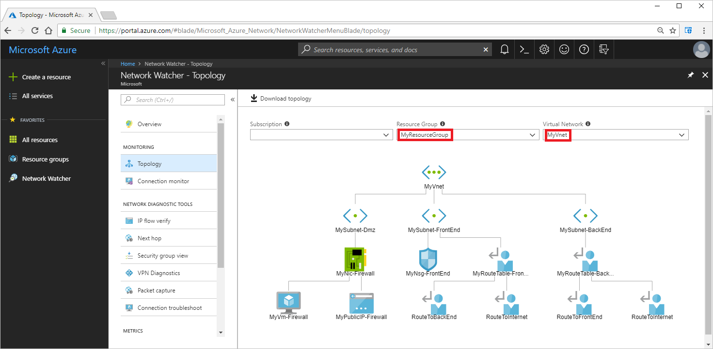

# View the topology of an Azure virtual network

In this article, you learn how to view resources in a Microsoft Azure virtual network, and the relationships between the resources. For example, a virtual network contains subnets. Subnets contain resources, such as Azure Virtual Machines (VM). VMs have one or more network interfaces. Each subnet can have a network security group and a route table associated to it. The topology capability of Azure Network Watcher enables you to view all of the resources in a virtual network, the resources associated to resources in a virtual network, and the relationships between the resources.

You can use the [Azure portal](#azure-portal), the [Azure CLI](#azure-cli), or [PowerShell](#powershell) to view a topology.

## <a name = "azure-portal"></a>View topology - Azure portal

1. Log into the [Azure portal](https://portal.azure.com) with an account that has the necessary [permissions](required-rbac-permissions.md).
2. On the top, left corner of the portal, select **All services**.
3. In the **All services** filter box, enter *Network Watcher*. When **Network Watcher** appears in the results, select it.
4. Select **Topology**. Generating a topology requires a network watcher in the same region that the virtual network that you want to generate the topology for exists in. If you don't have a network watcher enabled in the region that the virtual network you want to generate a topology for is in, network watchers are automatically created for you in all regions. The network watchers are created in a resource group named **NetworkWatcherRG**.
5. Select a subscription, the resource group of a virtual network you want to view the topology for, and then select the virtual network. In the following picture, a topology is shown for a virtual network named *MyVnet*, in the resource group named *MyResourceGroup*:

    

    As you can see in the previous picture, the virtual network contains three subnets. One subnet has a VM deployed in it. The VM has one network interface attached to it and a public IP address associated to it. The other two subnets have a route table associated to them. Each route table contains two routes. One subnet has a network security group associated to it. Topology information is only shown for resources that are:
    
    - Within the same resource group and region as the *myVnet* virtual network. For example, a network security group that exists in a resource group other than *MyResourceGroup*, isn't shown, even if the network security group is associated to a subnet in the *MyVnet* virtual network.
    - Within, or associated to resources within, the *myVnet* virtual network. For example, a network security group that isn't associated to a subnet or network interface in the *myVnet* virtual network isn't shown, even if the network security group is in the *MyResourceGroup* resource group.

  The topology shown in the picture is for the virtual network created after deploying the **Route traffic through a network virtual appliance script sample**, which you can deploy using the [Azure CLI](../virtual-network/scripts/virtual-network-cli-sample-route-traffic-through-nva.md?toc=%2fazure%2fnetwork-watcher%2ftoc.json), or [PowerShell](../virtual-network/scripts/virtual-network-powershell-sample-route-traffic-through-nva.md?toc=%2fazure%2fnetwork-watcher%2ftoc.json).

6. Select **Download topology** to download the image as an editable file, in svg format.

The resources shown in the diagram are a subset of the networking components in the virtual network. For example, while a network security group is shown, the security rules within it are not shown in the diagram. Though not differentiated in the diagram, the lines represent one of two relationships: *Containment* or *associated*. To see the full list of resources in the virtual network, and the type of relationship between the resources, generate the topology with [PowerShell](#powershell) or the [Azure CLI](#azure-cli).

## <a name = "azure-cli"></a>View topology - Azure CLI

You can run the commands in the steps that follow:
- In the Azure Cloud Shell, by selecting **Try It** at the top right of any command. The Azure Cloud Shell is a free interactive shell that has common Azure tools preinstalled and configured to use with your account.
- By running the CLI from your computer. If you run the CLI from your computer, steps in this article require the Azure CLI version 2.0.31 or later. Run `az --version` to find the installed version. If you need to install or upgrade, see [Install the Azure CLI](/cli/azure/install-azure-cli). If you are running the Azure CLI locally, you also need to run `az login` to create a connection with Azure.

The account that you use must have the necessary [permissions](required-rbac-permissions.md).

1. If you already have a network watcher in the same region as the virtual network that you want to create a topology for, skip to step 3. Create a resource group to contain a network watcher with [az group create](/cli/azure/group#az_group_create). The following example creates the resource group in the *eastus* region:

    ```azurecli-interactive
    az group create --name NetworkWatcherRG --location eastus
    ```

2. Create a network watcher with [az network watcher configure](/cli/azure/network/watcher#az-network-watcher-configure). The following example creates a network watcher in the *eastus* region:

    ```azurecli-interactive
    az network watcher configure \
      --resource-group NetworkWatcherRG \
      --location eastus \
      --enabled true
    ```

3. View the topology with [az network watcher show-topology](/cli/azure/network/watcher#az-network-watcher-show-topology). The following example views the topology for a resource group named *MyResourceGroup*:

    ```azurecli-interactive
    az network watcher show-topology --resource-group MyResourceGroup
    ```

    Topology information is only returned for resources that are within the same resource group as the *MyResourceGroup* resource group and the same region as the network watcher. For example, a network security group that exists in a resource group other than *MyResourceGroup*, isn't shown, even if the network security group is associated to a subnet in the *MyVnet* virtual network.

  Learn more about the [relationships](#relationhips) and [properties](#properties) in the returned output. If you don't have an existing virtual network to view a topology for, you can create one using the [Route traffic through a network virtual appliance](../virtual-network/scripts/virtual-network-cli-sample-route-traffic-through-nva.md?toc=%2fazure%2fnetwork-watcher%2ftoc.json) script sample. To view a diagram of the topology and download it in an editable file, use the [portal](#azure-portal).

## <a name = "powershell"></a>View topology - PowerShell

You can run the commands in the steps that follow:
- In the Azure Cloud Shell, by selecting **Try It** at the top right of any command. The Azure Cloud Shell is a free interactive shell that has common Azure tools preinstalled and configured to use with your account.
- By running PowerShell from your computer. If you run PowerShell from your computer, steps in this article require version 5.7.0 or later of the AzureRm module. Run `Get-Module -ListAvailable AzureRM` to find the installed version. If you need to upgrade, see [Install Azure PowerShell module](/powershell/azure/install-azurerm-ps). If you are running PowerShell locally, you also need to run `Login-AzureRmAccount` to create a connection with Azure.

The account that you use must have the necessary [permissions](required-rbac-permissions.md).

1. If you already have a network watcher in the same region as the virtual network that you want to create a topology for, skip to step 3. Create a resource group to contain a network watcher with [New-AzureRmResourceGroup](/powershell/module/AzureRM.Resources/New-AzureRmResourceGroup). The following example creates the resource group in the *eastus* region:

    ```azurepowershell-interactive
    New-AzureRmResourceGroup -Name NetworkWatcherRG -Location EastUS
    ```

2. Create a network watcher with [New-AzureRmNetworkWatcher](/powershell/module/azurerm.network/new-azurermnetworkwatcher). The following example creates a network watcher in the eastus region:

    ```azurepowershell-interactive
    New-AzureRmNetworkWatcher `
      -Name NetworkWatcher_eastus `
      -ResourceGroupName NetworkWatcherRG
    ```

3. Retrieve a Network Watcher instance with [Get-AzureRmNetworkWatcher](/powershell/module/azurerm.network/get-azurermnetworkwatcher). The following example retrieves a network watcher in the East US region:

    ```azurepowershell-interactive
    $nw = Get-AzurermResource `
      | Where {$_.ResourceType -eq "Microsoft.Network/networkWatchers" -and $_.Location -eq "EastUS" }
    $networkWatcher = Get-AzureRmNetworkWatcher `
      -Name $nw.Name `
      -ResourceGroupName $nw.ResourceGroupName
    ```

4. Retrieve a topology with [Get-AzureRmNetworkWatcherTopology](/powershell/module/azurerm.network/get-azurermnetworkwatchertopology). The following example retrieves a topology for a virtual network in the resource group named *MyResourceGroup*:

    ```azurepowershell-interactive
    Get-AzureRmNetworkWatcherTopology `
      -NetworkWatcher $networkWatcher `
      -TargetResourceGroupName MyResourceGroup
    ```

   Topology information is only returned for resources that are within the same resource group as the *MyResourceGroup* resource group and the same region as the network watcher. For example, a network security group that exists in a resource group other than *MyResourceGroup*, isn't shown, even if the network security group is associated to a subnet in the *MyVnet* virtual network.

  Learn more about the [relationships](#relationhips) and [properties](#properties) in the returned output. If you don't have an existing virtual network to view a topology for, you can create one using the [Route traffic through a network virtual appliance](../virtual-network/scripts/virtual-network-powershell-sample-route-traffic-through-nva.md?toc=%2fazure%2fnetwork-watcher%2ftoc.json) script sample. To view a diagram of the topology and download it in an editable file, use the [portal](#azure-portal).

## Relationships

All resources returned in a topology have one of the following types of relationship to another resource:

| Relationship type | Example                                                                                                |
| ---               | ---                                                                                                    |
| Containment       | A virtual network contains a subnet. A subnet contains a network interface.                            |
| Associated        | A network interface is associated with a VM. A public IP address is associated to a network interface. |

## Properties

All resources returned in a topology have the following properties:

- **Name**: The name of the resource
- **Id**: The URI of the resource.
- **Location**: The Azure region that the resource exists in.
- **Associations**: A list of associations to the referenced object. Each association has the following properties:
    - **AssociationType**: References the relationship between the child object and the parent. Valid values are *Contains* or *Associated*.
    - **Name**: The name of the referenced resource.
    - **ResourceId**:  - The URI of the resource referenced in the association.

## Next steps

- Learn how to [diagnose a network traffic filter problem to or from a VM](diagnose-vm-network-traffic-filtering-problem.md) using Network Watcher's IP flow verify capability
- Learn how to [diagnose a network traffic routing problem from a VM](diagnose-vm-network-routing-problem.md) using Network Watcher's next hop capability
