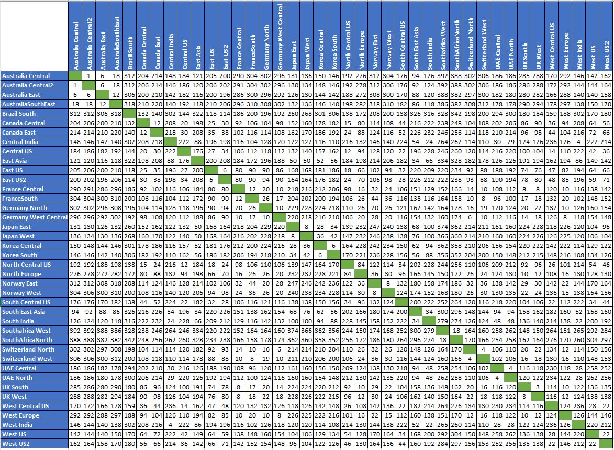

# Azure network round-trip latency statistics

Azure continuously monitors the latency (speed) of core areas of its network using internal monitoring tools as well as measurements collected by [ThousandEyes](https://thousandeyes.com), a third-party synthetic monitoring service.

## How are the measurements collected?

The latency measurements are collected from ThousandEyes agents, hosted in Azure cloud regions worldwide, that continuously send network probes between themselves in 1-minute intervals. The monthly latency statistics are derived from averaging the collected samples for the month.

## December 2019 latency figures

The monthly average round-trip times between Azure regions for past 30 days (ending on Dec 31, 2019) are shown below. The following measurements are powered by [ThousandEyes](https://thousandeyes.com).

## Next steps

Learn about [Azure regions](https://azure.microsoft.com/global-infrastructure/regions/).
