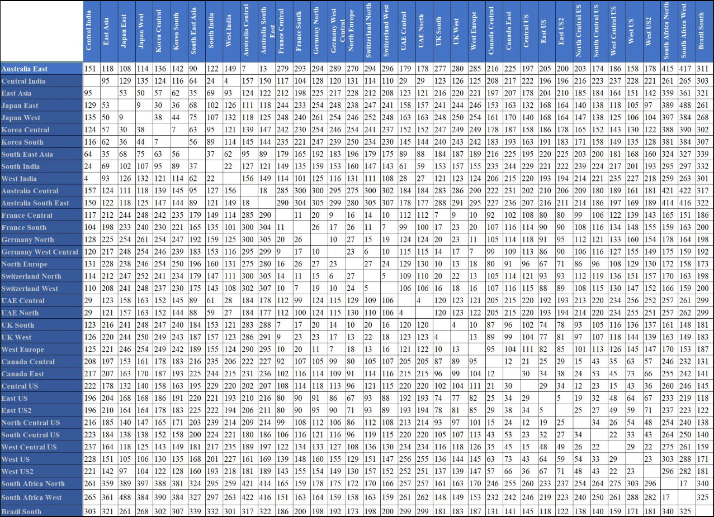

# Azure network round-trip latency statistics

Azure continuously monitors the latency (speed) of core areas of its network using internal monitoring tools as well as measurements collected by [ThousandEyes](https://thousandeyes.com), a third-party synthetic monitoring service.

## How are the measurements collected?

The latency measurements are collected from ThousandEyes agents hosted in Azure cloud regions world-wide, which continuously send network probes between themselves, in 1-minute intervals. The monthly latency statistics are derived from averaging the collected samples for the month.

## October 2019 latency figures

For the 31 days ending on October 31, 2019, monthly min and max round trip latency times within aggregated regions are:

- **5 ms** to **72 ms** for round trips within **North America** regions.
- **3 ms** to **28 ms** for round trips within **Europe** regions.
- **4 ms** to **134 ms** for round trips within **Asia** regions.

The following inter-region latency measurements are powered by [ThousandEyes](https://thousandeyes.com). The measurement unit in the table below is in milliseconds(ms).

## Next steps
- Learn about [Azure regions](https://azure.microsoft.com/global-infrastructure/regions/).