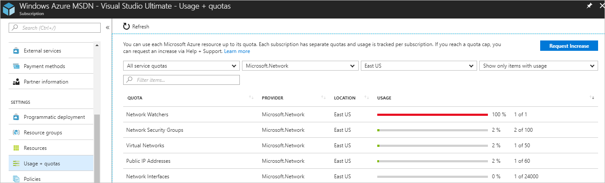

# Check resource usage against limits

In this article, you learn how to see the number of each network resource type that you've deployed in your subscription and what your [subscription limits](../azure-subscription-service-limits.md?toc=%2fazure%2fnetworking%2ftoc.json#networking-limits) are. The ability to view resource usage against limits is helpful to track current usage, and plan for future use. You can use the [Azure Portal](#azure-portal), [PowerShell](#powershell), or the [Azure CLI](#azure-cli) to track usage.

## Azure Portal

1. Log into the Azure [portal](https://portal.azure.com).
2. At the top, left corner of the Azure portal, select **All services**.
3. Enter *Subscriptions* in the **Filter** box. When **Subscriptions** appears in the search results, select it.
4. Select the name of the subscription you want to view usage information for.
5. Under **SETTINGS**, select **Usage + quota**.
6. You can select the following options:
   - **Resource types**: You can select all resource types, or select the specific types of resources you want to view.
   - **Providers**: You can select all resource providers, or select **Compute**, **Network**, or **Storage**.
   - **Locations**: You can select all Azure locations, or select specific locations.
   - You can select to show all resources, or only the resources where at least one is deployed.

     The example in the following picture shows all of the network resources with at least one resource deployed in the East US:

       

     You can sort the columns by selecting the column heading. The limits shown are the limits for your subscription. If you need to increase a default limit, select **Request Increase**, then complete and submit the support request. All resources have a maximum limit listed in Azure [limits](../azure-subscription-service-limits.md?toc=%2fazure%2fnetworking%2ftoc.json#networking-limits). If your current limit is already at the maximum number, the limit can't be increased.

## PowerShell

[!INCLUDE [updated-for-az](../../includes/updated-for-az.md)]

You can run the commands that follow in the [Azure Cloud Shell](https://shell.azure.com/powershell), or by running PowerShell from your computer. The Azure Cloud Shell is a free interactive shell. It has common Azure tools preinstalled and configured to use with your account. If you run PowerShell from your computer, you need the Azure PowerShell module, version 1.0.0 or later. Run `Get-Module -ListAvailable Az` on your computer, to find the installed version. If you need to upgrade, see [Install Azure PowerShell module](/powershell/azure/install-az-ps). If you're running PowerShell locally, you also need to run `Login-AzAccount` to log in to Azure.

View your usage against limits with [Get-AzNetworkUsage](https://docs.microsoft.com/powershell/module/az.network/get-aznetworkusage). The following example gets the usage for resources where at least one resource is deployed in the East US location:

```azurepowershell-interactive
Get-AzNetworkUsage `
  -Location eastus `
  | Where-Object {$_.CurrentValue -gt 0} `
  | Format-Table ResourceType, CurrentValue, Limit
```

You receive output formatted the same as the following example output:

```powershell
ResourceType            CurrentValue Limit
------------            ------------ -----
Virtual Networks                   1    50
Network Security Groups            2   100
Public IP Addresses                1    60
Network Interfaces                 1 24000
Network Watchers                   1     1
```

## Azure CLI

If using Azure Command-line interface (CLI) commands to complete tasks in this article, either run the commands in the [Azure Cloud Shell](https://shell.azure.com/bash), or by running the CLI from your computer. This article requires the Azure CLI version 2.0.32 or later. Run `az --version` to find the installed version. If you need to install or upgrade, see [Install the Azure CLI](/cli/azure/install-azure-cli). If you're running the Azure CLI locally, you also need to run `az login` to log in to Azure.

View your usage against limits with [az network list-usages](/cli/azure/network?view=azure-cli-latest#az-network-list-usages). The following example gets the usage for resources in the East US location:

```azurecli-interactive
az network list-usages \
  --location eastus \
  --out table
```

You receive output formatted the same as the following example output:

```azurecli
Name                    CurrentValue Limit
------------            ------------ -----
Virtual Networks                   1    50
Network Security Groups            2   100
Public IP Addresses                1    60
Network Interfaces                 1 24000
Network Watchers                   1     1
Load Balancers                     0   100
Application Gateways               0    50
```
