# Disaster recovery using Azure DNS and Traffic Manager

Disaster recovery focuses on recovering from a severe loss of application functionality. In order to choose a disaster recovery solution, business and technology owners must first determine the level of functionality that is required during a disaster, such as - unavailable, partially available via reduced functionality, or delayed availability, or fully available.
Most enterprise customers are choosing a multi-region architecture for resiliency against an application or infrastructure level failover. Customers can choose several approaches in the quest to achieve failover and high availability via redundant architecture. Here are some of the popular approaches:

- **Active-passive with cold standby**: In this failover solution, the VMs and other appliances that are running in the standby region are not active until there is a need for failover. However, the production environment is replicated in the form of backups, VM images, or Resource Manager templates, to a different region. This failover mechanism is cost-effective but takes a longer time to undertake a complete failover.
 
    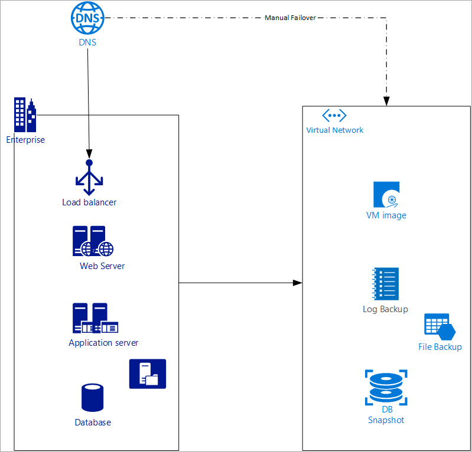
    
    *Figure - Active/Passive with cold standby disaster recovery configuration*

- **Active/Passive with pilot light**: In this failover solution, the standby environment is set up with a minimal configuration. The setup has only the necessary services running to support only a minimal and critical set of applications. In its native form, this scenario can only execute minimal functionality but can scale up and spawn additional services to take bulk of the production load if a failover occurs.
    
    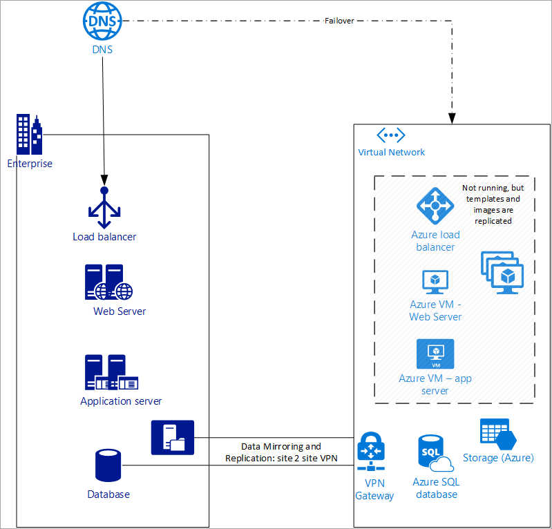
    
    *Figure: Active/Passive with pilot light disaster recovery configuration*

- **Active/Passive with warm standby**: In this failover solution, the standby region is pre-warmed and is ready to take the base load, auto scaling is turned on, and all the instances are up and running. This solution is not scaled to take the full production load but is functional, and all services are up and running. This solution is an augmented version of the pilot light approach.
    
    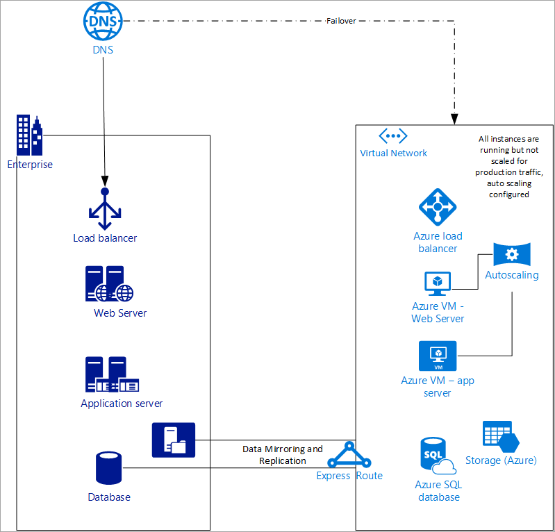
    
    *Figure: Active/Passive with warm standby disaster recovery configuration*
    
To learn more about failover and high availability, see [Disaster Recovery for Azure Applications](https://docs.microsoft.com/azure/architecture/resiliency/disaster-recovery-azure-applications).


## Planning your disaster recovery architecture

There are two technical aspects towards setting up your disaster recovery architecture:
-  Using a deployment mechanism to replicate instances, data, and configurations between primary and standby environments. This type of disaster recovery can be done natively via Azure Site-Recovery via Microsoft Azure partner appliances/services like Veritas or NetApp. 
- Developing a solution to divert network/web traffic from the primary site to the standby site. This type of disaster recovery can be achieved via Azure DNS, Azure Traffic Manager(DNS), or third-party global load balancers.

This article is limited to approaches via Network and Web traffic redirection. For instructions to set up Azure Site Recovery, see [Azure Site Recovery Documentation](https://docs.microsoft.com/azure/site-recovery/).
DNS is one of the most efficient mechanisms to divert network traffic because DNS is often global and external to the data center and is insulated from any regional or availability zone (AZ) level failures. One can use a DNS-based failover mechanism and in Azure, two DNS services can accomplish the same in some fashion - Azure DNS (authoritative DNS) and Azure Traffic Manager (DNS-based smart traffic routing). 

It is important to understand few concepts in DNS that are extensively used to discuss the solutions provided in this article:
- **DNS A Record** – A Records are pointers that point a domain to an IPv4 address. 
- **CNAME or Canonical name** - This record type is used to point to another DNS record. CNAME doesn’t respond with an IP address but rather the pointer to the record that contains the IP address. 
- **Weighted Routing** – one can choose to associate a weight to service endpoints and then distribute the traffic based on the assigned weights. This routing method is one of the four traffic routing mechanisms available within Traffic Manager. For more information, see [Weighted routing method](../traffic-manager/traffic-manager-routing-methods.md#weighted).
- **Priority Routing** – Priority routing is based on health checks of endpoints. By default, Azure Traffic manager sends all traffic to the highest priority endpoint, and upon a failure or disaster, Traffic Manager routes the traffic to the secondary endpoint. For more information, see [Priority routing method](../traffic-manager/traffic-manager-routing-methods.md#priority).

## Manual failover using Azure DNS
The Azure DNS manual failover solution for disaster recovery uses the standard DNS mechanism to failover to the backup site. The manual option via Azure DNS works best when used in conjunction with the cold standby or the pilot light approach. 

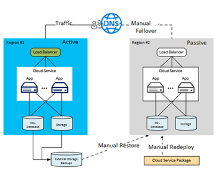

*Figure - Manual failover using Azure DNS*

The assumptions made for the solution are:
- Both primary and secondary endpoints have static IPs that don’t change often. Say for the primary site the IP is 100.168.124.44 and the IP for the secondary site is 100.168.124.43.
- An Azure DNS zone exists for both the primary and secondary site. Say for the primary site the endpoint is prod.contoso.com and for the backup site is dr.contoso.com. A DNS record for the main application known as www\.contoso.com also exists.   
- The TTL is at or below the RTO SLA set in the organization. For example, if an enterprise sets the RTO of the application disaster response to be 60 mins, then the TTL should be less than 60 mins, preferably the lower the better. 
  You can set up Azure DNS for manual failover as follows:
- Create a DNS zone
- Create DNS zone records
- Update CNAME record

### Step 1: Create a DNS
Create a DNS zone (for example, www\.contoso.com) as shown below:

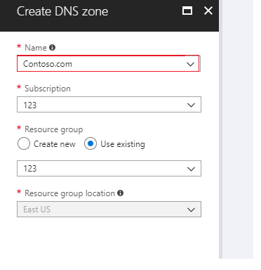

*Figure - Create a DNS zone in Azure*

### Step 2: Create DNS zone records

Within this zone create three records (for example - www\.contoso.com, prod.contoso.com and dr.consoto.com) as show below.

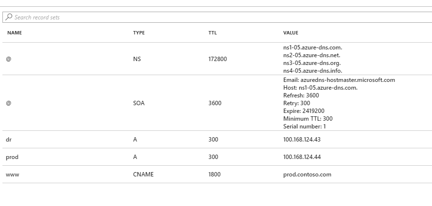

*Figure - Create DNS zone records in Azure*

In this scenario, site, www\.contoso.com has a TTL of 30 mins, which is well below the stated RTO, and is pointing to the production site prod.contoso.com. This configuration is during normal business operations. The TTL of prod.contoso.com and dr.contoso.com has been set to 300 seconds or 5 mins. 
You can use an Azure monitoring service such as Azure Monitor or Azure App Insights, or, any partner monitoring solutions such as Dynatrace, You can even use home grown solutions that can monitor or detect application or virtual infrastructure level failures.

### Step 3: Update the CNAME record

Once failure is detected, change the record value to point to dr.contoso.com as shown below:
       
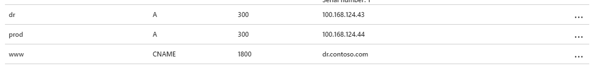

*Figure - Update the CNAME record in Azure*

Within 30 minutes, during which most resolvers will refresh the cached zone file, any query to www\.contoso.com will be redirected to dr.contoso.com.
You can also run the following Azure CLI command to change the CNAME value:
 ```azurecli
   az network dns record-set cname set-record \
   --resource-group 123 \
   --zone-name contoso.com \
   --record-set-name www \
   --cname dr.contoso.com
```
This step can be executed manually or via automation. It can be done manually via the console or by the Azure CLI. The Azure SDK and API can be used to automate the CNAME update so that no manual intervention is required. Automation can be built via Azure functions or within a third-party monitoring application or even from on- premises.

### How manual failover works using Azure DNS
Since the DNS server is outside the failover or disaster zone, it is insulated against any downtime. This enables user to architect a simple failover scenario that is cost effective and will work all the time assuming that the operator has network connectivity during disaster and can make the flip. If the solution is scripted, then one must ensure that the server or service running the script should be insulated against the problem affecting the production environment. Also, keep in mind the low TTL that was set against the zone so that no resolver around the world keeps the endpoint cached for long and customers can access the site within the RTO. For a cold standby and pilot light, since some prewarming and other administrative activity may be required – one should also give enough time before making the flip.

## Automatic failover using Azure Traffic Manager
When you have complex architectures and multiple sets of resources capable of performing the same function, you can configure Azure Traffic Manager (based on DNS) to check the health of your resources and route the traffic from the non-healthy resource to the healthy resource. 
In the following example, both the primary region and the secondary region have a full deployment. This deployment includes the cloud services and a synchronized database. 

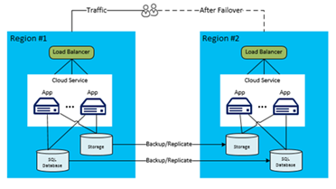

*Figure - Automatic failover using Azure Traffic Manager*

However, only the primary region is actively handling network requests from the users. The secondary region becomes active only when the primary region experiences a service disruption. In that case, all new network requests route to the secondary region. Since the backup of the database is near instantaneous, both the load balancers have IPs that can be health checked, and the instances are always up and running, this topology provides an option for going in for a low RTO and failover without any manual intervention. The secondary failover region must be ready to go-live immediately after failure of the primary region.
This scenario is ideal for the use of Azure Traffic Manager that has inbuilt probes for various types of health checks including http / https and TCP. Azure Traffic manager also has a rule engine that can be configured to failover when a failure occurs as described below. Let’s consider the following solution using Traffic Manager:
- Customer has the Region #1 endpoint known as prod.contoso.com with a static IP as 100.168.124.44 and a Region #2 endpoint known as dr.contoso.com with a static IP as 100.168.124.43. 
-	Each of these environments is fronted via a public facing property like a load balancer. The load balancer can be configured to have a DNS-based endpoint or a fully qualified domain name (FQDN) as shown above.
-	All the instances in Region 2 are in near real-time replication with Region 1. Furthermore, the machine images are up-to-date, and all software/configuration data is patched and are in line with Region 1.  
-	Autoscaling is preconfigured in advance. 

The steps taken to configure the failover with Azure Traffic Manager are as follows:
1. Create a new Azure Traffic Manager profile
2. Create endpoints within the Traffic Manager profile
3. Set up health check and failover configuration

### Step 1: Create a new Azure Traffic Manager profile
Create a new Azure Traffic manager profile with the name contoso123 and select the Routing method as Priority. 
If you have a pre-existing resource group that you want to associate with, then you can select an existing resource group, otherwise, create a new resource group.

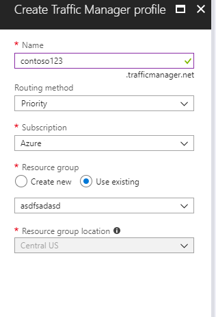

*Figure - Create a Traffic Manager profile*

### Step 2: Create endpoints within the Traffic Manager profile

In this step, you create endpoints that point to the production and disaster recovery sites. Here, choose the **Type** as an external endpoint, but if the resource is hosted in Azure, then you can choose **Azure endpoint** as well. If you choose **Azure endpoint**, then select a **Target resource** that is either an **App Service** or a **Public IP** that is allocated by Azure. The priority is set as **1** since it is the primary service for Region 1.
Similarly, create the disaster recovery endpoint within Traffic Manager as well.

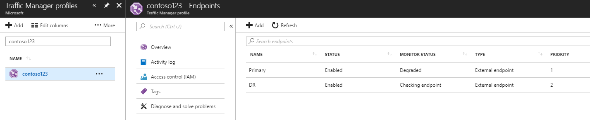

*Figure - Create disaster recovery endpoints*

### Step 3: Set up health check and failover configuration

In this step, you set the DNS TTL to 10 seconds, which is honored by most internet-facing recursive resolvers. This configuration means that no DNS resolver will cache the information for more than 10 seconds. For the endpoint monitor settings, the path is current set at / or root, but you can customize the endpoint settings to evaluate a path, for example, prod.contoso.com/index. The example below shows the **https** as the probing protocol. However, you can choose **http** or **tcp** as well. The choice of protocol depends upon the end application. The probing interval is set to 10 seconds, which enables fast probing, and the retry is set to 3. As a result, Traffic Manager will failover to the second endpoint if three consecutive intervals register a failure. The following formula defines the total time for an automated failover:
Time for failover = TTL + Retry * Probing interval 
And in this case, the value is 10 + 3 * 10 = 40 seconds (Max).
If the Retry is set to 1 and TTL is set to 10 secs, then the time for failover 10 + 1 * 10 = 20 seconds. Set the Retry to a value greater than **1** to eliminate chances of failovers due to false positives or any minor network blips. 


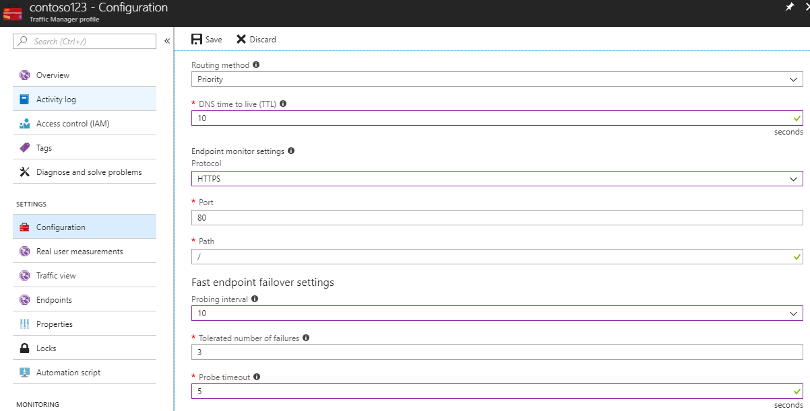

*Figure - Set up health check and failover configuration*

### How automatic failover works using Traffic Manager

During a disaster, the primary endpoint gets probed and the status changes to **degraded** and the disaster recovery site remains **Online**. By default, Traffic Manager sends all traffic to the primary (highest-priority) endpoint. If the primary endpoint appears degraded, Traffic Manager routes the traffic to the second endpoint as long as it remains healthy. One has the option to configure more endpoints within Traffic Manager that can serve as additional failover endpoints, or, as load balancers sharing the load between endpoints.

## Next steps
- Learn more about [Azure Traffic Manager](../traffic-manager/traffic-manager-overview.md).
- Learn more about [Azure DNS](../dns/dns-overview.md).


