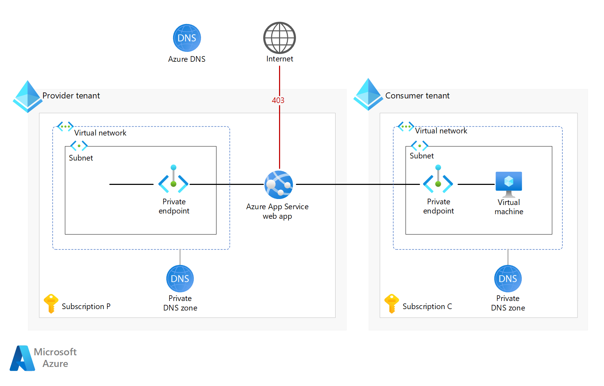

# Azure network foundation services overview

Azure network foundation services provide core connectivity for your resources in Azure. 

Network foundation services include: 

- [Azure Virtual Network](/azure/virtual-network)
- [Azure Private Link](/azure/private-link)
- [Azure DNS](/azure/dns)

The following diagram summarizes how these core services work together to provide infrastructure to your Azure network.

## Learn more

Also see: [Azure networking documentation](/azure/networking)

