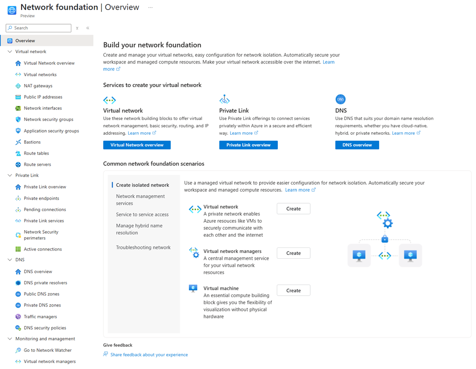

# Azure network foundation services overview

Azure network foundation services provide core connectivity for your resources in Azure. Network foundation services include **Azure Virtual Network**, **Azure Private Link**, and **Azure DNS**. Together, these core services build upon each other to provide the foundation for your Azure network. 

The following diagram is an example of how these services can be used together in a basic Azure network.

This article provides a summary of each of these Azure foundational services, and illustrates how they work together. Links are also provided to more detailed guidance for each foundational service.

## Azure Virtual Network

[Azure Virtual Network](/azure/virtual-network) enables you to create private networks in the cloud, securely connecting Azure resources, the Internet, and on-premises networks. 

Two virtual networks are provisioned in the following example: 
- The hub virtual network is used to deploy Azure services and provide access to data resources. The hub is optionally connected to an on-premises network. 
- The hub peers with a spoke network containing a business tier subnet with virtual machines to process user interactions, and an application subnet to handle data storage and transactions. 

 

For more information about designing virtual networks, see [Plan virtual networks](/azure/virtual-network/virtual-network-vnet-plan-design-arm). To create a virtual network, see [Use the Azure portal to create a virtual network](/azure/virtual-network/quick-create-portal).

## Azure Private Link

[Azure Private Link](/azure/private-link) enables secure, private connectivity from your virtual network to services that don't traverse the public Internet.

In the following figure, a **private endpoint** is provisioned in the app subnet of the spoke virtual network described previously. A private endpoint is a private IP address (10.1.1.135 in this example) associated with a service powered by Azure Private Link. 

Private endpoints securely connect services within virtual networks.

 

> [!NOTE]
> When you create a private endpoint, you're given the choice of integrating with a private DNS zone. This configuration can be added, deleted, or modified later. In the example shown here, the option to integrate with a private DNS zone is selected. This basic DNS configuration is suitable for virtual network workloads that don't use an Azure DNS Private Resolver. For more information, see [Azure Private Endpoint DNS integration](/azure/private-link/private-endpoint-dns-integration).

For an overview of private link and private endpoint, see [What is Azure Private Link service](/azure/private-link/private-link-service-overview) and [What is a private endpoint](/azure/private-link/private-endpoint-overview). To create a private endpoint, see [Create a private endpoint](/azure/private-link/create-private-endpoint-portal).

## Azure DNS

[Azure DNS](/azure/dns) provides cloud-based public and private domain name hosting and resolution. It includes three services that provide public or private DNS resolution and hosting, and one load balancing service:
* [Azure Public DNS](/azure/dns/public-dns-overview) provides high-availability hosting for public DNS domains.
* [Azure Private DNS](/azure/dns/private-dns-overview) is a DNS naming and resolution service for virtual networks and the private services hosted inside those networks.
* [Azure DNS Private Resolver](/azure/dns/dns-private-resolver-overview) is a fully managed high availability DNS service that enables you to query private DNS zones from an on-premises environment and vice versa without deploying VM based DNS servers.
* [Azure Traffic Manager](/azure/traffic-manager/traffic-manager-overview): A DNS-based traffic load balancer that can distribute traffic to public facing applications across Azure regions.

Azure DNS also provides internal DNS resolution for both private and public (internet) resources from within virtual networks. By default, virtual networks are configured to resolve DNS records using Azure-provided DNS at [168.63.129.16](/azure/virtual-network/what-is-ip-address-168-63-129-16). 

In the following example, the private endpoint shown in the previous figure is associated with the private DNS zone **privatelink.blob.core.windows.net**. The private DNS zone name is dependent on the type of private endpoint resource. In this example, the resource is blob storage. For more information about private DNS zones and private endpoints, see [Azure Private Endpoint private DNS zone values](/azure/private-link/private-endpoint-dns).

This zone is also configured with a virtual network link to the hub virtual network, enabling all resources in the hub network to resolve the zone using Azure-provided DNS (168.63.129.16) and providing access to the private endpoint using its fully qualified DNS name (FQDN).

By default, private endpoints can only be resolved from within Azure. To resolve the private-linked storage account from on-premises, or to resolve on-premises resources from within Azure, you can configure a **DNS private resolver** in the hub virtual network (not shown). 

For information about private endpoint scenarios with an Azure DNS Private Resolver, see [private endpoint DNS configuration scenarios](/azure/private-link/private-endpoint-dns-integration#dns-configuration-scenarios).

For more information about configuring a DNS private resolver, see [Resolve Azure and on-premises domains](/azure/dns/private-resolver-hybrid-dns).

## Azure portal experience

The Azure portal provides a centralized experience for [getting started with network foundation services](https://aka.ms/hubs/networkfoundation). Information and links are provided to help you create an isolated network, manage network services, secure access to resources, manage hybrid name resolution, and troubleshoot network issues.

Resource links are also provided in the left-hand service tree to help you understand, create, and view supporting components of the network foundation services.

## Learn more

- [Load balancing and content delivery](/azure/networking/load-balancer-content-delivery/load-balancing-content-delivery-overview)
- [Azure hybrid connectivity](/azure/networking/hybrid-connectivity)
- [Azure network security](/azure/networking/security/)
- [Azure network monitoring and management](/azure/networking/monitoring-management/)
- [Azure Networking Fundamentals](/azure/networking/fundamentals/)
- [Azure networking](/azure/networking)
