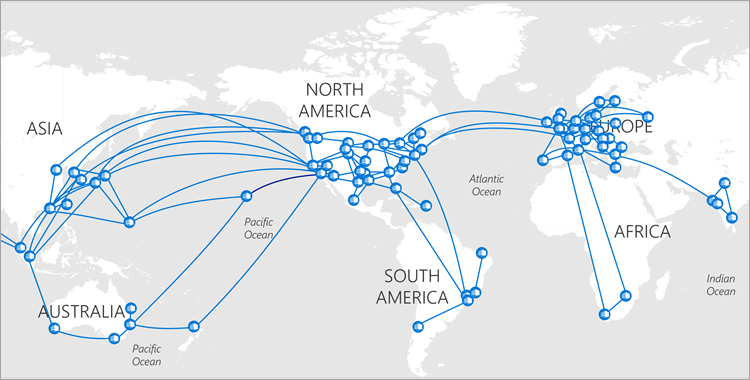
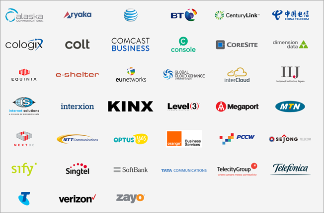
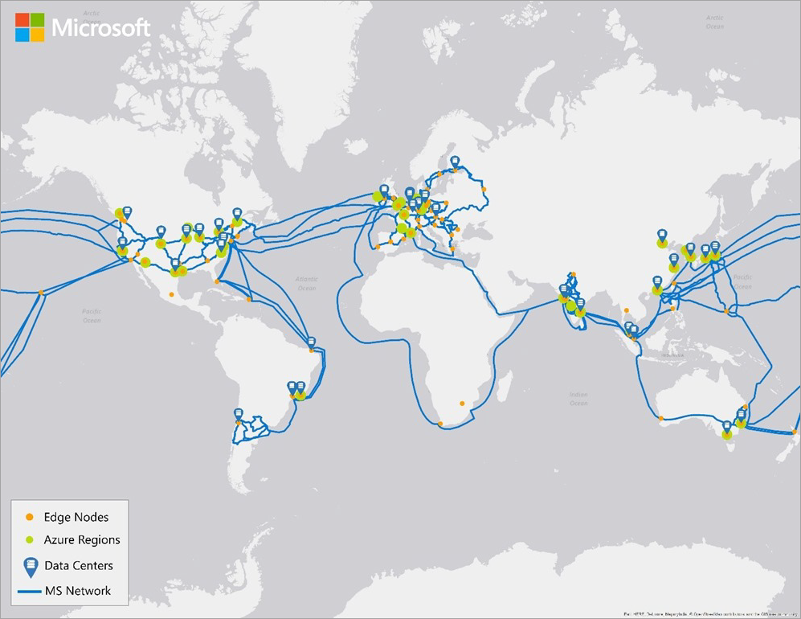

# Microsoft global network

Every day, customers around the world connect to Microsoft Azure, Bing, Dynamics 365, Office 365, OneDrive, Xbox, and many other services through trillions of requests. These requests are for diverse types of data, such as enterprise cloud applications and email, VOIP, streaming video, IoT, search, and cloud storage.

Customers expect instant responsiveness and reliability from our services. The Microsoft global wide-area network (WAN) plays an important part in delivering a great cloud service experience. Connecting hundreds of datacenters in 38 regions around the world, our global network offers near-perfect availability, high capacity, and the flexibility to respond to unpredictable demand spikes.

As we build, expand, and run this world-class network, we rely on three guiding principles:
- Be as close as possible to our customers for optimal latency.
- Stay in control of capacity and resiliency to guarantee that the network can survive multiple failures.
- Proactively manage network traffic at scale via software-defined networking (SDN).

## We are as close to customers as possible
You want a fast, reliable response when you use Microsoft services. Data travels over our network at nearly the speed of light; network speed, or latency, is a function of distance from the customer to the datacenter. If your service is far away, say you’re in London and the service is in Tokyo, the network path determines latency. We use innovative software to optimize network routing and to build and deploy network paths that are as direct as possible between customers and their data and services. This reduces latency to the limits imposed by the speed of light.
Customer traffic enters our global network through strategically placed Microsoft Edge nodes, our points of presence. These edge nodes are directly interconnected to more than 2,500 unique Internet partners through thousands of connections in more than 130 locations. 
Our rich interconnection strategy optimizes the paths that data travels on our global network. Customers get a better network experience with less latency, jitter, and packet loss with more throughput. Direct interconnections give customers better quality of service compared to transit links, because there are fewer hops, fewer parties, and better networking paths.

*Figure 1: Microsoft Global WAN*

Azure traffic between our datacenters stays on our network and does not flow over the Internet. This includes all traffic between Microsoft services anywhere in the world. For example, within Azure, traffic between virtual machines, storage, and SQL communication traverses only the Microsoft network, regardless of the source and destination region. [Intra-region VNet-to-VNet traffic](../virtual-network/virtual-network-peering-overview.md), as well as [cross-region VNet-to-VNet traffic](../vpn-gateway/vpn-gateway-howto-vnet-vnet-resource-manager-portal.md), stays on the Microsoft network.
Customers can use [Azure ExpressRoute](../expressroute/expressroute-introduction.md) to create private network connections to Azure, Dynamics 365, Office 365, and Skype for Business. ExpressRoute connections bypass the Internet and offer more reliability, faster speeds, and less latency than typical Internet connections. With ExpressRoute, customers connect to Azure at an ExpressRoute location at specific Microsoft Edge sites, such as an Internet exchange provider facility, or directly connect to Azure from an existing corporate WAN, such as a Multiprotocol Label Switching (MPLS) VPN provided by a network service provider.
For example, customers can connect to a local ExpressRoute site in Dallas and access virtual machines in Amsterdam, Busan, Dublin, Hong Kong, Osaka, Seoul, Singapore, Sydney, Tokyo, (or any of our datacenters) and the traffic will stay on our global backbone network. We have 37 [ExpressRoute sites](../expressroute/expressroute-locations.md), and growing, with one near each Azure region, as well as other strategic locations. Every time we announce a new Azure region, like [we recently did in Korea](https://news.microsoft.com/apac/2017/02/21/microsoft-cloud-expands-in-asia-with-microsoft-azure-available-from-korea/), you can expect that ExpressRoute will also be there, along with our global ecosystem of ExpressRoute partners.

*Figure 2. A sampling of the Microsoft ExpressRoute partner ecosystem which includes the world’s largest network and co-location providers*

## Stay in control of capacity and provide resiliency

To give customers a service that works well, our network must be able to handle failures and rapidly respond to demand spikes. To support the tremendous growth of our cloud services and maintain consistent service level agreements, we invest in private fiber (sometimes called [dark fiber](https://en.wikipedia.org/wiki/Dark_fibre)), for our metro, terrestrial, and submarine paths. Microsoft owns and runs one of the largest backbone networks in the world, connecting our datacenters and customers. Over the last three years, we’ve grown our long-haul WAN capacity by 700 percent. Within a given region, we can support up to 1.6 Pbps of inter-datacenter bandwidth. We continue to increase capacity to meet the strong demand for Microsoft cloud services.
Microsoft owns and runs one of the largest WAN backbones in the world.
Our submarine investments improve resiliency, performance, and reliability across the Pacific and Atlantic Oceans. Our latest investment is the MAREA cable, a 6,600 km submarine cable between Virginia Beach, Virginia, USA, and Bilbao, Spain, which we jointly developed with Facebook. MAREA will be the highest-capacity subsea cable to cross the Atlantic, featuring eight fiber pairs and an initial estimated design capacity of 160 Tbps. This [open cable](https://www.microsoft.com/en-us/research/publication/open-undersea-cable-systems-cloud-scale-operation/) system is an innovation in submarine cable design and delivery, which allows for greater bandwidth capacity thresholds and reduces cost. More importantly, it has given us the ability to introduce SDN principles into cable management, resulting in a better quality of service.
Over the last three years, we’ve grown our long-haul WAN capacity by 700 percent.
Global network infrastructure can be surprisingly vulnerable. For example, fiber optic cables can be cut by ship anchors dragging along the seabed. For an example, see [a ship accidentally cut Jersey’s internet cables with its anchor](https://www.businessinsider.com/ships-anchor-cuts-internet-cables-to-jersey-jt-2016-11). To provide the reliability our cloud needs, we have many physical networking paths with automatic routing around failures for optimal reliability.

## Controlling operations and managing traffic with software
Delivering traffic to millions, and growing, physical servers isn’t possible with pre-cloud technologies. In partnership with [Microsoft Research](https://www.microsoft.com/research/research-area/systems-and-networking/), we developed a range of SDN technologies to optimally manage routing and centralize control to meet network-wide goals. We use standard switches and routers, and then we manage them with our own software, which is built to handle the enormous volume of traffic on the Microsoft network.
We use an SDN-based architecture called SWAN to manage our WAN, which enables centralized management and control of network infrastructure and improves reliability and efficiency. SWAN controls when and how much traffic each service sends and automatically reconfigures the network’s data plane to match traffic demand. With SWAN, we control every network flow from the very farthest reaches of our network, across our global WAN, all the way down to the network interface card (NIC) on a server in one of our datacenters.

[!VIDEO https://channel9.msdn.com/Blogs/Azure/How-Microsoft-builds-its-fast-and-reliable-global-network]

## Conclusion
Whether you choose to reach the Microsoft cloud through the Internet or through a private network, we are committed to building the fastest and most reliable global network of any public cloud. We continue innovating and investing in a globally distributed networking platform to enable high performance, low latency, and the world’s most reliable cloud. We will continue to provide you with the best possible network experience, wherever in the world you happen to be.

