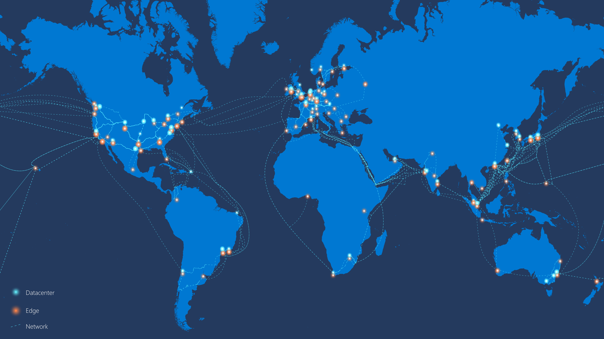

# Microsoft global network

Microsoft owns and operates one of the largest backbone networks in the world. This global and sophisticated architecture, spanning more than 100,000 miles, connects our datacenters and customers. 
 
Every day, customers around the world connect and pass trillions of requests to Microsoft Azure, Bing, Dynamics 365, Office 365, XBox, and many others. Regardless of type, customers expect instant reliability and responsiveness from our services. 
 
The [Microsoft global network](https://azure.microsoft.com/global-infrastructure/global-network/) (WAN) is a central part of delivering a great cloud experience. Connecting our Microsoft [data centers](https://azure.microsoft.com/global-infrastructure/) across 54 Azure regions and large mesh of edge-nodes strategically placed around the world, our global network offers both the availability, capacity, and the flexibility to meet any demand.

 
## Get the premium cloud network
 
Opting for the [best possible experience](https://www.sdxcentral.com/articles/news/azure-tops-aws-gcp-in-cloud-performance-says-thousandeyes/2018/11/) is easy when you use Microsoft cloud. From the moment when customer traffic enters our global network through our strategically placed edge-nodes, your data travels through optimized routes at near the speed of light. This ensures optimal latency for best performance. These edge-nodes, all interconnected to more than 3500 unique Internet partners (peers) through thousands of connections in more than 145 locations, provide the foundation of our interconnection strategy. 
 
Whether connecting from London to Tokyo, or from Washington DC to Los Angeles, network performance is quantified and impacted by things such as latency, jitter, packet loss, and throughput.  At Microsoft, we prefer and use direct interconnects as opposed to transit-links, this keeps response traffic symmetric and helps keep hops, peering parties and paths as short and simple as possible. 

For example, if a user in London attempts to access a service in Tokyo, then the Internet traffic enters one of our edges in London, goes over Microsoft WAN through France, our Trans-Arabia paths between Europe and India, and then to Japan where the service is hosted. Response traffic is symmetric. This is sometimes referred as [cold-potato routing](https://en.wikipedia.org/wiki/Hot-potato_and_cold-potato_routing) which means that the traffic stays on Microsoft network as long as possible before we hand it off.  
  
So, does that mean any and all traffic when using Microsoft services? Yes, any traffic between data centers, within Microsoft Azure or between Microsoft services such as Virtual Machines, Office 365, XBox, SQL DBs, Storage, and virtual networks are routed within our global network and never over the public Internet, to ensure optimal performance and integrity.  
 
Massive investments in fiber capacity and diversity across metro, terrestrial, and submarine paths are crucial for us to keep consistent and high service-level while fueling the extreme growth of our cloud and online services. Recent additions to our global network are our [MAREA](https://www.submarinecablemap.com/#/submarine-cable/marea) submarine cable,  the industry's first Open Line System (OLS) over subsea, between Bilbao, Spain and Virginia Beach, Virginia, USA, as well as the [AEC](https://www.submarinecablemap.com/#/submarine-cable/aeconnect-1) between New York, USA and Dublin, Ireland and [New Cross Pacific (NCP)](https://www.submarinecablemap.com/#/submarine-cable/new-cross-pacific-ncp-cable-system) between Tokyo, Japan, and Portland, Oregon, USA. 
 

## Our network is your network

We have put two decades of experience, along with massive investments into the network, to ensure optimal performance at all times. Businesses can take full advantage of our network assets and build advanced overlay architectures on top. 
 
Microsoft Azure offers the richest portfolio of services and capabilities, allowing customers to quickly and easily build, expand, and meet networking requirements anywhere. Our family of connectivity services span virtual network peering between regions, hybrid, and in-cloud point-to-site and site-to-site architectures as well as global IP transit scenarios.  For enterprises looking to connect their own datacenter or network to Azure, or customers with massive data ingestion or transit needs, [ExpressRoute](../expressroute/expressroute-introduction.md), and [ExpressRoute Direct](../expressroute/expressroute-erdirect-about.md) provide options up to 100 Gbps of bandwidth, directly into Microsoft's global network at peering locations across the world.  
 
[ExpressRoute Global Reach](../expressroute/expressroute-global-reach.md) is designed to complement your service provider's WAN implementation and connect your on-premises sites across the world. If you run a global operation, you can use ExpressRoute Global Reach in conjunction with your preferred and local service providers to connect all your global sites using the Microsoft global network. Expanding your new network in the cloud (WAN) to encompass large numbers of branch-sites can be accomplished through Azure Virtual WAN, which brings the ability to seamlessly connect your branches to Microsoft global network with SDWAN & VPN devices (that is, Customer Premises Equipment or CPE) with built-in ease of use and automated connectivity and configuration management. 
 
[Global VNet peering](../virtual-network/virtual-network-peering-overview.md) enables customers to connect two or more Azure virtual networks across regions seamlessly. Once peered, the virtual networks appear as one. The traffic between virtual machines in the peered virtual networks is routed through the Microsoft backbone infrastructure, much like traffic is routed between virtual machines in the same virtual network - through private IP addresses only. 
 

## Well managed using software-defined innovation

Running one of the leading clouds in the world, Microsoft has gained a lot of insight and experience in [building and managing](https://myignite.techcommunity.microsoft.com/sessions/66668) high-performance global infrastructure.  
 
We adhere to a robust set of operational principles: 
 
- Use best-of-breed switching hardware across the various tiers of the network.  
- Deploy new features with zero impact to end users.  
- Roll out updates securely and reliably across the fleet, as fast as possible. Hours instead of weeks.  
- Utilize cloud-scale deep telemetry and fully automated fault mitigation.  
- Use unified and software-defined Networking technology to control all hardware elements in the network.  Eliminating duplication and reduce failures. 
 
These principles apply to all layers of the network: from the host Network Interface, switching platform, network functions in the data center such as Load Balancers, all the way up to the WAN with our traffic engineering platform and our optical networks.  
 
The exponential growth of Azure and its network has reached a point where we eventually realized that human intuition could no longer be relied on to manage the global network operations. To fulfill the need to validate long, medium, and short-term changes on the network, we developed a platform to mirror and emulate our production network synthetically. The ability to create mirrored environments and run millions of simulations, allows us to test software and hardware changes and their impact, before committing them to our production platform and network. 

## Next steps
- [Learn more about the networking services provided in Azure](https://azure.microsoft.com/product-categories/networking/)
