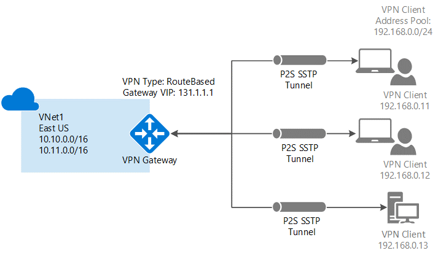
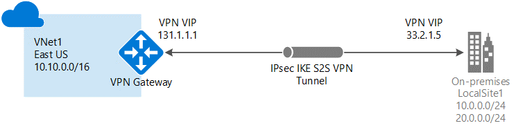
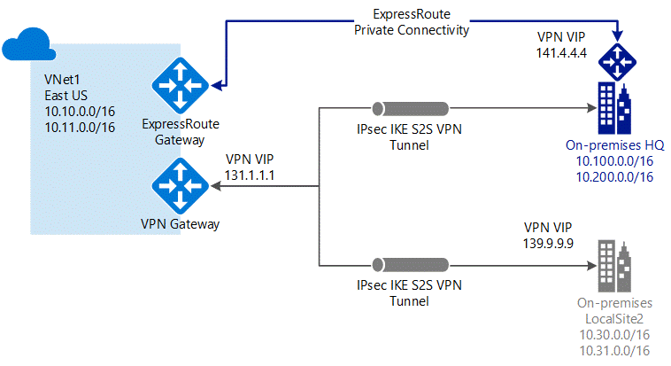
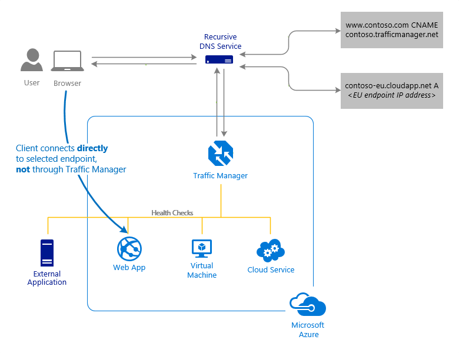
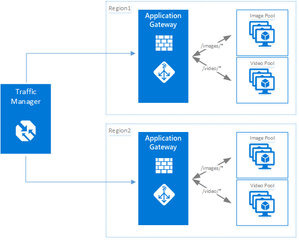

# Azure networking

Azure provides a variety of networking capabilities that can be used together or separately. Click any of the following key capabilities to learn more about them:
- [Connectivity between Azure resources](#connectivity): Connect Azure resources together in a secure, private virtual network in the cloud.
- [Internet connectivity](#internet-connectivity): Communicate to and from Azure resources over the Internet.
- [On-premises connectivity](#on-premises-connectivity): Connect an on-premises network to Azure resources through a virtual private network (VPN) over the Internet, or through a dedicated connection to Azure.
- [Load balancing and traffic direction](#load-balancing): Load balance traffic to servers in the same location and direct traffic to servers in different locations.
- [Security](#security): Filter network traffic between network subnets or individual virtual machines (VM).
- [Routing](#routing): Use default routing or fully control routing between your Azure and on-premises resources.
- [Manageability](#manageability): Monitor and manage your Azure networking resources.
- [Deployment and configuration tools](#tools): Use a web-based portal or cross-platform command-line tools to deploy and configure network resources.

## Connectivity between Azure resources

Azure resources such as Virtual Machines, Cloud Services, Virtual Machines Scale Sets, and Azure App Service Environments can communicate privately with each other through an Azure Virtual Network (VNet). A VNet is a logical isolation of the Azure cloud dedicated to your [subscription](../azure-glossary-cloud-terminology.md?toc=%2fazure%2fnetworking%2ftoc.json). You can implement multiple VNets within each Azure subscription and Azure [region](https://azure.microsoft.com/regions). Each VNet is isolated from other VNets. For each VNet you can:

- Specify a custom private IP address space using public and private (RFC 1918) addresses. Azure assigns resources connected to the VNet a private IP address from the address space you assign.
- Segment the VNet into one or more subnets and allocate a portion of the VNet address space to each subnet.
- Use Azure-provided name resolution or specify your own DNS server for use by resources connected to a VNet.

To learn more about the Azure Virtual Network service, read the [Virtual network overview](../virtual-network/virtual-networks-overview.md?toc=%2fazure%2fnetworking%2ftoc.json) article. You can connect VNets to each other, enabling resources connected to either VNet to communicate with each other across VNets. You can use either or both of the following options to connect VNets to each other:

- **Peering:** Enables resources connected to different Azure VNets within the same Azure region to communicate with each other. The bandwidth and latency across the VNets is the same as if the resources were connected to the same VNet. To learn more about peering, read the [Virtual network peering overview](../virtual-network/virtual-network-peering-overview.md?toc=%2fazure%2fnetworking%2ftoc.json) article.
- **VPN Gateway:** Enables resources connected to different Azure VNets within different Azure regions to communicate with each other. Traffic between VNets flows through an Azure VPN Gateway. Bandwidth between VNets is limited to the bandwidth of the gateway. To learn more about connecting VNets with a VPN Gateway, read the [Configure a VNet-to-VNet connection across regions](../vpn-gateway/vpn-gateway-howto-vnet-vnet-resource-manager-portal.md?toc=%2fazure%2fnetworking%2ftoc.json) article.

## Internet connectivity

All Azure resources connected to a VNet have outbound connectivity to the Internet by default. The private IP address of the resource is source network address translated (SNAT) to a public IP address by the Azure infrastructure. To learn more about outbound Internet connectivity, read the [Understanding outbound connections in Azure](../load-balancer/load-balancer-outbound-connections.md?toc=%2fazure%2fnetworking%2ftoc.json) article.

To communicate inbound to Azure resources from the Internet, or to communicate outbound to the Internet without SNAT, a resource must be assigned a public IP address. To learn more about public IP addresses, read the [Public IP addresses](../virtual-network/virtual-network-public-ip-address.md?toc=%2fazure%2fnetworking%2ftoc.json) article.

## On-premises connectivity

You can access resources in your VNet securely over either a VPN connection, or a direct private connection. To send network traffic between your Azure virtual network and your on-premises network, you must create a virtual network gateway. You configure settings for the gateway to create the type of connection that you want, either VPN or ExpressRoute.

You can connect your on-premises network to a VNet using any combination of the following options:

**Point-to-site (VPN over SSTP)**

The following picture shows separate point to site connections between multiple computers and a VNet:

This connection is established between a single computer and a VNet. This connection type is great if you're just getting started with Azure, or for developers, because it requires little or no changes to your existing network. It's also convenient when you are connecting from a remote location such as a conference or home. Point-to-site connections are often coupled with a site-to-site connection through the same virtual network gateway. The connection uses the SSTP protocol to provide encrypted communication over the Internet between the computer and the VNet. The latency for a point-to-site VPN is unpredictable, since the traffic traverses the Internet.

**Site-to-site (IPsec/IKE VPN tunnel)**

This connection is established between your on-premises VPN device and an Azure VPN Gateway. This connection type enables any on-premises resource that you authorize to access the VNet. The connection is an IPSec/IKE VPN that provides encrypted communication over the Internet between your on-premises device and the Azure VPN gateway. You can connect multiple on-premises sites to the same VPN gateway. The on-premises VPN device at each site must have an externally-facing public IP address that is not behind a NAT. The latency for a site-to-site connection is unpredictable, since the traffic traverses the Internet.

**ExpressRoute (dedicated private connection)**

This type of connection is established between your network and Azure, through an ExpressRoute partner. This connection is private. Traffic does not traverse the Internet. The latency for an ExpressRoute connection is predictable, since traffic doesn't traverse the Internet. ExpressRoute can be combined with a site-to-site connection.

To learn more about all the previous connection options, read the [Connection topology diagrams](../vpn-gateway/vpn-gateway-about-vpngateways.md?toc=%2fazure%2fnetworking%2ftoc.json)
article.

## Load balancing and traffic direction

Microsoft Azure provides multiple services for managing how network traffic is distributed and load balanced. You can use any of the following capabilities separately or together:

**DNS load balancing**

The Azure Traffic Manager service provides global DNS load balancing. Traffic Manager responds to clients with the IP address of a healthy endpoint, based on one of the following routing methods:
- **Geographic:** Clients are directed to specific endpoints (Azure, external or nested) based on which geographic location their DNS query originates from. This method enables scenarios where knowing a client's geographic region, and routing them based on it, is important. Examples include complying with data sovereignty mandates, localization of content & user experience, and measuring traffic from different regions.
- **Performance:** The IP address returned to the client is the "closest" to the client. The 'closest' endpoint is not necessarily closest as measured by geographic distance. Instead, this method determines the closest endpoint by measuring network latency. Traffic Manager maintains an Internet latency table to track the round-trip time between IP address ranges and each Azure datacenter.
- **Priority:** Traffic is directed to the primary (highest-priority) endpoint. If the primary endpoint is not available, Traffic Manager routes the traffic to the second endpoint. If both the primary and secondary endpoints are not available, the traffic goes to the third, and so on. Availability of the endpoint is based on the configured status (enabled or disabled) and the ongoing endpoint monitoring.
- **Weighted round-robin:** For each request, Traffic Manager randomly chooses an available endpoint. The probability of choosing an endpoint is based on the weights assigned to all available endpoints. Using the same weight across all endpoints results in an even traffic distribution. Using higher or lower weights on specific endpoints causes those endpoints to be returned more or less frequently in the DNS responses.

The following picture shows a request for a web application directed to a Web App endpoint. Endpoints can also be other Azure services such as VMs and Cloud Services.

The client connects directly to that endpoint. Azure Traffic Manager detects when an endpoint is unhealthy and then redirects clients to a different, healthy endpoint. To learn more about Traffic Manager, read the [Azure Traffic Manager overview](../traffic-manager/traffic-manager-overview.md?toc=%2fazure%2fnetworking%2ftoc.json) article.

**Application load balancing**

The Azure Application Gateway service provides application delivery controller (ADC) as a service. Application Gateway offers various Layer 7 (HTTP/HTTPS) load-balancing capabilities for your applications, including a web application firewall to protect your web applications from vulnerabilities and exploits. Application Gateway also allows you to optimize web farm productivity by offloading CPU-intensive SSL termination to the application gateway. 

Other Layer 7 routing capabilities include round-robin distribution of incoming traffic, cookie-based session affinity, URL path-based routing, and the ability to host multiple websites behind a single application gateway. Application Gateway can be configured as an Internet-facing gateway, an internal-only gateway, or a combination of both. Application Gateway is fully Azure managed, scalable, and highly available. It provides a rich set of diagnostics and logging capabilities for better manageability. To learn more about Application Gateway, read the [Application Gateway overview](../application-gateway/application-gateway-introduction.md?toc=%2fazure%2fnetworking%2ftoc.json) article.

The following picture shows URL path-based routing with Application Gateway:

**Network load balancing**

The Azure Load Balancer provides high-performance, low-latency Layer 4 load-balancing for all UDP and TCP protocols. It manages inbound and outbound connections. You can configure public and internal load-balanced endpoints. You can define rules to map inbound connections to back-end pool destinations by using TCP and HTTP health-probing options to manage service availability. To learn more about Load Balancer, read the [Load Balancer overview](../load-balancer/load-balancer-overview.md?toc=%2fazure%2fnetworking%2ftoc.json) article.

The following picture shows an Internet-facing multi-tier application that utilizes both external and internal load balancers:

## Security

You can filter traffic to and from Azure resources using the following options:

- **Network:** You can implement Azure network security groups (NSGs) to filter inbound and outbound traffic to Azure resources. Each NSG contains one or more inbound and outbound rules. Each rule specifies the source IP addresses, destination IP addresses, port, and protocol that traffic is filtered with. NSGs can be applied to individual subnets and individual VMs. To learn more about NSGs, read the [Network security groups overview](../virtual-network/security-overview.md?toc=%2fazure%2fnetworking%2ftoc.json) article.
- **Application:** By using an Application Gateway with web application firewall you can protect your web applications from vulnerabilities and exploits. Common examples are SQL injection attacks, cross site scripting, and malformed headers. Application gateway filters out this traffic and stops it from reaching your web servers. You are able to configure what rules you want enabled. The ability to configure SSL negotiation policies is provided to allow certain policies to be disabled. To learn more about the web application firewall, read the [Web application firewall](../application-gateway/application-gateway-web-application-firewall-overview.md?toc=%2fazure%2fnetworking%2ftoc.json) article.

If you need network capability Azure doesn't provide, or want to use network applications you use on-premises, you can implement the products in VMs and connect them to your VNet. The [Azure Marketplace](https://azuremarketplace.microsoft.com/marketplace/apps/category/networking?page=1&subcategories=appliances) contains several different VMs pre-configured with network applications you may currently use. These pre-configured VMs are typically referred to as network virtual appliances (NVA). NVAs are available with applications such as firewall and WAN optimization.

## Routing

Azure creates default route tables that enable resources connected to any subnet in any VNet to communicate with each other. You can implement either or both of the following types of routes to override the default routes Azure creates:
- **User-defined:** You can create custom route tables with routes that control where traffic is routed to for each subnet. To learn more about user-defined routes, read the [User-defined routes](../virtual-network/virtual-networks-udr-overview.md?toc=%2fazure%2fnetworking%2ftoc.json) article.
- **Border gateway protocol (BGP):** If you connect your VNet to your on-premises network using an Azure VPN Gateway or ExpressRoute connection, you can propagate BGP routes to your VNets. BGP is the standard routing protocol commonly used in the Internet to exchange routing and reachability information between two or more networks. When used in the context of Azure Virtual Networks, BGP enables the Azure VPN Gateways and your on-premises VPN devices, called BGP peers or neighbors, to exchange "routes" that inform both gateways on the availability and reachability for those prefixes to go through the gateways or routers involved. BGP can also enable transit routing among  multiple networks by propagating routes a BGP gateway learns from one BGP peer to all other BGP peers. To learn more about BGP, see the [BGP with Azure VPN Gateways overview](../vpn-gateway/vpn-gateway-bgp-overview.md?toc=%2fazure%2fnetworking%2ftoc.json) article.

## Manageability

Azure provides the following tools to monitor and manage networking:
- **Activity logs:** All Azure resources have activity logs which provide information about operations taken place, status of operations and who initiated the operation. To learn more about activity logs, read the [Activity logs overview](../azure-monitor/platform/activity-logs-overview.md?toc=%2fazure%2fnetworking%2ftoc.json) article.
- **Diagnostic logs:** Periodic and spontaneous events are created by network resources and logged in Azure storage accounts, sent to an Azure Event Hub, or sent to Azure Monitor logs. Diagnostic logs provide insight to the health of a resource. Diagnostic logs are provided for Load Balancer (Internet-facing), Network Security Groups, routes, and Application Gateway. To learn more about diagnostic logs, read the [Diagnostic logs overview](../azure-monitor/platform/diagnostic-logs-overview.md?toc=%2fazure%2fnetworking%2ftoc.json) article.
- **Metrics:** Metrics are performance measurements and counters collected over a period of time on resources. Metrics can be used to trigger alerts based on thresholds. Currently metrics are available on Application Gateway. To learn more about metrics, read the [Metrics overview](../monitoring-and-diagnostics/monitoring-overview-metrics.md?toc=%2fazure%2fnetworking%2ftoc.json) article.
- **Troubleshooting:** Troubleshooting information is accessible directly in the Azure portal. The information helps diagnose common problems with ExpressRoute, VPN Gateway, Application Gateway, Network Security Logs, Routes, DNS, Load Balancer, and Traffic Manager.
- **Role-based access control (RBAC):** Control who can create and manage networking resources with role-based access control (RBAC). Learn more about RBAC by reading the [Get started with RBAC](../role-based-access-control/overview.md?toc=%2fazure%2fnetworking%2ftoc.json) article. 
- **Packet capture:** The Azure Network Watcher service provides the ability to run a packet capture on a VM through an extension within the VM. This capability is available for Linux and Windows VMs. To learn more about packet capture, read the [Packet capture overview](../network-watcher/network-watcher-packet-capture-overview.md?toc=%2fazure%2fnetworking%2ftoc.json) article.
- **Verify IP flows:** Network Watcher allows you to verify IP flows between an Azure VM and a remote resource to determine whether packets are allowed or denied. This capability provides administrators the ability to quickly diagnose connectivity issues. To learn more about how to verify IP flows, read the [IP flow verify overview](../network-watcher/network-watcher-ip-flow-verify-overview.md?toc=%2fazure%2fnetworking%2ftoc.json) article.
- **Troubleshoot VPN connectivity:** The VPN troubleshooter capability of Network Watcher provides the ability to query a connection or gateway and verify the health of the resources. To learn more about troubleshooting VPN connections, read the [VPN connectivity troubleshooting overview](../network-watcher/network-watcher-troubleshoot-overview.md?toc=%2fazure%2fnetworking%2ftoc.json) article.
- **View network topology:** View a graphical representation of the network resources in a VNet with Network Watcher. To learn more about viewing network topology, read the [Topology overview](../network-watcher/network-watcher-topology-overview.md?toc=%2fazure%2fnetworking%2ftoc.json) article.

## Deployment and configuration tools

You can deploy and configure Azure networking resources with any of the following tools:

- **Azure portal:** A graphical user interface that runs in a browser. Open the [Azure portal](https://portal.azure.com).
- **Azure PowerShell:** Command-line tools for managing Azure from Windows computers. Learn more about Azure PowerShell by reading the [Azure PowerShell overview](/powershell/azure/overview?toc=%2fazure%2fnetworking%2ftoc.json) article.
- **Azure command-line interface (CLI):** Command-line tools for managing Azure from Linux, macOS, or Windows computers. Learn more about the Azure CLI by reading the [Azure CLI overview](/cli/azure/get-started-with-azure-cli?toc=%2fazure%2fnetworking%2ftoc.json) article.
- **Azure Resource Manager templates:** A file (in JSON format) that defines the infrastructure and configuration of an Azure solution. By using a template, you can repeatedly deploy your solution throughout its lifecycle and have confidence your resources are deployed in a consistent state. To learn more about authoring templates, read the [Best practices for creating templates](../azure-resource-manager/resource-manager-template-best-practices.md?toc=%2fazure%2fnetworking%2ftoc.json) article. Templates can be deployed with the Azure portal, CLI, or PowerShell. To get started with templates right away, deploy one of the many pre-configured templates in the [Azure Quickstart Templates](https://azure.microsoft.com/resources/templates/?term=network) library. 

## Pricing

Some of the Azure networking services have a charge, while others are free. View the [Virtual network](https://azure.microsoft.com/pricing/details/virtual-network), [VPN Gateway](https://azure.microsoft.com/pricing/details/vpn-gateway), [Application Gateway](https://azure.microsoft.com/pricing/details/application-gateway/), [Load Balancer](https://azure.microsoft.com/pricing/details/load-balancer), [Network Watcher](https://azure.microsoft.com/pricing/details/network-watcher), [DNS](https://azure.microsoft.com/pricing/details/dns), [Traffic Manager](https://azure.microsoft.com/pricing/details/traffic-manager) and [ExpressRoute](https://azure.microsoft.com/pricing/details/expressroute) pricing pages for more information.

## Next steps

- Create your first VNet, and connect a few VMs to it, by completing the steps in the [Create your first virtual network](../virtual-network/quick-create-portal.md?toc=%2fazure%2fnetworking%2ftoc.json) article.
- Connect your computer to a VNet by completing the steps in the [Configure a point-to-site connection](../vpn-gateway/vpn-gateway-howto-point-to-site-resource-manager-portal.md?toc=%2fazure%2fnetworking%2ftoc.json) article.
- Load balance Internet traffic to public servers by completing the steps in the [Create an Internet-facing load balancer](../load-balancer/load-balancer-get-started-internet-portal.md?toc=%2fazure%2fnetworking%2ftoc.json) article.
