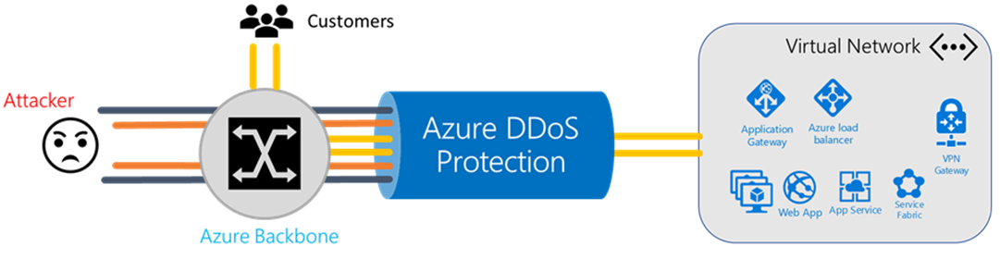
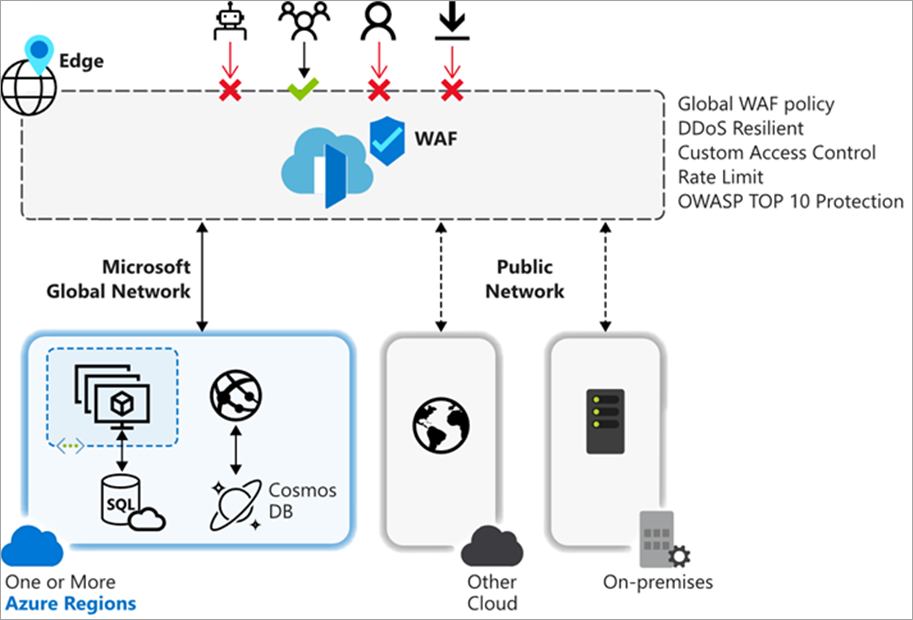

# Azure networking

The networking services in Azure provide a variety of networking capabilities that can be used together or separately. Click any of the following key capabilities to learn more about them:
- [**Connectivity services**](#connect): Connect Azure resources and on-premises resources using Virtual Network, Virtual WAN, ExpressRoute, and VPN Gateway.
- [**Application protection services**](#protect) Protect your applications using DDoS protection, Firewall, Network Security Groups, Web Application Firewall, and Virtual Network Endpoints.
- [**Application delivery services**](#deliver) Deliver applications in the Azure network using CDN, Front Door, Traffic Manager, Application Gateway, Load Balancer.
- [**Network monitoring**](#monitor) – Monitor your network resources in Azure using Network Watcher, ExpressRoute Monitor, Azure Monitor, Virtual Network TAP.

## Connectivity services
This section describes services that provide connectivity between Azure resources (Virtual Network), connectivity from an on-premises network to Azure resources, and branch to branch connectivity in Azure.

|Service|Why use?|Scenarios|
|---|---|---|
|[Virtual network](../virtual-network/virtual-networks-overview.md)|Enables Azure resources to securely communicate with each other, the internet, and on-premises networks.|[Filter network traffic](../virtual-network/tutorial-filter-network-traffic.md), [route network traffic](../virtual-network/tutorial-create-route-table-portal.md), [restrict network access to resources](../virtual-network/tutorial-restrict-network-access-to-resources.md), [connect virtual networks](../virtual-network/tutorial-connect-virtual-networks-portal.md).|
|[ExpressRoute](../expressroute/expressroute-introduction.md)|Extends your on-premises networks into the Microsoft cloud over a private connection facilitated by a connectivity provider.||
|[VPN Gateway](../vpn-gateway/vpn-gateway-about-vpngateways.md)|Sends encrypted traffic between an Azure virtual network and an on-premises location over the public Internet.|[Site-to-site-connections](../vpn-gateway/vpn-gateway-howto-site-to-site-resource-manager-portal.md), [VNet-to-VNet connections](../vpn-gateway/vpn-gateway-howto-vnet-vnet-resource-manager-portal.md), [Point-to-site connections](../vpn-gateway/vpn-gateway-howto-point-to-site-resource-manager-portal.md).|
|[Virtual WAN](../virtual-wan/virtual-wan-about.md)|Optimizes and automates branch connectivity to, and through, Azure. Azure regions serve as hubs that you can choose to connect your branches to.|[Site-to-site connections](../virtual-wan/virtual-wan-site-to-site-portal.md), [ExpressRoute connections](../virtual-wan/virtual-wan-expressroute-portal.md) [Point-to-site connections](../virtual-wan/virtual-wan-point-to-site-portal.md) |
|[Virtual network service endpoints](../virtual-network/virtual-network-service-endpoints-overview.md)|Enables you to limit network access to some Azure service resources to a virtual network subne|[Restrict network access to PaaS resources](../virtual-network/tutorial-restrict-network-access-to-resources-powershell.md)|

## Application protection services

Describes networking services in Azure that help protect your network resources - DDoS Protection, Web Application Firewall, Azure Firewall, network security groups, and service endpoints.

|Service|Why use?|Scenario|
|---|---|---|
|[DDoS protection](#ddosprotection)|High availability for your applications with protection from excess IP traffic charges|DDOS protection tuned to your application traffic patterns|
|[Web Application Firewall](#waf)|Prevent SQL injection, stop cross site scripting, and an array of other types of attacks using cloud native approach|Centralized inbound web application protection from common exploits and vulnerabilities|
|[Azure Firewall](#firewall)|Better central governance of all traffic flows, full devops integration using cloud native high availability with autoscale|Centralized outbound and inbound (non-HTTP/S) network and application (L3-L7) filtering|
|[Network security groups](#nsg)|Full granular distributed end node control at VM/subnet for all network traffic flows|Distributed inbound & outbound network (L3-L4) traffic filtering on VM, Container, or subnet|
|[Service endpoints](#serviceendpoints)|Extend your Virtual Network controls to lock down Azure service resources (PaaS) access|Restrict access to Azure service resources (PaaS) to only your virtual network
|
### DDoS Protection
Azure DDoS protection, combined with application design best practices, provide defense against DDoS attacks. The service is available in two service tiers - Basic and Standard. For more information about DDoS protection, see [DDoS Protection Overview](../virtual-network/ddos-protection-overview.md).

### Web Application Firewall

Web application firewall (WAF) provides centralized protection of your web applications from common exploits and vulnerabilities. For more information about Web Application Firewall, see [WAF overview](../frontdoor/waf-overview.md)

### Azure Firewall
Azure Firewall is a managed, cloud-based network security service that protects your Azure Virtual Network resources. For more information about Azure Firewall, see the [Azure Firewall documentation](../firewall/overview.md).

### Network security groups
You can filter network traffic to and from Azure resources in an Azure virtual network with a network security group. For more information, see [Security Overview](../virtual-network/security-overview.md).

### Service endpoints
Virtual Network (VNet) service endpoints extend your virtual network private address space and the identity of your VNet to the Azure services, over a direct connection. Endpoints allow you to secure your critical Azure service resources to only your virtual networks. Traffic from your VNet to the Azure service always remains on the Microsoft Azure backbone network. For more information, see [Virtual network service endpoints](../virtual-network/virtual-network-service-endpoints-overview.md).

## Application delivery in Azure

Deliver applications in the Azure network using Content Delivery Network (CDN), Front Door, Traffic Manager, Application Gateway, Load Balancer Azure networking services.

|Service|Why use?|Scenario|
|---|---|---|
|[Content Delivery Network](#cdn)|||
|[Front Door](#frontdoor)|||
|[Traffic Manager](#trafficmanager)|||
|[Load Balancer](#loadbalancer)|||
|[Application Gateway](#applicationgateway)|||
|

### Content Delivery Network
Azure Content Delivery Network (CDN) offers developers a global solution for rapidly delivering high-bandwidth content to users by caching their content at strategically placed physical nodes across the world. For more information about Azure CDN, see [Azure Content Delivery Network](../cdn/cdn-overview.md)

### Azure Front Door service
Azure Front Door Service enables you to define, manage, and monitor the global routing for your web traffic by optimizing for best performance and instant global failover for high availability. With Front Door, you can transform your global (multi-region) consumer and enterprise applications into robust, high-performance personalized modern applications, APIs, and content that reach a global audience with Azure. For more information, see [Azure Front Door](../frontdoor/front-door-overview.md).

### Traffic Manager

Azure Traffic Manager is a DNS-based traffic load balancer that enables you to distribute traffic optimally to services across global Azure regions, while providing high availability and responsiveness. For more information, see [Azure Traffic Manager](../traffic-manager/traffic-manager-overview.md)

### Load Balancer
Azure Load Balancer helps you scale your applications and create high availability for your services. Load Balancer supports inbound and outbound scenarios, provides low latency and high throughput, and scales up to millions of flows for all TCP and UDP applications. For more information, see [Azure Load Balancer](../load-balancer/load-balancer-overview.md).

### Application Gateway
Azure Application Gateway is a web traffic load balancer that enables you to manage traffic to your web applications. It is an Application Delivery Controller (ADC) as a service, offering various layer 7 load-balancing capabilities for your applications. For more information, see [What is Azure Application Gateway?](../application-gateway/overview.md). 

## Network monitoring services
Monitor your network resources in Azure using Network Watcher, ExpressRoute Monitor, Azure Monitor, Virtual Network TAP.

|Service|Why use?|Scenario|
|---|---|---|
|[Network Watcher](#networkwatcher)|||
|[ExpressRoute Monitor](#expressroutemonitor)|||
|[Azure Monitor](#azuremonitor)|||
|[Virtual Network TAP](#vnettap)|||
|

### Network Watcher
Azure Network Watcher provides tools to monitor, diagnose, view metrics, and enable or disable logs for resources in an Azure virtual network. For more information, see [What is Network Watcher?](../network-watcher/network-watcher-monitoring-overview.md?toc=%2fazure%2fnetworking%2ftoc.json).
### ExpressRoute Monitor
To learn about how view ExpressRoute circuit metrics, diagnostic logs and alerts, see [ExpressRoute monitoring, metrics, and alerts](../expressroute/expressroute-monitoring-metrics-alerts.md?toc=%2fazure%2fnetworking%2ftoc.json).
### Azure Monitor
Azure Monitor maximizes the availability and performance of your applications by delivering a comprehensive solution for collecting, analyzing, and acting on telemetry from your cloud and on-premises environments. It helps you understand how your applications are performing and proactively identifies issues affecting them and the resources they depend on. For more information, see [Azure Monitor Overview](../azure-monitor/overview.md?toc=%2fazure%2fnetworking%2ftoc.json).
### Virtual Network TAP
Azure virtual network TAP (Terminal Access Point) allows you to continuously stream your virtual machine network traffic to a network packet collector or analytics tool. The collector or analytics tool is provided by a [network virtual appliance](https://azure.microsoft.com/solutions/network-appliances/) partner. For more information, see .

## Next steps

- Create your first VNet, and connect a few VMs to it, by completing the steps in the [Create your first virtual network](../virtual-network/quick-create-portal.md?toc=%2fazure%2fnetworking%2ftoc.json) article.
- Connect your computer to a VNet by completing the steps in the [Configure a point-to-site connection article](../vpn-gateway/vpn-gateway-howto-point-to-site-resource-manager-portal.md?toc=%2fazure%2fnetworking%2ftoc.json).
- Load balance Internet traffic to public servers by completing the steps in the [Create an Internet-facing load balancer](../load-balancer/load-balancer-get-started-internet-portal.md?toc=%2fazure%2fnetworking%2ftoc.json) article.
 
 
   
