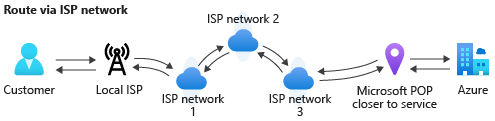

# Routing Azure traffic to the Internet

Microsoft has built a large global network for Azure customers, built to offer fast response times and continuously augmented with new edges to be as close to the customer as possible. In addition to the low latency reach to Microsoft network from any part of the globe, the Microsoft Global Network is the best performing cloud network of all three major players as reported recently by ThousandEyes.  Microsoft's Global network is designed to be highly redundant and available, with diverse paths to handle failures such as fiber cuts without any interruptions to customer traffic. Additionally, Azure enables cold potato routing for user traffic coming from or to the Internet, which means Microsoft carries customer traffic on its secure, fast, and reliable global private network as much as possible without needing to traverse on the public Internet.

However, one size does not fit all. Customer workloads have differing requirements for availability, performance, and cost. Routing Preference allows Azure customers to choose how their traffic to/from their Azure resources is   delivered in a manner that best suits their business needs.

## Routing on Microsoft Global Network

This routing option brings customer packets into Microsoft's highly reliable, diverse, monitored and managed Global network at an edge site close to the end user. The egress traffic is also carried across Microsoft Global network close to the end user (cold potato routing).

#### Example: User from Seattle accessing Azure resources deployed in West Europe (Amsterdam)

Ingress Route: Traffic from user in Seattle enters Microsoft Network Point Of Presence in Seattle (WST)  ->  Traffic traverses on Microsoft Global Network from Seattle to Amsterdam to reach Azure resources deployed in West Europe. 

Return Path (Egress Route): Traffic from Azure resources deployed in West Europe traverses on Microsoft Global Network all the way to Seattle, and exits Microsoft Network in Seattle.

## Routing on Internet Path(ISP Network)

With this routing option, customer traffic enters and exits Microsoft network only in the Azure region where the service is hosted. Traffic traverses on ISP internet route and enters/exits Microsoft Point Of Presence in Azure region where service is deployed. Performance and Reliability are typical ISP quality. Microsoft peers with selective transit ISPs to provide good performance to customers.

#### Example: User from Seattle accessing Azure resources deployed in West Europe (Amsterdam)

Ingress Route: Traffic from user in Seattle takes internet route and enters Microsoft Network Point Of Presence in Amsterdam. 

Return Path (Egress Route): Traffic from Azure resources deployed in West Europe exits Microsoft Network in Amsterdam, and takes internet route to reach users in Seattle.

## Next steps

* [Configure Routing Preference for Azure resources](configure-routing-preference-portal.md)
