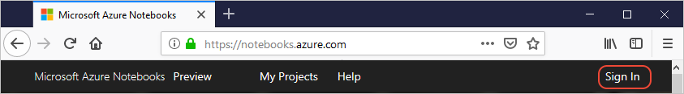
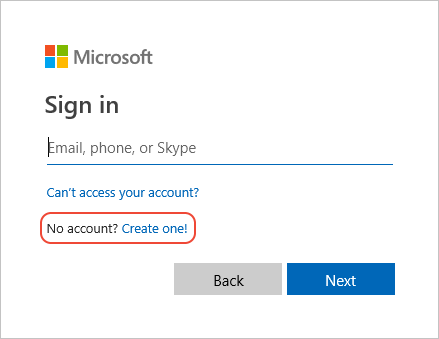
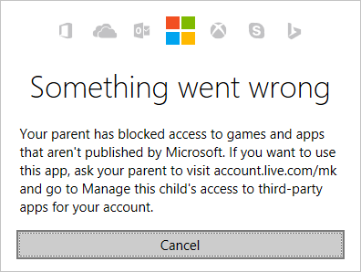
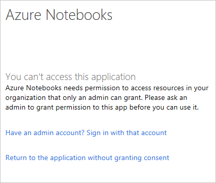

# Your user account for Azure Notebooks Preview

You can use Azure Notebooks with or without signing in with a user account:

- Without signing in, you can create and run notebooks but cannot retain notebooks or data files as part of projects. Users who receive a link to an Azure Notebook, for example, can enjoy the notebook without needing to sign in.
- When signed in, Azure Notebooks retains all your projects with your account. Signed-in users also have a user ID that allows them to share their projects and notebooks with others.
- When the account used for Azure Notebooks is also associated with an Azure Subscription, you gain additional benefits such as running notebooks on more powerful servers, creating private notebooks, and granting permissions to notebooks to individual users.

[!INCLUDE [notebooks-status](../../includes/notebooks-status.md)]

Signing into Azure Notebooks requires either a Microsoft Account or a "Work or School" account. You're prompted for your account when selecting the **Sign In** command on the upper right side of the Notebooks page:

All the work you do in Azure Notebooks is associated with the account you use to sign in. Each account must also have a unique user ID in your [user profile](azure-notebooks-user-profile.md). As a result, you can sign into Azure Notebooks with different accounts if you need to maintain separate sets of projects and separate identities. For example, every member of a data science team might have both individual accounts alongside as a shared group account that they use to present their work to people outside of their company. Instructors, similarly, might maintain an account for their teaching role that's different from an account used in external consulting or open-source work.

## Microsoft accounts

Microsoft accounts are used to sign into any number of Microsoft products and services, such as Windows, Azure, outlook.com, OneDrive, and XBox Live. If you use any of those services, it's likely that you already have a Microsoft Account that you can use with Azure Notebooks.

If you're unsure, select the **Create One** command in the account prompt. You can create a new Microsoft account using any email address from any provider.

> [!Note]
> If you attempt to create a new account with an email address that already has an account associated with it, you may see the message, "You can't sign up here with a work or school email address. Use a personal email, such as Gmail or Yahoo!, or get a new Outlook email." In that case, try signing in with the work email address without creating a new account.

For child accounts, access to Azure Notebooks is blocked by default. Signing in with a child account displays the error shown below:

To enable access, a parent must do the following steps:

1. Visit `https://account.live.com/mk` and sign in with a parent account.
1. In the section for the child in question, select **Manage this child's access to third-party apps**.
1. On the next page, select **Enable access**.
1. When the child account is next used to log into Azure Notebooks, select **Yes** in the permissions prompt that appears.

> [!Warning]
> Enabling access to third-party apps for Azure Notebooks also enables access for all other third-party apps. Parents are advised to use discretion when enabling access and may want to monitor their child's activity more closely.

## Work or school accounts

A work or school account is created by an organization’s administrator to enable a member of the organization to access Microsoft cloud services such as Office 365, and also as an account to sign into Windows on a domain-joined computer. A work or school account typically uses an organizational email address, such as any-user@contoso.com.

Signing into Azure Notebooks with a work or school account may require administrator consent because Azure Notebooks collects or uses (but does not disclose) information such as the account's email address and the user's browser information. (Browser data is used to optimize features according to popular usage.)

The administrator of an organizational account must provide consent on behalf of users if users are restricted from consenting individually. In this case, users see the message "You can't access this application":

To provide consent as an administrator, use the [administrator consent page](https://notebooks.azure.com/account/adminConsent), which walks you through the process.

## Next steps  

> [!div class="nextstepaction"]
> [Edit your profile and user ID](azure-notebooks-user-profile.md)
