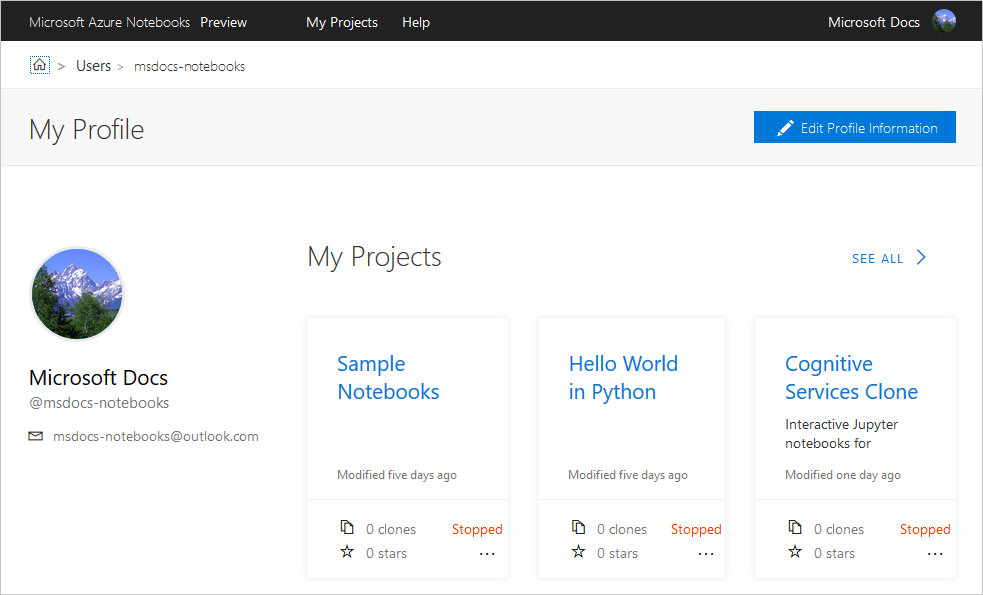
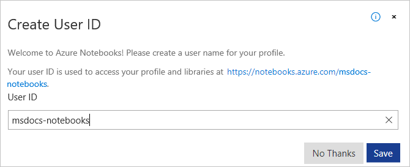
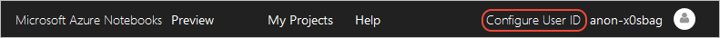

# Your profile and user ID for Azure Notebooks

Within the powerful, collaborative space of Azure Notebooks, your user profile presents your public image to others:

Your user ID is part of the URLs you use to share projects and notebooks. The following list describes the different URL patterns:

- `https://notebooks.azure.com/<user_id>`: Your profile page.
- `https://notebooks.azure.com/<user_id>/projects`: Your projects. You see all projects; other users see only your public projects.
- `https://notebooks.azure.com/<user_id>/projects/<project_id>`: Project files.
- `https://notebooks.azure.com/<user_id>/projects/<project_id>/clones`: Clones of a specific projects.
- `https://notebooks.azure.com/<user_id>/projects/<project_id>/html/<notebook>.ipynb`: The HTML preview of a specific notebook or file.

## Your user ID

When signing into Azure Notebooks for the first time, your account is automatically assigned a temporary user ID, such as "anon-idr3ca". As long as you have a user ID that begins with "anon-", Azure Notebooks prompts you to change it whenever you sign in:

A **Configure User ID** command also appears next to the temporary user name:

You can also change your user ID at any time on your profile page.

A user ID must be composed of between four and sixteen letters, numbers, and hyphens. No other characters are allowed, and the user ID cannot begin or end with a hyphen or use multiple hyphens in a row. Because user IDs are unique across all Azure Notebooks accounts, you may see the message, "User ID is already in use." (The message also appears if you attempt to use a Microsoft trademark as a user ID.) In these cases, choose a different user ID.

> [!Important]
> Changing your ID invalidates any URLs you might have shared using your previous ID. You can change your ID back to your previous ID to revalidate the links. However, it's possible for another user to claim an unused the ID in the meantime.

## Your profile

Your profile is composed of publicly viewable information at the URL, `https://notebooks.azure.com/<user_id>`. Your profile page also shows your recently used projects and any starred projects.

To edit your profile, use the **Edit Profile Information** command on your profile page. The sections of your profile are as follows:

| Section | Contents |
| --- | --- |
| Profile photo | An image that's shown on your profile page. |
| Account Information | Your display name, user ID, and public email account. The email account here provides other users a mean to contact you and can be different from the [account](azure-notebooks-user-account.md) you use to sign into Azure Notebooks itself. |
| Profile Information | Your location, company, job title, web site, and a short description of yourself. |
| Social Profiles | Your GItHub, Twitter, and Facebook IDs, if you wish to share them. |
| Privacy Settings | Provides two commands:<ul><li>**Export My Profile**: creates and downloads a *.zip* file containing all the information that Azure Notebooks saves in your profile, including your photograph, profile information, and security logs.</li><li>**Delete My Account**: Permanently deletes all your personal information stored in Azure Notebooks.</li></ul> |
| Enable Site Features | Allows you to control aspects of the behavior of Azure Notebooks:<ul><li>**Unified Frontend for Notebooks**: enables faster notebook startup and better persistence.</li><li>**Run in JupyterLab by default**: By default, Azure Notebooks provides a simple user interface that's suitable for most users. JupyterLab provides a richer but more complicated interface for experienced users.</li><li>**VNext Website**: enables the modernized web layout shown in this documentation.</li></ul> |

## Next steps  

> [!div class="nextstepaction"]
> [Tutorial: create an run a Jupyter notebook to do linear regression](tutorial-create-run-jupyter-notebook.md)
