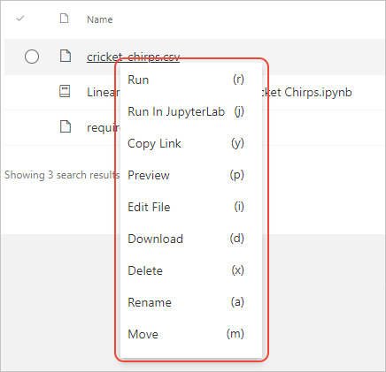
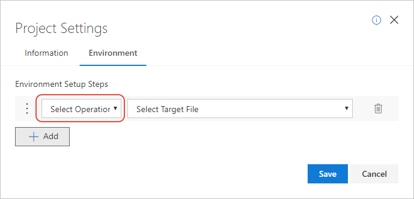
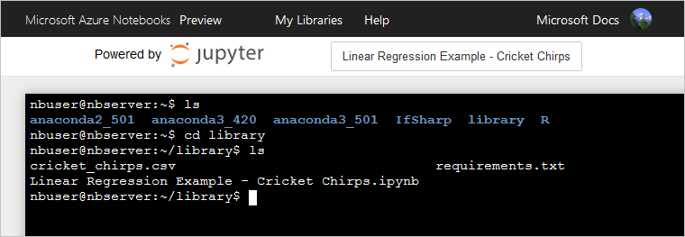

# Manage and configure projects

A project in Azure Notebooks is essentially a configuration of the underlying Linux virtual machine in which Jupyter notebooks run, along with a file folder and descriptive metadata. The project dashboard in Azure Notebooks allows you to manage files and otherwise configure the project's characteristics:

- The compute tier on which the project runs, which can be the free tier or an Azure virtual machine.
- Project metadata, which includes a name, description, an identifier that's used when sharing the project, and whether the project is public or private.
- The project's notebook, data, and other files, which you manage like any other file system.
- A project's environment, which you manage either through startup scripts or directly through the terminal.
- Logs, which you access through the terminal.

> [!Note]
> The management and configuration features described here are available only to the project owner who created the project initially. You can, however, clone the project into your own account, in which case you become the owner and can configure the project as desired.

Azure Notebooks starts the underlying virtual machine whenever you run a notebook or other file. The server automatically saves files and shuts down after 60 minutes of inactivity. You can also stop the server at any time with the **Shutdown** command (keyboard shortcut: h).

## Compute tier

By default, projects run on the **Free Compute** tier, which is limited to 4GB of memory and 1GB of data to prevent abuse. You can bypass these limitations and increase compute power by using a different virtual machine that you've provisioned in an Azure subscription. For more information, see [How to use Data Science Virtual Machines](use-data-science-virtual-machine.md).

## Edit project metadata

On the project dashboard, select **Project Settings**, then select the **Information** tab, which contains the project's metadata as described in the following table. You can change project metadata at any time.

| Setting | Description |
| --- | --- |
| Project name | A friendly name for your project that Azure Notebooks uses for display purposes. For example, "Hello World in Python". |
| Project ID | A custom identifier that becomes part of the URL you use to share a project. This ID can use only letters, numbers, and hyphens, is limited to 30 characters, and cannot be a [reserved project ID](create-clone-jupyter-notebooks.md#reserved-project-ids). If you're unsure what to use, a common convention is to use a lowercase version of your project name where spaces are turned into hyphens, such as "my-notebook-project" (truncated if necessary to fit the length limit). |
| Public project | If set, allows anyone with the link to access the project. When creating a private project, clear this option. |
| Hide clones | If set, other users can't see a list of clones that have been made for this project. Hiding clones is useful for projects that are shared with many people who are not part of the same organization, such as when using a notebook for teaching a class. |

> [!Important]
>
> Changing the project ID invalidates any links to the project that you might have shared previously.

## Manage project files

The project dashboard shows the contents of the project's folder system. You can use various commands to manage those files.

### Create new files and folders

The **+ New** command (keyboard shortcut: n) creates new files or folders. When using the command, first select the type of item to create:

| Item type | Description | Command behavior |
| --- | --- | --- |
| **Notebook** | A Jupyter notebook | Displays a popup in which you specify the notebook's filename and language. |
| **Folder** | A subfolder | Creates an edit field in the project's file list into which you enter the folder name. |
| **Blank File** | A file into which you can store any content such as text, data, etc. | Creates an edit field in the project's file list into which you enter the file name. |
| **Markdown** | A Markdown file. | Creates an edit field in the project's file list into which you enter the file name. |

### Upload files

The **Upload** command provides two options to import data from other locations: **From URL** and **From Computer**. For more information, see [Work with data files in Azure Notebook projects](work-with-project-data-files.md).

### Select file-specific commands

Each item in the project's file list provides commands through a right-click context menu:



| Command | Keyboard shortcut | Action |
| --- | --- | --- |
| Run | r (or click) | Runs a notebook file. Other file types are opened for viewing.  |
| Copy Link | y | Copies a link to the file to the clipboard. |
| Run in Jupyter Lab | j | Runs a notebook in JupyterLab, which is a more developer-oriented interface than Jupyter normally provides. |
| Preview | p | Opens an HTML preview of the file; for notebooks, the preview is a read-only rendering of the notebook. For more information, see the [Preview](#preview) section. |
| Edit file | i | Opens the file for editing. |
| Download | d | Downloads a zip file that contains the file or the contents of a folder. |
| Rename | a | Prompts for a new name for the file or folder. |
| Delete | x | Prompts for confirmation, then permanently removes the file from the project. Deletions cannot be undone. |
| Move | m | Moves a file into a different folder in the same project. |

#### Preview

A preview of a file or notebook is a read-only view of the contents; running notebook cells is disabled. A preview is shown to anyone that has a link to the file or notebook but has not signed into Azure Notebooks. Once signed in, a user can clone the notebook to their own account, or they can download the notebook to their local computer.

The preview page supports several toolbar commands with keyboard shortcuts:

| Command | Keyboard shortcut | Action |
| --- | --- | --- |
| Share | s | Displays the sharing popup from which you can obtain a link, share to social media, obtain HTML for embedding, and send an email. |
| Clone | c  | Clone the notebook to your account. |
| Run | r | Runs the notebook if you're allowed to do so. |
| Download | d | Downloads a copy of the notebook. |

## Configure the project environment

There are three ways to configure the environment of the underlying virtual machine in which your notebooks run:

- Include a one-time initialization script
- Use the project's environment settings to specify setup steps
- Access the virtual machine through a terminal.

All forms of project configuration are applied whenever the virtual machine is started, and thus affects all notebooks within the project.

### One-time initialization script

The first-time Azure Notebooks creates a server for the project, it looks for a file in the project called *aznbsetup.sh*. If this file is present, Azure Notebooks runs it. The output of the script is stored in your project folder as *.aznbsetup.log*.

### Environment setup steps

You can use the project's environment settings to create individual steps that configure the environment.

On the project dashboard, select **Project Settings**, then select the **Environment** tab in which you add, remove, and modify setup steps for the project:


To add a step, first select **+ Add**, then select a step type in the **Operation** drop-down list:



The information you then project depends on the type of operation you chose:

- **Requirements.txt**: In the second drop-down list, select a *requirements.txt* file that's already in the project. Then select a Python version from the third drop-down list that appears. By using a *requirements.txt* file, Azure Notebooks runs `pip install -r` with the *requirements.txt* file when starting a notebook server. You don't need to explicitly install packages from within the notebook itself.

- **Shell script**: In the second drop-down list, select a bash shell script in the project (typically a file with the *.sh* extension) that contains any commands you wish to run to initialize the environment.

- **Environment.yml**: In the second drop-down list, select an *environments.yml* file for Python projects using a conda environment.

When you're done adding steps, select **Save**.

### Use the terminal

On the project dashboard, the **Terminal** command opens a Linux terminal that gives you direct access to the server. Within the terminal you can download data, edit or manage files, inspect processes, and even use tools like vi and nano.

> [!Note]
> If you have startup scripts in your project's environment, opening the terminal may display a message indicating that setup is still in progress.

You can issue any standard Linux commands in the terminal. You can also use `ls` in the home folder to see the different environments that exist on the virtual machine, such as *anaconda2_501*, *anaconda3_420*, *anaconda3_501*, *IfSharp*, and *R*, along with a *project* folder that contains the project:



To affect a specific environment, change directories into that environment folder first.

For the Python environments, you can find `pip` and `conda` in *bin* folder of each environment. You can also use built-in aliases for the environments:

```bash
# Anaconda 2 5.3.0/Python 2.7: python27
python27 -m pip install <package>

# Anaconda 3 4.2.0/Python 3.5: python35
python35 -m pip install <package>

# Anaconda 3 5.3.0/Python 3.6: python36
python36 -m pip install <package>
```

Changes made to the server apply only to the current session, except for files and folders you create in the *project* folder itself. For example, editing a file in the project folder is persisted between sessions, but packages with `pip install` are not.

> [!Note]
> If you use `python` or `python3`, you invoke the system-installed versions of Python, which are not used for notebooks. You don't have permissions for operations like `pip install` either, so be sure to use the version-specific aliases.

## Access notebook logs

If you run into issues when running a notebook, output from Jupyter is stored in a folder named *.nb.log*. You can access these logs through the **Terminal** command or the project dashboard.

Typically when you're running Jupyter locally you may have started it from a terminal window. The terminal window shows output such as kernel status.

To view logs, use the following command in the terminal:

```bash
cat .nb.log
```

You can also use the command from a code cell in a Python notebook:

```bash
!cat .nb.log
```

## Next steps

- [How to: Work with project data files](work-with-project-data-files.md)
- [Access cloud data in a notebook](access-data-resources-jupyter-notebooks.md)
