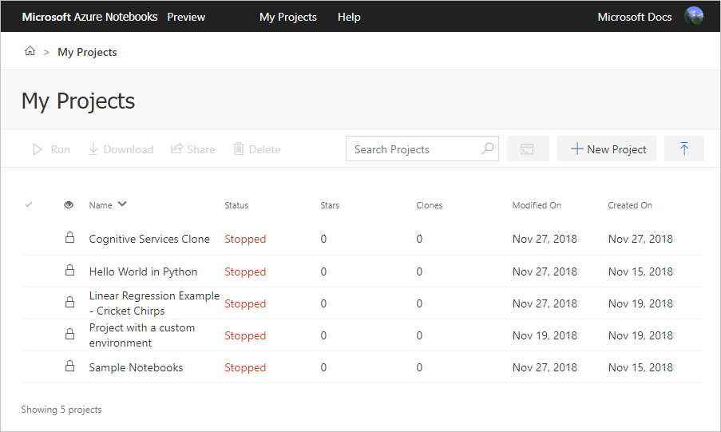
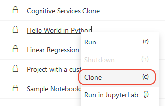
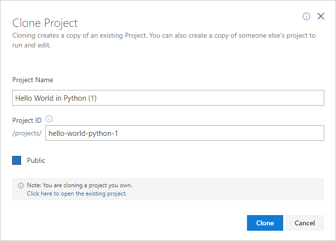

# Create and clone projects in Azure Notebooks Preview

Azure Notebooks organizes your Jupyter notebooks and related files into logical groups called *projects*. You create a project first as a container, then create or clone one or more notebooks within a folder alongside other project files. (This process is demonstrated in the [tutorial](tutorial-create-run-jupyter-notebook.md).)

[!INCLUDE [notebooks-status](../../includes/notebooks-status.md)]

A project also maintains metadata and other configuration settings that affect the server on which notebooks run, including custom setup steps and package installation. For more information, see [Manage and configure projects](configure-manage-azure-notebooks-projects.md).

## Use the My Projects dashboard

Your **My Projects** dashboard at `https://notebooks.azure.com/<userID>/projects` is where you view, manage, and create projects:

[](media/my-projects-dashboard.png#lightbox)

What you can do on the dashboard depends on whether you're signed in with the account that owns the user ID:

| Command | Available to | Description |
| --- | --- | --- |
| **Run** | Owner | Starts the project server and opens the project folder in Jupyter. (More commonly, you navigate into a project folder first, then start a notebook from there.) |
| **Download** | Anyone | Downloads a copy of the selected project as a ZIP file. |
| **Share** | Anyone | Displays the sharing popup through which you can obtain a URL to a selected project, share to social media, send an email with the URL, and obtain both HTML or Markdown code for with a "launch notebook" badge (see [obtain a launch badge](#obtain-a-launch-badge)) with the URL. |
| **Delete** | Owner | Deletes the selected project. This operation cannot be undone. |
| **Terminal** | Owner | Starts the project server, then opens a new browser window with the bash terminal for that server. |
| **+ New Project** | Owner | Creates a new project. See [Create a new project](#create-a-new-project). |
| **Upload GitHub Repo** | Owner | Imports a project from GitHub. [Import a project from GitHub](#import-a-project-from-github). |
| **Clone** | Anyone | Copies a selected project into your own account. Prompts you to sign in if not already. See [Clone a project](#clone-a-project). |

### Obtain a launch badge

When you use the **Share** command and select the **Embed** tab, you can copy either HTML code or Markdown that creates a "launch notebook" badge:


If you don't have an Azure Notebooks project, you can create a link that clones from GitHub directly using the following templates, substituting the appropriate username and repository names:

```html
<a href="https://notebooks.azure.com/import/gh/<GitHub_username>/<repository_name>"></a>
```

```markdown
[](https://notebooks.azure.com/import/gh/<GitHub_username>/<repository_name>)
```

## Create a new project

When you use the **+ New Project** command, Azure Notebooks displays a **Create New Project** popup. In this popup, enter the following information, then select **Create**:

| Field | Description |
| --- | --- |
| Project name | A friendly name for your project that Azure Notebooks uses for display purposes. For example, "My Notebook Project". |
| Project ID | A custom identifier that becomes part of the URL you use to share a project (the form is `https://notebooks.azure.com/<user_id>/projects/<project_id>`). This ID can use only letters, numbers, and hyphens, is limited to 30 characters, and cannot be a [reserved project ID](#reserved-project-ids). If you're unsure what to use, a common convention is to use a lowercase version of your project name where spaces are turned into hyphens, such as "my-notebook-project" (truncated if necessary to fit the length limit). |
| Public | If set, allows anyone with the link to access the project. When creating a private project, clear this option. |
| Initialize this project with a README | If set, creates a default *README.md* file in the project. A *README.md* file is where you provide documentation for your project, if desired. |

### Reserved project IDs

The following reserved words cannot be used by themselves as project IDs. These reserved words can, however, be used as part of longer project IDs.

| | | | | | |
| --- | --- | --- | --- | --- | --- |
| about | account | administration | api | blog | classroom |
| content | dashboard | explore | faq | help | html |
| home | import | library | management | new | notebook |
| notebooks | pdf | preview | pricing | profile | search |
| status | support | test | | | |

If you attempt to use one of these words as a project ID, the **Create New Project** and **Project Settings** popups indicate, "Library id is a reserved identifier."

Because a project ID is also part of a project's URL, ad blocker software might block the use of certain keywords, such as "advert." In such cases, use a different word in the project ID.

## Import a project from GitHub

You can easily import an entire public GitHub repo as a project including any data and *README.md* files. Use the **Upload GitHub Repo** command, provide the following details in the popup, then select **Import**:

| Field | Description |
| --- | --- |
| GitHub repository | The name of the source repository on github.com. For example, to clone the Jupyter notebooks for Azure Cognitive Services at [https://github.com/Microsoft/cognitive-services-notebooks](https://github.com/Microsoft/cognitive-services-notebooks), enter "Microsoft/cognitive-services-notebooks".  |
| Clone recursively | GitHub repositories can contain multiple child repositories. Set this option if you want to clone the parent repository and all its children. Because it's possible for a repository to have many children, leave this option clear unless you know you need it. |
| Project name | A friendly name for your project that Azure Notebooks uses for display purposes. |
| Project ID | A custom identifier that becomes part of the URL you use to share a project (the form is `https://notebooks.azure.com/<user_id>/projects/<project_id>`). This ID can use only letters, numbers, and hyphens, is limited to 30 characters, and cannot be a [reserved project ID](#reserved-project-ids). If you're unsure what to use, a common convention is to use a lowercase version of your project name where spaces are turned into hyphens, such as "my-notebook-project" (truncated if necessary to fit the length limit). |
| Public | If set, allows anyone with the link to access the project. When creating a private project, clear this option. |

Importing a repository from GitHub also imports its history. You can use standard Git commands from the terminal to commit new changes, pull changes from GitHub, and so on.

## Clone a project

Cloning creates a copy of an existing project in your own account, where you can then run and modify any notebook or other file in the project. You can also use cloning to make copies of your own projects in which you do experiments or other work without disturbing the original project.

To clone a project:

1. On the **My Projects** dashboard, right-click the desired project and select **Clone** (keyboard shortcut: c).

    

1. In the **Clone Project** popup, enter a name and ID for the clone, and specify whether the clone is public. These settings are the same as for a [new project](#create-a-new-project).

    

1. After you select the **Clone** button, Azure Notebooks navigates directly to the copy.

## Next steps

- [Explore sample notebooks](azure-notebooks-samples.md)
- [How to: Configure and manage projects](configure-manage-azure-notebooks-projects.md)
- [How to: Install packages from within a notebook](install-packages-jupyter-notebook.md)
- [How to: Present a slide show](present-jupyter-notebooks-slideshow.md)
- [How to: Work with data files](work-with-project-data-files.md)
- [How to: Access data resources](access-data-resources-jupyter-notebooks.md)
- [How to: Use Azure Machine Learning](use-machine-learning-services-jupyter-notebooks.md)
