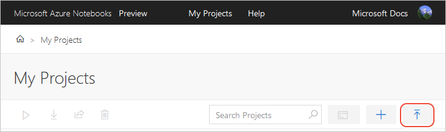
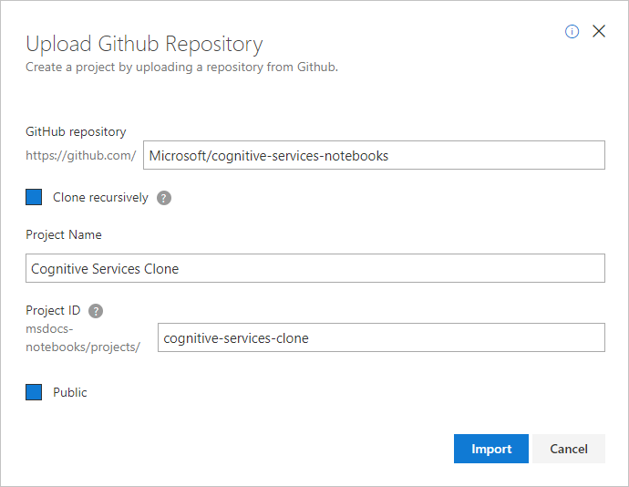
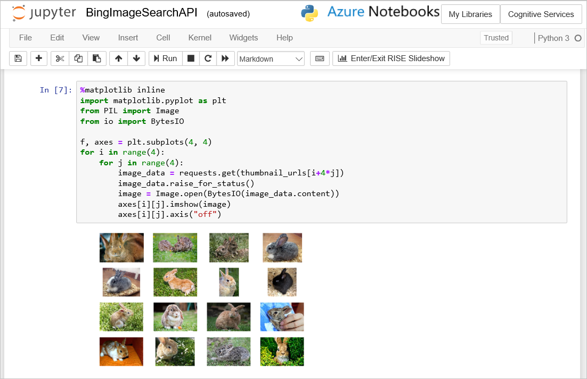
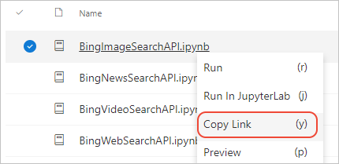

# Quickstart: Clone a notebook in Azure Notebooks Preview

[!INCLUDE [notebooks-status](../../includes/notebooks-status.md)]

In this quickstart, you copy a Jupyter notebook stored in GitHub to an Azure Notebooks account. 

GitHub repositories provide storage and version control for Jupyter notebooks. Collaborators maintain local copies of the repositories, and run the notebooks from those copies. Cloning a Jupyter notebook from GitHub into your Azure Notebooks account creates an independent copy of the notebook. Changes are stored in your Azure Notebooks account only, and don't affect the original GitHub repository. 

Because your Azure Notebooks clone is in the cloud, you can share it with collaborators, who need not make any local copies or have Jupyter installed on their computers. You might also clone a notebook simply as a starting point for a project of your own, or to obtain data files. 

## Prerequisites
None.

## Clone Azure Cognitive Services notebooks

1. Go to [Azure Notebooks](https://notebooks.azure.com) and sign in. For details, see [Quickstart - Sign in to Azure Notebooks](quickstart-sign-in-azure-notebooks.md).

1. From your public profile page, select **My Projects** at the top of the page:

    

1. On the **My Projects** page, select the up arrow button (keyboard shortcut: U; the button appears as **Upload GitHub Repo** when the browser window is wide enough):

    

1. In the **Upload GitHub Repository** that appears, enter or set the following details, then select **Import**:

   - **GitHub repository**: Microsoft/cognitive-services-notebooks (this name clones the Jupyter notebooks for Azure Cognitive Services at [https://github.com/Microsoft/cognitive-services-notebooks](https://github.com/Microsoft/cognitive-services-notebooks)).
   - **Clone recursively**: (cleared)
   - **Project name**: Cognitive Services Clone
   - **Project ID**: cognitive-services-clone
   - **Public**: (cleared)

     

1. Be patient while the process completes; cloning a repository can take a few minutes.

1. Once cloning is finished, Azure Notebooks takes you to the new project where you can see the copies of all the files.

    

## Share a notebook

1. To share your copy of the cloned project, use the **Share** control or obtain a link, obtain HTML or Markdown code that contains the link, or create an email message with the link:

    

1. Because you cleared the **Public** option when cloning the project, the clone is private. To make your copy public, select **Project Settings**, set the **Public project** option in the popup, and then select **Save**.

1. Select a notebook in the project to run it. Each notebook in the Azure Cognitive Services repository, for example, is its own self-contained Quickstart. The image below shows the result of using the BingImageSearchAPI notebook, after adding a Cognitive Services API subscription key and changing the search term "puppies" to "bunnies":

    

1. When you're done running the notebook, select **File** > **Close and halt** to close the notebook and its browser window.

1. To share an individual notebook in the project, right-click the notebook and select **Copy link** (keyboard shortcut: y):

    

1. To edit files other than notebooks, right-click the file in the project and select **Edit file** (keyboard shortcut: i). The default action, **Run** (keyboard shortcut: r), only shows the file contents and doesn't allow editing.

## Next steps

> [!div class="nextstepaction"]
> [Tutorial: Create and run a Jupyter notebook to do linear regression](tutorial-create-run-jupyter-notebook.md)
