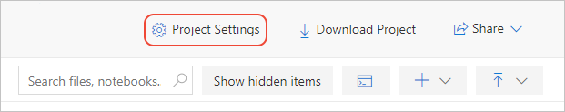
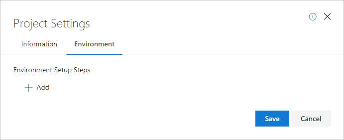

# Quickstart: Create a project with a custom environment in Azure Notebooks Preview

A project in Azure Notebooks is a collection of files, such as notebooks, data files, documentation, images, and so on, along with an environment that can be configured with specific setup commands. By defining the environment with the project, anyone who clones the project into their own Azure Notebooks account has all the information they need to recreate the necessary environment.

[!INCLUDE [notebooks-status](../../includes/notebooks-status.md)]

## Create a project

1. Go to [Azure Notebooks](https://notebooks.azure.com) and sign in. (For details, see [Quickstart - Sign in to Azure Notebooks](quickstart-sign-in-azure-notebooks.md)).

1. From your public profile page, select **My Projects** at the top of the page:

    

1. On the **My Projects** page, select **+ New Project** (keyboard shortcut: n); the button may appear only as **+** if the browser window is narrow:

    

1. In the **Create New Project** popup that appears, enter or set the following details, then select **Create**:

    - **Project name**: Project with a custom environment
    - **Project ID**: project-custom-environment
    - **Public project**: (cleared)
    - **Create a README.md**: (cleared)

1. After a few moments, Azure Notebooks navigates you to the new project. Add a notebook to the project by selecting the **+ New** drop-down (which may appear as only **+**), then selecting **Notebook**.

1. Give the notebook a name like *Custom environment.ipynb*, select **Python 3.6** for the language, and select **New**.

## Add a custom setup step

1. On the project page, select **Project Settings**.

    

1. In the **Project Settings** popup, select the **Environment** tab, then under **Environment Setup Steps**, select **+ Add**:

    

1. The **+ Add** command creates a step that's defined by an operation and a target file that's selected from the files in your project. The following operations are supported:

   | Operation | Description |
   | --- | --- |
   | Requirements.txt | Python projects define their dependencies in a requirements.txt file. With this option, select the appropriate file from the project's file list, and also select the Python version in the additional drop-down that appears. If necessary, select **Cancel** to return to the project, upload or create the file, then return to the **Project Settings** > **Environment** tab and create a new step. With this step in place, running a notebook in the project automatically runs `pip install -r <file>` |
   | Shell script | Use to indicate a bash shell script (typically a file with the *.sh* extension) that contains any commands you wish to run to initialize the environment. |
   | Environment.yml | A Python project that uses conda for managing an environment uses an *environments.yml* file to describe dependencies. With this option, select the appropriate file from the project's file list. |

   > [!WARNING]
   > As this is a preview service under development, there is currently a known issue where the `Environment.yml` setting does not get applied to your project as expected. The project and the Jupyter notebooks within do not load the specified environment file at present.

1. To remove any setup step, select the **X** to the right of the step.

1. When all setup steps are in place, select **Save**. (Select **Cancel** to discard changes).

1. To test your environment, create and run a new notebook, then create a code cell with statements that depend on a package in the environment, such as using a Python `import` statement. If the statement succeeds, then the necessary package was successfully installed in the environment.

## Next steps

> [!div class="nextstepaction"]
> [Manage and configure projects in Azure Notebooks](configure-manage-azure-notebooks-projects.md)

> [!div class="nextstepaction"]
> [Tutorial: create an run a Jupyter notebook to do linear regression](tutorial-create-run-jupyter-notebook.md)
