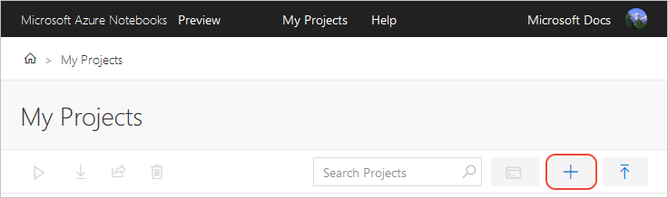
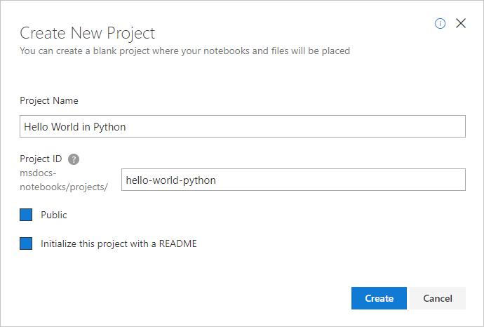
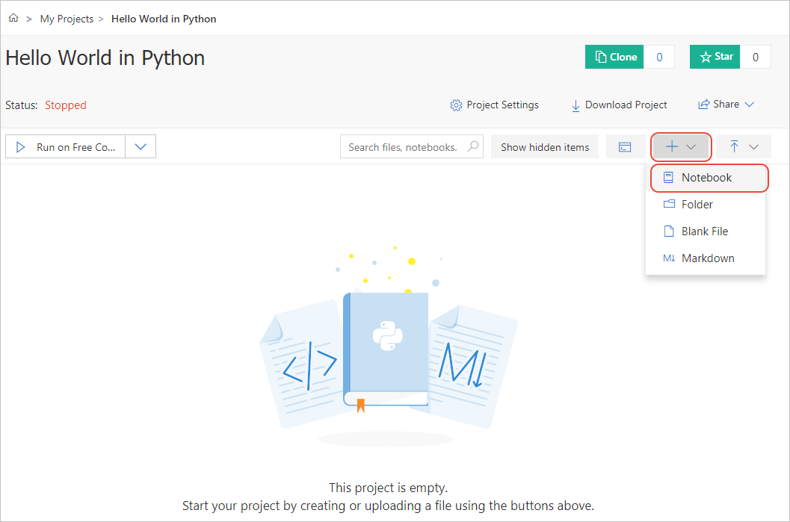
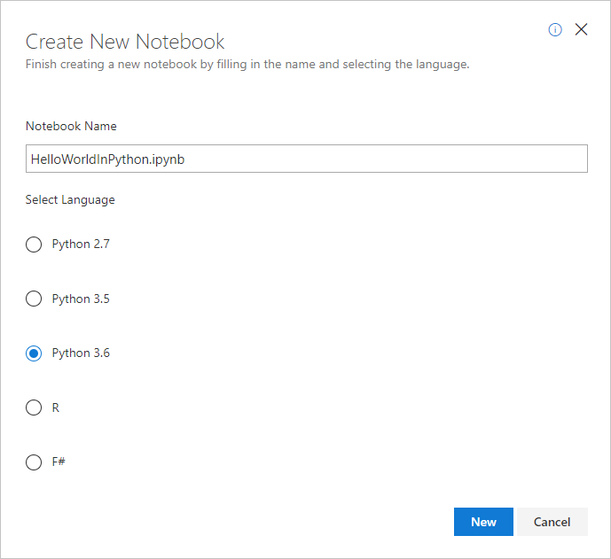
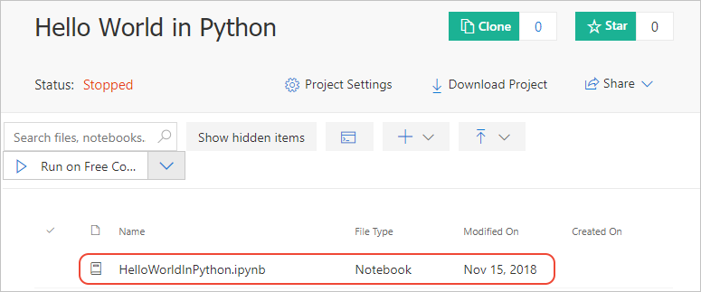
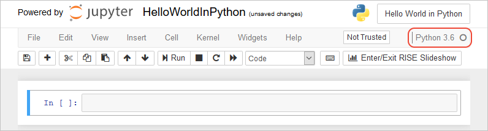
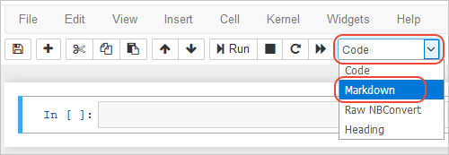
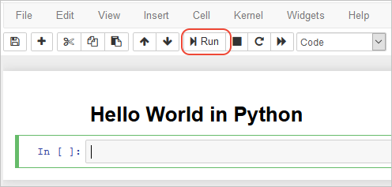
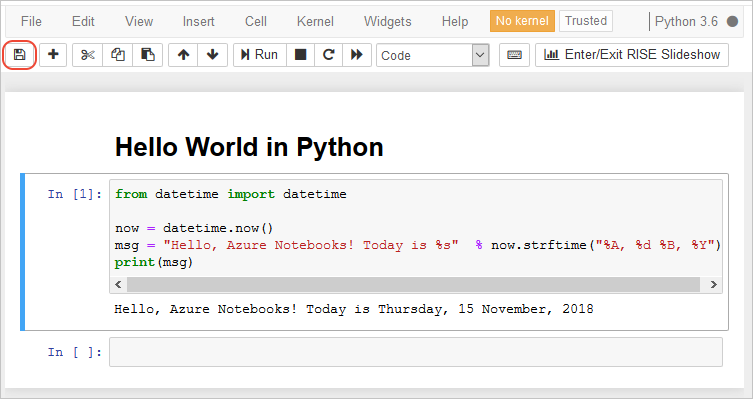
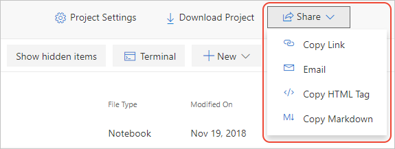

# Quickstart: Create and share a notebook in Azure Notebooks Preview

[!INCLUDE [notebooks-status](../../includes/notebooks-status.md)]

In this quickstart, you create and run a Jupyter notebook on Azure Notebooks, then share that notebook with others. Jupyter lets you easily combine Markdown text, executable code, persistent data, graphics, and visualizations on one sharable canvas, the notebook. Azure Notebooks is a free hosted service to develop and run Jupyter notebooks in the cloud with no installation.

## Prerequisites
None.

## Create a new project and notebook

1. Go to the [Azure Notebooks site (https://notebooks.azure.com)](https://notebooks.azure.com) and sign in. For details, see [Quickstart - Sign in to Azure Notebooks](quickstart-sign-in-azure-notebooks.md).

1. From your public profile page, select **My Projects** at the top of the page:

    

1. On the **My Projects** page, select **+ New Project** (keyboard shortcut: n). The button may appear only as **+** if the browser window is narrow:

    

1. In the **Create New Project** popup that appears, enter or set the following details, then select **Create**:

   - **Project name**: Hello World in Python
   - **Project ID**: hello-world-python
   - **Public project**: (cleared)
   - **Create a README.md**: (cleared)

     

1. After a few moments, Azure Notebooks navigates you to the new project. Add a notebook to the project by selecting the **+ New** drop-down (which may appear as only **+**), then selecting **Notebook**:

    [](media/quickstarts/empty-project-new-notebook-button.png#lightbox)

1. In the **Create New Notebook** popup that appears, enter a filename for your notebook, such as *HelloWorldInPython.ipynb* (*.ipynb* means IronPython (Jupyter) Notebook), and select **Python 3.6** for the language (also referred to as the *kernel*):

    

1. Select **New** to finish creating the notebook, which then appears in your project's file list:

    

## Run the notebook

1. Select the new notebook to run it in the editor; the kernel you selected (Python 3.6 in this example) is automatically activated for this notebook:

    

1. By default, the notebook has one empty code cell. To change the cell type to **Markdown**, use the cell type drop-down to select **Markdown**:

    

1. Enter or paste the following heading text into the cell:

    ```markdown
    # Hello World in Python
    ```

1. Because you're editing Markdown, the text appears as a header with the "#". To render the Markdown into HTML, select the **Run** button. Azure Notebooks then automatically creates a new code cell afterwards:

    

1. In the code cell, enter the following Python code:

    ```python
    from datetime import datetime

    now = datetime.now()
    msg = "Hello, Azure Notebooks! Today is %s"  % now.strftime("%A, %d %B, %Y")
    print(msg)
    ```

1. Select **Run** (keyboard shortcut: Shift+Enter) to run the code. Below the cell you should see successful output similar to the following text:

    ```output
    Hello, Azure Notebooks! Today is Thursday, 15 November, 2018
    ```

1. Select the save icon to save your work:

    

1. Select the **File** > **Close and Halt** menu command to stop the server and close the browser window.

## Share the notebook

To share your notebook, switch back to the project page if needed, right-click the notebook file, select **Copy Link** (keyboard shortcut: y), and paste that link into an appropriate message (email, IM, etc.).

On the project page, you can also use the **Share** menu to obtain a link, create an email message with the link, or obtain HTML and Markdown embed code:



## Next steps

> [!div class="nextstepaction"]
> [Tutorial: Create and run a Jupyter notebook to do linear regression](tutorial-create-run-jupyter-notebook.md)
