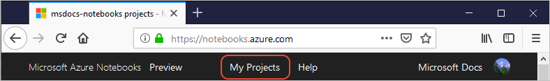
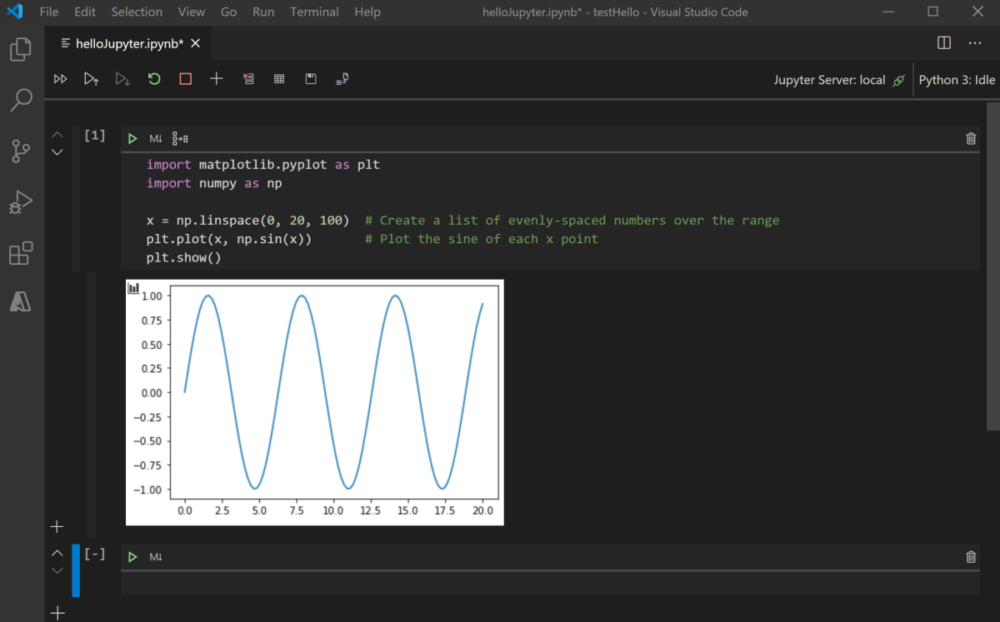
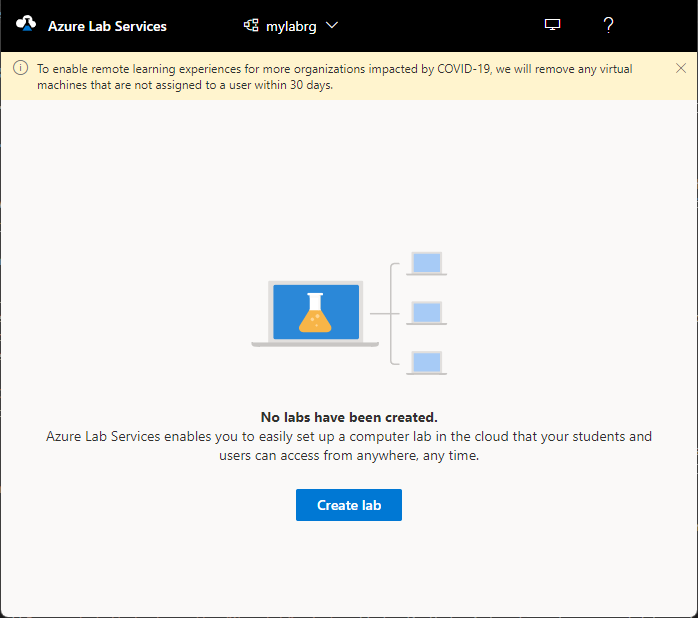

# Quickstart: Export a Jupyter notebook project in Azure Notebooks Preview

[!INCLUDE [notebooks-status](../../includes/notebooks-status.md)]

In this quickstart, you will download an Azure Notebooks project for use in other Jupyter notebook solutions. 

## Prerequisites
An existing Azure Notebooks project.

## Export an Azure Notebooks project

1. Go to [Azure Notebooks](https://notebooks.azure.com) and sign in. For details, see [Quickstart - Sign in to Azure Notebooks](quickstart-sign-in-azure-notebooks.md).

1. From your public profile page, select **My Projects** at the top of the page:

    

1. Select a project.
1. Click the download "Download" button to trigger a zip file download that contains all of your project files.
1. Alternatively, from a specific project page, click the "Download Project" button to download all the files of a given project.

After downloading your project files, you can use them with other Jupyter Notebook solutions. Some options described in the sections below include: 
- [Visual Studio Code](#use-notebooks-in-visual-studio-code)
- [Visual Studio Codespaces](#use-notebooks-in-visual-studio-codespaces)
- [Azure Machine Learning](#use-notebooks-with-azure-machine-learning)
- [Azure Lab Services](#use-azure-lab-services)
- [GitHub](#use-github)

## Create an environment for notebooks

If you'd like to create an environment that matches that of the Azure Notebooks Preview, you can use the script file provided in GitHub.

1. Navigate to the Azure Notebooks [GitHub repository](https://github.com/microsoft/AzureNotebooks) or [directly access the environment folder](https://aka.ms/aznbrequirementstxt).
1. From a command prompt, navigate to the directory you want to use for your projects.
1. Download the environment folder contents and follow the README instructions to install the Azure Notebooks package dependencies.

## Use Notebooks in Visual Studio Code

[VS Code](https://code.visualstudio.com/) is a free code editor that you can use locally or connected to remote compute. Combined with the Python extension, it offers a full environment for Python development including a rich native experience for working with Jupyter notebooks. 

After [downloading](#export-an-azure-notebooks-project) your project files you can use them with VS Code. For guidance using VS Code with Jupyter Notebooks, see the [Working with Jupyter Notebooks in Visual Studio Code](https://code.visualstudio.com/docs/python/jupyter-support) and [Data Science in Visual Studio Code](https://code.visualstudio.com/docs/python/data-science-tutorial) tutorials.

You can also use the [Azure Notebooks environment script](#create-an-environment-for-notebooks) with Visual Studio Code to create an environment that matches the Azure Notebooks Preview.

## Use Notebooks in Visual Studio Codespaces

Visual Studio Codespaces provides cloud hosted environments where you can edit your notebooks using Visual Studio Code or your web browser. It offers the same great Jupyter experience as VS Code, but without needing to install anything on your device. If you don’t want to set up a local environment and prefer a cloud-backed solution, then creating a codespace is a great option. To get started:

1. [Download](#export-an-azure-notebooks-project) your project files.
1. [Create a GitHub repository](https://help.github.com/github/getting-started-with-github/create-a-repo) for storing your notebooks. 
1. [Add your files](https://help.github.com/github/managing-files-in-a-repository/adding-a-file-to-a-repository) to the repository.
1. Setup Visual Studio Codespaces in the [browser](https://docs.microsoft.com/visualstudio/online/how-to/browser), [Visual Studio](https://docs.microsoft.com/visualstudio/online/how-to/vside), or [Visual Studio Code](https://docs.microsoft.com/visualstudio/online/how-to/vscode).

## Use Notebooks with Azure Machine Learning

Azure Machine Learning provides an end-to-end machine learning platform to enable users to build and deploy models faster on Azure. Azure ML allows you to run Jupyter Notebooks on a VM or a shared cluster computing environment. If you are in need of a cloud-based solution for your ML workload with experiment tracking, dataset management, and more, we recommend Azure Machine Learning. To get started with Azure ML:

1. [Download](#export-an-azure-notebooks-project) your project files.
1. [Create a Workspace](../machine-learning/how-to-manage-workspace.md) in the Azure portal.

   
 
1. Open the [Azure Studio (preview)](https://ml.azure.com/).
1. Using the left-side navigation bar, select **Notebooks**.
1. Click on the **Upload files** button and upload the project files that you downloaded from Azure Notebooks.

For additional information about Azure ML and running Jupyter Notebooks, you can review the [documentation](../machine-learning/how-to-run-jupyter-notebooks.md) or try the [Intro to Machine Learning](https://docs.microsoft.com/learn/modules/intro-to-azure-machine-learning-service/) module on Microsoft Learn.

## Use Azure Lab Services

[Azure Lab Services](https://azure.microsoft.com/services/lab-services/) allow educators to easily setup and provide on-demand access to preconfigured VMs for an entire classroom. If you're looking for a way to work with Jupyter Notebooks and cloud compute in a tailored classroom environment, Lab Services is a great option.

 After [downloading](#export-an-azure-notebooks-project) your project files you can use them with Azure Lab Services. For guidance about setting up a lab, see [Set up a lab to teach data science with Python and Jupyter Notebooks](../lab-services/class-type-jupyter-notebook.md)

## Use GitHub

GitHub provides a free, source-control-backed way to store notebooks (and other files), share your notebooks with others, and work collaboratively. If you’re looking for a way to share your projects and collaborate with others, GitHub is a great option and can be combined with [Visual Studio Codespaces](#use-notebooks-in-visual-studio-codespaces) for a great development experience. To get started with GitHub

1. [Download](#export-an-azure-notebooks-project) your project files.
1. [Create a GitHub repository](https://help.github.com/github/getting-started-with-github/create-a-repo) for storing your notebooks. 
1. [Add your files](https://help.github.com/github/managing-files-in-a-repository/adding-a-file-to-a-repository) to the repository.

## Next steps

- [Learn about Python in Visual Studio Code](https://code.visualstudio.com/docs/python/python-tutorial)
- [Learn about Azure Machine Learning and Jupyter Notebooks](../machine-learning/how-to-run-jupyter-notebooks.md)
- [Learn about Visual Studio Codespaces](https://visualstudio.microsoft.com/services/visual-studio-codespaces/)
- [Learn about Azure Lab Services](https://azure.microsoft.com/services/lab-services/)
- [Learn about GitHub](https://help.github.com/github/getting-started-with-github/)