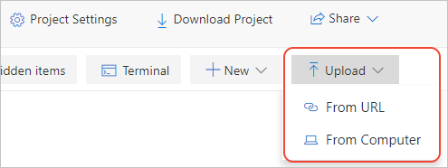

# Quickstart: Migrate a local Jupyter notebook in Azure Notebooks Preview

In this quickstart, you migrate a Jupyter notebook from your local computer or another accessible file URL to Azure Notebooks. 

Jupyter notebooks on your own computer are accessible only to you. You can share your files, but recipients then have their own local copies of the notebook, and it's difficult to incorporate their changes. Even if you store notebooks in a shared online repository such as GitHub, each collaborator must have a local Jupyter installation configured like yours.

By migrating your local or repository-based notebooks to Azure Notebooks, you can instantly share them with your collaborators, who need only a browser to view and run your notebooks. If they sign in to Azure Notebooks, they can also make changes.

## Prerequisites

- A [Jupyter notebook](https://jupyter-notebook.readthedocs.io) on your local computer or at another accessible file URL. 

## Create a project on Azure Notebooks

This quickstart demonstrates migrating a notebook from your local computer or another accessible file URL. To migrate notebooks from a GitHub repository, see [Quickstart: Clone a notebook](quickstart-clone-jupyter-notebook.md).

[!INCLUDE [notebooks-status](../../includes/notebooks-status.md)]

1. Go to [Azure Notebooks](https://notebooks.azure.com) and sign in. (For details, see [Quickstart - Sign in to Azure Notebooks](quickstart-sign-in-azure-notebooks.md)).

1. From your public profile page, select **My Projects** at the top of the page:

    

1. On the **My Projects** page, select **New Project** (keyboard shortcut: n). The button may appear only as **+** if the browser window is narrow:

    

1. In the **Create New Project** popup that appears, enter appropriate values for the notebook you're migrating in the **Project name** and **Project ID** fields, clear the options for **Public project** and **Create a README.md**, then select **Create**.

## Upload the local notebook

1. On the project page, select **Upload** (which may appear as an up arrow only if your browser window is small), then select 1. In the popup that appears, select **From computer** if your notebook is located on your local file system, or **From URL** if your notebook is located online:

    

   Again, if your notebook is in a GitHub repository, follow the steps on [Quickstart: Clone a notebook](quickstart-clone-jupyter-notebook.md) instead.

   - If using **From Computer**, drag and drop your *.ipynb* files into the popup, or select **Choose Files**, then browse to and select the files you want to import. Then select **Upload**. The uploaded files are given the same name as the local files. You don't need to upload the contents of any *.ipynb_checkpoints* folders.

     

   - If using **From URL**, enter the source address in the **File URL** field and the filename to assign to the notebook in your project in the **File Name** field. Then select **Upload**. If you have multiple files with separate URLs, use the **Add File** command to check the first URL you entered, after which the popup provides new fields for another file.

     

1. Open and run your newly uploaded notebook to verify its contents and operation. When you're done, select **File** > **Halt and close** to close the notebook.

1. To share a link to your uploaded notebook, right-click the file in the project and select **Copy Link** (keyboard shortcut: y), then paste that link into the appropriate message. Alternately, you can share the project as a whole using the **Share** control on the project page.

1. To edit files other than notebooks, right-click the file in the project and select **Edit file** (keyboard shortcut: i). The default action, **Run** (keyboard shortcut: r), only shows the file contents and doesn't allow editing.

## Next steps

> [!div class="nextstepaction"]
> [Tutorial: Create and run a Jupyter notebook to do linear regression](tutorial-create-run-jupyter-notebook.md)
