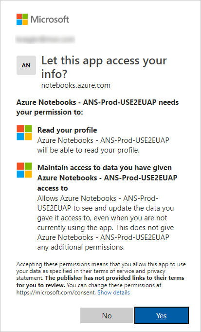
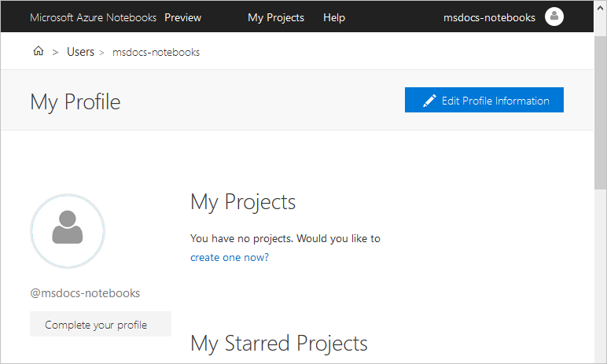
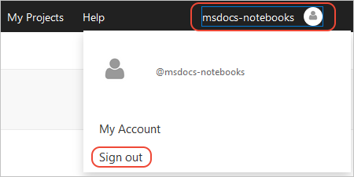

# Quickstart: Sign in and set a user ID

Although you can always view Azure Notebooks without signing in, you must sign in to run notebooks, access saved projects and notebooks, and share your notebooks with others.

## Sign in

1. Select **Sign in** on the top right of [notebooks.azure.com](https://notebooks.azure.com/).

    

1. When prompted, enter the email address of a Microsoft Account or a work or school account and select **Next**. Account types are described on [Your user account for Azure Notebooks](azure-notebooks-user-account.md). If you don't have a Microsoft Account, or wish to make one for use specifically with Azure Notebooks, select **Create one**:

    

1. Enter your password when prompted.

1. If you're signing in for the first time, Azure Notebooks asks for permission to access your account. Select **Yes** to continue:

    

## Set a user ID

1. Upon first sign in, you're assigned a temporary user ID like "anon-idrca3". Whenever you have a user ID that begins with "anon-", Azure Notebooks prompts you to create an ID of your own. Your user ID is used in any URL that you obtain to share your projects and notebooks, so choose something that's unique and meaningful to you.

    

    If you select **No Thanks**, Azure Notebooks continues to prompt you for a user ID each time you sign in. Your user ID can also be set at any time in your [user profile](azure-notebooks-user-profile.md).

1. After successfully signing in, Azure Notebooks navigates to your public profile page, on which you can select **Edit Profile Information** to fill out the rest of your information (for more information, see [Your profile and user ID](azure-notebooks-user-profile.md)):

    

## Sign out

1. To sign out, select your username on the upper right of the page, then select **Sign out**:

    

## Next steps

> [!div class="nextstepaction"]
> [Quickstart: Create and share a notebook](quickstart-create-share-jupyter-notebook.md)
