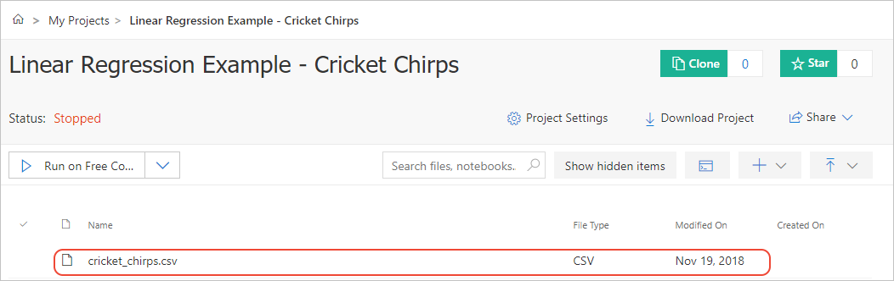
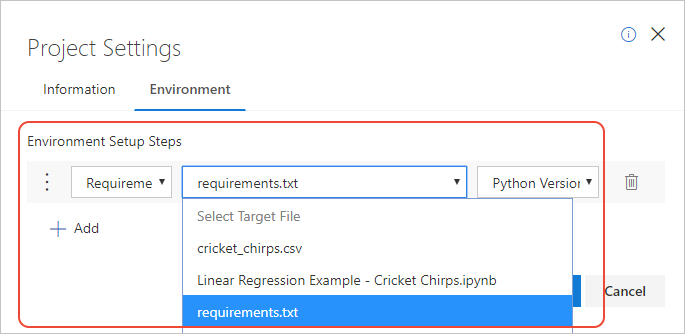
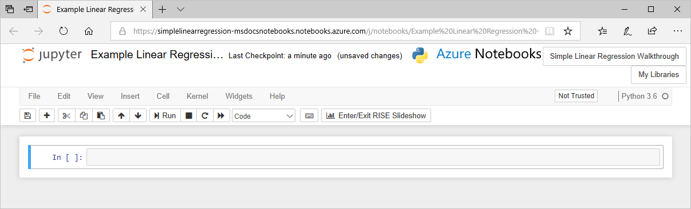
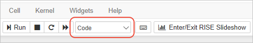
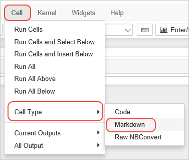
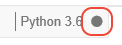
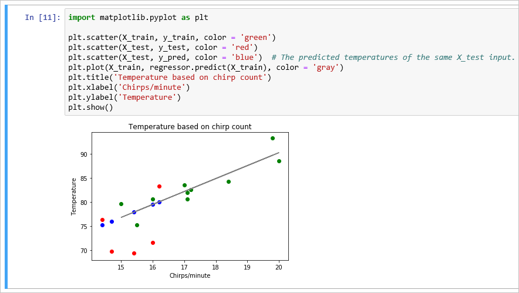

# Tutorial: create and run a Jupyter notebook with Python

[!INCLUDE [notebooks-status](../../includes/notebooks-status.md)]

This tutorial walks you through the process of using Azure Notebooks to create a complete Jupyter notebook that demonstrates simple linear regression. In the course of this tutorial, you familiarize yourself with the Jupyter notebook UI, which includes creating different cells, running cells, and presenting the notebook as a slide show.

The completed notebook can be found on [GitHub - Azure Notebooks Samples](https://github.com/Microsoft/AzureNotebooks/tree/master/Samples/Linear%20Regression%20-%20Cricket%20Chirps). This tutorial, however, begins with a new project and an empty notebook so you can experience creating it step by step.

In this tutorial, you learn how to:

> [!div class="checklist"]
> * Create a project notebook with some sample data
> * Use the notebook interface to create a variety of types of cells
> * Run the notebook
> * Save the notebook
> * Debug the notebook in Visual Studio Code

## Create the project

1. Go to [Azure Notebooks](https://notebooks.azure.com) and sign in. (For details, see [Quickstart - Sign in to Azure Notebooks](quickstart-sign-in-azure-notebooks.md)).

1. From your public profile page, select **My Projects** at the top of the page:

    

1. On the **My Projects** page, select **+ New Project** (keyboard shortcut: n); the button may appear only as **+** if the browser window is narrow:

    

1. In the **Create New Project** popup that appears, enter or set the following details, then select **Create**:

   - **Project name**: Linear Regression Example - Cricket Chirps
   - **Project ID**: linear-regression-example
   - **Public project**: (cleared)
   - **Create a README.md**: (cleared)

1. After a few moments, Azure Notebooks navigates you to the new project.

## Create the data file

The linear regression model you create in the notebook draws data from a file in your project called *cricket_chirps.csv*. You can create this file either by copying it from [GitHub - Azure Notebooks Samples](https://github.com/Microsoft/AzureNotebooks/tree/master/Samples/Linear%20Regression%20-%20Cricket%20Chirps), or by entering the data directly. The following sections describe both approaches.

### Upload the data file

1. On your project dashboard in Azure Notebooks, select **Upload** > **From URL**
1. In the popup, enter the following URL in **File URL** and *cricket_chirps.csv* in **File Name**, then select **Done**.

    ```url
    https://raw.githubusercontent.com/Microsoft/AzureNotebooks/master/Samples/Linear%20Regression%20-%20Cricket%20Chirps/cricket_chirps.csv
    ```

1. The *cricket_chirps.csv* file should now appear in your project's file list:

    

### Create a file from scratch

1. On your project dashboard in Azure Notebooks, select **+ New** > **Blank File**
1. A field appears in the project's file list. Enter *cricket_chirps.csv* and press Enter.
1. Right-click *cricket_chirps.csv* and select **Edit File**.
1. In the editor that appears, enter the following data:

    ```csv
    Chirps/Minute,Temperature
    20,88.6
    16,71.6
    19.8,93.3
    18.4,84.3
    17.1,80.6
    15.5,75.2
    14.7,69.7
    17.1,82
    15.4,69.4
    16.2,83.3
    15,79.6
    17.2,82.6
    16,80.6
    17,83.5
    14.4,76.3
    ```

1. Select **Save File** to save the file and return to the project dashboard.

## Install project level packages

Within a notebook, you can always use commands like `!pip install` in a code cell to install required packages. However, such commands are run every time you run the notebook's code cells, and can take considerable time. For this reason, you can instead install packages at the project level using a `requirements.txt` file.

1. Use the process described in [Create a file from scratch](#create-a-file-from-scratch) to create a file named `requirements.txt` with the following contents:

    ```text
    matplotlib==3.0.0
    numpy==1.15.0
    pandas==0.23.4
    scikit-learn==0.20.0
    ```

    You can also upload a `requirements.txt` file from your local computer if you prefer, as described on [Upload the data file](#upload-the-data-file).

1. On the project dashboard, select **Project Settings**.
1. In the popup that appears, select the **Environment** tab, then select **+Add**.
1. In the first drop-down control (the operation) under **Environment Setup Steps**, choose **Requirements.txt**.
1. In the second drop-down control (the file name), choose *requirements.txt* (the file you created).
1. In the third drop-down control (the Python version), choose **Python Version 3.6**.
1. Select **Save**.



With this setup step in place, any notebook you run in the project will run in an environment where those packages are installed.

## Create and run a notebook

With the data file ready and the project environment set, you can now create and open the notebook.

1. On the project dashboard, select **+ New** > **Notebook**.
1. In the popup, enter *Linear Regression Example - Cricket Chirps.ipynb* for **Item Name**, choose **Python 3.6** for the language, then select **New**.
1. After the new notebook appears on the file list, select it to start the notebook. A new browser tab opens automatically.
1. Because you have a *requirements.txt* file in the environment settings, you see the message, "Waiting for your container to finish being prepared." You can select **OK** to close the message and continue working in the notebook; you can't run code cells, however, until the environment is set up fully.
1. The notebook opens in the Jupyter interface with a single empty code cell as the default.

    [](media/tutorial/tutorial-new-notebook.png#lightbox)

## Tour the notebook interface

With the notebook running, you can add code and Markdown cells, run those cells, and manage the operation of the notebook. First, however, it's worth taking a few minutes to familiarize yourself with the interface. For full documentation, select the **Help** > **Notebook Help** menu command.

Along the top of the window you see the following items:

(A) The name of your notebook, which you can edit by clicking.
(B) Buttons to navigate to the containing project and your projects dashboard, which open new tabs in your browser.
(C) A menu with commands for working with the notebook.
(D) a toolbar with shortcuts for common operations.
(E) the editing canvas containing cells.
(F) indicator of whether the notebook is trusted (default is **Not Trusted**).
(G) the kernel used to run the notebook along with an activity indicator.

[](media/tutorial/tutorial-notebook-ui.png#lightbox)

Jupyter provides a built-in tour of the primary UI elements. Start the tour by selecting the **Help** > **User Interface Tour** command and clicking through the popups.

The groups of menu commands are as follows:

| Menu | Description |
| --- | --- |
| File | Commands to manage the notebook file, including commands to create and copy notebooks, show a print preview, and download the notebook in a variety of formats. |
| Edit | Typical commands to cut, copy, and paste cells, find and replace values, manage cell attachments, and insert images.  |
| View | Commands to control visibility of different parts of the Jupyter UI. |
| Insert | Commands to insert a new cell above or below the current cell. You use these commands frequently when creating a notebook. |
| Cell | The various **Run** commands run one or more cells in different combinations. The **Cell Type** commands change the type of a cell between **Code**, **Markdown**, and **Raw NBConvert** (plain text). The **Current Outputs** and **All Outputs** commands control how output from run code is shown, and include a command to clear all output. |
| Kernel | Commands to manage how code is being run in the kernel, along with **Change kernel** to change the language or Python version used to run the notebook. |
| Data | Commands to upload and download files from the project or session. See [Work with project data files](work-with-project-data-files.md) |
| Widgets | Commands to manage [Jupyter Widgets](https://ipywidgets.readthedocs.io/en/stable/examples/Widget%20Basics.html), which provide additional capabilities for visualization, mapping, and plotting.|
| Help | Commands that provide help and documentation for the Jupyter interface. |

Most of the commands on the toolbar have equivalent menu commands. One exception is **Enter/Edit RISE Slideshow**, which is discussed on [Share and present notebooks](present-jupyter-notebooks-slideshow.md).

You use a number of these commands as you populate the notebook in the sections that follow.

## Create a Markdown cell

1. Click into the first empty cell shown on the notebook canvas. By default, a cell is a **Code** type, which means it's designed to contain runnable code for the selected kernel (Python, R, or F#). The current type is shown in the type drop-down on the toolbar:

    

1. Change the cell type to **Markdown** using the toolbar drop-down; alternately, use the **Cell** > **Cell Type** > **Markdown** menu command:

    

1. Click into the cell to start editing, then enter the following Markdown:

    ```markdown
    # Example Linear Regression

    This notebook contains a walkthrough of a simple linear regression. The data, obtained from [college.cengage.com](https://college.cengage.com/mathematics/brase/understandable_statistics/7e/students/datasets/slr/frames/frame.html), relates the rate of cricket chirps to temperature from *The Song of Insects*, by Dr. G. W. Pierce, Harvard College Press.

    In this example we're using the count of chirps per minute as the independent varible to then predict the dependent variable, temperature. In short, we're using a little data science to make ourselves a cricket thermometer. (You could also reverse the data and use temperature to predict the number of chirps, but it's more fun to use crickets as the thermometer itself!)

    The methods shown in this example follow what's presented in the Udemy course, [Machine Learning A to Z](https://www.udemy.com/machinelearning/learn/v4/).

    A lovely aspect of Notebooks is that you can use Markdown cells to explain what the code is doing rather than code comments. There are several benefits to doing so:

    - Markdown allows for richer text formatting, like *italics*, **bold**, `inline code`, hyperlinks, and headers.
    - Markdown cells automatically word wrap whereas code cells do not. Code comments typically use explicit line breaks for formatting, but that's not necessary in Markdown.
    - Using Markdown cells makes it easier to run the Notebook as a slide show.
    - Markdown cells help you remove lengthy comments from the code, making the code easier to scan.

    When you run a code cell, Jupyter executes the code; when you run a Markdown cell, Jupyter renders all the formatting into text that's suitable for presentation.
    ```

1. To render the Markdown into HTML for the browser, select the **Run** command on the toolbar, or use the **Cell** > **Run Cells** command. The Markdown code for formatting and links now appear as you expect them to in a browser.

1. When you run the last cell in the notebook, Jupyter automatically creates a new cell below the one you ran. Put more Markdown into this cell by repeating the steps in this section with the following Markdown:

    ```markdown
    ## Install packages using pip or conda

    Because the code in your notebook likely uses some Python packages, you need to make sure the Notebook environment contains those packages. You can do this directly within the notebook in a code block that contains the appropriate pip or conda commands prefixed by `!`:

    \```
    !pip install <pkg name>

    !conda install <pkg name> -y
    \```
    ```

1. To edit the Markdown again, double-click in the rendered cell. To render HTML again after making changes, run the cell.

## Create a code cell with commands

As the previous Markdown cell explained, you can include commands directly in the notebook. You can use commands to install packages, run curl or wget to retrieve data, or anything else. Jupyter notebooks effectively run within a Linux virtual machine, so you have the full Linux command set to work with.

1. Enter the commands below in the code cell that appeared after you used **Run** on the previous Markdown cell. If you don't see a new cell, create one with **Insert** > **Insert Cell Below** or use the **+** button on the toolbar.

    ```bash
    !pip install numpy
    !pip install matplotlib
    !pip install pandas
    !pip install sklearn
    ```

1. Before running the cell, create a new cell with the **+** button on the toolbar, set it to Markdown, and enter the following explanation:

    ```markdown
    Note that when you run a code block that contains install commands, and also those with `import` statements, it make take the notebooks a little time to complete the task. To the left of the code block you see `In [*]` to indicate that execution is happening. The Notebook's kernel on the upper right also shows a filled-in circle to indicate "busy."
    ```

1. Select the **Cell** > **Run All** command to run all the cells in the notebook. Notice that the Markdown cells render as HTML, and the command run in the kernel, and observe the kernel indicator as described in the Markdown itself:

    

1. It also takes a little time for all of the `pip install` commands to run, and because you already installed these packages in the project environment (and because they're also included in Azure Notebooks by default), you see many messages that read, "Requirement already satisfied." All of that output can be visually distracting, so select that cell (using a single click), then use the **Cell** > **Cell Outputs** > **Toggle** to hide the output. You can also use the **Clear** command on that same submenu to remove the output entirely.

    The **Toggle** command hides only the most recent output from the cell; if you run the cell again, the output reappears.

1. Because the packages are installed in the project environment, comment out the `! pip install` commands using `#`; this way they can remain in the notebook as instructional material but won't take any time to run and won't produce unnecessary output. In this case, keeping the commented commands in the notebook also indicates the notebook's dependencies.

    ```bash
    # !pip install numpy
    # !pip install matplotlib
    # !pip install pandas
    # !pip install sklearn
    ```

## Create the remaining cells

To populate the rest of the notebook, you next create a series of Markdown and code cells. For each cell listed below, first create the new cell, then set the type, then paste in the content.

Although you can wait to run the notebook after you've created each cell, it's interesting to run each cell as you create it. Not all cells show output; if you don't see any errors, assume the cell ran normally.

Each code cell depends on the code that's been run in previous cells, and if you neglect to run one of the cells, later cells may produce errors. If you find that you've forgotten to run a cell, try using the **Cell** > **Run All Above** before running the current cell.

If you see unexpected results (which you probably will!), check that each cell is set to "Code" or "Markdown" as necessary. For example, an "Invalid syntax" error typically occurs when you've entered Markdown into Code cell.

1. Markdown cell:

    ```markdown
    ## Import packages and prepare the dataset

    In this example we're using numpy, pandas, and matplotlib. Data is in the file cricket_chirps.csv. Because this file is in the same project as this present Notebook, we can just load it using a relative pathname.
    ```

1. Code cell; when run, shows the table contents as output. You can suppress the output by commenting out the `print` statement.

    ```python
    import numpy as np
    import pandas as pd

    dataset = pd.read_csv('cricket_chirps.csv')
    print(dataset)
    X = dataset.iloc[:, :-1].values  # Matrix of independent variables -- remove the last column in this data set
    y = dataset.iloc[:, 1].values    # Matrix of dependent variables -- just the last column (1 == 2nd column)
    ```

    > [!Note]
    > You may see warnings from this code about "numpy.dtype size changed"; the warnings can be safely ignored.

1. Markdown cell:

    ```markdown
    Next, split the dataset into a Training set (2/3rds) and Test set (1/3rd). We don't need to do any feature scaling because there is only one column of independent variables, and packages typically do scaling for you.
    ```

1. Code cell; when run, this cell has no output.

    ```python
    from sklearn.model_selection import train_test_split

    X_train, X_test, y_train, y_test = train_test_split(X, y, test_size = 1/3, random_state = 0)
    ```

1. Markdown cell:

    ```markdown
    ## Fit the data to the training set

    "Fitting" the data to a training set means making the line that describes the relationship between the independent and the dependent variables. With a simple data set like we're using here, you can visualize the line on a simple x-y plot: the x-axis is the independent variable (chirp count in this example), and the y-axis is the independent variable (temperature). Fitting the data means plotting all the points in the training set, then drawing the best-fit line through that data.

    With two independent variables you can imagine a three-dimensional plot with a line fitted to the data. At three or more independent variables, however, it's no longer easy to visualize the fit, but you get the idea. In the end, it's all just mathematics, which a computer can handle easily without having to form a mental picture!

    The regressor's `fit` method here creates the line, which algebraically is of the form `y = x*b1 + b0`, where b1 is the coefficient or slope of the line (which you can get to through `regressor.coef_`), and b0 is the intercept of the line at x=0 (which you can get to through `regressor.intercept_`).
    ```

1. Code cell; when run, this cell shows the output, `LinearRegression(copy_X=True, fit_intercept=True, n_jobs=None,normalize=False)`.

    ```python
    from sklearn.linear_model import LinearRegression

    regressor = LinearRegression()    # This object is the regressor, that does the regression
    regressor.fit(X_train, y_train)   # Provide training data so the machine can learn to predict using a learned model.
    ```

1. Markdown cell:

    ```markdown
    ## Predict the results

    With the regressor in hand, we can predict the test set results using its `predict` method. That method takes a vector of independent variables for which you want predictions.

    Because the regressor is fit to the data by virtue of `coef_` and `intercept_`, a prediction is the result of `coef_ * x + intercept_`. (Indeed, `predict(0)` returns `intercept_` and `predict(1)` returns `intercept_ + coef_`.)

    In the code, the `y_test` matrix (from when we split the set) contains the real observations. `y_pred` assigned here contains the predictions for the same `X_test` inputs. It's not expected that the test or training points exactly fit the regression; the regression is trying to find the model that we can use to make predictions with new observations of the independent variables.
    ```

1. Code cell; when run, this cell shows results like `[79.49588055 75.98873911 77.87719989 80.03544077 75.17939878]`.

    ```python
    y_pred = regressor.predict(X_test)
    print(y_pred)
    ```

1. Markdown cell:

    ```markdown
    It's interesting to think that all the "predictions" we use in daily life, like weather forecasts, are just regression models of some sort working with various data sets. Those models are much more complicated than what's shown here, but the idea is the same.

    Knowing how predictions work help us understand that the actual observations we would collect in the moment will always be somewhat off from the predictions: the predictions fit exactly to the model, whereas the observations typically won't.

    Of course, such systems feed new observations back into the dataset to continually improve the model, meaning that predictions should get more accurate over time.

    The challenge is determining what data to actually use. For example, with weather, how far back in time do you go? How have weather patterns been changing decade by decade? In any case, something like weather predictions will be doing things hour by hour, day by day, for things like temperature, precipitation, winds, cloud cover, etc. Radar and other observations are of course fed into the model and the predictions are reduced to mathematics.
    ```

1. Markdown cell:

    ```markdown
    ## Visualize the results

    The following code generates a plot: green dots are training data, red dots are test data, blue dots are predictions. Gray line is the regression itself. You see that all the blue dots are exactly on the line, as they should be, because the predictions exactly fit the model (the line).
    ```

1. Code cell; when run, this cell produces a graphical plot. If you don't see the plot the first time (and instead see "Figure size 640x480 with 1 Axes"), run the cell again.

    ```python
    import matplotlib.pyplot as plt

    plt.scatter(X_train, y_train, color = 'green')
    plt.scatter(X_test, y_test, color = 'red')   
    plt.scatter(X_test, y_pred, color = 'blue')  # The predicted temperatures of the same X_test input.
    plt.plot(X_train, regressor.predict(X_train), color = 'gray')
    plt.title('Temperature based on chirp count')
    plt.xlabel('Chirps/minute')
    plt.ylabel('Temperature')
    plt.show()
    ```

    

1. Markdown cell:

    ```markdown
    ## Closing comments

    At the end of the day, when you create a model, you use training data. Then you start feeding test data (real observations) to see how well the model actually works. You may find that the model is a little inaccurate over time, in which case you retrain the model with some new data. Retraining the model means you're creating a new fit line that's used for predictions.

    This regression can be used to examine the variability of the relationship between temperature and chirp count. Of course, if the model proves too inaccurate (that is, the predictions aren't very good), then it suggests that we might need to introduce more independent variables like humidity, time of year, latitude, amount of moonlight, and so on. If you have such data, you can do separate lines regressions for each independent variable, and then do multiple regressions with combinations of independent variables. 

    Again, once you are working with more than one or two independent variables, it's much easier to use machine learning to crunch the numbers than to try to visualize it graphically.
    ```

## Clear outputs and rerun all cells

After following the steps in the previous section to populate the entire notebook, you've created both a piece of running code in the context of a full tutorial on linear regression. This direct combination of code and text is one of the great advantages of notebooks!

Try rerunning the whole notebook now:

1. Clear all the kernel's session data and all cell output by selecting **Kernel** > **Restart & Clear Output**. This command is always a good one to run when you've completed a notebook, just to make sure that you haven't created any strange dependencies between code cells.

1. Rerun the notebook using **Cell** > **Run All**. Notice the kernel indicator is filled in while code is running.

    If you have any code that runs for too long or otherwise gets stuck, you can stop the kernel by using the **Kernel** > **Interrupt** command.

1. Scroll through the notebook to examine the results. (If again the plot doesn't appear, rerun that cell.)

## Save, halt, and close the notebook

During the time you're editing a notebook, you can save its current state with the **File** > **Save and Checkpoint** command or the save button on the toolbar. A "checkpoint" creates a snapshot that you can revert to at any time during the session. Checkpoints allow you to make a series of experimental changes, and if those changes don't work, you can just revert to a checkpoint using the **File** > **Revert to Checkpoint** command. An alternate approach is to create extra cells and comment out any code that you don't want to run; either way works.

You can also use the **File** > **Make a Copy** command at any time to make a copy of the current state of the notebook into a new file in your project. That copy opens in a new browser tab automatically.

When you're done with a notebook, use the **File** > **Close and halt** command, which closes the notebook and shuts down the kernel that's been running it. Azure Notebooks then closes the browser tab automatically.

## Debug notebooks using Visual Studio Code

If the code cells in your notebook don't behave in the way you expect, you may have code bugs or other defects. However, other than using `print` statements to show the value of variables, a typical Jupyter environment doesn't offer any debugging facilities.

Fortunately, you can download the notebook's *.ipynb* file, then open it in Visual Studio Code using the Python extension. The extension directly imports a notebook as a single code file, preserving your Markdown cells in comments. Once you've imported the notebook, you can use the Visual Studio Code debugger to step through your code, set breakpoints, examine state, and so forth. After making corrections to your code, you then export the *.ipynb* file from Visual Studio Code and upload it back into Azure Notebooks.

For more information, see [Debug a Jupyter notebook](https://code.visualstudio.com/docs/python/jupyter-support#debug-a-jupyter-notebook) in the Visual Studio Code documentation.

Also see [Visual Studio Code - Jupyter support](https://code.visualstudio.com/docs/python/jupyter-support) for additional features of Visual Studio Code for Jupyter notebooks.

## Next steps

- [Explore sample notebooks](azure-notebooks-samples.md)

How-to articles:

- [Create and clone projects](create-clone-jupyter-notebooks.md)
- [Configure and manage projects](configure-manage-azure-notebooks-projects.md)
- [Install packages from within a notebook](install-packages-jupyter-notebook.md)
- [Present a slide show](present-jupyter-notebooks-slideshow.md)
- [Work with data files](work-with-project-data-files.md)
- [Access data resources](access-data-resources-jupyter-notebooks.md)
- [Use Azure Machine Learning](use-machine-learning-services-jupyter-notebooks.md)
