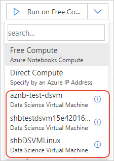
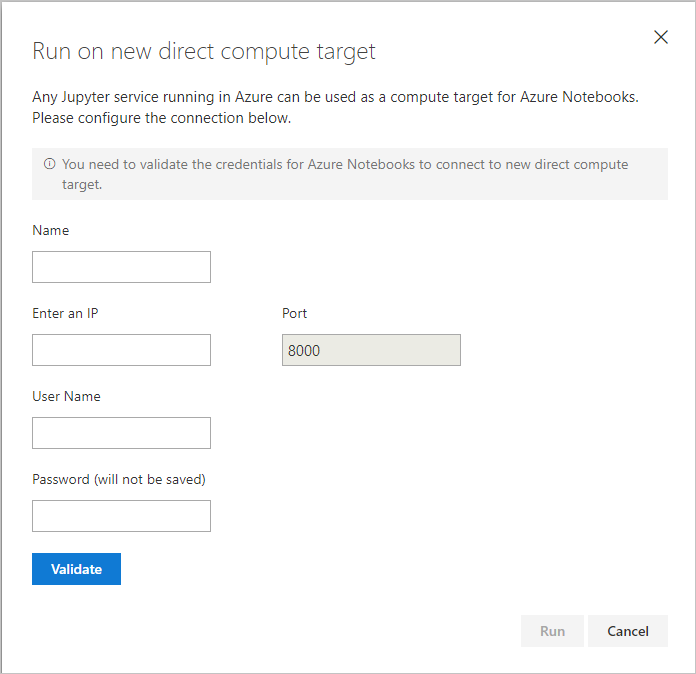
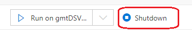

# Use Azure Data Science Virtual Machines

[!INCLUDE [notebooks-status](../../includes/notebooks-status.md)]

By default, projects run on the **Free Compute** tier, which is limited to 4 GB of memory and 1 GB of data to prevent abuse. You can bypass these limitations by using a different virtual machine that you've provisioned in an Azure subscription. For this purpose, the best choice is an Azure Data Science Virtual Machine (DSVM) using the **Data Science Virtual Machine for Linux (Ubuntu)** image. Such a DSVM comes pre-configured with everything you need for Azure Notebooks and appears automatically on the **Run** drop-down list in Azure Notebooks.

> [!Note]
> Azure Notebooks is supported only on DSVMs created with the on Linux Ubuntu image. Notebooks are not supported on Windows 2012, Windows 2016, or Linux CentOS images.

## Create a DSVM instance

To create a new DSVM instance, follow the instructions on [Create an Ubuntu Data Science VM](/azure/machine-learning/data-science-virtual-machine/dsvm-ubuntu-intro). For more information including pricing details, see [Data Science Virtual Machines](https://azure.microsoft.com/services/virtual-machines/data-science-virtual-machines/).

## Connect to the DSVM

Once you're created the DSVM, select the **Run** drop-down list on the Azure Notebooks project dashboard, and select the appropriate DSVM instance. The drop-down list shows DSVM instances if the following conditions are true:

- You're signed into Azure Notebooks with an account that uses Azure Active Directory (AAD), such as a company account.
- Your account is connected to an Azure subscription.
- You have one or more virtual machines in that subscription, with at least Reader access, that uses the Data Science Virtual Machine for Linux (Ubuntu) image.)

When you select a DSVM instance, Azure Notebooks may prompt you for the specific machine credentials used when you created the VM.

> [!Important]
> The username must be lowercase to use it with JupyterHub.

If any of the conditions aren't met, you can still connect to the DSVM. On the drop-down list, select the **Direct Compute** option,
which prompts you for a name (to show in the list), the VM's IP address and port (typically 8000, the default port to which JupyterHub listens), and the VM credentials:

You obtain these values from the DSVM page in the Azure portal.

## Accessing Azure Notebooks files from the DSVM

File system access is supported for DSVM versions 19.06.15 or later. To check the version, first connect to your DSVM via SSH, then run the following command: `curl -H Metadata:true "http://169.254.169.254/metadata/instance?api-version=2018-10-01"` (you must use the exact IP address shown here). The version number is shown in the output for "version".

To preserve parity of file paths with the **Free Compute** tier, you are able to only open one project at a time on a DSVM. To open a new project, you must shut down the open project first.

When a project is run on a VM, the files are mounted on the root directory of the Jupyter server (the directory shown in JupyterHub), replacing the default Azure Notebooks files. When you shut down the VM using the **Shutdown** button on the notebook UI, Azure Notebooks restores the default files.

## Create new DSVM users

If multiple users share a DSVM, you can avoid blocking each other by creating and using a DSVM user for each notebook user:

1. On the [Azure portal](https://portal.azure.com), navigate to your virtual machine.
1. Under **Support + troubleshooting** in the left margin, select **Reset password**.
1. Enter a new **username**. The username must be lowercase to use it with JupyterHub. Enter a password. Then select **Update**. (Existing usernames are not affected.)
1. Repeat the previous step for any additional users.

## Next steps

Learn more about DSVMs on [Introduction to Azure Data Science Virtual Machines](/azure/machine-learning/data-science-virtual-machine/overview).
