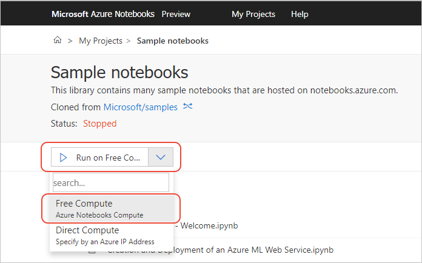

# Using Data Science Virtual Machines

## Why connect to a Data Science Virtual Machine (DSVM)

By default, projects run on the **Free Compute** tier, which is limited to 4GB of memory and 1GB of data to prevent abuse. You can bypass these limitations by using a different virtual machine that you've provisioned in an Azure subscription. Connecting to a [DSVM](https://azure.microsoft.com/en-us/services/virtual-machines/data-science-virtual-machines/) can increase your compute power.

## How to create a DSVM

|Operating System|Azure Notebooks|
|:---:|:---:|
|Linux Ubuntu| Supported|
|Windows 2016| Not Supported|
|Windows 2012| Not Supported|
|Linux CentOS| Not Supported|

To create a new DSVM instance, follow the instructions on [Create an Ubuntu Data Science VM](/azure/machine-learning/data-science-virtual-machine/dsvm-ubuntu-intro). Use the **Data Science Virtual Machine for Linux (Ubuntu)** image if you want the DSVM to appear in the drop-down list in Azure Notebooks.

## Ways to connect to a DSVM

The **Run** drop-down list on the project dashboard is where you select the compute tier on which the project runs. 

### Discovery
If the following conditions are true, the drop-down list also shows DSVM instances. (If any of these conditions aren't met, you can still connect to the DSVM using the Direct Compute option and enter the values obtained from the Azure portal.)

- You're signed into Azure Notebooks with an account that uses Azure Active Directory (AAD), such as a company account.
- Your account is connected to an Azure subscription.
- You have one or more virtual machines in that subscription, with at least Reader access, that use the Data Science Virtual Machine for Linux (Ubuntu) image.)

When you select a DSVM instance, Azure Notebooks may prompt you for the specific machine credentials used when you created the VM.

### Direct Connect
Once you have a suitably configured Azure virtual machine, select the **Direct Compute** option in the drop-down list, which prompts you for a name (to show in the list), the VM's IP address and port (typically 8000, the default port to which JupyterHub listens), and the VM credentials:

## Accessing Azure Notebooks Files from DSVM

To preserve parity of file paths with free compute you are only able to open one project at a time on a DSVM. If you would like to open a new project after opening a project, you will need to shutdown the open project first.

When a project is run on a VM, the files are mounted on the root directory of the Jupyter server (the directory shown in JupyterHub), replacing the default Azure Notebooks files. When you shut down the VM using the **Shutdown** button on the notebook UI, Azure Notebooks restores the default files.

If multiple users will share a DSVM you can avoid blocking each other by creating and using a DSVM user for each notebook user.

### How to Create new DSVM users
1. Go to [Azure Portal](https://ms.portal.azure.com).
2. Navigate to your virtual machine.
3. Click 'Reset password' under 'Support + troubleshooting' in the left margin.
4. Enter a new username and password and click 'Update' (Your old usernames should still continue to work).
