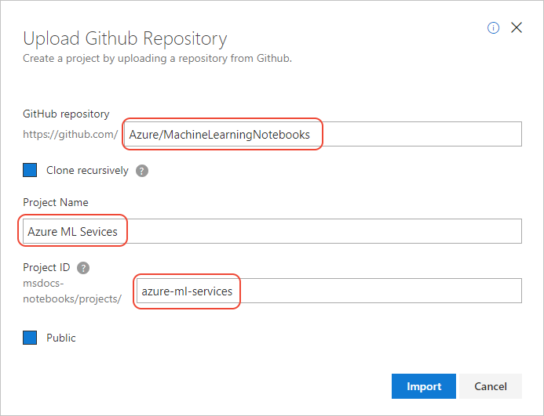

# Use Azure Machine Learning service in a notebook

Azure Notebooks comes pre-configured with the necessary environment to work with [Azure Machine Learning service](/azure/machine-learning/service/). You can easily clone a sample project into your Notebooks account to explore a variety of Machine Learning scenarios.

## Clone the sample into your account

1. Sign into [Azure Notebooks](https://notebooks.azure.com/).
1. Select **My Projects** to navigate to the projects dashboard.
1. Select the **Upload GitHub Repo** (the up arrow) button open the **Upload GitHub Repository** popup.
1. In the popup, enter `Azure/MachineLearningNotebooks` in **GitHub repository**, provide a name for the project in **Project Name** like "Azure Machine Learning service", provide an identifier in **Project ID**, clear **Public** if you want, then select **Import**.

    

1. After a minute or two, Azure Notebooks automatically takes you to the new project's dashboard.

## Run a sample notebook

1. Select **00 - configuration.ipynb** to start the configuration section of the notebook, and follow its instructions to create an Azure Machine Learning Workspace.

    - Because Azure Notebooks already contains the necessary Python packages, you can just run the code snippet in step 2 of the Prerequisites to verify the Azure ML SDK version.

1. Once configuration is complete, select **01.getting-started** to navigate into the folder containing thirteen different sample notebooks, each of which is self-explanatory.

## Next steps

The Azure Machine Learning Services documentation contains a variety of other resources that guide you through working with Machine Learning Service within notebooks:

- [Quickstart: Use Python to get started with Azure Machine Learning](https://docs.microsoft.com/azure/machine-learning/service/quickstart-create-workspace-with-python)
- [Tutorial #1: Train an image classification model with Azure Machine Learning service](https://docs.microsoft.com/azure/machine-learning/service/tutorial-train-models-with-aml)
- [Tutorial #2: Deploy an image classification model in Azure Container Instance (ACI)](https://docs.microsoft.com/azure/machine-learning/service/tutorial-deploy-models-with-aml)
- [Tutorial: Train a classification model with automated machine learning in Azure Machine Learning service](https://docs.microsoft.com/azure/machine-learning/service/tutorial-auto-train-models)

Also see the documentation for the [Azure Machine Learning SDK for Python](https://docs.microsoft.com/python/api/overview/azure/ml/intro?view=azure-ml-py).
