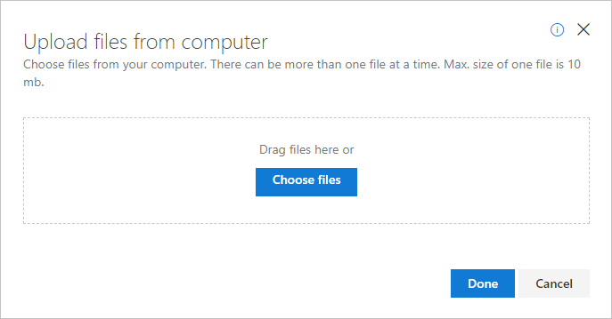
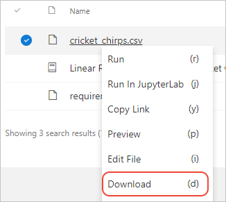
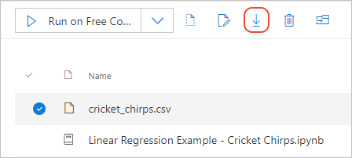
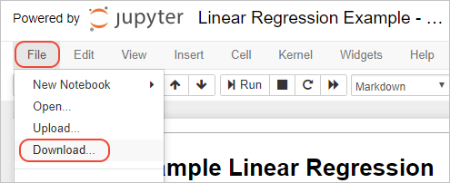

# Work with data files in Azure Notebook projects

Data is the lifeblood of many Jupyter notebooks, especially notebooks used for data science. With Azure Notebooks, you can easily  import from a variety of sources into a project, and then use that data from notebooks. You can also have notebooks generate data that's stored in the project, which you can then download for use elsewhere.

The **Data** menu within a running notebook also provides **Upload** and **Download** commands, which work with files in the project as well as temporary files for the current notebook session.

You can also use code within a notebook to access a variety of data sources directly, including files within a project. You can also access arbitrary data by using commands in a code cell. Because such data is stored in variables within the notebook session, it won't be saved in the project unless you use code to specifically generate project files.

Working with code in data is best experienced within a running notebook itself: for that purpose, refer to the [Getting to your data in Azure Notebooks sample notebook](https://notebooks.azure.com/Microsoft/projects/samples/html/Getting%20to%20your%20Data%20in%20Azure%20Notebooks.ipynb).

The remainder of this article provides details on project-level file operations.

## Import data

You can bring files into a project from the project dashboard, or within a running notebook using either the **Data** menu or a command such as `curl`.

### Import files from the project dashboard

1. In the project, navigate to the folder where you want to import the files.

1. Select the **Upload** command, then either **From URL** or **From computer** and project the necessary details for the data you want to import:

   - **From URL**: Enter the source address in the **File URL** field and the filename to assign to the notebook in your project in the **File Name** field. Then select **+ Add File** to add the URL to the upload list. Repeat the process for any additional URLs, then select **Done**.

     

   - **From computer**: Drag and drop files into the popup, or select **Choose Files**, then browse to and select the data files you want to import. You can drop or choose any number of files, of any type and format because it's up to the code in the notebook to open the file and parse its data.

     

1. Once imported, files appear on the project dashboard and can be accessed within notebook code using relative pathnames to the containing folder.

### Import files from the File menu in a notebook

1. Within a running notebook, select the **File** > **Upload** command:

    

1. In the dialog box that opens, navigate to and select the files you want to upload. You can select any number of files of any type. Select **Open** when done.

1. In the **Upload status** popup that appears, select a **Destination Folder** from the drop-down list:

    - Session folder (*~/* ): Uploads files into the current notebook session but doesn't create files in the project. The session folder is a peer to the project folder, but doesn't persist after the session ends. To access session files in code, prefix the filenames with the relative path *../*.

        Using the session folder is helpful for experimentation and avoids cluttering the project with files you may or may not need on a long-term basis. You can also upload files to the session folder that have identical names to files in the project without causing conflicts and without having to rename the files. For example, say you have one version of *data.csv* in the project already, but want to experiment with a different version of *data.csv*. By uploading the file into the session folder, you can run the notebook using data in the uploaded file (referring to it in code using *../data.csv*) rather than the data in the project's file.

    - Project folder (*/project*): uploads files into the project where they can be accessed using relative pathnames in code. Uploading a file to this folder is the same as uploading a file on the project dashboard. The file is saved with the project and is available in later sessions.

        Uploading fails if you try to upload a file with the same name as one that already exists in the project. To overwrite a file, upload the new file from the project dashboard instead, which gives you the option to overwrite.

1. Select **Start Upload** to complete the process.

### Create or import files using commands

You can use commands within a terminal or within a Python code cell to create files within both the project and session folders. For example, commands like `curl` and `wget` download files from the Internet directly.

To download files in the terminal, select the **Terminal** command on the project dashboard, then enter suitable commands:

```bash
curl https://raw.githubusercontent.com/petroleum101/figures/db46e7f48b8aab67a0dfe31696f6071fb7a84f1e/oil_price/oil_price.csv -o oil_price.csv

wget https://raw.githubusercontent.com/petroleum101/figures/db46e7f48b8aab67a0dfe31696f6071fb7a84f1e/oil_price/oil_price.csv -o oil_price.csv
```

When using a Python code cell in a notebook, prefix the commands with `!`.

The project folder is the default folder, so specifying a destination filename like *oil_price.csv* creates the file in the project. To create a session file, prefix the name with *../* as in *../oil_price.csv*.

### Create files in code

When using code that creates a file, such as the pandas `write_csv` function, pathnames are always relative to the project folder. Using *../* creates a session file that's discarded when the notebook is halted and closed.

## Export files

You can export data from the project dashboard or from within a notebook.

## Export files from the project dashboard

On the project dashboard, right-click a file and select **Download**:



You can also select a file and use the **Download** command (keyboard shortcut: d) on the dashboard:



## Export files from the Data menu in a notebook

1. Select the **File** > **Download** menu command:

    

1. A popup appears that shows the folders in the session; the *project* folder contains the project files:

    

1. Select the boxes to the left of the files and folders you want to download, then select **Download Selected**.

1. The notebook prepares a single *.zip* file containing the selected files, which you then save as you normally do from your browser. The notebook creates a *.zip* file even when you download a single file.

## Next steps

- [Access cloud data in a notebook](access-data-resources-jupyter-notebooks.md)
