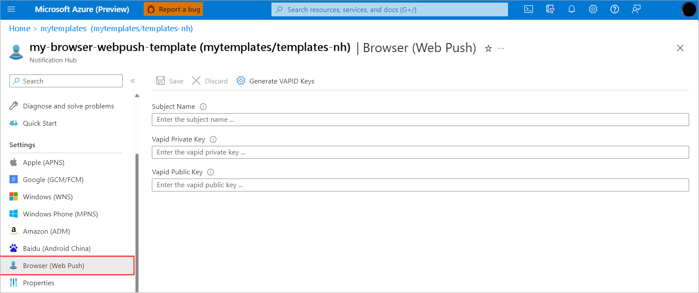

# Web push notifications with Azure Notification Hubs

This article describes how to send browser push notifications to single users through Azure Notification Hubs.

At a high level, the process is:

1. [Set credentials](#set-credentials):
   - [In the Azure portal](#set-credentials-in-azure-portal)
   - [Using the REST API](#set-credentials-using-rest-api)

2. [Create registrations and installations](#create-registrations-and-installations).

3. [Send push notifications](#send-push-notifications):
   - [Direct sends](#create-direct-sends)
   - [Batch (audience) sends](#create-audience-sends)
   - [Debug/test sends](#create-debugtest-sends)

## Overview

Web push (or browser push) is a type of notification that customers get on their desktop browsers, or in some cases mobile browsers, on a per-website basis.  

Azure Notification Hubs now supports [*browser push*](https://developers.google.com/web/ilt/pwa/introduction-to-push-notifications) for all major browsers, including Microsoft Edge, Google Chrome, and Mozilla Firefox. Apple Safari isn't included. For Apple Safari, you can use existing APNS support as described in [Configuring Safari Push Notifications](https://developer.apple.com/library/archive/documentation/NetworkingInternet/Conceptual/NotificationProgrammingGuideForWebsites/PushNotifications/PushNotifications.html#//apple_ref/doc/uid/TP40013225-CH3-SW1), with certificate-based authentication.

Browser push is supported across platforms on devices with the following operating systems and browsers.

Browser push support on laptop computers:

| Operating system | Browsers                                                |
|------------------|---------------------------------------------------------|
| Windows OS       | Google Chrome v48+<br>Microsoft Edge v17+<br>Mozilla Firefox v44+<br>Safari v7+<br>Opera v42+ |
| macOS            | Chrome v48+<br>Firefox v44+<br>Safari v7+<br>Opera v42+ |
| Linux OS         | Chrome v48+<br>Firefox v44+<br>Safari v7+<br>Opera v42+ |

Browser push support on tablet PCs:

| Operating system | Browsers                                  |
|------------------|-------------------------------------------|
| Windows OS       | Chrome v48+<br>Firefox v44+<br>Opera v42+ |
| iOS              | Not supported.                             |
| Android OS       | Chrome v48+<br>Firefox v44+<br>Opera v42+ |

Browser push support on mobile devices:

| Operating system | Browsers                                  |
|------------------|-------------------------------------------|
| iOS              | Not supported.                            |
| Android OS       | Chrome v48+<br>Firefox v44+<br>Opera v42+ |

## Set credentials

To subscribe to browser push notifications on your web site, you can use VAPID keys. You can generate VAPID credentials by using services such as the [VAPID key generator](https://www.attheminute.com/vapid-key-generator/). The credentials should look similar to the following:

```json
{ 
    "location": "South Central US", 
    "properties": { 
        "browserCredential": { 
            "properties": { 
                "subject": "mailto:email@microsoft.com", 
                "vapidPublicKey": "some-vapid-public-key", 
                "vapidPrivateKey":"some-vapid-private-key" 
            } 
        } 
    } 
} 
```

### Set credentials in Azure portal

You can set credentials for browser push in the Azure portal using the browser credentials.

To set browser push credentials in the portal, follow these steps:

1. In the [Azure portal](https://portal.azure.com), open the **Browser (Web Push)** blade in your notification hub.

   [](media/browser-push/notification-hubs-browser-web-push.png#lightbox)

1. Enter your existing VAPID keys, or generate a new VAPID key pair using a service such as the [VAPID Key Generator](https://www.attheminute.com/vapid-key-generator/).

1. Select **Save**.

### Set credentials using REST API

You can also set the browser credentials for browser push by using the REST API, such as using the [Create Or Update Hub REST API](/rest/api/notificationhubs/notification-hubs/create-or-update) method, the Azure Resource Manager API, or the V2 RP.

Enter the credentials in this format, providing the subscription ID, resource group, namespace, and notification hub:

```http
https://management.azure.com/subscriptions/{subcription}/resourceGroups/{resource-group}/providers/Microsoft.NotificationHubs/namespaces/{namespace}/notificationHubs/{hub}api-version=2016-03-01
```

## Create registrations and installations

Bulk sends require registrations or installations. You can also use the registrations and installations in debug sends.

The following examples show the registration request body for a native registration, a template registration, and a browser installation.

### Native registration request body

```xml
<?xml version="1.0" encoding="utf-8"?><entry xmlns="http://www.w3.org/2005/Atom"><content type="application/xml"><BrowserRegistrationDescription xmlns:i="http://www.w3.org/2001/XMLSchema-instance" xmlns="http://schemas.microsoft.com/netservices/2010/10/servicebus/connect"><Endpoint></Endpoint><P256DH></P256DH><Auth></Auth></BrowserRegistrationDescription></content></entry> 
```

### Browser template registration request body

```xml
<?xml version="1.0" encoding="utf-8"?> 
<entry xmlns="http://www.w3.org/2005/Atom"> 
    <content type="application/xml"> 
        <BrowserTemplateRegistrationDescription xmlns:i="http://www.w3.org/2001/XMLSchema-instance" xmlns="http://schemas.microsoft.com/netservices/2010/10/servicebus/connect"> 
            <Endpoint></Endpoint> 
            <P256DH></P256DH> 
            <Auth></Auth> 
            <BodyTemplate><![CDATA[{"title":"asdf","message":"xts"}]]></BodyTemplate> 
        </BrowserTemplateRegistrationDescription> 
    </content> 
</entry> 
```

### Installation request body

```json
{  
    "installationId": "installation-id", 
    "platform": "browser", 
    "pushChannel": { 
            "endpoint": "", 
            "p256dh": "", 
            "auth": "" 
        } 
}   
```

## Send push notifications

After you [set credentials for browser push](#set-credentials) and [create registrations and installations](#create-registrations-and-installations) for the devices, you're ready to create push notifications. This section describes how to create a notification for a [direct send|](#create-direct-sends), [audience send](#create-audience-sends), and [debug (test) send](#create-debugtest-sends).

### Create direct sends

For a direct send, you'll need the endpoint URI, p25DH key, and auth secret from a browser subscription. For more information about direct send notifications, see [Direct send](/rest/api/notificationhubs/direct-send).

To create a direct send notification, follow these steps:

1. Set the following headers for browser push:

   - `ServiceBusNotification-Format - browser`
   - `ServiceBusNotification-DeviceHandle - endpoint`: the `endpoint` field from the subscription
   - `P256DH`: the `p256dh` field from the subscription
   - `Auth`: the `auth` field from the subscription

1. Create the message body. The message body is typically in this format:

   ```json
   { 
     "title": "Some Title", 
     "body": "Some body of a message" 
   } 
   ```

   You can specify other fields in the body; for example, `icon`, to change the icon per message.

1. Send the notification.

### Create audience sends

For an audience send, use the same `ServiceBus Notification-Format` header used for a direct send, and modify the message payload as desired. Optionally, specify a tag expression using the `ServiceBusNotification-Tags` header. For more information about creating an audience send, see [Send an APNS native notification](/rest/api/notificationhubs/send-apns-native-notification).

To create an audience send using the SDK, use the following statement:

```csharp
var outcome = await notificationHubClient.SendNotificationAsync(new BrowserNotification(payload, tagExpression);
```

### Create debug/test sends

Debug sends are created in the Azure portal and require registrations and installations.

After you [create registrations for the devices](#create-registrations-and-installations), follow these steps to create a debug send notification:  

1. In the [Azure portal](https://portal.azure.com), open the **Test Send** blade in your notification hub.

   [](media/browser-push/notification-hubs-test-send.png#lightbox)

1. In the **Platform** field, select **Browser**.

1. Specify **Send to Tag Expression**.

1. Modify **Payload** to your desired message.

1. Select **Send**.

## Next steps  

- [Find out more about direct sends](/rest/api/notificationhubs/direct-send)
- [Send batches directly to a collection of device handles](/rest/api/notificationhubs/direct-batch-send)
