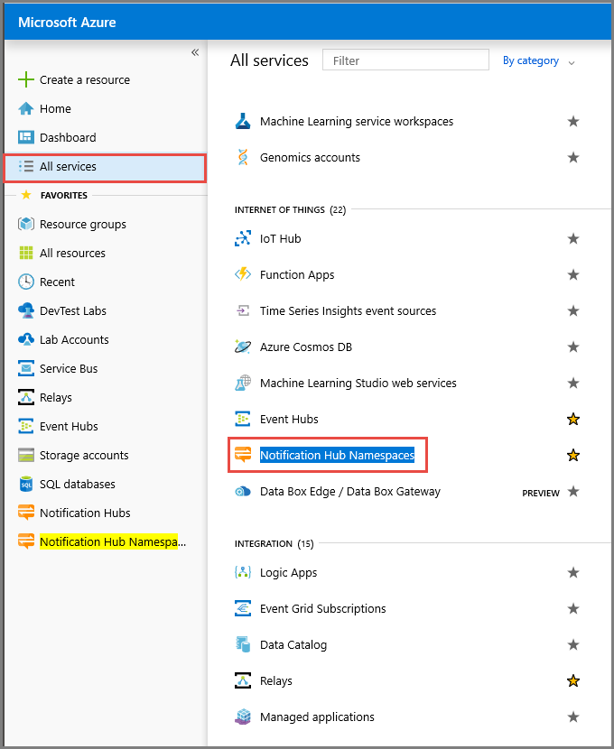
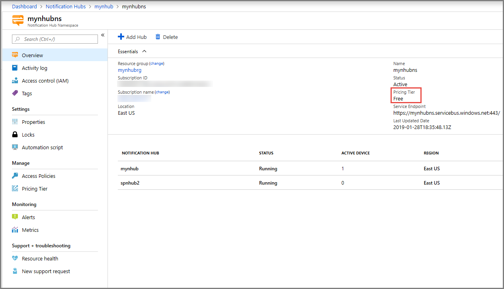
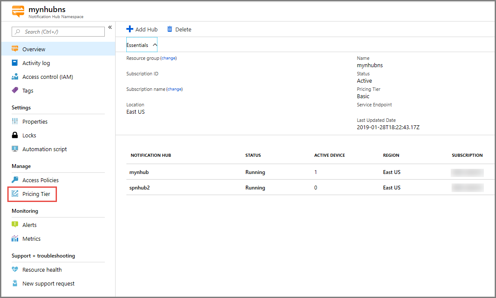

# Change pricing tier of an Azure notification hubs namespace
Notification Hubs is offered in three tiers: **free**, **basic**, and **standard**. This article shows you how to change the pricing tier for an Azure Notification Hubs namespace. 

## Overview
In Azure Notification Hubs, a **hub** is the smallest resource/entity. It generally maps to one application and can hold one certificate for each Platform Notification System we support for the app. The application can be a hybrid or a native and a cross-platform application.

A **namespace** is a collection of notification hubs. Each namespace usually consists of hubs that are related and used for a specific purpose. For example, you could have three different namespaces for development, test, and production purposes respectively. 

You can associate a pricing tier at the namespace level. Notification Hubs supports three tiers: **free**, **basic**, and **standard**. You can use the tier for a namespace that suits your requirements. The following sections show you how to change the pricing tier of a Notification Hubs namespace. 

## Use Azure portal 
When using Azure portal, you can change the pricing tier for a namespace on the namespace page or a hub page.  When you change it on a hub page, you actually change it at the namespace level. It changes the pricing tier for the namespace and all hubs in the namespace. 

### Change tier on the namespace page
The following procedure gives you steps to change the pricing tier for a namespace on the namespace page. When you change the tier for a namespace, it applies to all hubs in the namespace.

1. Sign in to the [Azure portal](https://portal.azure.com).
2. Select **All services** on the left menu. 
3. Select **Notification Hub Namespaces** in the **Internet of Things** section. If you select star (`*`) next to the text, it gets added to the left navigation bar under **FAVORITES**. It helps you with accessing the namespaces page faster the next time onwards. After you add it to the FAVORITES, select **Notification Hub Namespaces**. 

    
1. On the **Notification Hub Namespaces** page, select the namespace for which you want to change the pricing tier. 
2. On the **Notification Hub Namespace** page for your namespace, you can see the current pricing tier for the namespace in the **Essentials** section. In the following image, you can see that the pricing tier of the namespace is **Free**. 

    
1. On the **Notification Hub Namespace** page for your namespace, select **Pricing Tier** under **Manage** section. 

    
6. Change your pricing tier, and click the **Select** button.    
7. You see the status of the tier change action in the **alerts**. 
8. Switch to the **Overview** page. Confirm that the new tier is shown for the **Pricing Tier** field in the **Essentials** section.     
1. This step is optional. Select any hub in the namespace. Confirm that you see the same pricing tier in the **Essentials** section. You should see the same pricing tier for all the hubs in the namespace. 

### Change tier on the hub page
The following procedure gives you steps to change the pricing tier for a namespace on the hub page. Even though you do these steps starting from the hub page, you actually change the pricing tier for the namespace and all hubs in the namespace. 

1. Sign in to the [Azure portal](https://portal.azure.com).
2. Select **All services** on the left menu.
3. Select **Notification Hubs** in the **Internet of Things** section. 
4. Select your notification **hub**. 
5. Select **Pricing Tier** on the left menu. 
6. Change the pricing tier, and click the **Select** button. This action changes the pricing tier setting for the namespace that contains the hub. So, you see the new pricing tier on the namespace page and all hub pages. 

## Use REST API
You can use the following Resource Provider REST APIs to get the current pricing tier and update it. 

### Get current pricing tier for a namespace
To get the **current namespace tier**, send a GET command as shown in the following example: 

```REST
GET: https://management.core.windows.net/{subscription ID}/services/ServiceBus/Namespaces/{namespace name}/notificationhubplan
```

### Update pricing tier for a namespace
To **update the namespace tier**, send a PUT command as shown in the following example: 

```REST
PUT: https://management.core.windows.net/{subscription ID}/services/ServiceBus/Namespaces/{namespace name}/notificationhubplan
Body: <NotificationHubPlan xmlns:i="https://www.w3.org/2001/XMLSchema-instance" xmlns="http://schemas.microsoft.com/netservices/2010/10/servicebus/connect"><SKU>Standard</SKU></NotificationHubPlan>
```


## Next steps
For more information about these tiers and pricing, see [Notification Hubs pricing](https://azure.microsoft.com/pricing/details/notification-hubs/).
