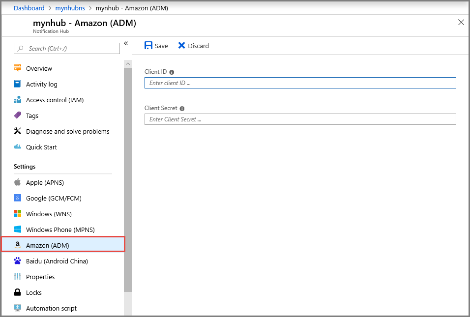

# Configure Android Device Messaging (ADM) settings for a notification hub in the Azure portal
This article shows you how to configure Android Device Messaging (ADM) settings for an Azure notification hub by using the Azure portal. 

## Prerequisites
If you haven't already created a notification hub, create one now. For more information, see [Create an Azure notification hub in the Azure portal](create-notification-hub-portal.md). 

## Configure Android Device Messaging

The following procedure gives you steps to configure Amazon Device Messaging (ADM) settings for a notification hub: 

1. In the Azure portal, on the **Notification Hub** page, select **Amazon (ADM)** on the left menu.
2. Enter values for **Client ID** and **Client Secret**.
3. Select **Save**.
    
   

## Next steps
For a tutorial with step-by-step instructions for pushing notifications to Android devices by using Azure Notification Hubs and Android Device Messaging (ADM), see [Get started with Notification Hubs for Kindle apps](notification-hubs-kindle-amazon-adm-push-notification.md).

