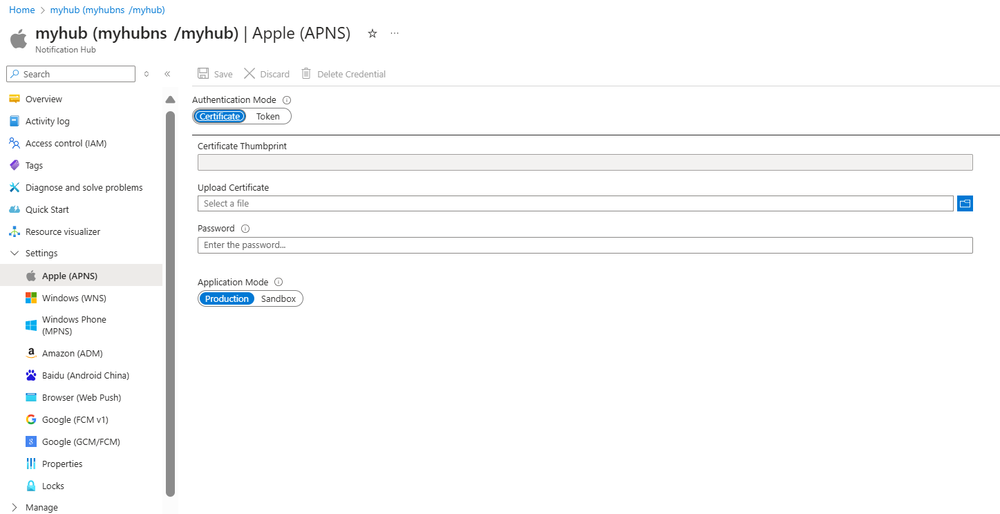
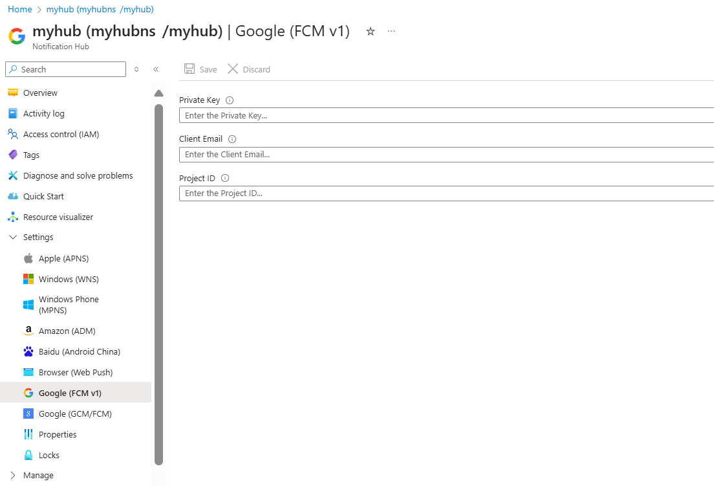
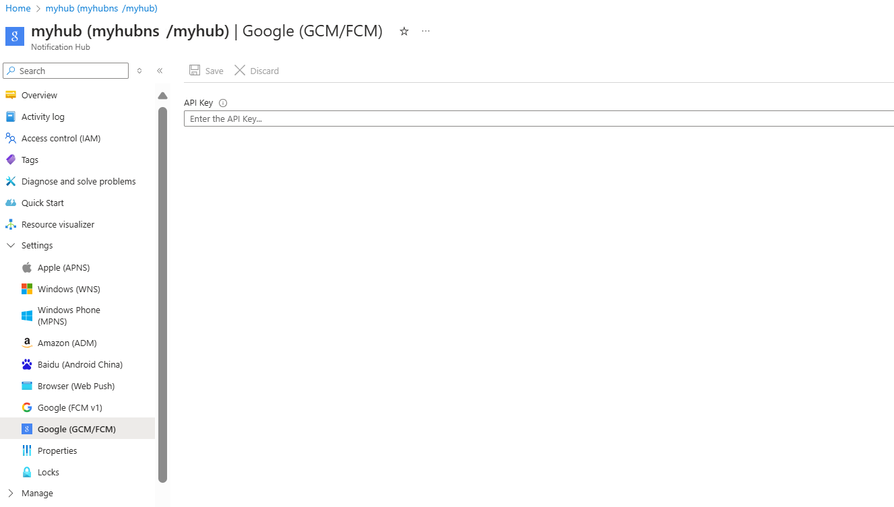
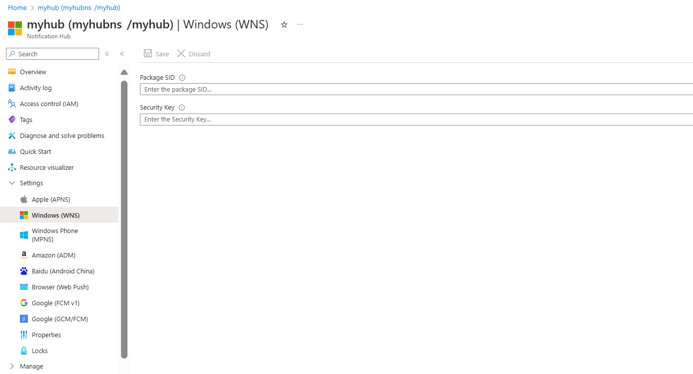

# Quickstart: Set up push notifications in a notification hub

Azure Notification Hubs provides a push engine that's easy to use and that scales out. Use Notification Hubs to send notifications to any platform (iOS, Android, Windows) and from any back end (cloud or on-premises). For more information, see [What is Azure Notification Hubs?](notification-hubs-push-notification-overview.md).

In this quickstart, you use the platform notification system (PNS) settings in Notification Hubs to set up push notifications on multiple platforms. The quickstart shows you the steps to take when you use the Azure portal. [Google Firebase Cloud Messaging](?tabs=azure-cli#google-firebase-cloud-messaging-fcm) includes instructions for using the Azure CLI.

> [!NOTE]
> For information about Firebase Cloud Messaging deprecation and migration steps, see [Google Firebase Cloud Messaging migration](notification-hubs-gcm-to-fcm.md).

If you didn't already create a notification hub, create one now. For more information, see [Create an Azure notification hub in the Azure portal](create-notification-hub-portal.md) or [Create an Azure notification hub using the Azure CLI](create-notification-hub-azure-cli.md).

## Apple Push Notification Service

To set up Apple Push Notification Service (APNS):

1. In the Azure portal, on the **Notification Hub** page, select **Apple (APNS)** from the left menu.

1. For **Authentication Mode**, select either **Certificate** or **Token**.

   1. If you select **Certificate**:

      * Select the file icon, and then select the *.p12* file you want to upload.
      * Enter a password.
      * Select **Sandbox** mode. Or, to send push notifications to users who purchased your app from the store, select **Production** mode.

      

   1. If you select **Token**:

      * Enter the values for **Key ID**, **Bundle ID**, **Team ID**, and **Token**.
      * Select **Sandbox** mode. Or, to send push notifications to users who purchased your app from the store, select **Production** mode.

      

For more information, see [Send push notifications to iOS apps using Azure Notification Hubs](ios-sdk-get-started.md).

## Google Firebase Cloud Messaging V1 (FCMv1)

To set up push notifications for Google FCMv1:

1. In the Azure portal, on the **Notification Hub** page, select **Google (FCMv1)** from the left menu.
1. Update the **Private Key**, **Project ID**, and **Client Email** values from the service account JSON file obtained from the Firebase Console.
1. Select **Save**.



When you complete these steps, an alert indicates that the notification hub has been successfully updated. The **Save** button is disabled.

## Google Firebase Cloud Messaging (FCM)

> [!NOTE]
> Firebase Cloud Messaging (FCM) has been deprecated and is no longer supported.

### [Portal](#tab/azure-portal)

To set up push notifications for Google FCM:

1. In the Azure portal, on the **Notification Hub** page, select **Google (GCM/FCM)** from the left menu.
1. Paste the **API Key** for the Google FCM project that you saved earlier.
1. Select **Save**.

   

When you complete these steps, an alert indicates that the notification hub has been successfully updated. The **Save** button is disabled.

### [Azure CLI](#tab/azure-cli)

You need the **API Key** for your Google Firebase Cloud Messaging (FCM) project.

[!INCLUDE [azure-cli-prepare-your-environment.md](~/reusable-content/azure-cli/azure-cli-prepare-your-environment-h3.md)]

* This article requires version 2.0.67 or later of the Azure CLI. If you use Azure Cloud Shell, the latest version is already installed.

## Set up push notifications for Google FCM

1. Use the [az notification-hub credential gcm update](/cli/azure/notification-hub/credential/gcm#az-notification-hub-credential-gcm-update) command to add your Google API key to your notification hub.

   ```azurecli
   az notification-hub credential gcm update --resource-group spnhubrg --namespace-name spnhubns    --notification-hub-name spfcmtutorial1nhub --google-api-key myKey
   ```

1. The Android App needs a connection string to connect with the notification hub.  Use the [az notification-hub authorization-rule list](/cli/azure/notification-hub/authorization-rule#az-notification-hub-authorization-rule-list) command to list the available access policies.  Use the [az notification-hub authorization-rule list-keys](/cli/azure/notification-hub/authorization-rule#az-notification-hub-authorization-rule-list-keys) command to get the access policy connection strings.  Specify the **primaryConnectionString** or **secondaryConnectionString** in the `--query` parameter to get the primary connection string directly.

   ```azurecli
   #list access policies for a notification hub
   az notification-hub authorization-rule list --resource-group spnhubrg --namespace-name spnhubns --notification-hub-name spfcmtutorial1nhub --output table

   #list keys and connection strings for a notification hub access policy
   az notification-hub authorization-rule list-keys --resource-group spnhubrg --namespace-name spnhubns --notification-hub-name spfcmtutorial1nhub --name myAccessPolicyName --output json

   #get the primaryConnectionString for an access policy
   az notification-hub authorization-rule list-keys --resource-group spnhubrg --namespace-name spnhubns --notification-hub-name spfcmtutorial1nhub --name myAccessPolicyName --query primaryConnectionString
   ```

1. Use the [az notification-hub test-send](/cli/azure/notification-hub#az-notification-hub-test-send) command to test sending messages to the Android App.

   ```azurecli
   #test with message body
   az notification-hub test-send --resource-group spnhubrg --namespace-name spnhubns --notification-hub-name spfcmtutorial1nhub --notification-format gcm --message "my message body"

   #test with JSON string
   az notification-hub test-send --resource-group spnhubrg --namespace-name spnhubns --notification-hub-name spfcmtutorial1nhub --notification-format gcm --payload "{\"data\":{\"message\":\"my JSON string\"}}"
   ```

You can get Azure CLI references for other platforms with the [az notification-hub credential](/cli/azure/notification-hub/credential) command.

For more information about sending notifications to an Android application, see [Send push notifications to Android devices using Firebase](notification-hubs-android-push-notification-google-fcm-get-started.md).

---

## Windows Push Notification Service

To set up Windows Push Notification Service (WNS):

1. In the Azure portal, on the **Notification Hub** page, select **Windows (WNS)** from the left menu.
1. Enter values for **Package SID** and **Security Key**.
1. Select **Save**.

   

For information, see [Send notifications to UWP apps by using Azure Notification Hubs](notification-hubs-windows-store-dotnet-get-started-wns-push-notification.md).

When you complete these steps, an alert indicates that the notification hub was successfully updated. The **Save** button is disabled.

For more information, see [Get started with Notification Hubs by using Baidu](notification-hubs-baidu-china-android-notifications-get-started.md).

## Next steps

In this quickstart, you learned how to configure platform notification system settings for a notification hub in the Azure portal.

To learn more about how to push notifications to various platforms, see these tutorials:

* [Send push notifications to iOS apps using Azure Notification Hubs](ios-sdk-get-started.md)
* [Send notifications to Android devices by using Notification Hubs and Google FCM](notification-hubs-android-push-notification-google-fcm-get-started.md)
* [Send notifications to a UWP app running on a Windows device](notification-hubs-windows-store-dotnet-get-started-wns-push-notification.md)
* [Send notifications by using Notification Hubs and Baidu cloud push](notification-hubs-baidu-china-android-notifications-get-started.md)
