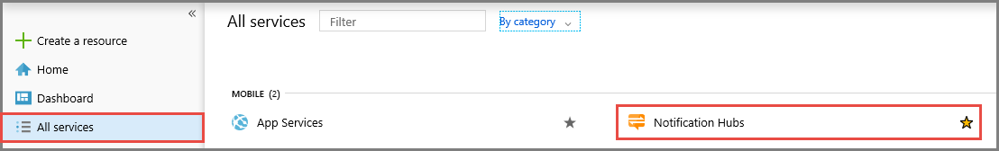
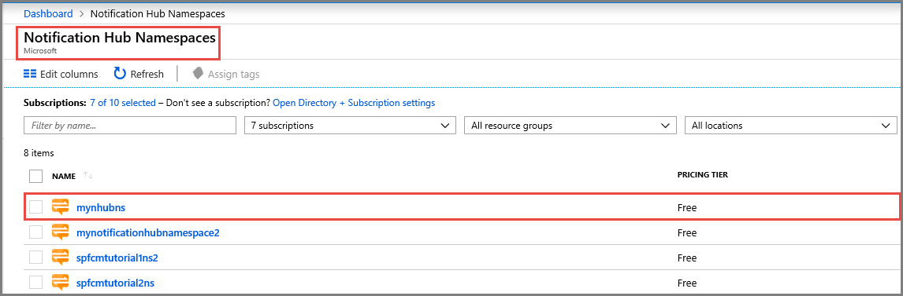
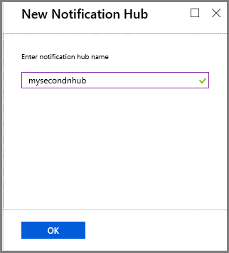
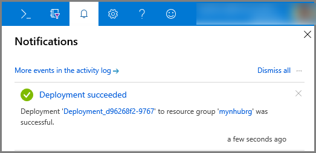
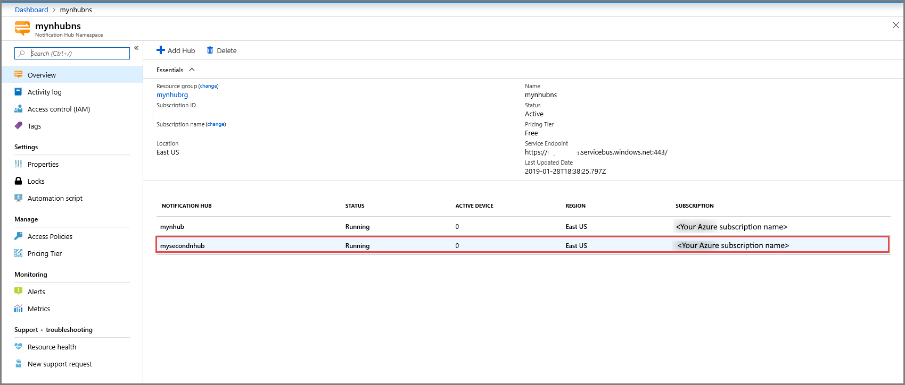
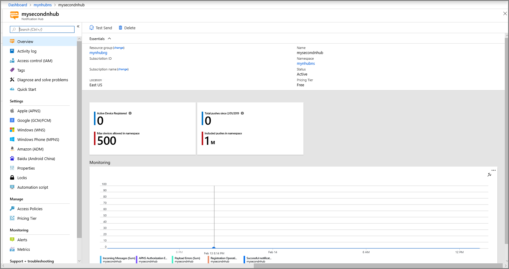

# Quickstart: Create an Azure notification hub in the Azure portal

Azure Notification Hubs provide an easy-to-use and scaled-out push engine that allows you to send notifications to any platform (iOS, Android, Windows, Kindle, Baidu, etc.) from any backend (cloud or on-premises). For more information about the service, see [What is Azure Notification Hubs?](notification-hubs-push-notification-overview.md).

In this quickstart, you create a notification hub in the Azure portal. The first section gives you steps to create a Notification Hubs namespace and a hub in that namespace. The second section gives you steps to create a notification hub in an existing Notification Hubs namespace.

## Create a namespace and a notification hub

In this section, you create a namespace and a hub in the namespace.

[!INCLUDE [notification-hubs-portal-create-new-hub](../../includes/notification-hubs-portal-create-new-hub.md)]

## Create a notification hub in an existing namespace

In this section, you create a notification hub in an existing namespace.

1. Sign in to the [Azure portal](https://portal.azure.com).
2. Select **All services** on the left menu, search for **Notification Hub**, select **star** (`*`) next to **Notification Hub Namespaces** to add it to the **FAVORITES** section on the left menu. Select **Notification Hub Namespaces**.

      
3. On the **Notification Hub Namespaces** page, select your namespace from the list.

      
4. On the **Notification Hub Namespace** page, select **Add Hub** on the toolbar.

      
5. On the **New Notification Hub** page, enter a name for the notification hub, and select **OK**.

      
6. Select **Notifications** (Bell icon) at the top to see the status of the deployment of the new hub. Select **X** in the right-corner to close the notification window.

      
7. Refresh the **Notification Hub Namespaces** web page to see your new hub in the list.

      
8. Select your **notification hub** to see the home page for your notification hub.

      

## Next steps

In this quickstart, you created a notification hub. To learn how to configure the hub with platform notification system (PNS) settings, see [Configure a notification hub with PNS settings](configure-notification-hub-portal-pns-settings.md).
