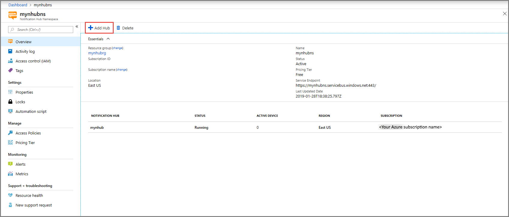

# Create an Azure notification hub by using the Azure portal 

## Create a namespace and a notification hub
[!INCLUDE [notification-hubs-portal-create-new-hub](../../includes/notification-hubs-portal-create-new-hub.md)]

## Create a notification hub in an existing namespace
1. Sign in to the [Azure portal](https://portal.azure.com).
2. Select **All services** on the left menu, search for **Notification Hub**, select **star** (`*`) next to **Notification Hub Namespaces** to add it to the **FAVORITES** section on the left menu. Select **Notification Hub Namespaces**. 

      
3. On the **Notification Hub Namespaces** page, select your namespace from the list. 

      
1. On the **Notification Hub Namespace** page, select **Add Hub** on the toolbar. 

      
4. On the **New Notification Hub** page, enter a name for the notification hub, and select **OK**.

      
4. Select **Notifications** (Bell icon) at the top to see the status of the deployment of the new hub. Select **X** in the right-corner to close the notification window. 

      
5. Refresh the **Notification Hub Namespaces** web page to see your new hub in the list. 

      
6. Select your **notification hub** to see the home page for your notification hub. 

      

## Next steps
In this tutorial, you used Firebase Cloud Messaging to push notifications to Android devices. To learn how to push notifications by using Google Cloud Messaging, advance to the following tutorial:

> [!div class="nextstepaction"]
>[Push notifications to Android devices using Google Cloud Messaging](notification-hubs-android-push-notification-google-gcm-get-started.md)

<!-- Images. -->

<!-- URLs. -->
[Get started with push notifications in Mobile Services]: ../mobile-services-javascript-backend-android-get-started-push.md  
[Mobile Services Android SDK]: https://go.microsoft.com/fwLink/?LinkID=280126&clcid=0x409
[Referencing a library project]: http://go.microsoft.com/fwlink/?LinkId=389800
[Notification Hubs Guidance]: notification-hubs-push-notification-overview.md
[Use Notification Hubs to push notifications to users]: notification-hubs-aspnet-backend-gcm-android-push-to-user-google-notification.md
[Use Notification Hubs to send breaking news]: notification-hubs-aspnet-backend-android-xplat-segmented-gcm-push-notification.md
[Azure portal]: https://portal.azure.com
