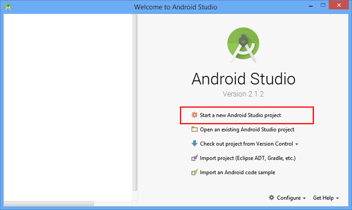
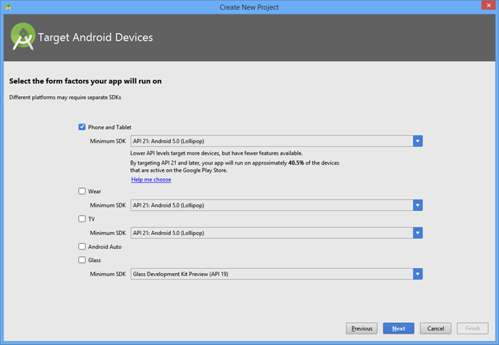
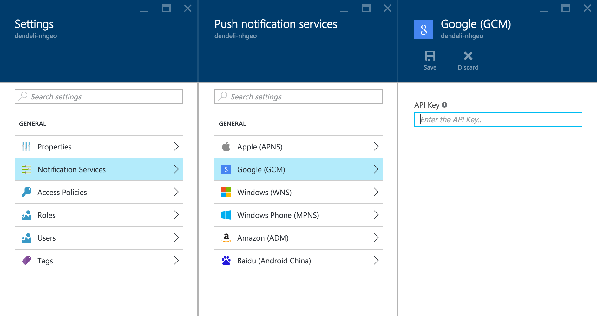
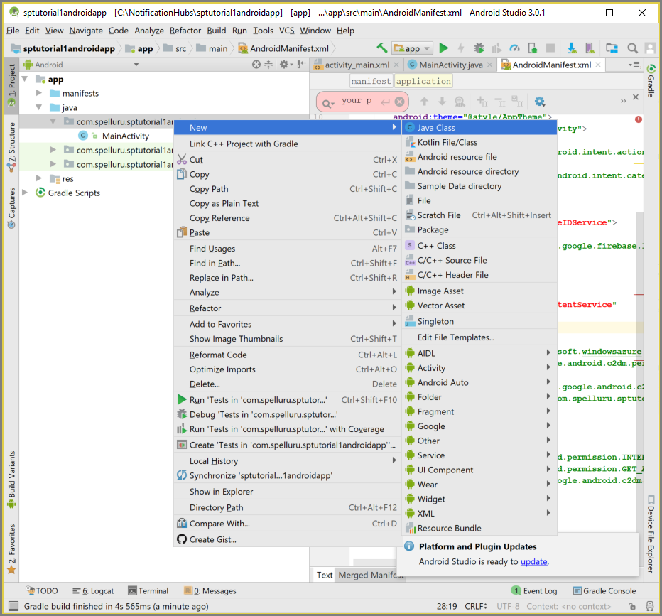

# Tutorial: Push notifications to Android devices by using Azure Notification Hubs and Google Firebase Cloud Messaging
[!INCLUDE [notification-hubs-selector-get-started](../../includes/notification-hubs-selector-get-started.md)]

> [!IMPORTANT]
> This article demonstrates push notifications with Google Firebase Cloud Messaging (FCM). If you are still using Google Cloud Messaging (GCM), see [Push notifications to Android devices with Azure Notification Hubs and GCM](notification-hubs-android-push-notification-google-gcm-get-started.md).

This tutorial shows you how to use Azure Notification Hubs and Firebase Cloud Messaging to push notifications to an Android application. In this tutorial, you create a blank Android app that receives push notifications by using Firebase Cloud Messaging (FCM).

The completed code for this tutorial can be downloaded from GitHub [here](https://github.com/Azure/azure-notificationhubs-samples/tree/master/Android/GetStartedFirebase).

In this tutorial, you take the following steps:

> [!div class="checklist"]
> * Create an Android Studio project.
> * Create a Firebase project that supports Firebase Cloud Messaging.
> * Create a notification hub.
> * Connect your app to the notification hub.
> * Test the app. 

## Prerequisites
To complete this tutorial, you must have an active Azure account. If you don't have an account, you can create a free trial account in just a couple of minutes. For details, see [Azure Free Trial](https://azure.microsoft.com/free/).

* In addition to an active Azure account mentioned above, this tutorial requires the latest version of [Android Studio](http://go.microsoft.com/fwlink/?LinkId=389797).
* Android 2.3 or higher for Firebase Cloud Messaging.
* Google Repository revision 27 or higher is required for Firebase Cloud Messaging.
* Google Play Services 9.0.2 or higher for Firebase Cloud Messaging.
* Completing this tutorial is a prerequisite for all other Notification Hubs tutorials for Android apps.

## Create an Android Studio Project
1. In Android Studio, start a new Android Studio project.
   
    
2. Choose the **Phone and Tablet** form factor and the **Minimum SDK** that you want to support. Then click **Next**.
   
    
3. Choose **Empty Activity** for the main activity, click **Next**, and then click **Finish**.

## Create a Firebase project that supports FCM
[!INCLUDE [notification-hubs-enable-firebase-cloud-messaging](../../includes/notification-hubs-enable-firebase-cloud-messaging.md)]

## Configure a notification hub
[!INCLUDE [notification-hubs-portal-create-new-hub](../../includes/notification-hubs-portal-create-new-hub.md)]

### Configure Firebase Cloud Messaging settings for the hub
1. Select **Google (GCM)** in the **NOTIFICATION SETTINGS** category. 
2. Enter the API key (FCM server key) you copied earlier from the [Firebase console](https://firebase.google.com/console/).
3. Select **Save** on the toolbar.

    

Your notification hub is now configured to work with Firebase Cloud Messaging, and you have the connection strings to both register your app to receive and send push notifications.

## <a id="connecting-app"></a>Connect your app to the notification hub
### Add Google Play services to the project
[!INCLUDE [Add Play Services](../../includes/notification-hubs-android-studio-add-google-play-services.md)]

### Adding Azure Notification Hubs libraries
1. In the `Build.Gradle` file for the **app**, add the following lines in the **dependencies** section.
   
    ```java
        compile 'com.microsoft.azure:notification-hubs-android-sdk:0.4@aar'
        compile 'com.microsoft.azure:azure-notifications-handler:1.0.1@aar'
    ```

2. Add the following repository after the **dependencies** section.
   
    ```java
        repositories {
            maven {
                url "http://dl.bintray.com/microsoftazuremobile/SDK"
            }
        }
    ```

### Add Google Firebase support

1. In the `Build.Gradle` file for the **app**, add the following lines in the **dependencies** section.
   
    ```java
        compile 'com.google.firebase:firebase-core:12.0.0'
    ```

2. Add the following plugin at the end of the file. 
   
    ```java
    apply plugin: 'com.google.gms.google-services'
    ```

### Updating the AndroidManifest.xml.
1. To support FCM, you must implement an Instance ID listener service in your code, which is used to [obtain registration tokens](https://firebase.google.com/docs/cloud-messaging/android/client#sample-register) using [Google's FirebaseInstanceId API](https://firebase.google.com/docs/reference/android/com/google/firebase/iid/FirebaseInstanceId). In this tutorial, the name of the class is `MyInstanceIDService`. 
   
    Add the following service definition to the AndroidManifest.xml file, inside the `<application>` tag. 
   
    ```xml
        <service android:name=".MyInstanceIDService">
            <intent-filter>
                <action android:name="com.google.firebase.INSTANCE_ID_EVENT"/>
            </intent-filter>
        </service>
    ```

2. Once you have received your FCM registration token from the FirebaseInstanceId API, you use it to [register with the Azure Notification Hub](notification-hubs-push-notification-registration-management.md). You support this registration in the background using an `IntentService` named `RegistrationIntentService`. This service is also responsible for refreshing your FCM registration token.
   
    Add the following service definition to the AndroidManifest.xml file, inside the `<application>` tag. 
   
    ```xml
        <service
            android:name=".RegistrationIntentService"
            android:exported="false">
        </service>
    ```

3. You need to also define a receiver to receive notifications. Add the following receiver definition to the AndroidManifest.xml file, inside the `<application>` tag. Replace the `<your package>` placeholder with your actual package name shown at the top of the `AndroidManifest.xml` file.

    ```xml
        <receiver android:name="com.microsoft.windowsazure.notifications.NotificationsBroadcastReceiver"
            android:permission="com.google.android.c2dm.permission.SEND">
            <intent-filter>
                <action android:name="com.google.android.c2dm.intent.RECEIVE" />
                <category android:name="<your package name>" />
            </intent-filter>
        </receiver>
    ```

4. Add the following necessary FCM-related permissions below the  `</application>` tag. 
   
    For more information on these permissions, see [Setup a GCM Client app for Android](https://developers.google.com/cloud-messaging/android/client#manifest) and [Migrate a GCM Client App for Android to Firebase Cloud Messaging](https://developers.google.com/cloud-messaging/android/android-migrate-fcm#remove_the_permissions_required_by_gcm).
   
    ```xml
        <uses-permission android:name="android.permission.INTERNET"/>
        <uses-permission android:name="android.permission.GET_ACCOUNTS"/>
        <uses-permission android:name="com.google.android.c2dm.permission.RECEIVE" />
    ```

### Adding code
1. In the Project View, expand **app** > **src** > **main** > **java**. Right-click your package folder under **java**, click **New**, and then click **Java Class**. Add a new class named `NotificationSettings`. 
   
    
   
    Make sure to update these three placeholders in the following code for the `NotificationSettings` class:
   
   * **SenderId**: The Sender ID you obtained earlier in the **Cloud Messaging** tab of your project settings in the [Firebase console](https://firebase.google.com/console/).
   * **HubListenConnectionString**: The **DefaultListenAccessSignature** connection string for your hub. You can copy that connection string by clicking **Access Policies** in your hub on the [Azure portal].
   * **HubName**: Use the name of your notification hub that appears in the hub page in the [Azure portal].
     
     `NotificationSettings` code:
     
    ```java
       public class NotificationSettings {
     
           public static String SenderId = "<Your project number>";
           public static String HubName = "<Your HubName>";
           public static String HubListenConnectionString = "<Enter your DefaultListenSharedAccessSignature connection string>";
       }
    ```

2. Using the steps preceding, add another new class named `MyInstanceIDService`. This class is your Instance ID listener service implementation.
   
    The code for this class calls your `IntentService` to [refresh the FCM token](https://developers.google.com/instance-id/guides/android-implementation#refresh_tokens) in the background.
   
    ```java
        import android.content.Intent;
        import android.util.Log;
        import com.google.firebase.iid.FirebaseInstanceIdService;

        public class MyInstanceIDService extends FirebaseInstanceIdService {

            private static final String TAG = "MyInstanceIDService";

            @Override
            public void onTokenRefresh() {

                Log.d(TAG, "Refreshing GCM Registration Token");

                Intent intent = new Intent(this, RegistrationIntentService.class);
                startService(intent);
            }
        };
    ```

1. Add another new class to your project named, `RegistrationIntentService`. This class implements the `IntentService` interface, and handles [refreshing the FCM token](https://developers.google.com/instance-id/guides/android-implementation#refresh_tokens) and [registering with the notification hub](notification-hubs-push-notification-registration-management.md).
   
    Use the following code for this class.
   
    ```java
        import android.app.IntentService;
        import android.content.Intent;
        import android.content.SharedPreferences;
        import android.preference.PreferenceManager;
        import android.util.Log;        
        import com.google.firebase.iid.FirebaseInstanceId;
        import com.microsoft.windowsazure.messaging.NotificationHub;
   
        public class RegistrationIntentService extends IntentService {
   
            private static final String TAG = "RegIntentService";
   
            private NotificationHub hub;
   
            public RegistrationIntentService() {
                super(TAG);
            }
   
            @Override
            protected void onHandleIntent(Intent intent) {
   
                SharedPreferences sharedPreferences = PreferenceManager.getDefaultSharedPreferences(this);
                String resultString = null;
                String regID = null;
                String storedToken = null;
   
                try {
                    String FCM_token = FirebaseInstanceId.getInstance().getToken();
                    Log.d(TAG, "FCM Registration Token: " + FCM_token);
   
                    // Storing the registration ID that indicates whether the generated token has been
                    // sent to your server. If it is not stored, send the token to your server,
                    // otherwise your server should have already received the token.
                    if (((regID=sharedPreferences.getString("registrationID", null)) == null)){
   
                        NotificationHub hub = new NotificationHub(NotificationSettings.HubName,
                                NotificationSettings.HubListenConnectionString, this);
                        Log.d(TAG, "Attempting a new registration with NH using FCM token : " + FCM_token);
                        regID = hub.register(FCM_token).getRegistrationId();
   
                        // If you want to use tags...
                        // Refer to : https://azure.microsoft.com/documentation/articles/notification-hubs-routing-tag-expressions/
                        // regID = hub.register(token, "tag1,tag2").getRegistrationId();
   
                        resultString = "New NH Registration Successfully - RegId : " + regID;
                        Log.d(TAG, resultString);
   
                        sharedPreferences.edit().putString("registrationID", regID ).apply();
                        sharedPreferences.edit().putString("FCMtoken", FCM_token ).apply();
                    }
   
                    // Check if the token may have been compromised and needs refreshing.
                    else if ((storedToken=sharedPreferences.getString("FCMtoken", "")) != FCM_token) {
   
                        NotificationHub hub = new NotificationHub(NotificationSettings.HubName,
                                NotificationSettings.HubListenConnectionString, this);
                        Log.d(TAG, "NH Registration refreshing with token : " + FCM_token);
                        regID = hub.register(FCM_token).getRegistrationId();
   
                        // If you want to use tags...
                        // Refer to : https://azure.microsoft.com/documentation/articles/notification-hubs-routing-tag-expressions/
                        // regID = hub.register(token, "tag1,tag2").getRegistrationId();
   
                        resultString = "New NH Registration Successfully - RegId : " + regID;
                        Log.d(TAG, resultString);
   
                        sharedPreferences.edit().putString("registrationID", regID ).apply();
                        sharedPreferences.edit().putString("FCMtoken", FCM_token ).apply();
                    }
   
                    else {
                        resultString = "Previously Registered Successfully - RegId : " + regID;
                    }
                } catch (Exception e) {
                    Log.e(TAG, resultString="Failed to complete registration", e);
                    // If an exception happens while fetching the new token or updating our registration data
                    // on a third-party server, this ensures that we'll attempt the update at a later time.
                }
   
                // Notify UI that registration has completed.
                if (MainActivity.isVisible) {
                    MainActivity.mainActivity.ToastNotify(resultString);
                }
            }
        }
    ```

2. In your `MainActivity` class, add the following `import` statements above the class declaration.
   
    ```java
        import com.google.android.gms.common.ConnectionResult;
        import com.google.android.gms.common.GoogleApiAvailability;
        import com.microsoft.windowsazure.notifications.NotificationsManager;
        import android.content.Intent;
        import android.util.Log;
        import android.widget.TextView;
        import android.widget.Toast;
    ```
3. Add the following private members at the top of the class. You use these fields to [check the availability of Google Play Services as recommended by Google](https://developers.google.com/android/guides/setup#ensure_devices_have_the_google_play_services_apk).
   
    ```java
        public static MainActivity mainActivity;
        public static Boolean isVisible = false;    
        private static final String TAG = "MainActivity";
        private static final int PLAY_SERVICES_RESOLUTION_REQUEST = 9000;
    ```

4. In your `MainActivity` class, add the following method to the availability of Google Play Services. 
   
    ```java
        /**
        * Check the device to make sure it has the Google Play Services APK. If
        * it doesn't, display a dialog that allows users to download the APK from
        * the Google Play Store or enable it in the device's system settings.
        */
    
        private boolean checkPlayServices() {
            GoogleApiAvailability apiAvailability = GoogleApiAvailability.getInstance();
            int resultCode = apiAvailability.isGooglePlayServicesAvailable(this);
            if (resultCode != ConnectionResult.SUCCESS) {
                if (apiAvailability.isUserResolvableError(resultCode)) {
                    apiAvailability.getErrorDialog(this, resultCode, PLAY_SERVICES_RESOLUTION_REQUEST)
                            .show();
                } else {
                    Log.i(TAG, "This device is not supported by Google Play Services.");
                    ToastNotify("This device is not supported by Google Play Services.");
                    finish();
                }
                return false;
            }
            return true;
        }
    ```

5. In your `MainActivity` class, add the following code that checks for Google Play Services before calling your `IntentService` to get your FCM registration token and register with your notification hub.
   
    ```java
        public void registerWithNotificationHubs()
        {
            if (checkPlayServices()) {
                // Start IntentService to register this application with FCM.
                Intent intent = new Intent(this, RegistrationIntentService.class);
                startService(intent);
            }
        }
    ```

6. In the `OnCreate` method of the `MainActivity` class, add the following code to start the registration process when activity is created.
   
    ```java
        @Override
        protected void onCreate(Bundle savedInstanceState) {
            super.onCreate(savedInstanceState);
            setContentView(R.layout.activity_main);
   
            mainActivity = this;
            NotificationsManager.handleNotifications(this, NotificationSettings.SenderId, MyHandler.class);
            registerWithNotificationHubs();
        }
    ```

7. To verify app state and report status in your app, add these additional methods to the `MainActivity`.
   
    ```java
        @Override
        protected void onStart() {
            super.onStart();
            isVisible = true;
        }
   
        @Override
        protected void onPause() {
            super.onPause();
            isVisible = false;
        }
   
        @Override
        protected void onResume() {
            super.onResume();
            isVisible = true;
        }
   
        @Override
        protected void onStop() {
            super.onStop();
            isVisible = false;
        }
   
        public void ToastNotify(final String notificationMessage) {
            runOnUiThread(new Runnable() {
                @Override
                public void run() {
                    Toast.makeText(MainActivity.this, notificationMessage, Toast.LENGTH_LONG).show();
                    TextView helloText = (TextView) findViewById(R.id.text_hello);
                    helloText.setText(notificationMessage);
                }
            });
        }
    ```

8. The `ToastNotify` method uses the *"Hello World"* `TextView` control to report status and notifications persistently in the app. In your activity_main.xml layout, add the following ID for that control.
   
    ```java
       android:id="@+id/text_hello"
    ```

9. Next you add a subclass for your receiver you defined in the AndroidManifest.xml. Add another new class to your project named `MyHandler`.
10. Add the following import statements at the top of `MyHandler.java`:
    
    ```java
        import android.app.NotificationManager;
        import android.app.PendingIntent;
        import android.content.Context;
        import android.content.Intent;
        import android.media.RingtoneManager;
        import android.net.Uri;
        import android.os.Bundle;
        import android.support.v4.app.NotificationCompat;
        import com.microsoft.windowsazure.notifications.NotificationsHandler;
    ```

11. Add the following code for the `MyHandler` class making it a subclass of `com.microsoft.windowsazure.notifications.NotificationsHandler`.
    
    This code overrides the `OnReceive` method, so the handler reports notifications that are received. The handler also sends the push notification to the Android notification manager by using the `sendNotification()` method. The `sendNotification()` method should be executed when the app is not running and a notification is received.
    
    ```java
        public class MyHandler extends NotificationsHandler {
            public static final int NOTIFICATION_ID = 1;
            private NotificationManager mNotificationManager;
            NotificationCompat.Builder builder;
            Context ctx;
    
            @Override
            public void onReceive(Context context, Bundle bundle) {
                ctx = context;
                String nhMessage = bundle.getString("message");
                sendNotification(nhMessage);
                if (MainActivity.isVisible) {
                    MainActivity.mainActivity.ToastNotify(nhMessage);
                }
            }
    
            private void sendNotification(String msg) {
    
                Intent intent = new Intent(ctx, MainActivity.class);
                intent.addFlags(Intent.FLAG_ACTIVITY_CLEAR_TOP);
    
                mNotificationManager = (NotificationManager)
                        ctx.getSystemService(Context.NOTIFICATION_SERVICE);
    
                PendingIntent contentIntent = PendingIntent.getActivity(ctx, 0,
                        intent, PendingIntent.FLAG_ONE_SHOT);
    
                Uri defaultSoundUri = RingtoneManager.getDefaultUri(RingtoneManager.TYPE_NOTIFICATION);
                NotificationCompat.Builder mBuilder =
                        new NotificationCompat.Builder(ctx)
                                .setSmallIcon(R.mipmap.ic_launcher)
                                .setContentTitle("Notification Hub Demo")
                                .setStyle(new NotificationCompat.BigTextStyle()
                                        .bigText(msg))
                                .setSound(defaultSoundUri)
                                .setContentText(msg);
    
                mBuilder.setContentIntent(contentIntent);
                mNotificationManager.notify(NOTIFICATION_ID, mBuilder.build());
            }
        }
    ```

12. In Android Studio on the menu bar, click **Build** > **Rebuild Project** to make sure that no errors are present in your code.
13. Run the app on your device and verify it registers successfully with the notification hub. 
    
    > [!NOTE]
    > Registration may fail on the initial launch until the `onTokenRefresh()` method of instance ID service is called. The refresh should initiate a successful registration with the notification hub.
    > 
    > 

## Test the app
### Test send notification from the notification hub
You can send push notifications from the [Azure portal] by doing the following actions: 

1. Select **Test Send** in the **Troubleshooting** section.
2. For **Platforms**, select **Android**. 
3. Select **Send**.  You do not see a notification on the Android device yet because you haven't run the mobile app on it. After you run the mobile app, select **Send** button again to see the notification message. 
4. See the **result** of the operation in the list at the bottom. 

    


[!INCLUDE [notification-hubs-sending-notifications-from-the-portal](../../includes/notification-hubs-sending-notifications-from-the-portal.md)]


### Run the mobile app
If you want to test push notifications inside an emulator, make sure that your emulator image supports the Google API level that you chose for your app. If your image doesn't support native Google APIs, you end up with the **SERVICE\_NOT\_AVAILABLE** exception.

In addition, ensure that you have added your Google account to your running emulator under **Settings** > **Accounts**. Otherwise, your attempts to register with GCM may result in the **AUTHENTICATION\_FAILED** exception.

1. Run the app and notice that the registration ID is reported for a successful registration.
   
    
2. Enter a notification message to be sent to all Android devices that have registered with the hub.
   
    
3. Press **Send Notification**. Any devices that have the app running shows an `AlertDialog` instance with the push notification message. Devices that don't have the app running but were previously registered for push notifications receive a notification in the Android Notification Manager. The notifications can be viewed by swiping down from the upper-left corner.
   
    

## Next steps
In this tutorial, you used Firebase Cloud Messaging to push notifications to Android devices. To learn how to push notifications by using Google Cloud Messaging, advance to the following tutorial: 

> [!div class="nextstepaction"]
>[Push notifications to Android devices using Google Cloud Messaging](notification-hubs-android-push-notification-google-gcm-get-started.md)


<!-- Images. -->


<!-- URLs. -->
[Get started with push notifications in Mobile Services]: ../mobile-services-javascript-backend-android-get-started-push.md  
[Mobile Services Android SDK]: https://go.microsoft.com/fwLink/?LinkID=280126&clcid=0x409
[Referencing a library project]: http://go.microsoft.com/fwlink/?LinkId=389800
[Notification Hubs Guidance]: notification-hubs-push-notification-overview.md
[Use Notification Hubs to push notifications to users]: notification-hubs-aspnet-backend-gcm-android-push-to-user-google-notification.md
[Use Notification Hubs to send breaking news]: notification-hubs-aspnet-backend-android-xplat-segmented-gcm-push-notification.md
[Azure portal]: https://portal.azure.com
