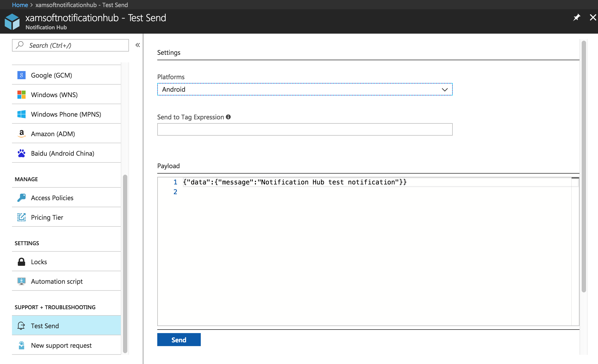

# Tutorial: Push notifications to Android devices by using Azure Notification Hubs and Google Cloud Messaging (deprecated)

[!INCLUDE [notification-hubs-selector-get-started](../../includes/notification-hubs-selector-get-started.md)]

> [!WARNING]
> As of April 10, 2018, Google has deprecated Google Cloud Messaging (GCM). The GCM server and client APIs are deprecated and will be removed as soon as May 29, 2019. For more information, see [GCM and FCM Frequently Asked Questions](https://developers.google.com/cloud-messaging/faq).

## Overview

This tutorial shows you how to use Azure Notification Hubs to send push notifications to an Android application.
You create a blank Android app that receives push notifications by using Google Cloud Messaging (GCM).

> [!IMPORTANT]
> The Google Cloud Messaging (GCM) is deprecated and will be removed [soon](https://developers.google.com/cloud-messaging/faq).

> [!IMPORTANT]
> This topic demonstrates push notifications with Google Cloud Messaging (GCM). If you are using Google's Firebase Cloud Messaging (FCM), see [Sending push notifications to Android with Azure Notification Hubs and FCM](notification-hubs-android-push-notification-google-fcm-get-started.md).

The completed code for this tutorial can be downloaded from GitHub [here](https://github.com/Azure/azure-notificationhubs-samples/tree/master/Android/GetStarted).

In this tutorial, you do the following actions:

> [!div class="checklist"]
> * Create a project that supports Google Cloud Messaging.
> * Create a notification hub
> * Connect your app to the notification hub
> * Test the app

## Prerequisites

* **Azure subscription**. If you don't have an Azure subscription, [create a free Azure account](https://azure.microsoft.com/free/) before you begin.
* [Android Studio](https://go.microsoft.com/fwlink/?LinkId=389797).

## Creating a project that supports Google Cloud Messaging

[!INCLUDE [mobile-services-enable-Google-cloud-messaging](../../includes/mobile-services-enable-google-cloud-messaging.md)]

## Create a notification hub

[!INCLUDE [notification-hubs-portal-create-new-hub](../../includes/notification-hubs-portal-create-new-hub.md)]

### Configure GCM setting for the notification hub

1. Select **Google (GCM)** in **NOTIFICATION SETTINGS**.
2. Enter **API Key** you got from the Google Cloud Console.
3. Select **Save** on the toolbar.

    

Your notification hub is now configured to work with GCM, and you have the connection strings to both register your app to receive and send push notifications.

## <a id="connecting-app"></a>Connect your app to the notification hub

### Create a new Android project

1. In Android Studio, start a new Android Studio project.

   ![Android Studio - new project][13]
2. Choose the **Phone and Tablet** form factor and the **Minimum SDK** that you want to support. Then click **Next**.

   ![Android Studio - project creation workflow][14]
3. Choose **Empty Activity** for the main activity, click **Next**, and then click **Finish**.

### Add Google Play services to the project

[!INCLUDE [Add Play Services](../../includes/notification-hubs-android-studio-add-google-play-services.md)]

### Adding Azure Notification Hubs libraries

1. In the `Build.Gradle` file for the **app**, add the following lines in the **dependencies** section.

    ```gradle
    implementation 'com.microsoft.azure:notification-hubs-android-sdk:0.6@aar'
    implementation 'com.microsoft.azure:azure-notifications-handler:1.0.1@aar'
    ```
2. Add the following repository after the **dependencies** section.

    ```gradle
    repositories {
        maven {
            url "https://dl.bintray.com/microsoftazuremobile/SDK"
        }
    }
    ```

### Updating the project's AndroidManifest.xml

1. To support GCM, implement an Instance ID listener service in the code that is used to [obtain registration tokens](https://developers.google.com/cloud-messaging/) using [Google's Instance ID API](https://developers.google.com/instance-id/). In this tutorial, the name of the class is `MyInstanceIDService`.

    Add the following service definition to the AndroidManifest.xml file, inside the `<application>` tag. Replace the `<your package>` placeholder with your actual package name shown at the top of the `AndroidManifest.xml` file.
  
    ```xml
    <service android:name="<your package>.MyInstanceIDService" android:exported="false">
        <intent-filter>
            <action android:name="com.google.android.gms.iid.InstanceID"/>
        </intent-filter>
    </service>
    ```
2. Once the application receives the GCM registration token from the Instance ID API, it uses the token to [register with the Azure Notification Hub](notification-hubs-push-notification-registration-management.md). The registration in the background is done using an `IntentService` named `RegistrationIntentService`. This service is responsible for [refreshing the GCM registration token](https://developers.google.com/instance-id/guides/android-implementation#refresh_tokens).

    Add the following service definition to the AndroidManifest.xml file, inside the `<application>` tag. Replace the `<your package>` placeholder with your actual package name shown at the top of the `AndroidManifest.xml` file.

    ```xml
    <service
        android:name="<your package>.RegistrationIntentService"
        android:exported="false">
    </service>
    ```
3. Define a receiver to receive notifications. Add the following receiver definition to the AndroidManifest.xml file, inside the `<application>` tag. Replace the `<your package>` placeholder with your actual package name shown at the top of the `AndroidManifest.xml` file.

    ```xml
    <receiver android:name="com.microsoft.windowsazure.notifications.NotificationsBroadcastReceiver"
        android:permission="com.google.android.c2dm.permission.SEND">
        <intent-filter>
            <action android:name="com.google.android.c2dm.intent.RECEIVE" />
            <category android:name="<your package name>" />
        </intent-filter>
    </receiver>
    ```
4. Add the following necessary GCM permissions below the  `</application>` tag. Replace `<your package>` with the package name shown at the top of the `AndroidManifest.xml` file.

    For more information on these permissions, see [Setup a GCM Client app for Android](https://developers.google.com/cloud-messaging/).

    ```xml
    <uses-permission android:name="android.permission.INTERNET"/>
    <uses-permission android:name="android.permission.GET_ACCOUNTS"/>
    <uses-permission android:name="android.permission.WAKE_LOCK"/>
    <uses-permission android:name="com.google.android.c2dm.permission.RECEIVE" />

    <permission android:name="<your package>.permission.C2D_MESSAGE" android:protectionLevel="signature" />
    <uses-permission android:name="<your package>.permission.C2D_MESSAGE"/>
    ```

### Adding code

1. In the Project View, expand **app** > **src** > **main** > **java**. Right-click your package folder under **java**, click **New**, and then click **Java Class**. Add a new class named `NotificationSettings`.

    ![Android Studio - new Java class][6]

    Update the three placeholders in the following code for the `NotificationSettings` class:

   * `SenderId`: The project number you obtained earlier in the [Google Cloud Console](https://cloud.google.com/console).
   * `HubListenConnectionString`: The `DefaultListenAccessSignature` connection string for your hub. You can copy that connection string by clicking **Access Policies** on the **Settings** page of your hub on the [Azure portal].
   * `HubName`: Use the name of your notification hub that appears in the hub page in the [Azure portal].

     `NotificationSettings` code:

     ```java
     public class NotificationSettings {
        public static String SenderId = "<Your project number>";
        public static String HubName = "<Your HubName>";
        public static String HubListenConnectionString = "<Your default listen connection string>";
     }
     ```
2. Add another new class named `MyInstanceIDService`. This class is the Instance ID listener service implementation.

    The code for this class calls `IntentService` to [refresh the GCM token](https://developers.google.com/instance-id/guides/android-implementation#refresh_tokens) in the background.

    ```java
    import android.content.Intent;
    import android.util.Log;
    import com.google.android.gms.iid.InstanceIDListenerService;

    public class MyInstanceIDService extends InstanceIDListenerService {

        private static final String TAG = "MyInstanceIDService";

        @Override
        public void onTokenRefresh() {

            Log.i(TAG, "Refreshing GCM Registration Token");

            Intent intent = new Intent(this, RegistrationIntentService.class);
            startService(intent);
        }
    };
    ```
3. Add another new class to your project named, `RegistrationIntentService`. This class implements `IntentService` that handles [refreshing the GCM token](https://developers.google.com/instance-id/guides/android-implementation#refresh_tokens) and [registering with the notification hub](notification-hubs-push-notification-registration-management.md).

    Use the following code for this class.

    ```java
    import android.app.IntentService;
    import android.content.Intent;
    import android.content.SharedPreferences;
    import android.preference.PreferenceManager;
    import android.util.Log;

    import com.google.android.gms.gcm.GoogleCloudMessaging;
    import com.google.android.gms.iid.InstanceID;
    import com.microsoft.windowsazure.messaging.NotificationHub;

    public class RegistrationIntentService extends IntentService {

        private static final String TAG = "RegIntentService";

        private NotificationHub hub;

        public RegistrationIntentService() {
            super(TAG);
        }

        @Override
        protected void onHandleIntent(Intent intent) {
            SharedPreferences sharedPreferences = PreferenceManager.getDefaultSharedPreferences(this);
            String resultString = null;
            String regID = null;

            try {
                InstanceID instanceID = InstanceID.getInstance(this);
                String token = instanceID.getToken(NotificationSettings.SenderId,
                        GoogleCloudMessaging.INSTANCE_ID_SCOPE);
                Log.i(TAG, "Got GCM Registration Token: " + token);

                // Storing the registration id that indicates whether the generated token has been
                // sent to your server. If it is not stored, send the token to your server,
                // otherwise your server should have already received the token.
                if ((regID=sharedPreferences.getString("registrationID", null)) == null) {
                    NotificationHub hub = new NotificationHub(NotificationSettings.HubName,
                            NotificationSettings.HubListenConnectionString, this);
                    Log.i(TAG, "Attempting to register with NH using token : " + token);

                    regID = hub.register(token).getRegistrationId();

                    // If you want to use tags...
                    // Refer to : https://azure.microsoft.com/documentation/articles/notification-hubs-routing-tag-expressions/
                    // regID = hub.register(token, "tag1", "tag2").getRegistrationId();

                    resultString = "Registered Successfully - RegId : " + regID;
                    Log.i(TAG, resultString);
                    sharedPreferences.edit().putString("registrationID", regID ).apply();
                } else {
                    resultString = "Previously Registered Successfully - RegId : " + regID;
                }
            } catch (Exception e) {
                Log.e(TAG, resultString="Failed to complete token refresh", e);
                // If an exception happens while fetching the new token or updating the registration data
                // on a third-party server, this ensures that we'll attempt the update at a later time.
            }

            // Notify UI that registration has completed.
            if (MainActivity.isVisible) {
                MainActivity.mainActivity.ToastNotify(resultString);
            }
        }
    }
    ```
4. In your `MainActivity` class, add the following `import` statements at the beginning of the class.

    ```java
    import com.google.android.gms.common.ConnectionResult;
    import com.google.android.gms.common.GoogleApiAvailability;
    import com.google.android.gms.gcm.*;
    import com.microsoft.windowsazure.notifications.NotificationsManager;
    import android.util.Log;
    import android.widget.TextView;
    import android.widget.Toast;
    import android.content.Intent;
    ```
5. Add the following private members at the top of the class. This code [checks the availability of Google Play Services as recommended by Google](https://developers.google.com/android/guides/setup#ensure_devices_have_the_google_play_services_apk).

    ```java
    public static MainActivity mainActivity;
    public static Boolean isVisible = false;
    private GoogleCloudMessaging gcm;
    private static final int PLAY_SERVICES_RESOLUTION_REQUEST = 9000;
    private static final String TAG = "MainActivity";
    ```
6. In your `MainActivity` class, add the following method to the availability of Google Play Services.

    ```java
    /**
        * Check the device to make sure it has the Google Play Services APK. If
        * it doesn't, display a dialog that allows users to download the APK from
        * the Google Play Store or enable it in the device's system settings.
        */
    private boolean checkPlayServices() {
        GoogleApiAvailability apiAvailability = GoogleApiAvailability.getInstance();
        int resultCode = apiAvailability.isGooglePlayServicesAvailable(this);
        if (resultCode != ConnectionResult.SUCCESS) {
            if (apiAvailability.isUserResolvableError(resultCode)) {
                apiAvailability.getErrorDialog(this, resultCode, PLAY_SERVICES_RESOLUTION_REQUEST)
                        .show();
            } else {
                Log.i(TAG, "This device is not supported by Google Play Services.");
                ToastNotify("This device is not supported by Google Play Services.");
                finish();
            }
            return false;
        }
        return true;
    }
    ```
7. In your `MainActivity` class, add the following code that checks for Google Play Services before calling your `IntentService` to get your GCM registration token and register with your notification hub.

    ```java
    public void registerWithNotificationHubs()
    {
        Log.i(TAG, " Registering with Notification Hubs");

        if (checkPlayServices()) {
            // Start IntentService to register this application with GCM.
            Intent intent = new Intent(this, RegistrationIntentService.class);
            startService(intent);
        }
    }
    ```
8. In the `OnCreate` method of the `MainActivity` class, add the following code to start the registration process when activity is created.

    ```java
    @Override
    protected void onCreate(Bundle savedInstanceState) {
        super.onCreate(savedInstanceState);
        setContentView(R.layout.activity_main);

        mainActivity = this;
        NotificationsManager.handleNotifications(this, NotificationSettings.SenderId, MyHandler.class);
        registerWithNotificationHubs();
    }
    ```
9. Add these additional methods to the `MainActivity` to verify app state and report status in your app.

    ```java
    @Override
    protected void onStart() {
        super.onStart();
        isVisible = true;
    }

    @Override
    protected void onPause() {
        super.onPause();
        isVisible = false;
    }

    @Override
    protected void onResume() {
        super.onResume();
        isVisible = true;
    }

    @Override
    protected void onStop() {
        super.onStop();
        isVisible = false;
    }

    public void ToastNotify(final String notificationMessage) {
        runOnUiThread(new Runnable() {
            @Override
            public void run() {
                Toast.makeText(MainActivity.this, notificationMessage, Toast.LENGTH_LONG).show();
                TextView helloText = (TextView) findViewById(R.id.text_hello);
                helloText.setText(notificationMessage);
            }
        });
    }
    ```
10. The `ToastNotify` method uses the *"Hello World"* `TextView` control to report status and notifications persistently in the app. In your activity_main.xml layout, add the following ID for that control.

    ```xml
    android:id="@+id/text_hello"
    ```
11. Add a subclass for the receiver that's defined in the AndroidManifest.xml. Add another new class to your project named `MyHandler`.
12. Add the following import statements at the top of `MyHandler.java`:

    ```java
    import android.app.NotificationManager;
    import android.app.PendingIntent;
    import android.content.Context;
    import android.content.Intent;
    import android.os.Bundle;
    import android.support.v4.app.NotificationCompat;
    import com.microsoft.windowsazure.notifications.NotificationsHandler;
    import android.net.Uri;
    import android.media.RingtoneManager;
    ```
13. Add the following code for the `MyHandler` class making it a subclass of `com.microsoft.windowsazure.notifications.NotificationsHandler`.

    This code overrides the `OnReceive` method, so the handler reports notifications that are received. The handler also sends the push notification to the Android notification manager by using the `sendNotification()` method. The `sendNotification()` method should be executed when the app is not running and a notification is received.

    ```java
    public class MyHandler extends NotificationsHandler {
        public static final int NOTIFICATION_ID = 1;
        private NotificationManager mNotificationManager;
        NotificationCompat.Builder builder;
        Context ctx;

        @Override
        public void onReceive(Context context, Bundle bundle) {
            ctx = context;
            String nhMessage = bundle.getString("message");
            sendNotification(nhMessage);
            if (MainActivity.isVisible) {
                MainActivity.mainActivity.ToastNotify(nhMessage);
            }
        }

        private void sendNotification(String msg) {

            Intent intent = new Intent(ctx, MainActivity.class);
            intent.addFlags(Intent.FLAG_ACTIVITY_CLEAR_TOP);

            mNotificationManager = (NotificationManager)
                    ctx.getSystemService(Context.NOTIFICATION_SERVICE);

            PendingIntent contentIntent = PendingIntent.getActivity(ctx, 0,
                    intent, PendingIntent.FLAG_ONE_SHOT);

            Uri defaultSoundUri = RingtoneManager.getDefaultUri(RingtoneManager.TYPE_NOTIFICATION);
            NotificationCompat.Builder mBuilder =
                    new NotificationCompat.Builder(ctx)
                            .setSmallIcon(R.mipmap.ic_launcher)
                            .setContentTitle("Notification Hub Demo")
                            .setStyle(new NotificationCompat.BigTextStyle()
                                    .bigText(msg))
                            .setSound(defaultSoundUri)
                            .setContentText(msg);

            mBuilder.setContentIntent(contentIntent);
            mNotificationManager.notify(NOTIFICATION_ID, mBuilder.build());
        }
    }
    ```
14. In Android Studio on the menu bar, click **Build** > **Rebuild Project** to make sure that no errors are present in your code.

## Testing your app

### Run the mobile application

1. Run the app and notice that the registration ID is reported for a successful registration.

      ![Testing on Android - Channel registration][18]
2. Enter a notification message to be sent to all Android devices that have registered with the hub.

      ![Testing on Android - sending a message][19]

3. Press **Send Notification**. Any devices that have the app running shows an `AlertDialog` instance with the push notification message. Devices that don't have the app running but were previously registered for push notifications receive a notification in the Android Notification Manager. The notification messages can be viewed by swiping down from the upper-left corner.

      ![Testing on Android - notifications][21]

### Test send push notifications from the Azure portal

You can test receiving push notifications in your app by sending them via the [Azure portal].

1. In the **Troubleshooting** section, select **Test Send**.
2. For **Platforms**, select **Android**.
3. Select **Send** to send the test notification.
4. Confirm that you see the notification message on the Android device.

    

[!INCLUDE [notification-hubs-sending-notifications-from-the-portal](../../includes/notification-hubs-sending-notifications-from-the-portal.md)]

#### Push notifications in the emulator

If you want to test push notifications inside an emulator, make sure that your emulator image supports the Google API level that you chose for your app. If your image doesn't support native Google APIs, you end up with the **SERVICE\_NOT\_AVAILABLE** exception.

In addition, ensure that you have added your Google account to your running emulator under **Settings** > **Accounts**. Otherwise, your attempts to register with GCM may result in the **AUTHENTICATION\_FAILED** exception.

## (Optional) Send push notifications directly from the app

Normally, you would send notifications using a backend server. For some cases, you might want to be able to send push notifications directly from the client application. This section explains how to send notifications from the client using the [Azure Notification Hub REST API](https://msdn.microsoft.com/library/azure/dn223264.aspx).

1. In Android Studio Project View, expand **App** > **src** > **main** > **res** > **layout**. Open the `activity_main.xml` layout file and click the **Text** tab to update the text contents of the file. Update it with the code below, which adds new `Button` and `EditText` controls for sending push notification messages to the notification hub. Add this code at the bottom, just before `</RelativeLayout>`.

    ```xml
    <Button
    android:layout_width="wrap_content"
    android:layout_height="wrap_content"
    android:text="@string/send_button"
    android:id="@+id/sendbutton"
    android:layout_centerVertical="true"
    android:layout_centerHorizontal="true"
    android:onClick="sendNotificationButtonOnClick" />

    <EditText
    android:layout_width="match_parent"
    android:layout_height="wrap_content"
    android:id="@+id/editTextNotificationMessage"
    android:layout_above="@+id/sendbutton"
    android:layout_centerHorizontal="true"
    android:layout_marginBottom="42dp"
    android:hint="@string/notification_message_hint" />
    ```
2. In Android Studio Project View, expand **App** > **src** > **main** > **res** > **values**. Open the `strings.xml` file and add the string values that are referenced by the new `Button` and `EditText` controls. Add the following lines at the bottom of the file, just before `</resources>`.

    ```xml
    <string name="send_button">Send Notification</string>
    <string name="notification_message_hint">Enter notification message text</string>
    ```
3. In your `NotificationSetting.java` file, add the following setting to the `NotificationSettings` class.

    Update `HubFullAccess` with the **DefaultFullSharedAccessSignature** connection string for your hub. This connection string can be copied from the [Azure portal] by clicking **Access Policies** on the **Settings** page for your notification hub.

    ```java
    public static String HubFullAccess = "<Enter Your DefaultFullSharedAccess Connection string>";
    ```
4. In your `MainActivity.java` file, add the following `import` statements at the beginning of the file.

    ```java
    import java.io.BufferedOutputStream;
    import java.io.BufferedReader;
    import java.io.InputStreamReader;
    import java.io.OutputStream;
    import java.net.HttpURLConnection;
    import java.net.URL;
    import java.net.URLEncoder;
    import javax.crypto.Mac;
    import javax.crypto.spec.SecretKeySpec;
    import android.util.Base64;
    import android.view.View;
    import android.widget.EditText;
    ```
5. In your `MainActivity.java` file, add the following members at the top of the `MainActivity` class.

    ```java
    private String HubEndpoint = null;
    private String HubSasKeyName = null;
    private String HubSasKeyValue = null;
    ```
6. Create a Software Access Signature (SaS) token to authenticate a POST request to send messages to your notification hub. Parse the key data from the connection string and then creating the SaS token, as mentioned in the [Common Concepts](https://msdn.microsoft.com/library/azure/dn495627.aspx) REST API reference. The following code is an example implementation.

    In `MainActivity.java`, add the following method to the `MainActivity` class to parse your connection string.

    ```java
    /**
        * Example code from https://msdn.microsoft.com/library/azure/dn495627.aspx
        * to parse the connection string so a SaS authentication token can be
        * constructed.
        *
        * @param connectionString This must be the DefaultFullSharedAccess connection
        *                         string for this example.
        */
    private void ParseConnectionString(String connectionString)
    {
        String[] parts = connectionString.split(";");
        if (parts.length != 3)
            throw new RuntimeException("Error parsing connection string: "
                    + connectionString);

        for (int i = 0; i < parts.length; i++) {
            if (parts[i].startsWith("Endpoint")) {
                this.HubEndpoint = "https" + parts[i].substring(11);
            } else if (parts[i].startsWith("SharedAccessKeyName")) {
                this.HubSasKeyName = parts[i].substring(20);
            } else if (parts[i].startsWith("SharedAccessKey")) {
                this.HubSasKeyValue = parts[i].substring(16);
            }
        }
    }
    ```
7. In `MainActivity.java`, add the following method to the `MainActivity` class to create a SaS authentication token.

    ```java
    /**
        * Example code from https://msdn.microsoft.com/library/azure/dn495627.aspx to
        * construct a SaS token from the access key to authenticate a request.
        *
        * @param uri The unencoded resource URI string for this operation. The resource
        *            URI is the full URI of the Service Bus resource to which access is
        *            claimed. For example,
        *            "http://<namespace>.servicebus.windows.net/<hubName>"
        */
    private String generateSasToken(String uri) {

        String targetUri;
        String token = null;
        try {
            targetUri = URLEncoder
                    .encode(uri.toString().toLowerCase(), "UTF-8")
                    .toLowerCase();

            long expiresOnDate = System.currentTimeMillis();
            int expiresInMins = 60; // 1 hour
            expiresOnDate += expiresInMins * 60 * 1000;
            long expires = expiresOnDate / 1000;
            String toSign = targetUri + "\n" + expires;

            // Get an hmac_sha1 key from the raw key bytes
            byte[] keyBytes = HubSasKeyValue.getBytes("UTF-8");
            SecretKeySpec signingKey = new SecretKeySpec(keyBytes, "HmacSHA256");

            // Get an hmac_sha1 Mac instance and initialize with the signing key
            Mac mac = Mac.getInstance("HmacSHA256");
            mac.init(signingKey);

            // Compute the hmac on input data bytes
            byte[] rawHmac = mac.doFinal(toSign.getBytes("UTF-8"));

            // Using android.util.Base64 for Android Studio instead of
            // Apache commons codec
            String signature = URLEncoder.encode(
                    Base64.encodeToString(rawHmac, Base64.NO_WRAP).toString(), "UTF-8");

            // Construct authorization string
            token = "SharedAccessSignature sr=" + targetUri + "&sig="
                    + signature + "&se=" + expires + "&skn=" + HubSasKeyName;
        } catch (Exception e) {
            if (isVisible) {
                ToastNotify("Exception Generating SaS : " + e.getMessage().toString());
            }
        }

        return token;
    }
    ```
8. In `MainActivity.java`, add the following method to the `MainActivity` class to handle the **Send Notification** button click and send the push notification message to the hub by using the built-in REST API.

    ```java
    /**
        * Send Notification button click handler. This method parses the
        * DefaultFullSharedAccess connection string and generates a SaS token. The
        * token is added to the Authorization header on the POST request to the
        * notification hub. The text in the editTextNotificationMessage control
        * is added as the JSON body for the request to add a GCM message to the hub.
        *
        * @param v
        */
    public void sendNotificationButtonOnClick(View v) {
        EditText notificationText = (EditText) findViewById(R.id.editTextNotificationMessage);
        final String json = "{\"data\":{\"message\":\"" + notificationText.getText().toString() + "\"}}";

        new Thread()
        {
            public void run()
            {
                try
                {
                    // Based on reference documentation...
                    // https://msdn.microsoft.com/library/azure/dn223273.aspx
                    ParseConnectionString(NotificationSettings.HubFullAccess);
                    URL url = new URL(HubEndpoint + NotificationSettings.HubName +
                            "/messages/?api-version=2015-01");

                    HttpURLConnection urlConnection = (HttpURLConnection)url.openConnection();

                    try {
                        // POST request
                        urlConnection.setDoOutput(true);

                        // Authenticate the POST request with the SaS token
                        urlConnection.setRequestProperty("Authorization",
                            generateSasToken(url.toString()));

                        // Notification format should be GCM
                        urlConnection.setRequestProperty("ServiceBusNotification-Format", "gcm");

                        // Include any tags
                        // Example below targets 3 specific tags
                        // Refer to : https://azure.microsoft.com/documentation/articles/notification-hubs-routing-tag-expressions/
                        // urlConnection.setRequestProperty("ServiceBusNotification-Tags",
                        //        "tag1 || tag2 || tag3");

                        // Send notification message
                        urlConnection.setFixedLengthStreamingMode(json.length());
                        OutputStream bodyStream = new BufferedOutputStream(urlConnection.getOutputStream());
                        bodyStream.write(json.getBytes());
                        bodyStream.close();

                        // Get response
                        urlConnection.connect();
                        int responseCode = urlConnection.getResponseCode();
                        if ((responseCode != 200) && (responseCode != 201)) {
                            BufferedReader br = new BufferedReader(new InputStreamReader((urlConnection.getErrorStream())));
                            String line;
                            StringBuilder builder = new StringBuilder("Send Notification returned " +
                                    responseCode + " : ")  ;
                            while ((line = br.readLine()) != null) {
                                builder.append(line);
                            }

                            ToastNotify(builder.toString());
                        }
                    } finally {
                        urlConnection.disconnect();
                    }
                }
                catch(Exception e)
                {
                    if (isVisible) {
                        ToastNotify("Exception Sending Notification : " + e.getMessage().toString());
                    }
                }
            }
        }.start();
    }
    ```

## Next steps

In this tutorial, you sent broadcast notifications to all your Android devices registered with the backend. To learn how to push notifications to specific Android devices, advance to the following tutorial:  

 > [!div class="nextstepaction"]
 > [Push notifications to specific devices](notification-hubs-aspnet-backend-android-xplat-segmented-gcm-push-notification.md)

<!-- Images. -->
[6]: ./media/notification-hubs-android-get-started/notification-hub-android-new-class.png
[12]: ./media/notification-hubs-android-get-started/notification-hub-connection-strings.png
[13]: ./media/notification-hubs-android-get-started/notification-hubs-android-studio-new-project.png
[14]: ./media/notification-hubs-android-get-started/notification-hubs-android-studio-choose-form-factor.png
[15]: ./media/notification-hubs-android-get-started/notification-hub-create-android-app4.png
[16]: ./media/notification-hubs-android-get-started/notification-hub-create-android-app5.png
[17]: ./media/notification-hubs-android-get-started/notification-hub-create-android-app6.png
[18]: ./media/notification-hubs-android-get-started/notification-hubs-android-studio-registered.png
[19]: ./media/notification-hubs-android-get-started/notification-hubs-android-studio-set-message.png
[20]: ./media/notification-hubs-android-get-started/notification-hub-create-console-app.png
[21]: ./media/notification-hubs-android-get-started/notification-hubs-android-studio-received-message.png
[22]: ./media/notification-hubs-android-get-started/notification-hub-scheduler1.png
[23]: ./media/notification-hubs-android-get-started/notification-hub-scheduler2.png
[29]: ./media/mobile-services-android-get-started-push/mobile-eclipse-import-Play-library.png
[30]: ./media/notification-hubs-android-get-started/notification-hubs-debug-hub-gcm.png
[31]: ./media/notification-hubs-android-get-started/notification-hubs-android-studio-add-ui.png

<!-- URLs. -->
[Get started with push notifications in Mobile Services]: ../mobile-services-javascript-backend-android-get-started-push.md 
[Mobile Services Android SDK]: https://go.microsoft.com/fwLink/?LinkID=280126&clcid=0x409
[Referencing a library project]: https://go.microsoft.com/fwlink/?LinkId=389800
[Notification Hubs Guidance]: https://msdn.microsoft.com/library/jj927170.aspx
[Use Notification Hubs to push notifications to users]: notification-hubs-aspnet-backend-gcm-android-push-to-user-google-notification.md
[Use Notification Hubs to send breaking news]: notification-hubs-aspnet-backend-android-xplat-segmented-gcm-push-notification.md
[Azure portal]: https://portal.azure.com
