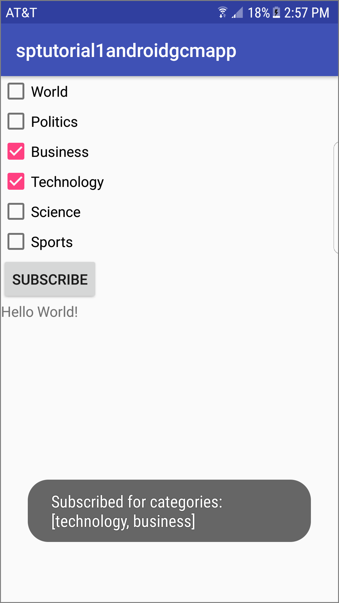
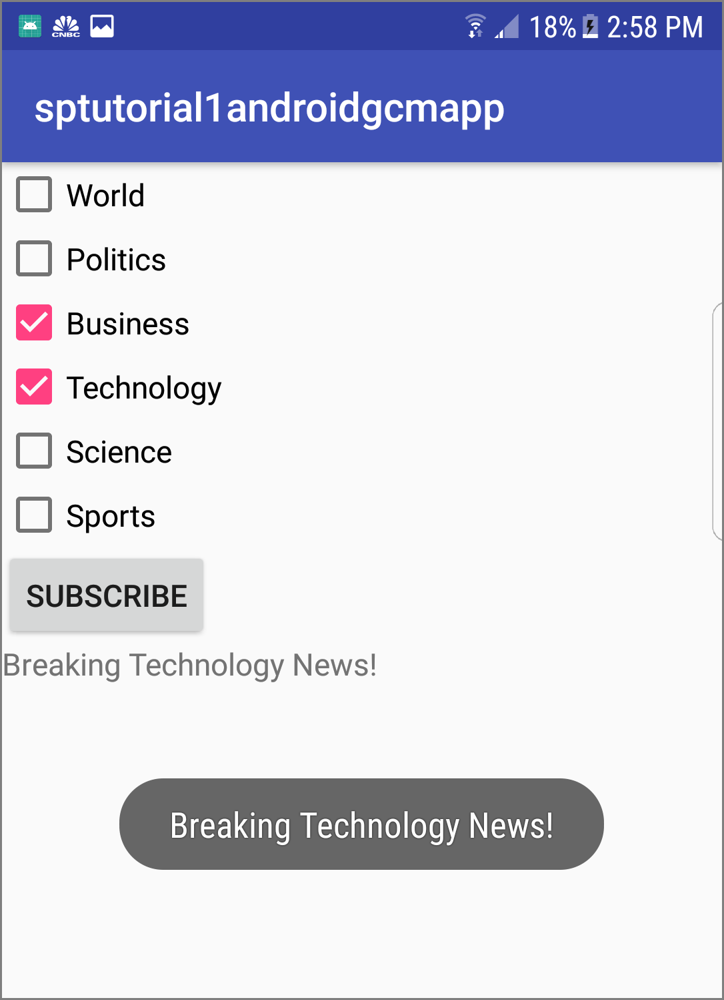

# Tutorial: Push notifications to specific Android devices using Azure Notification Hubs and Google Cloud Messaging
[!INCLUDE [notification-hubs-selector-breaking-news](../../includes/notification-hubs-selector-breaking-news.md)]

## Overview
This tutorial shows you how to use Azure Notification Hubs to broadcast breaking news notifications to an Android app. When complete, you will be able to register for breaking news categories you are interested in, and receive only push notifications for those categories. This scenario is a common pattern for many apps where notifications have to be sent to groups of users that have previously declared interest in them, for example, RSS reader, apps for music fans, etc.

Broadcast scenarios are enabled by including one or more *tags* when creating a registration in the notification hub. When notifications are sent to a tag, all devices that have registered for the tag will receive the notification. Because tags are simply strings, they do not have to be provisioned in advance. For more information about tags, see [Notification Hubs Routing and Tag Expressions](notification-hubs-tags-segment-push-message.md).

In this tutorial, you do the following actions: 

> [!div class="checklist"]
> * Add category selection to the mobile app.
> * Registerd for notifications with tags. 
> * Send tagged notifications. 
> * Test the app

## Prerequisites
This tutorial builds on the app you created in [Tutorial: Push notifications to Android devices by using Azure Notification Hubs and Google Cloud Messaging][get-started]. Before starting this tutorial, complete the [Tutorial: Push notifications to Android devices by using Azure Notification Hubs and Google Cloud Messaging][get-started].

## Add category selection to the app
The first step is to add the UI elements to your existing main activity that enable the user to select categories to register. The categories selected by a user are stored on the device. When the app starts, a device registration is created in your notification hub with the selected categories as tags.

1. Open your res/layout/activity_main.xml file, and substitute the content with the following content:
   
    ```xml
    <LinearLayout xmlns:android="http://schemas.android.com/apk/res/android"
        xmlns:tools="http://schemas.android.com/tools"
        android:layout_width="match_parent"
        android:layout_height="match_parent"
        tools:context="com.example.breakingnews.MainActivity"
        android:orientation="vertical">

            <CheckBox
                android:id="@+id/worldBox"
                android:layout_width="wrap_content"
                android:layout_height="wrap_content"
                android:text="@string/label_world" />
            <CheckBox
                android:id="@+id/politicsBox"
                android:layout_width="wrap_content"
                android:layout_height="wrap_content"
                android:text="@string/label_politics" />
            <CheckBox
                android:id="@+id/businessBox"
                android:layout_width="wrap_content"
                android:layout_height="wrap_content"
                android:text="@string/label_business" />
            <CheckBox
                android:id="@+id/technologyBox"
                android:layout_width="wrap_content"
                android:layout_height="wrap_content"
                android:text="@string/label_technology" />
            <CheckBox
                android:id="@+id/scienceBox"
                android:layout_width="wrap_content"
                android:layout_height="wrap_content"
                android:text="@string/label_science" />
            <CheckBox
                android:id="@+id/sportsBox"
                android:layout_width="wrap_content"
                android:layout_height="wrap_content"
                android:text="@string/label_sports" />
            <Button
                android:layout_width="wrap_content"
                android:layout_height="wrap_content"
                android:onClick="subscribe"
                android:text="@string/button_subscribe" />
            <TextView
                android:layout_width="wrap_content"
                android:layout_height="wrap_content"
                android:text="Hello World!"
                android:id="@+id/text_hello"
            />
    </LinearLayout>
    ```
2. Open your res/values/strings.xml file and add the following lines:

    ```xml
    <string name="button_subscribe">Subscribe</string>
    <string name="label_world">World</string>
    <string name="label_politics">Politics</string>
    <string name="label_business">Business</string>
    <string name="label_technology">Technology</string>
    <string name="label_science">Science</string>
    <string name="label_sports">Sports</string>
    ```

    Your main_activity.xml graphical layout should look like in the following image:
   
    ![][A1]
3. Create a class `Notifications` in the same package as your **MainActivity** class.

    ```java   
    import java.util.HashSet;
    import java.util.Set;

    import android.content.Context;
    import android.content.SharedPreferences;
    import android.os.AsyncTask;
    import android.util.Log;
    import android.widget.Toast;
    import android.view.View;

    import com.google.android.gms.gcm.GoogleCloudMessaging;
    import com.microsoft.windowsazure.messaging.NotificationHub;

    public class Notifications {
        private static final String PREFS_NAME = "BreakingNewsCategories";
        private GoogleCloudMessaging gcm;
        private NotificationHub hub;
        private Context context;
        private String senderId;

        public Notifications(Context context, String senderId, String hubName, 
                                String listenConnectionString) {
            this.context = context;
            this.senderId = senderId;

            gcm = GoogleCloudMessaging.getInstance(context);
            hub = new NotificationHub(hubName, listenConnectionString, context);
        }

        public void storeCategoriesAndSubscribe(Set<String> categories)
        {
            SharedPreferences settings = context.getSharedPreferences(PREFS_NAME, 0);
            settings.edit().putStringSet("categories", categories).commit();
            subscribeToCategories(categories);
        }

        public Set<String> retrieveCategories() {
            SharedPreferences settings = context.getSharedPreferences(PREFS_NAME, 0);
            return settings.getStringSet("categories", new HashSet<String>());
        }

        public void subscribeToCategories(final Set<String> categories) {
            new AsyncTask<Object, Object, Object>() {
                @Override
                protected Object doInBackground(Object... params) {
                    try {
                        String regid = gcm.register(senderId);

                        String templateBodyGCM = "{\"data\":{\"message\":\"$(messageParam)\"}}";

                        hub.registerTemplate(regid,"simpleGCMTemplate", templateBodyGCM, 
                            categories.toArray(new String[categories.size()]));
                    } catch (Exception e) {
                        Log.e("MainActivity", "Failed to register - " + e.getMessage());
                        return e;
                    }
                    return null;
                }

                protected void onPostExecute(Object result) {
                    String message = "Subscribed for categories: "
                            + categories.toString();
                    Toast.makeText(context, message,
                            Toast.LENGTH_LONG).show();
                }
            }.execute(null, null, null);
        }

    }
    ```
       
    This class uses the local storage to store the categories of news that this device has to receive. It also contains methods to register for these categories.
4. In your **MainActivity** class remove your private fields for **NotificationHub** and **GoogleCloudMessaging**, and add a field for **Notifications**:

    ```java   
    // private GoogleCloudMessaging gcm;
    // private NotificationHub hub;
    private Notifications notifications;
    ```
5. Then, in the **onCreate** method, remove the initialization of the **hub** field and the **registerWithNotificationHubs** method. Then add the following lines, which initialize an instance of the **Notifications** class. 

    ```java
    protected void onCreate(Bundle savedInstanceState) {
        super.onCreate(savedInstanceState);
        setContentView(R.layout.activity_main);
        mainActivity = this;

        NotificationsManager.handleNotifications(this, NotificationSettings.SenderId,
                MyHandler.class);

        notifications = new Notifications(this, NotificationSettings.SenderId, NotificationSettings.HubName, NotificationSettings.HubListenConnectionString);

        notifications.subscribeToCategories(notifications.retrieveCategories());
    }
    ```

    Confirm that the hub name and the connection string are set properly in the NotificationSettings class.

    > [AZURE.NOTE] Because credentials that are distributed with a client app are not generally secure, you should only distribute the key for listen access with your client app. Listen access enables your app to register for notifications, but existing registrations cannot be modified and notifications cannot be sent. The full access key is used in a secured backend service for sending notifications and changing existing registrations.
1. Then, add the following imports:

    ```java   
    import android.widget.CheckBox;
    import java.util.HashSet;
    import java.util.Set;
    ```
1. Add the following `subscribe` method to handle the subscribe button click event:        
   
    ```java
    public void subscribe(View sender) {
        final Set<String> categories = new HashSet<String>();

        CheckBox world = (CheckBox) findViewById(R.id.worldBox);
        if (world.isChecked())
            categories.add("world");
        CheckBox politics = (CheckBox) findViewById(R.id.politicsBox);
        if (politics.isChecked())
            categories.add("politics");
        CheckBox business = (CheckBox) findViewById(R.id.businessBox);
        if (business.isChecked())
            categories.add("business");
        CheckBox technology = (CheckBox) findViewById(R.id.technologyBox);
        if (technology.isChecked())
            categories.add("technology");
        CheckBox science = (CheckBox) findViewById(R.id.scienceBox);
        if (science.isChecked())
            categories.add("science");
        CheckBox sports = (CheckBox) findViewById(R.id.sportsBox);
        if (sports.isChecked())
            categories.add("sports");

        notifications.storeCategoriesAndSubscribe(categories);
    }
    ```
       
    This method creates a list of categories and uses the **Notifications** class to store the list in the local storage and register the corresponding tags with your notification hub. When categories are changed, the registration is recreated with the new categories.

Your app is now able to store a set of categories in local storage on the device and register with the notification hub whenever the user changes the selection of categories.

## Register for notifications
These steps register with the notification hub on startup using the categories that have been stored in local storage.

> [!NOTE]
> Because the registrationId assigned by Google Cloud Messaging (GCM) can change at any time, you should register for notifications frequently to avoid notification failures. This example registers for notification every time that the app starts. For apps that are run frequently, more than once a day, you can probably skip registration to preserve bandwidth if less than a day has passed since the previous registration.
> 
> 

1. Add the following code at the end of the **onCreate** method in the **MainActivity** class:
   
    ```java
    notifications.subscribeToCategories(notifications.retrieveCategories());
    ```
   
    This code makes sure that every time the app starts it retrieves the categories from local storage and requests a registration for these categories. 
2. Then update the `onStart()` method of the `MainActivity` class as follows:
   
    ```java
    @Override
    protected void onStart() {
   
        super.onStart();
        isVisible = true;
   
        Set<String> categories = notifications.retrieveCategories();
   
        CheckBox world = (CheckBox) findViewById(R.id.worldBox);
        world.setChecked(categories.contains("world"));
        CheckBox politics = (CheckBox) findViewById(R.id.politicsBox);
        politics.setChecked(categories.contains("politics"));
        CheckBox business = (CheckBox) findViewById(R.id.businessBox);
        business.setChecked(categories.contains("business"));
        CheckBox technology = (CheckBox) findViewById(R.id.technologyBox);
        technology.setChecked(categories.contains("technology"));
        CheckBox science = (CheckBox) findViewById(R.id.scienceBox);
        science.setChecked(categories.contains("science"));
        CheckBox sports = (CheckBox) findViewById(R.id.sportsBox);
        sports.setChecked(categories.contains("sports"));
    }
    ```
   
    This code updates the main activity based on the status of previously saved categories.

The app is now complete and can store a set of categories in the device local storage used to register with the notification hub whenever the user changes the selection of categories. Next, define a backend that can send category notifications to this app.

## Send tagged notifications
[!INCLUDE [notification-hubs-send-categories-template](../../includes/notification-hubs-send-categories-template.md)]

## Test the app
1. In Android Studio, run the app on your Android device or emulator. The app UI provides a set of toggles that lets you choose the categories to subscribe to.
2. Enable one or more categories toggles, then click **Subscribe**. The app converts the selected categories into tags and requests a new device registration for the selected tags from the notification hub. The registered categories are returned and displayed in a toast notification.

    
1. Run the .NET console app, which sends notifications for each category. Notifications for the selected categories appear as toast notifications.

    

## Next steps
In this tutorial, you sent broadcast notifications to specific Android devices that have registered for the categories. To learn how to push notifications to specific users, advance to the following tutorial: 

> [!div class="nextstepaction"]
>[Push notifications to specific users](notification-hubs-aspnet-backend-gcm-android-push-to-user-google-notification.md)

<!-- Images. -->
[A1]: ./media/notification-hubs-aspnet-backend-android-breaking-news/android-breaking-news1.PNG

<!-- URLs.-->
[get-started]: notification-hubs-android-push-notification-google-gcm-get-started.md
[Use Notification Hubs to broadcast localized breaking news]: notification-hubs-windows-store-dotnet-xplat-localized-wns-push-notification.md
[Notify users with Notification Hubs]: notification-hubs-aspnet-backend-windows-dotnet-wns-notification.md
[Mobile Service]: /develop/mobile/tutorials/get-started/
[Notification Hubs Guidance]: http://msdn.microsoft.com/library/jj927170.aspx
[Notification Hubs How-To for Windows Store]: http://msdn.microsoft.com/library/jj927172.aspx
[Submit an app page]: http://go.microsoft.com/fwlink/p/?LinkID=266582
[My Applications]: http://go.microsoft.com/fwlink/p/?LinkId=262039
[Live SDK for Windows]: http://go.microsoft.com/fwlink/p/?LinkId=262253
[Azure portal]: https://portal.azure.com
[wns object]: http://go.microsoft.com/fwlink/p/?LinkId=260591
