# Get started with Notification Hubs using Baidu

[!INCLUDE [notification-hubs-selector-get-started](../../includes/notification-hubs-selector-get-started.md)]

> [!IMPORTANT]
> This tutorial is deprecated. 

Baidu cloud push is a Chinese cloud service that you can use to send push notifications to mobile devices.

As Google Play and FCM (Firebase Cloud Messaging) are not available in China, it is necessary to use different app stores and push services. Baidu is one of them, and the one currently used by Notification Hub.

## Prerequisites

This tutorial requires:

* Android SDK (we assume that you use Android Studio), which you can download from the [Android site](https://go.microsoft.com/fwlink/?LinkId=389797)
* [Baidu Push Android SDK]

> [!NOTE]
> To complete this tutorial, you must have an active Azure account. If you don't have an account, you can create a free trial account in just a couple of minutes. For details, see [Azure Free Trial](https://azure.microsoft.com/pricing/free-trial/?WT.mc_id=A0E0E5C02&amp;returnurl=http%3A%2F%2Fazure.microsoft.com%2Fen-us%2Fdocumentation%2Farticles%2Fnotification-hubs-baidu-get-started%2F).

## Create a Baidu account

To use Baidu, you must have a Baidu account. If you already have one, log in to the [Baidu portal] and skip to the next step. Otherwise, see the following instructions on how to create a Baidu account.  

1. Go to the [Baidu portal] and click the **登录** (**Login**) link. Click **立即注册** (**Register Now**) to start the account registration process.

    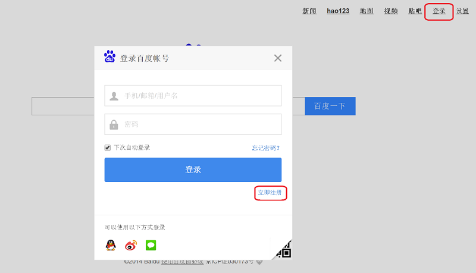

2. Enter the required details—phone/email address, password, and verification code—and click 注册 (**Signup**).

    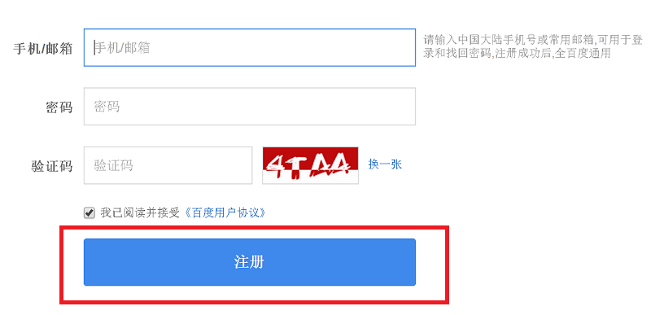

3. You are sent an email to the email address that you entered with a link to activate your Baidu account.

    

4. Log in to your email account, open the Baidu activation mail, and click the activation link to activate your Baidu account.

    

Once you have an activated Baidu account, log in to the [Baidu portal].

## Create a Baidu cloud push project

When you create a Baidu cloud push project, you receive your app ID, API key, and secret key.

1. Once you have logged in to the [Baidu portal], click **更多>>** (**more**).

    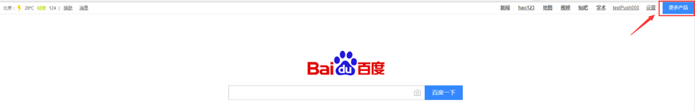

2. Scroll down in the **站长与开发者服务** (**Webmaster and Developer Services**) section and click **百度云推送** (**Baidu Cloud Push**).

    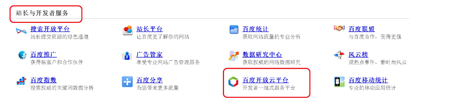

3. On the next page, click **登录** (**Login**) on the top-right corner.

    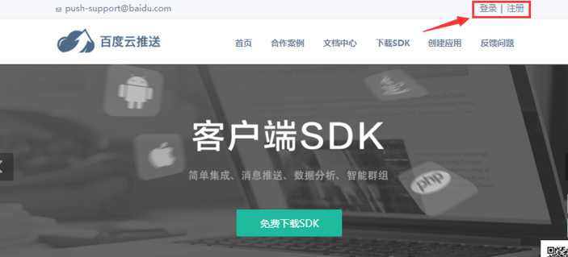

4. Then, click **创建应用** (**Create Application**) on this page.

    

5. On the next page, click 创建新应用 (**Create New Application**).

    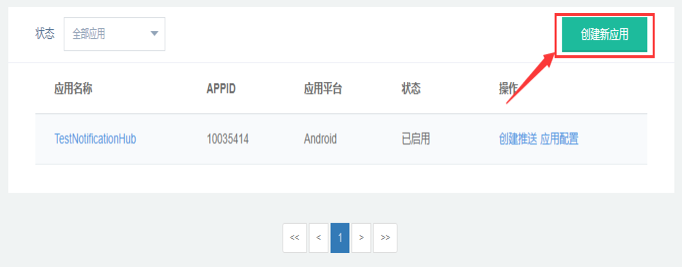

6. Enter an application name and click 创建 (**Create**).

    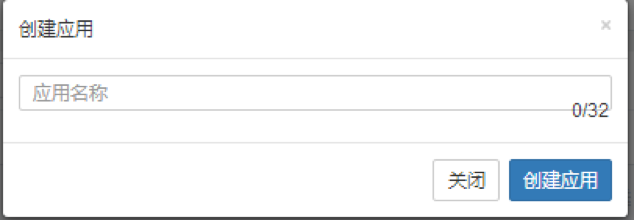

7. Upon successful creation of a Baidu cloud push project, you see a page with **AppID**, **API Key**, and **Secret Key**. Make a note of the API key and secret key, which we use later.

    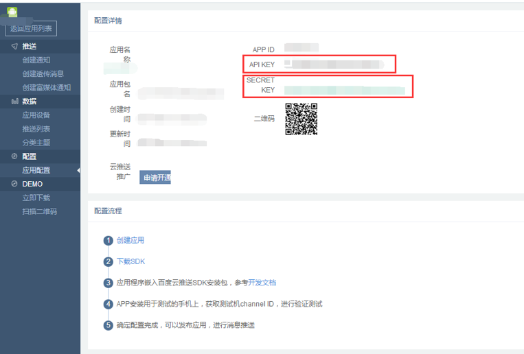

8. Configure the project for push notifications by clicking 创建通知 (**Create Notification**)  on the left pane.

    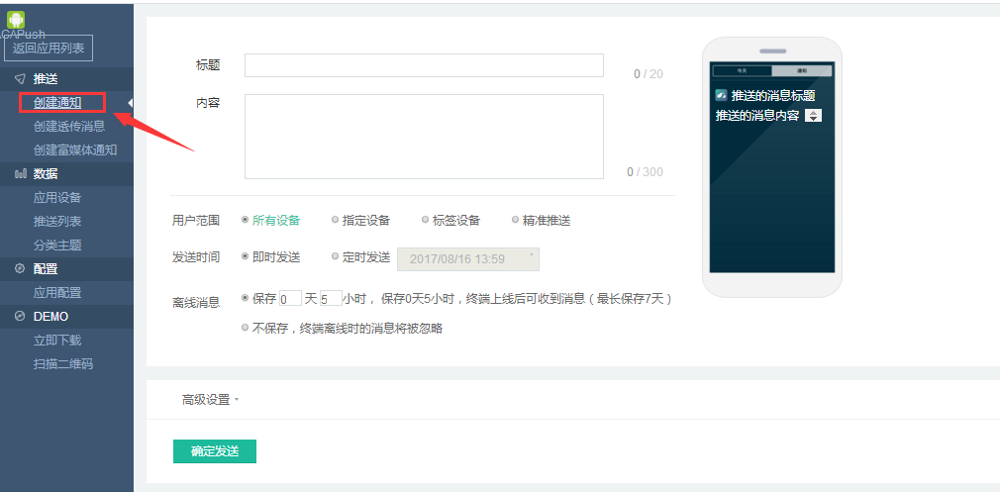

## Configure a new notification hub

[!INCLUDE [notification-hubs-portal-create-new-hub](../../includes/notification-hubs-portal-create-new-hub.md)]

&emsp;&emsp;6. In your notification hub, select **Notification Services** and then **Baidu (Android China)**.

&emsp;&emsp;&emsp;&emsp;

&emsp;&emsp;7. Scroll down to the Baidu notification settings section. Enter the API key and secret key that you obtained from the Baidu console, in the Baidu cloud push project. Then click Save.

&emsp;&emsp;&emsp;&emsp;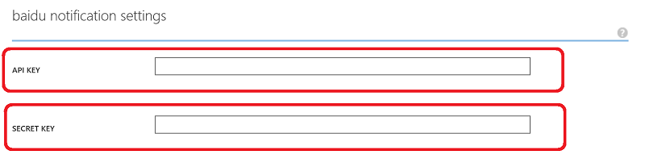

Your notification hub is now configured to work with Baidu. You also have the **connection strings** to register your app to both send and receive push notifications.

Make a note of the `DefaultListenSharedAccessSignature` and `DefaultFullSharedAccessSignature` from the Access connection information window.

## Connect your app to the notification hub

1. In Android Studio, create a new Android project (File > New > New Project).

    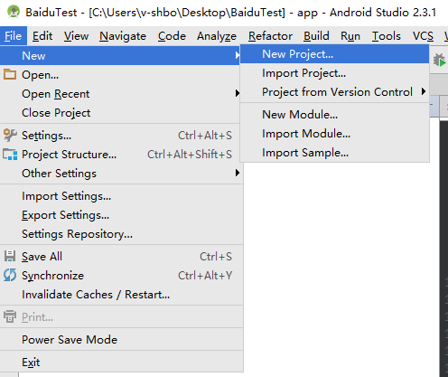

2. Enter an Application Name and ensure that the Minimum Required SDK version is set to API 16: Android 4.1. **Also please make sure your package name (应用包名) is the same as in the Baidu Cloud Push Portal**

    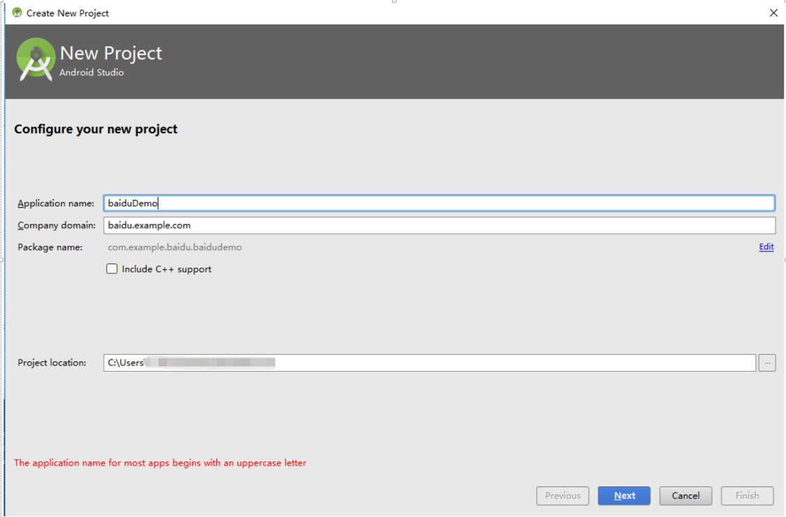
    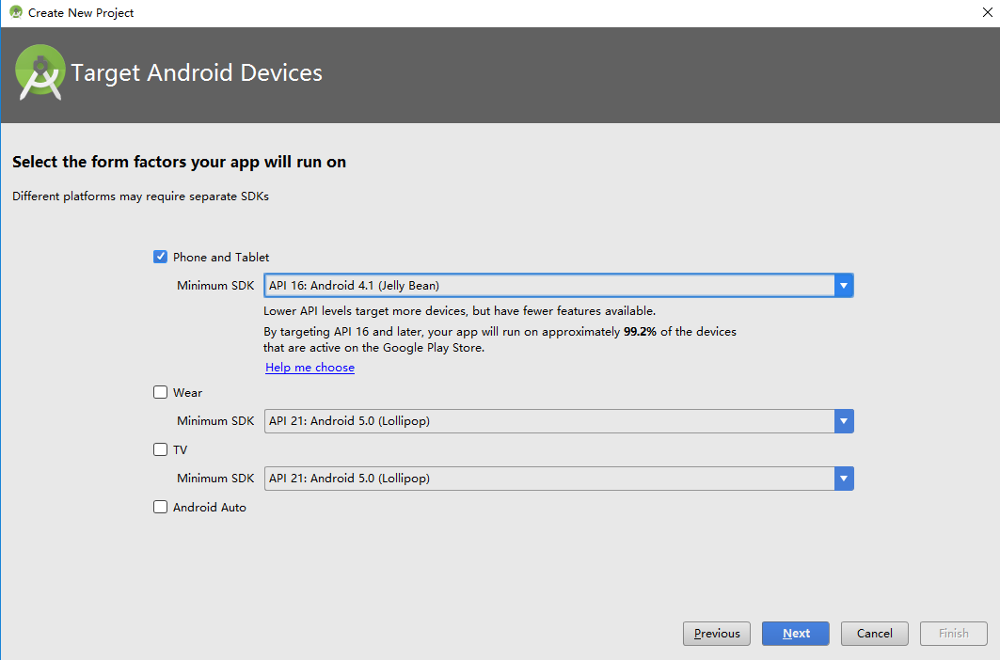

3. Click Next and continue following the wizard until the Create Activity window appears. Make sure that Empty Activity is selected, and finally select Finish to create a new Android Application.

    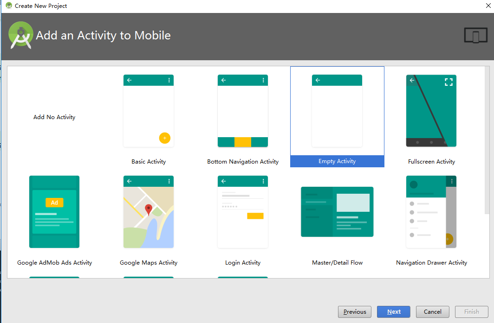

4. Make sure that the Project Build Target is set correctly.

5. Then add Azure Notification Hubs libraries. In the `Build.Gradle` file for the app, add the following lines in the dependencies section.

    ```javascript
    implementation 'com.microsoft.azure:notification-hubs-android-sdk:0.6@aar'
    implementation 'com.microsoft.azure:azure-notifications-handler:1.0.1@aar'
    ```

    Add the following repository after the dependencies section.

    ```javascript
    repositories {
        maven {
            url "https://dl.bintray.com/microsoftazuremobile/SDK"
        }
    }
    ```

    To avoid the List conflict, add the following code in the project's `Manifest.xml` file:

    ```xml
    <manifest package="YOUR.PACKAGE.NAME"
    xmlns:tools="http://schemas.android.com/tools"
    xmlns:android="http://schemas.android.com/apk/res/android">
    ```

    and in the `<application/>` tag:

    ```xml
    <application
        tools:replace="android:allowBackup,icon,theme,label">
    ```

6. Download and unzip the [Baidu Push Android SDK](https://push.baidu.com/doc/android/api). Copy the `pushservice-x.y.z jar` file in the libs folder. Then copy the `.so` files in the `src/main/jniLibs` (create a new folder) folders of your Android application.

    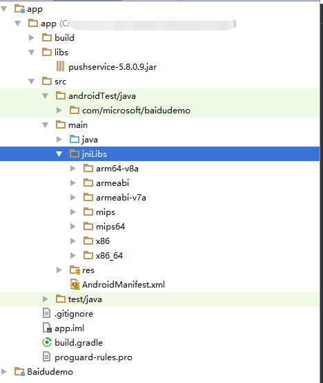

7. In the project's `libs` folder, right click on the `pushervice-x.y.z.jar` file; select **Add as Library** to including this library in the project.

    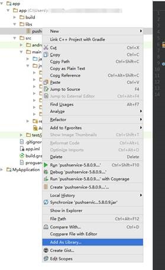

8. Open the Android project's `AndroidManifest.xml` file and add the permissions required by the Baidu SDK. **Replace `YOURPACKAGENAME` with your package name**.

    ```xml
    <uses-permission android:name="android.permission.INTERNET" />
    <uses-permission android:name="android.permission.READ_PHONE_STATE" />
    <uses-permission android:name="android.permission.ACCESS_NETWORK_STATE" />
    <uses-permission android:name="android.permission.RECEIVE_BOOT_COMPLETED" />
    <uses-permission android:name="android.permission.WRITE_SETTINGS" />
    <uses-permission android:name="android.permission.VIBRATE" />
    <uses-permission android:name="android.permission.WRITE_EXTERNAL_STORAGE" />
    <uses-permission android:name="android.permission.DISABLE_KEYGUARD" />
    <uses-permission android:name="android.permission.ACCESS_COARSE_LOCATION" />
    <uses-permission android:name="android.permission.ACCESS_WIFI_STATE" />
    <uses-permission android:name="android.permission.ACCESS_DOWNLOAD_MANAGER" />
    <uses-permission android:name="android.permission.DOWNLOAD_WITHOUT_NOTIFICATION" />
    <uses-permission android:name="android.permission.EXPAND_STATUS_BAR" />
    !! <uses-permission android:name="baidu.push.permission.WRITE_PUSHINFOPROVIDER.YOURPACKAGENAME" />
    !!<permission android:name="baidu.push.permission.WRITE_PUSHINFOPROVIDER.YOURPACKAGENAME"android:protectionLevel="normal" />

    ```

9. Add the following configuration within the application element after the `.MainActivity` activity element, replacing *yourprojectname* (for example, `com.example.BaiduTest`):

    ```xml
    <activity
        android:name="com.baidu.android.pushservice.richmedia.MediaViewActivity"
        android:configChanges="orientation|keyboardHidden"
        android:label="MediaViewActivity" />
    <activity
        android:name="com.baidu.android.pushservice.richmedia.MediaListActivity"
        android:configChanges="orientation|keyboardHidden"
        android:label="MediaListActivity"
        android:launchMode="singleTask" />

    <!-- Push application definition message -->
    <receiver android:name=".MyPushMessageReceiver">
        <intent-filter>

            <!-- receive push message-->
            <action android:name="com.baidu.android.pushservice.action.MESSAGE" />
            <!-- receive bind,unbind,fetch,delete.. message-->
            <action android:name="com.baidu.android.pushservice.action.RECEIVE" />
            <action android:name="com.baidu.android.pushservice.action.notification.CLICK" />
        </intent-filter>
    </receiver>

    <receiver
        android:name="com.baidu.android.pushservice.PushServiceReceiver"
        android:process=":bdservice_v1">
        <intent-filter>
            <action android:name="android.intent.action.BOOT_COMPLETED" />
            <action android:name="android.net.conn.CONNECTIVITY_CHANGE" />
            <action android:name="com.baidu.android.pushservice.action.notification.SHOW" />
            <action android:name="com.baidu.android.pushservice.action.media.CLICK" />
            <action android:name="android.intent.action.MEDIA_MOUNTED" />
            <action android:name="android.intent.action.USER_PRESENT" />
            <action android:name="android.intent.action.ACTION_POWER_CONNECTED" />
            <action android:name="android.intent.action.ACTION_POWER_DISCONNECTED" />
        </intent-filter>
    </receiver>

    <receiver
        android:name="com.baidu.android.pushservice.RegistrationReceiver"
        android:process=":bdservice_v1">
        <intent-filter>
            <action android:name="com.baidu.android.pushservice.action.METHOD" />
            <action android:name="com.baidu.android.pushservice.action.BIND_SYNC" />
        </intent-filter>
        <intent-filter>
            <action android:name="android.intent.action.PACKAGE_REMOVED" />

            <data android:scheme="package" />
        </intent-filter>
    </receiver>

    <service
        android:name="com.baidu.android.pushservice.PushService"
        android:exported="true"
        android:process=":bdservice_v1">
        <intent-filter>
            <action android:name="com.baidu.android.pushservice.action.PUSH_SERVICE" />
        </intent-filter>
    </service>

    <service
        android:name="com.baidu.android.pushservice.CommandService"
        android:exported="true" />

    <!-- Adapt the ContentProvider declaration required for the Android N system, and the write permissions include the application package name-->
    <provider
        android:name="com.baidu.android.pushservice.PushInfoProvider"
        android:authorities="com.baidu.push.example.bdpush"
        android:exported="true"
        android:protectionLevel="signature"
        android:writePermission="baidu.push.permission.WRITE_PUSHINFOPROVIDER. yourprojectname  " />

    <!-- API Key of the Baidu application -->
    <meta-data
        android:name="api_key"
        !!   android:value="api_key" />
    </application>
    ```

10. Add a new class called `ConfigurationSettings.java` to the project.

    ```java
    public class ConfigurationSettings {
        public static String API_KEY = "...";
        public static String NotificationHubName = "...";
        public static String NotificationHubConnectionString = "...";
    }
    ```

    Set the value of the `API_KEY` string with the API_KEY from the Baidu Cloud Project.

    Set the value of the `NotificationHubName` string with your notification hub name from the [Azure portal]; and then `NotificationHubConnectionString` with `DefaultListenSharedAccessSignature` from the [Azure portal].

11. Open MainActivity.java, and add the following to the onCreate method:

    ```java
    PushManager.startWork(this, PushConstants.LOGIN_TYPE_API_KEY,  API_KEY );
    ```

12. Add a new class called `MyPushMessageReceiver.java`, and add the following code to it. It is the class that handles the push notifications that are received from the Baidu push server.

    ```java
    package your.package.name;

    import android.content.Context;
    import android.content.Intent;
    import android.os.AsyncTask;
    import android.text.TextUtils;
    import android.util.Log;

    import com.baidu.android.pushservice.PushMessageReceiver;
    import com.microsoft.windowsazure.messaging.NotificationHub;
    import org.json.JSONException;
    import org.json.JSONObject;

    import java.util.List;

    public class MyPushMessageReceiver extends PushMessageReceiver {

        public static final String TAG = MyPushMessageReceiver.class
                .getSimpleName();
        public static NotificationHub hub = null;
        public static String mChannelId, mUserId;

        @Override
        public void onBind(Context context, int errorCode, String appid,
                        String userId, String channelId, String requestId) {
            String responseString = "onBind errorCode=" + errorCode + " appid="
                    + appid + " userId=" + userId + " channelId=" + channelId
                    + " requestId=" + requestId;
            Log.d(TAG, responseString);

            if (errorCode == 0) {
                // Binding successful
                Log.d(TAG, " Binding successful");
            }
            try {
                if (hub == null) {
                    hub = new NotificationHub(
                            ConfigurationSettings.NotificationHubName,
                            ConfigurationSettings.NotificationHubConnectionString,
                            context);
                    Log.i(TAG, "Notification hub initialized");
                }
            } catch (Exception e) {
                Log.e(TAG, e.getMessage());
            }
            mChannelId = channelId;
            mUserId = userId;

            registerWithNotificationHubs();
        }
        private void registerWithNotificationHubs() {

            new AsyncTask<Void, Void, Void>() {
                @Override
                protected Void doInBackground(Void... params) {
                    try {
                        hub.registerBaidu(mUserId, mChannelId);
                        Log.i(TAG, "Registered with Notification Hub - '"
                                + ConfigurationSettings.NotificationHubName + "'"
                                + " with UserId - '"
                                + mUserId + "' and Channel Id - '"
                                + mChannelId + "'");
                    } catch (Exception e) {
                        Log.e(TAG, e.getMessage());
                    }
                    return null;
                }
            }.execute(null, null, null);
        }

        @Override
        public void onMessage(Context context, String message,
                            String customContentString) {
            String messageString = " onMessage=\"" + message
                    + "\" customContentString=" + customContentString;
            Log.d(TAG, messageString);
            if (!TextUtils.isEmpty(customContentString)) {
                JSONObject customJson = null;
                try {
                    customJson = new JSONObject(customContentString);
                    String myvalue = null;
                    if (!customJson.isNull("mykey")) {
                        myvalue = customJson.getString("mykey");
                    }
                } catch (JSONException e) {
                    e.printStackTrace();
                }
            }

        }

        @Override
        public void onNotificationArrived(Context context, String title, String description, String customContentString) {
            String notifyString = " Notice Arrives onNotificationArrived  title=\"" + title
                    + "\" description=\"" + description + "\" customContent="
                    + customContentString;
            Log.d(TAG, notifyString);
            if (!TextUtils.isEmpty(customContentString)) {
                JSONObject customJson = null;
                try {
                    customJson = new JSONObject(customContentString);
                    String myvalue = null;
                    if (!customJson.isNull("mykey")) {
                        myvalue = customJson.getString("mykey");
                    }
                } catch (JSONException e) {
                    // TODO Auto-generated catch block
                    e.printStackTrace();
                }
            }
        }

        @Override
        public void onNotificationClicked(Context context, String title, String description, String customContentString) {
            String notifyString = " onNotificationClicked title=\"" + title + "\" description=\""
                    + description + "\" customContent=" + customContentString;
            Log.d(TAG, notifyString);
            Intent intent = new Intent(context.getApplicationContext(),MainActivity.class);
            intent.putExtra("title",title);
            intent.putExtra("description",description);
            intent.putExtra("isFromNotify",true);
            intent.addFlags(Intent.FLAG_ACTIVITY_NEW_TASK);
            context.getApplicationContext().startActivity(intent);

        }

        @Override
        public void onSetTags(Context context, int errorCode,
                            List<String> successTags, List<String> failTags, String requestId) {
            String responseString = "onSetTags errorCode=" + errorCode
                    + " successTags=" + successTags + " failTags=" + failTags
                    + " requestId=" + requestId;
            Log.d(TAG, responseString);

        }

        @Override
        public void onDelTags(Context context, int errorCode,
                            List<String> successTags, List<String> failTags, String requestId) {
            String responseString = "onDelTags errorCode=" + errorCode
                    + " successTags=" + successTags + " failTags=" + failTags
                    + " requestId=" + requestId;
            Log.d(TAG, responseString);

        }

        @Override
        public void onListTags(Context context, int errorCode, List<String> tags,
                            String requestId) {
            String responseString = "onListTags errorCode=" + errorCode + " tags="
                    + tags;
            Log.d(TAG, responseString);

        }

        @Override
        public void onUnbind(Context context, int errorCode, String requestId) {
            String responseString = "onUnbind errorCode=" + errorCode
                    + " requestId = " + requestId;
            Log.d(TAG, responseString);

            if (errorCode == 0) {
                // Unbinding is successful
                Log.d(TAG, " Unbinding is successful ");
            }
        }
    }
    ```

## Send notifications to your app

You can quickly test receiving notifications from the [Azure portal]: use the **Send** button in the notification hub configuration screen, as shown in the following screens:

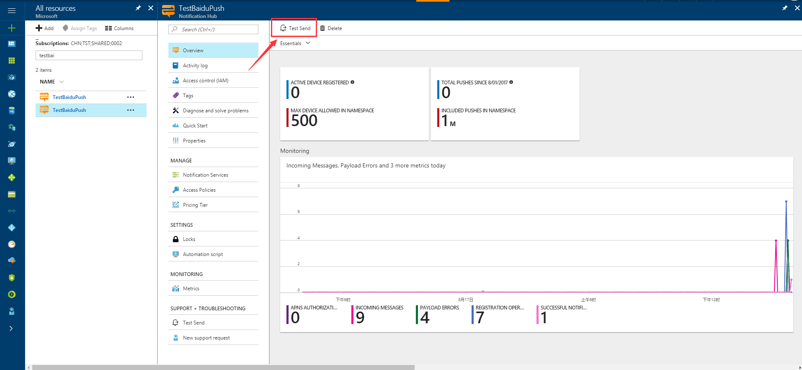
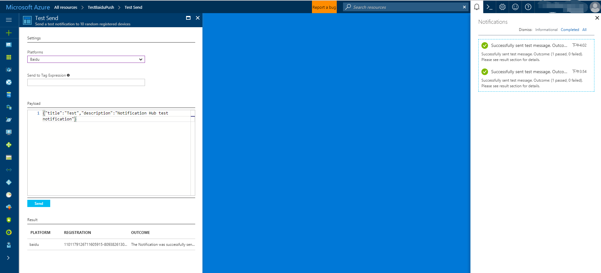

Push notifications are normally sent in a back-end service like Mobile Services or ASP.NET using a compatible library. If a library is not available for your back-end, you can use the REST API directly to send notification messages.

For simplicity, this tutorial uses a console app as a demonstration on how to send a notification with the .NET SDK. However, we recommend the [Use Notification Hubs to push notifications to users](notification-hubs-aspnet-backend-windows-dotnet-wns-notification.md) tutorial as the next step for sending notifications from an ASP.NET backend. 

Here are different approaches for sending notifications:

* **REST Interface**:  You can support notification on any backend platform using  the [REST interface](https://msdn.microsoft.com/library/windowsazure/dn223264.aspx).
* **Microsoft Azure Notification Hubs .NET SDK**: In the Nuget Package Manager for Visual Studio, run [Install-Package Microsoft.Azure.NotificationHubs](https://www.nuget.org/packages/Microsoft.Azure.NotificationHubs/).
* **Node.js**: [How to use Notification Hubs from Node.js](notification-hubs-nodejs-push-notification-tutorial.md).
* **Mobile Apps**: For an example of how to send notifications from an Azure App Service Mobile Apps backend that's integrated with Notification Hubs, see [Add push notifications to your mobile app](../app-service-mobile/app-service-mobile-windows-store-dotnet-get-started-push.md).
* **Java / PHP**: For an example of how to send notifications by using the REST APIs, see "How to use Notification Hubs from Java/PHP" ([Java](notification-hubs-java-push-notification-tutorial.md) | [PHP](notification-hubs-php-push-notification-tutorial.md)).

## (Optional) Send notifications from a .NET console app.

In this section, we show sending a notification using a .NET console app.

1. Create a new Visual C# console application:

    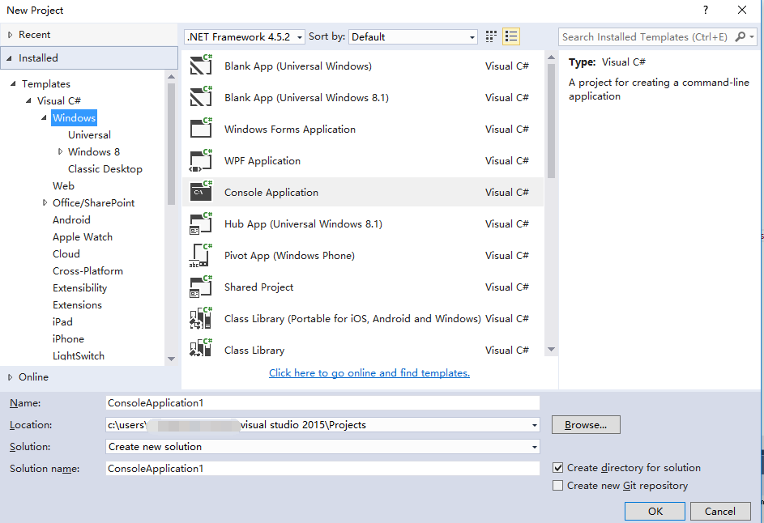

2. In the Package Manager Console window, set the **Default project** to your new console application project, and then in the console window, execute the following command:

    ```shell
    Install-Package Microsoft.Azure.NotificationHubs
    ```

    This instruction adds a reference to the Azure Notification Hubs SDK using the [Microsoft.Azure.Notification Hubs NuGet package](https://www.nuget.org/packages/Microsoft.Azure.NotificationHubs/).

    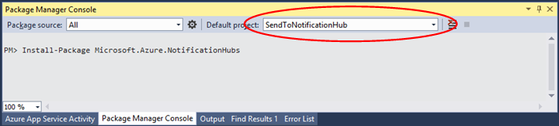

3. Open the file `Program.cs` and add the following using statement:

    ```csharp
    using Microsoft.Azure.NotificationHubs;
    ```

4. In your `Program` class, add the following method and replace `DefaultFullSharedAccessSignatureSASConnectionString` and `NotificationHubName` with the values that you have.

    ```csharp
    private static async void SendNotificationAsync()
    {
        NotificationHubClient hub = NotificationHubClient.CreateClientFromConnectionString("DefaultFullSharedAccessSignatureSASConnectionString", "NotificationHubName");
        string message = "{\"title\":\"((Notification title))\",\"description\":\"Hello from Azure\"}";
        var result = await hub.SendBaiduNativeNotificationAsync(message);
    }
    ```

5. Add the following lines in your `Main` method:

    ```csharp
    SendNotificationAsync();
    Console.ReadLine();
    ```

## Test your app

To test this app with an actual phone, just connect the phone to your computer by using a USB cable. This action loads your app onto the attached phone.

To test this app with the emulator, on the Android Studio top toolbar, click **Run**, and then select your app: it starts the emulator, loads, and runs the app.

The app retrieves the `userId` and `channelId` from the Baidu Push notification service and registers with the notification hub.

To send a test notification, you can use the debug tab of the [Azure portal]. If you built the .NET console application for Visual Studio, just press the F5 key in Visual Studio to run the application. The application sends a notification that appears in the top notification area of your device or emulator.

<!-- URLs. -->
[Mobile Services Android SDK]: https://go.microsoft.com/fwLink/?LinkID=280126&clcid=0x409
[Baidu Push Android SDK]: https://push.baidu.com/sdk/push_client_sdk_for_android
[Azure portal]: https://portal.azure.com/
[Baidu portal]: https://www.baidu.com/
