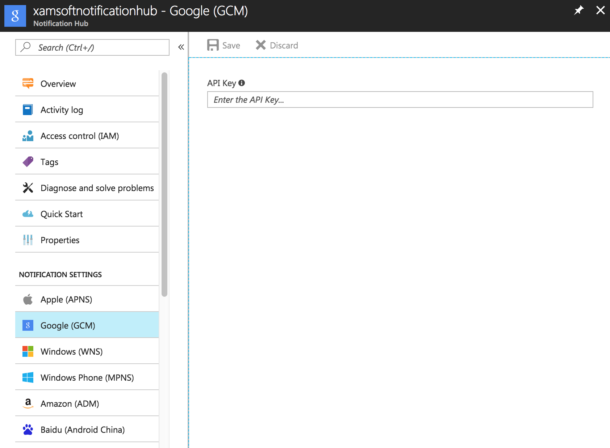

<properties
	pageTitle="Send push notifications to Chrome apps with Azure Notification Hubs | Microsoft Azure"
	description="Learn how to use Azure Notification Hubs to send push notifications to a Chrome App."
	services="notification-hubs"
    keywords="mobile push notifications,push notifications,push notification,chrome push notifications"
	documentationCenter=""
	authors="wesmc7777"
	manager="erikre"
	editor=""/>

<tags
	ms.service="notification-hubs"
	ms.workload="mobile"
	ms.tgt_pltfrm="mobile-chrome"
	ms.devlang="JavaScript"
	ms.topic="hero-article"
	ms.date="06/29/2016"
	ms.author="wesmc"/>

# Send push notifications to Chrome apps with Azure Notification Hubs

[AZURE.INCLUDE [notification-hubs-selector-get-started](../../includes/notification-hubs-selector-get-started.md)]

This topic shows you how to use Azure Notification Hubs to send push notifications to a Chrome App, which will be displayed within the context of the Google Chrome browser. In this tutorial, we will create a Chrome app that receives push notifications by using [Google Cloud Messaging (GCM)](https://developers.google.com/cloud-messaging/). 

>[AZURE.NOTE] To complete this tutorial, you must have an active Azure account. If you don't have an account, you can create a free trial account in just a couple of minutes. For details, see [Azure Free Trial](https://azure.microsoft.com/pricing/free-trial/?WT.mc_id=A0E0E5C02&amp;returnurl=http%3A%2F%2Fazure.microsoft.com%2Fen-us%2Fdocumentation%2Farticles%notification-hubs-chrome-get-started%2F).

The tutorial walks you through these basic steps to enable push notifications:

* [Enable Google Cloud Messaging](#register)
* [Configure your notification hub](#configure-hub)
* [Connect your Chrome App to the notification hub](#connect-app)
* [Send a push notification to your Chrome App](#send)
* [Additional functionality & capabilities](#next-steps)

>[AZURE.NOTE] Chrome app push notifications are not generic in-browser notifications - they are specific to the browser extensibility model (see [Chrome Apps Overview] for details). In addition to the desktop browser, Chrome apps run on mobile (Android and iOS) through Apache Cordova. See [Chrome Apps on Mobile] to learn more.

Configuring GCM and Azure Notification Hubs is identical to configuring for Android, since [Google Cloud Messaging for Chrome] has been deprecated and the same GCM now supports both Android devices and Chrome instances.

##Enable Google Cloud Messaging

1. Navigate to the [Google Cloud Console] website, sign in with your Google account credentials, and then click the **Create Project** button. Provide an appropriate **Project Name**, and then click the **Create** button.

   	![Google Cloud Console - Create Project][1]

2. Make a note of the **Project Number** on the **Projects** page for the project that you just created. You will use this as the **GCM Sender ID** in the Chrome App to register with GCM.

   	![Google Cloud Console - Project Number][2]

3. In the left pane, click **APIs & auth**, and then scroll down and click the toggle to enable **Google Cloud Messaging for Android**. You don't have to enable **Google Cloud Messaging for Chrome**.

   	![Google Cloud Console - Server Key][3]

4. In the left pane, click **Credentials** > **Create New Key** > **Server Key** > **Create**.

   	![Google Cloud Console - Credentials][4]

5. Make a note of the server **API Key**. You will configure this in your notification hub next, to enable it to send push notifications to GCM.

   	![Google Cloud Console - API Key][5]

##Configure your notification hub

[AZURE.INCLUDE [notification-hubs-portal-create-new-hub](../../includes/notification-hubs-portal-create-new-hub.md)]

&emsp;&emsp;6.   In the **Settings** blade, select **Notification Services** and then **Google (GCM)**. Enter the API key and save.

&emsp;&emsp;

##Connect your Chrome App to the notification hub

Your notification hub is now configured to work with GCM, and you have the connection strings to register your app to both receive and send push notifications. LK

###Create a new Chrome App

The sample below is based on the [Chrome App GCM Sample] and uses the recommended way to create a Chrome App. We will highlight the steps specifically related to Azure Notification Hubs. 

>[AZURE.NOTE] We recommend that you download the source for this Chrome App from [Chrome App Notification Hub Sample].

The Chrome App is created via JavaScript, and you can use any of your preferred word editors for creating it. Below is what this Chrome App will look like.

![Google Chrome App][15]

1. Create a folder and name it `ChromePushApp`. Of course, the name is arbitrary - if you name it something different, make sure you substitute the path in the required code segments.

2. Download the [crypto-js library] in the folder you created in the second step. This library folder will contain two subfolders: `components` and `rollups`.

3. Create a `manifest.json` file. All Chrome Apps are backed by a manifest file that contains the app metadata and, most importantly, all permissions that are granted to the app when the user installs it.

		{
		  "name": "NH-GCM Notifications",
		  "description": "Chrome platform app.",
		  "manifest_version": 2,
		  "version": "0.1",
		  "app": {
		    "background": {
		      "scripts": ["background.js"]
		    }
		  },
		  "permissions": ["gcm", "storage", "notifications", "https://*.servicebus.windows.net/*"],
		  "icons": { "128": "gcm_128.png" }
		}

	Notice the `permissions` element, which specifies that this Chrome App will be able to receive push notifications from GCM. It must also specify the Azure Notification Hubs URI where the Chrome App will make a REST call to register.
	Our sample app also uses an icon file, `gcm_128.png`, that you will find at the source that's reused from the original GCM sample. You can substitute it for any image that fits the [icon criteria](https://developer.chrome.com/apps/manifest/icons).

4. Create a file called `background.js` with the following code:

		// Returns a new notification ID used in the notification.
		function getNotificationId() {
		  var id = Math.floor(Math.random() * 9007199254740992) + 1;
		  return id.toString();
		}

		function messageReceived(message) {
		  // A message is an object with a data property that
		  // consists of key-value pairs.

		  // Concatenate all key-value pairs to form a display string.
		  var messageString = "";
		  for (var key in message.data) {
		    if (messageString != "")
		      messageString += ", "
		    messageString += key + ":" + message.data[key];
		  }
		  console.log("Message received: " + messageString);

		  // Pop up a notification to show the GCM message.
		  chrome.notifications.create(getNotificationId(), {
		    title: 'GCM Message',
		    iconUrl: 'gcm_128.png',
		    type: 'basic',
		    message: messageString
		  }, function() {});
		}

		var registerWindowCreated = false;

		function firstTimeRegistration() {
		  chrome.storage.local.get("registered", function(result) {

		    registerWindowCreated = true;
		    chrome.app.window.create(
		      "register.html",
		      {  width: 520,
		         height: 500,
		         frame: 'chrome'
		      },
		      function(appWin) {}
		    );
		  });
		}

		// Set up a listener for GCM message event.
		chrome.gcm.onMessage.addListener(messageReceived);

		// Set up listeners to trigger the first-time registration.
		chrome.runtime.onInstalled.addListener(firstTimeRegistration);
		chrome.runtime.onStartup.addListener(firstTimeRegistration);

	This is the file that pops up the Chrome App window HTML (**register.html**) and also defines the handler **messageReceived** to handle the incoming push notification.

5. Create a file called `register.html` - this defines the UI of the Chrome App. 

   >[AZURE.NOTE] This sample uses **CryptoJS v3.1.2**. If you downloaded another version of the library, make sure you properly substitute the version in the `src` path.

		<html>

		<head>
		<title>GCM Registration</title>
		
		
		
		</head>

		<body>

		Sender ID: <input id="senderId" type="TEXT" size="20"> 
		<button id="registerWithGCM">Register with GCM</button>
		 
		 
		 

		Notification Hub Name: <input id="hubName" type="TEXT" style="width:400px">  
		Connection String: <textarea id="connectionString" type="TEXT" style="width:400px;height:60px"></textarea>

		 

		<button id="registerWithNH" disabled="true">Register with Azure Notification Hubs</button>

		 
		 

		<textarea id="console" type="TEXT" readonly style="width:500px;height:200px;background-color:#e5e5e5;padding:5px"></textarea>

		</body>

		</html>

6. Create a file called `register.js` with the code below. This file specifies the script behind `register.html`. Chrome Apps do not allow inline execution, so you have to create a separate backing script for your UI.

		var registrationId = "";
		var hubName        = "", connectionString = "";
		var originalUri    = "", targetUri = "", endpoint = "", sasKeyName = "", sasKeyValue = "", sasToken = "";

		window.onload = function() {
		   document.getElementById("registerWithGCM").onclick = registerWithGCM;  
		   document.getElementById("registerWithNH").onclick = registerWithNH;
		   updateLog("You have not registered yet. Please provider sender ID and register with GCM and then with  Notification Hubs.");
		}

		function updateLog(status) {
		  currentStatus = document.getElementById("console").innerHTML;
		  if (currentStatus != "") {
		    currentStatus = currentStatus + "\n\n";
		  }

		  document.getElementById("console").innerHTML = currentStatus  + status;
		}

		function registerWithGCM() {
		  var senderId = document.getElementById("senderId").value.trim();
		  chrome.gcm.register([senderId], registerCallback);

		  // Prevent register button from being clicked again before the registration finishes.
		  document.getElementById("registerWithGCM").disabled = true;
		}

		function registerCallback(regId) {
		  registrationId = regId;
		  document.getElementById("registerWithGCM").disabled = false;

		  if (chrome.runtime.lastError) {
		    // When the registration fails, handle the error and retry the
		    // registration later.
		    updateLog("Registration failed: " + chrome.runtime.lastError.message);
		    return;
		  }

		  updateLog("Registration with GCM succeeded.");
		  document.getElementById("registerWithNH").disabled = false;

		  // Mark that the first-time registration is done.
		  chrome.storage.local.set({registered: true});
		}

		function registerWithNH() {
		  hubName = document.getElementById("hubName").value.trim();
		  connectionString = document.getElementById("connectionString").value.trim();
		  splitConnectionString();
		  generateSaSToken();
		  sendNHRegistrationRequest();
		}

		// From http://msdn.microsoft.com/library/dn495627.aspx
		function splitConnectionString()
		{
		  var parts = connectionString.split(';');
		  if (parts.length != 3)
		  throw "Error parsing connection string";

		  parts.forEach(function(part) {
		    if (part.indexOf('Endpoint') == 0) {
		    endpoint = 'https' + part.substring(11);
		    } else if (part.indexOf('SharedAccessKeyName') == 0) {
		    sasKeyName = part.substring(20);
		    } else if (part.indexOf('SharedAccessKey') == 0) {
		    sasKeyValue = part.substring(16);
		    }
		  });

		  originalUri = endpoint + hubName;
		}

		function generateSaSToken()
		{
		  targetUri = encodeURIComponent(originalUri.toLowerCase()).toLowerCase();
		  var expiresInMins = 10; // 10 minute expiration

		  // Set expiration in seconds.
		  var expireOnDate = new Date();
		  expireOnDate.setMinutes(expireOnDate.getMinutes() + expiresInMins);
		  var expires = Date.UTC(expireOnDate.getUTCFullYear(), expireOnDate
		    .getUTCMonth(), expireOnDate.getUTCDate(), expireOnDate
		    .getUTCHours(), expireOnDate.getUTCMinutes(), expireOnDate
		    .getUTCSeconds()) / 1000;
		  var tosign = targetUri + '\n' + expires;

		  // Using CryptoJS.
		  var signature = CryptoJS.HmacSHA256(tosign, sasKeyValue);
		  var base64signature = signature.toString(CryptoJS.enc.Base64);
		  var base64UriEncoded = encodeURIComponent(base64signature);

		  // Construct authorization string.
		  sasToken = "SharedAccessSignature sr=" + targetUri + "&sig="
		                  + base64UriEncoded + "&se=" + expires + "&skn=" + sasKeyName;
		}

		function sendNHRegistrationRequest()
		{
		  var registrationPayload =
		  "<?xml version=\"1.0\" encoding=\"utf-8\"?>" +
		  "<entry xmlns=\"http://www.w3.org/2005/Atom\">" +
		      "<content type=\"application/xml\">" +
		          "<GcmRegistrationDescription xmlns:i=\"http://www.w3.org/2001/XMLSchema-instance\" xmlns=\"http://schemas.microsoft.com/netservices/2010/10/servicebus/connect\">" +
		              "<GcmRegistrationId>{GCMRegistrationId}</GcmRegistrationId>" +
		          "</GcmRegistrationDescription>" +
		      "</content>" +
		  "</entry>";

		  // Update the payload with the registration ID obtained earlier.
		  registrationPayload = registrationPayload.replace("{GCMRegistrationId}", registrationId);

		  var url = originalUri + "/registrations/?api-version=2014-09";
		  var client = new XMLHttpRequest();

		  client.onload = function () {
		    if (client.readyState == 4) {
		      if (client.status == 200) {
		        updateLog("Notification Hub Registration succesful!");
		        updateLog(client.responseText);
		      } else {
		        updateLog("Notification Hub Registration did not succeed!");
		        updateLog("HTTP Status: " + client.status + " : " + client.statusText);
		        updateLog("HTTP Response: " + "\n" + client.responseText);
		      }
		    }
		  };

		  client.onerror = function () {
		        updateLog("ERROR - Notification Hub Registration did not succeed!");
		  }

		  client.open("POST", url, true);
		  client.setRequestHeader("Content-Type", "application/atom+xml;type=entry;charset=utf-8");
		  client.setRequestHeader("Authorization", sasToken);
		  client.setRequestHeader("x-ms-version", "2014-09");

		  try {
		      client.send(registrationPayload);
		  }
		  catch(err) {
		      updateLog(err.message);
		  }
		}

	The above script has the following key parameters:
	- **window.onload** defines the button-click events of the two buttons on the UI. One registers with GCM, and the other uses the registration ID that's returned after registration with GCM to register with Azure Notification Hubs.
	- **updateLog** is the function that allows us to handle simple logging capabilities.
	- **registerWithGCM** is the first button-click handler, which makes the `chrome.gcm.register` call to GCM to register the current Chrome App instance.
	- **registerCallback** is the callback function that gets called when the GCM registration call returns.
	- **registerWithNH** is the second button-click handler, which registers with Notification Hubs. It gets `hubName` and `connectionString` (which the user has specified) and crafts the Notification Hubs Registration REST API call.
	- **splitConnectionString** and **generateSaSToken** are helpers that represent the JavaScript implementation of a SaS token creation process, that must be used in all REST API calls. For more information, see [Common Concepts](http://msdn.microsoft.com/library/dn495627.aspx).
	- **sendNHRegistrationRequest** is the function that makes a HTTP REST call to Azure Notification Hubs.
	- **registrationPayload** defines the registration XML payload. For more information, see [Create Registration NH REST API]. We update the registration ID in it with what we received from GCM.
	- **client** is an instance of **XMLHttpRequest** that we use to make the HTTP POST request. Note that we update the `Authorization` header with `sasToken`. Successful completion of this call will register this Chrome App instance with Azure Notification Hubs.

The overall folder structure for this project should resemble this:
   	![Google Chrome App - Folder Structure][21]

###Set up and test your Chrome App

1. Open your Chrome browser. Open **Chrome extensions** and enable **Developer mode**.

   	![Google Chrome - Enable Developer Mode][16]

2. Click **Load unpacked extension** and navigate to the folder where you created the files. You can also optionally use the **Chrome Apps & Extensions Developer Tool**. This tool is a Chrome App in itself (installed from the Chrome Web Store) and provides advanced debugging capabilities for your Chrome App development.

   	![Google Chrome - Load Unpacked Extension][17]

3. If the Chrome App is created without any errors, then you will see your Chrome App show up.

   	![Google Chrome - Chrome App Display][18]

4. Enter the **Project Number** that you got earlier from the **Google Cloud Console** as the sender ID, and click **Register with GCM**. You must see the message **Registration with GCM succeeded.**

   	![Google Chrome - Chrome App Customization][19]

5. Enter your **Notification Hub Name** and the **DefaultListenSharedAccessSignature** that you obtained from the portal earlier, and click **Register with Azure Notification Hub**. You must see the message **Notification Hub Registration successful!** and the details of the registration response, which contains the Azure Notification Hubs registration ID.

   	![Google Chrome - Specify Notification Hub Details][20]  

##Send a notification to your Chrome App

For testing purposes, we will send Chrome push notifications by using a .NET console application. 

>[AZURE.NOTE] You can send push notifications with Notification Hubs from any backend via our public <a href="http://msdn.microsoft.com/library/windowsazure/dn223264.aspx">REST interface</a>. Check out our [documentation portal](https://azure.microsoft.com/documentation/services/notification-hubs/) for more cross-platform examples.

1. In Visual Studio, from the **File** menu, select **New** and then **Project**. Under **Visual C#**, click **Windows** and **Console Application**, and then click **OK**.  This creates a new console application project.

2. From the **Tools** menu, click **Library Package Manager** and then **Package Manager Console**. This displays the Package Manager Console.

3. In the console window, execute the following command:

        Install-Package Microsoft.Azure.NotificationHubs

   	This adds a reference to the Azure Service Bus SDK with the <a href="http://nuget.org/packages/  WindowsAzure.ServiceBus/">WindowsAzure.ServiceBus NuGet package</a>.

4. Open `Program.cs` and add the following `using` statement:

        using Microsoft.Azure.NotificationHubs;

5. In the `Program` class, add the following method:

        private static async void SendNotificationAsync()
        {
            NotificationHubClient hub = NotificationHubClient.CreateClientFromConnectionString("<connection string with full access>", "<hub name>");
            String message = "{\"data\":{\"message\":\"Hello Chrome from Azure Notification Hubs\"}}";
            await hub.SendGcmNativeNotificationAsync(message);
        }

   	Make sure to replace the `<hub name>` placeholder with the name of the notification hub that appears in the [portal](https://portal.azure.com) in your Notification Hub blade. Also, replace the connection string placeholder with the connection string called `DefaultFullSharedAccessSignature` that you obtained in the notification hub configuration section.

	>[AZURE.NOTE] Make sure that you use the connection string with **Full** access, not **Listen** access. The **Listen** access connection string does not grant permissions to send push notifications.

5. Add the following calls in the `Main` method:

         SendNotificationAsync();
		 Console.ReadLine();
         
6. Make sure that Chrome is running, and run the console application.

7. You should see the following notification pop up on your desktop.

   	![Google Chrome - Notification][13]

8. You can also see all your notifications by using the Chrome Notifications window in the taskbar (in Windows) when Chrome is running.

   	![Google Chrome - Notifications List][14]

>[AZURE.NOTE] You don't need to have the Chrome App running or open in the browser (though the Chrome browser itself must be running). You also get a consolidated view of all your notifications in the Chrome Notifications window.

## Next steps

Learn more about Notification Hubs in [Notification Hubs Overview].

To target specific users, refer to the [Azure Notification Hubs Notify Users] tutorial. 

If you want to segment your users by interest groups, you can follow the [Azure Notification Hubs breaking news] tutorial.

<!-- Images. -->
[1]: ./media/notification-hubs-chrome-get-started/GoogleConsoleCreateProject.PNG
[2]: ./media/notification-hubs-chrome-get-started/GoogleProjectNumber.png
[3]: ./media/notification-hubs-chrome-get-started/EnableGCM.png
[4]: ./media/notification-hubs-chrome-get-started/CreateServerKey.png
[5]: ./media/notification-hubs-chrome-get-started/ServerKey.png
[6]: ./media/notification-hubs-chrome-get-started/CreateNH.png
[7]: ./media/notification-hubs-chrome-get-started/NHNamespace.png
[8]: ./media/notification-hubs-chrome-get-started/NamespaceConfigure.png
[9]: ./media/notification-hubs-chrome-get-started/NHConfigure.png
[10]: ./media/notification-hubs-chrome-get-started/NHConfigureGCM.png
[11]: ./media/notification-hubs-chrome-get-started/NHDashboard.png
[12]: ./media/notification-hubs-chrome-get-started/NHConnString.png
[13]: ./media/notification-hubs-chrome-get-started/ChromeNotification.png
[14]: ./media/notification-hubs-chrome-get-started/ChromeNotificationWindow.png
[15]: ./media/notification-hubs-chrome-get-started/ChromeApp.png
[16]: ./media/notification-hubs-chrome-get-started/ChromeExtensions.png
[17]: ./media/notification-hubs-chrome-get-started/ChromeLoadExtension.png
[18]: ./media/notification-hubs-chrome-get-started/ChromeAppLoaded.png
[19]: ./media/notification-hubs-chrome-get-started/ChromeAppGCM.png
[20]: ./media/notification-hubs-chrome-get-started/ChromeAppNH.png
[21]: ./media/notification-hubs-chrome-get-started/FinalFolderView.png

<!-- URLs. -->
[Chrome App Notification Hub Sample]: http://google.com
[Google Cloud Console]: http://cloud.google.com/console
[Azure Classic Portal]: https://manage.windowsazure.com/
[Notification Hubs Overview]: http://msdn.microsoft.com/library/jj927170.aspx
[Chrome Apps Overview]: https://developer.chrome.com/apps/about_apps
[Chrome App GCM Sample]: https://github.com/GoogleChrome/chrome-app-samples/tree/master/samples/gcm-notifications
[Installable Web Apps]: https://developers.google.com/chrome/apps/docs/
[Chrome Apps on Mobile]: https://developer.chrome.com/apps/chrome_apps_on_mobile
[Create Registration NH REST API]: http://msdn.microsoft.com/library/azure/dn223265.aspx
[crypto-js library]: http://code.google.com/p/crypto-js/
[GCM with Chrome Apps]: https://developer.chrome.com/apps/cloudMessaging
[Google Cloud Messaging for Chrome]: https://developer.chrome.com/apps/cloudMessagingV1
[Azure Notification Hubs Notify Users]: notification-hubs-aspnet-backend-windows-dotnet-notify-users.md
[Azure Notification Hubs breaking news]: notification-hubs-windows-store-dotnet-send-breaking-news.md
