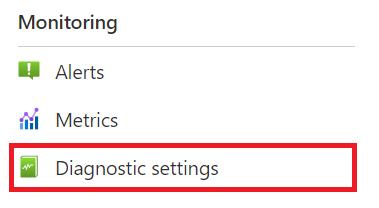
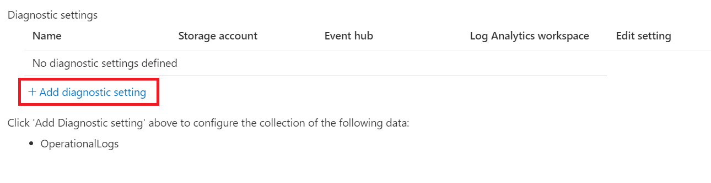
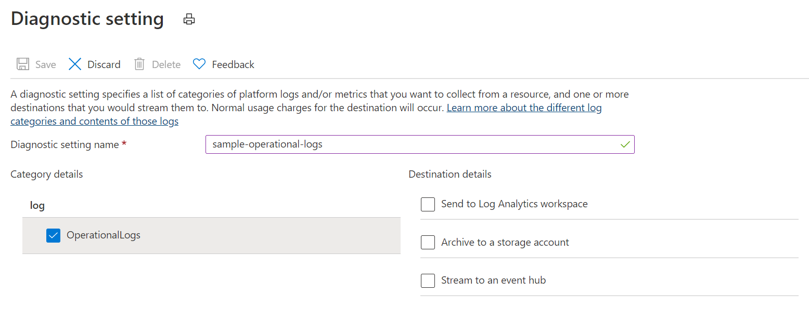

# Enable diagnostics logs for Notification Hubs

When you start using your Azure Notification Hubs namespace, you might want to monitor how and when your namespace is created, deleted, or accessed. This article provides an overview of all the operational and diagnostics logs that are available.

Azure Notification Hubs currently supports activity and operational logs, which capture *management operations* that are performed on the Azure Notification Hubs namespace.

## Diagnostic logs schema

All logs are stored in JavaScript Object Notation (JSON) format in the following two locations:

- **AzureActivity**: Displays logs from operations and actions that are conducted against your namespace in the Azure portal or through Azure Resource Manager template deployments.
- **AzureDiagnostics**: Displays logs from operations and actions that are conducted against your namespace by using the API, or through management clients on the language SDK.

Diagnostic log JSON strings include the elements listed in the following table:

| Name | Description |
| ------- | ------- |
| time | UTC timestamp of the log |
| resourceId | Relative path to the Azure resource |
| operationName | Name of the management operation |
| category | Log category. Valid values: `OperationalLogs` |
| callerIdentity | Identity of the caller who initiated the management operation |
| resultType | Status of the management operation. Valid values: `Succeeded` or `Failed` |
| resultDescription | Description of the management operation |
| correlationId | Correlation ID of the management operation (if specified) |
| callerIpAddress | The caller IP address. Empty for calls that originated from the Azure portal |

Here's an example of an operational log JSON string:

```json
{
    "operationName": "Microsoft.NotificationHubs/Namespaces/NotificationHubs/authorizationRules/action",
    "resourceId": "/SUBSCRIPTIONS/2CAC2A14-BA6B-46A6-BCE8-2D9781A41BA2/RESOURCEGROUPS/SAMPLES/PROVIDERS/MICROSOFT.NOTIFICATIONHUBS/NAMESPACES/SAMPLE-NS",
    "time": "1/1/2021 5:16:32 AM +00:00",
    "category": "OperationalLogs",
    "resultType": "Succeeded",
    "resultDescription": "Gets Hub Authorization Rules",
    "correlationId": "00000000-0000-0000-0000-000000000000",
    "callerIdentity": "{ \"identityType\": \"Portal\", \"identity\": \"\" }"
}
```

The `callerIdentity` field can be empty, or a JSON string with one of the following formats.

For calls originating from the Azure portal the `identity` field is empty. The log can be correlated to activity logs to determine the logged in user.

```json
{
    "identityType": "Portal",
    "identity": ""
}
```

For calls made through Azure Resource Manager the `identity` field will contain the username of the logged in user.

```json
{
   "identityType": "Username",
   "identity": "test@foo.com"
}
```

For calls to the Notification Hubs REST API the `identity` field will contain the name of the access policy used to generate the SharedAccessSignature token.

```json
{
   "identityType": "KeyName",
   "identity": "SharedAccessRootKey2"
}
```

## Events and operations captured in operational logs

Operational logs capture all management operations that are performed on the Azure Notification Hubs namespace. Data operations are not captured, because of the high volume of data operations that are conducted on Azure Notification Hubs.

The following management operations are captured in operational logs: 

| Scope | Operation Name | Operation Description |
| :-- | :-- | :-- |
| Namespace | Microsoft.NotificationHubs/Namespaces/authorizationRules/action | List Authorization Rules |
| Namespace | Microsoft.NotificationHubs/Namespaces/authorizationRules/delete | Delete Authorization Rule |
| Namespace | Microsoft.NotificationHubs/Namespaces/authorizationRules/listkeys/action | List Keys |
| Namespace | Microsoft.NotificationHubs/Namespaces/authorizationRules/read | Get Authorization Rule |
| Namespace | Microsoft.NotificationHubs/Namespaces/authorizationRules/regenerateKeys/action | Regenerate Keys |
| Namespace | Microsoft.NotificationHubs/Namespaces/authorizationRules/write | Create or Update Authorization Rule |
| Namespace | Microsoft.NotificationHubs/Namespaces/delete | Delete Namespace |
| Namespace | Microsoft.NotificationHubs/Namespaces/read | Get Namespace |
| Namespace | Microsoft.NotificationHubs/Namespaces/write | Create or Update Namespace |
| Notification Hub | Microsoft.NotificationHubs/Namespaces/NotificationHubs/authorizationRules/action | List Authorization Rules |
| Notification Hub | Microsoft.NotificationHubs/Namespaces/NotificationHubs/authorizationRules/delete | Delete Authorization Rule |
| Notification Hub | Microsoft.NotificationHubs/Namespaces/NotificationHubs/authorizationRules/listkeys/action | List Keys |
| Notification Hub | Microsoft.NotificationHubs/Namespaces/NotificationHubs/authorizationRules/read | Read Authorization Rule |
| Notification Hub | Microsoft.NotificationHubs/Namespaces/NotificationHubs/authorizationRules/regenerateKeys/action | Regenerate Keys |
| Notification Hub | Microsoft.NotificationHubs/Namespaces/NotificationHubs/authorizationRules/write | Create or Update Authorization Rule |
| Notification Hub | Microsoft.NotificationHubs/Namespaces/NotificationHubs/delete | Delete Notification Hub |
| Notification Hub | Microsoft.NotificationHubs/Namespaces/NotificationHubs/pnsCredentials/action | Create, Update, or Get PNS Credentials |
| Notification Hub | Microsoft.NotificationHubs/Namespaces/NotificationHubs/read | Get Notification Hub |
| Notification Hub | Microsoft.NotificationHubs/Namespaces/NotificationHubs/write | Create or Update Notification Hub |

## Enable operational logs

Operational logs are disabled by default. To enable logs, do the following:

1. In the [Azure portal](https://portal.azure.com), go to your Azure Notification Hubs namespace and then, under **Monitoring**, select  **Diagnostic settings**.

   

1. In the **Diagnostics settings** pane, select **Add diagnostic setting**.  

   

1. Configure the diagnostics settings by doing the following:

   a. In the **Name** box, enter a name for the diagnostics settings.  

   b. Select one of the following three destinations for your diagnostics logs:  
   - If you select **Send to Log Analytics workspace**, you need to specify which instance of Log Analytics the diagnostics will be sent to.
     > [!NOTE]
     > Sending to the Log Analytics workspace is currently not supported.
   - If you select **Archive to a storage account**, you need to configure the storage account where the diagnostics logs will be stored.  
   - If you select **Stream to an event hub**, you need to configure the event hub that you want to stream the diagnostics logs to.

   c. Select the **OperationalLogs** check box.

    

1. Select **Save**.

The new settings take effect in about 10 minutes. The logs are displayed in the configured archival target, in the **Diagnostics logs** pane.

## Next steps

To learn more about configuring diagnostics settings, see:
* [Overview of Azure diagnostics logs](../azure-monitor/essentials/platform-logs-overview.md).

To learn more about Azure Notification Hubs, see:
* [What is Azure Notification Hubs?](notification-hubs-push-notification-overview.md)