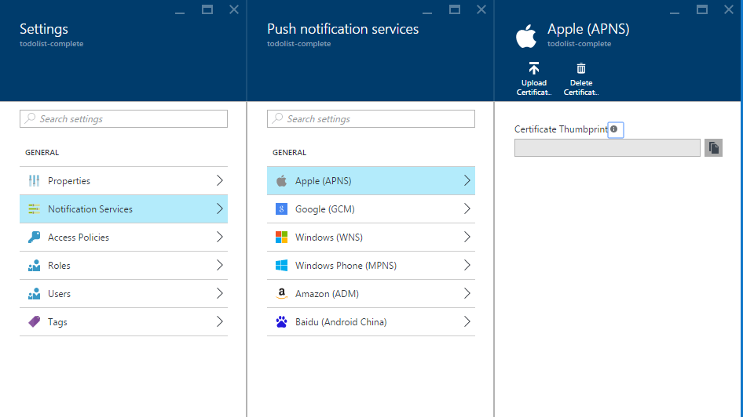

<properties
	pageTitle="Sending push notifications to iOS with Azure Notification Hubs | Microsoft Azure"
	description="In this tutorial, you learn how to use Azure Notification Hubs to send push notifications to an iOS application."
	services="notification-hubs"
	documentationCenter="ios"
    keywords="push notification,push notifications,ios push notifications"
	authors="wesmc7777"
	manager="erikre"
	editor=""/>

<tags
	ms.service="notification-hubs"
	ms.workload="mobile"
	ms.tgt_pltfrm="mobile-ios"
	ms.devlang="objective-c"
	ms.topic="hero-article"
	ms.date="06/29/2016"
	ms.author="wesmc"/>

# Sending push notifications to iOS with Azure Notification Hubs

[AZURE.INCLUDE [notification-hubs-selector-get-started](../../includes/notification-hubs-selector-get-started.md)]

##Overview

> [AZURE.NOTE] To complete this tutorial, you must have an active Azure account. If you don't have an account, you can create a free trial account in just a couple of minutes. For details, see [Azure Free Trial](https://azure.microsoft.com/pricing/free-trial/?WT.mc_id=A0E0E5C02&amp;returnurl=http%3A%2F%2Fazure.microsoft.com%2Fen-us%2Fdocumentation%2Farticles%2Fnotification-hubs-ios-get-started).

This tutorial shows you how to use Azure Notification Hubs to send push notifications to an iOS application. You'll create a blank iOS app that receives push notifications by using the [Apple Push Notification service (APNs)](https://developer.apple.com/library/ios/documentation/NetworkingInternet/Conceptual/RemoteNotificationsPG/Chapters/ApplePushService.html). 

When you're finished, you'll be able to use your notification hub to broadcast push notifications to all the devices running your app.

## Before you begin

[AZURE.INCLUDE [notification-hubs-hero-slug](../../includes/notification-hubs-hero-slug.md)]

The completed code for this tutorial can be found [on GitHub](https://github.com/Azure/azure-notificationhubs-samples/tree/master/iOS/GetStartedNH/GetStarted). 

##Prerequisites

This tutorial requires the following:

+ [Mobile Services iOS SDK version 1.2.4]
+ Latest version of [Xcode]
+ An iOS 8 (or later version)-capable device
+ [Apple Developer Program](https://developer.apple.com/programs/) membership.

   > [AZURE.NOTE] Because of configuration requirements for push notifications, you must deploy and test push notifications on a physical iOS device (iPhone or iPad) instead of the iOS Simulator.

Completing this tutorial is a prerequisite for all other Notification Hubs tutorials for iOS apps.

[AZURE.INCLUDE [Notification Hubs Enable Apple Push Notifications](../../includes/notification-hubs-enable-apple-push-notifications.md)]

##Configure your Notification Hub for iOS push notifications

This section walks you through creating a new notification hub and configuring authentication with APNS using the **.p12** push certificate that you created. If you want to use a notification hub that you have already created, you can skip to step 5.

[AZURE.INCLUDE [notification-hubs-portal-create-new-hub](../../includes/notification-hubs-portal-create-new-hub.md)]

<ol start="6">
<li>

Click the <b>Notification Services</b> button in the <b>Settings</b> blade, then select <b>Apple (APNS)</b>. Click on <b>Upload Certificate</b> and select the <b>.p12</b> file that you exported earlier. Make sure you also specify the correct password.

Make sure to select <b>Sandbox</b> mode since this is for development. Only use the <b>Production</b> if you want to send push notifications to users who purchased your app from the store.

</li>
</ol>
&emsp;&emsp;

&emsp;&emsp;

Your notification hub is now configured to work with APNS, and you have the connection strings to register your app and send push notifications.

##Connect your iOS app to Notification Hubs

1. In Xcode, create a new iOS project and select the **Single View Application** template.

   	![Xcode - Single View Application][8]

2. When setting the options for your new project, make sure to use the same **Product Name** and **Organization Identifier** that you used when you previously set the bundle ID on the Apple Developer portal.

	![Xcode - project options][11]

3. Under **Targets**, click your project name, click the **Build Settings** tab and expand **Code Signing Identity**, and then under **Debug**, set your code-signing identity. Toggle **Levels** from **Basic** to **All**, and set **Provisioning Profile** to the provisioning profile that you created previously.

	If you don't see the new provisioning profile that you created in Xcode, try refreshing the profiles for your signing identity. Click **Xcode** on the menu bar, click **Preferences**, click the **Account** tab, click the **View Details** button, click your signing identity, and then click the refresh button in the bottom-right corner.

   	![Xcode - provisioning profile][9]

4. Download the [Mobile Services iOS SDK version 1.2.4] and unzip the file. In Xcode, right-click your project and click the **Add Files to** option to add the **WindowsAzureMessaging.framework** folder to your Xcode project. Select **Copy items if needed**, and then click **Add**.

	>[AZURE.NOTE] The notification hubs SDK does not currently support bitcode on Xcode 7.  You must set **Enable Bitcode** to **No** in the **Build Options** for your project.

   	![Unzip Azure SDK][10]

5. Add a new header file to your project named `HubInfo.h`. This file will hold the constants for your notification hub.  Add the following definitions and replace the string literal placeholders with your *hub name* and the *DefaultListenSharedAccessSignature* that you noted earlier.

		#ifndef HubInfo_h
		#define HubInfo_h
		
			#define HUBNAME @"<Enter the name of your hub>"
			#define HUBLISTENACCESS @"<Enter your DefaultListenSharedAccess connection string"
		
		#endif /* HubInfo_h */

6. Open your `AppDelegate.h` file add the following import directives:

         #import <WindowsAzureMessaging/WindowsAzureMessaging.h> 
		 #import "HubInfo.h"
		
7. In your `AppDelegate.m file`, add the following code in the `didFinishLaunchingWithOptions` method based on your version of iOS. This code registers your device handle with APNs:

	For iOS 8:

	 	UIUserNotificationSettings *settings = [UIUserNotificationSettings settingsForTypes:UIUserNotificationTypeSound |
												UIUserNotificationTypeAlert | UIUserNotificationTypeBadge categories:nil];

    	[[UIApplication sharedApplication] registerUserNotificationSettings:settings];
    	[[UIApplication sharedApplication] registerForRemoteNotifications];

	For iOS versions prior to 8:

         [[UIApplication sharedApplication] registerForRemoteNotificationTypes: UIRemoteNotificationTypeAlert | UIRemoteNotificationTypeBadge | UIRemoteNotificationTypeSound];

8. In the same file, add the following methods. This code connects to the notification hub using the connection information you specified in HubInfo.h. It then gives the device token to the notification hub so that the notification hub can send notifications:

	    - (void)application:(UIApplication *)application didRegisterForRemoteNotificationsWithDeviceToken:(NSData *) deviceToken {
		    SBNotificationHub* hub = [[SBNotificationHub alloc] initWithConnectionString:HUBLISTENACCESS
										notificationHubPath:HUBNAME];

		    [hub registerNativeWithDeviceToken:deviceToken tags:nil completion:^(NSError* error) {
		        if (error != nil) {
		            NSLog(@"Error registering for notifications: %@", error);
		        }
				else {
				    [self MessageBox:@"Registration Status" message:@"Registered"];
				}
	    	}];
		}

		-(void)MessageBox:(NSString *)title message:(NSString *)messageText
		{
			UIAlertView *alert = [[UIAlertView alloc] initWithTitle:title message:messageText delegate:self
				cancelButtonTitle:@"OK" otherButtonTitles: nil];
			[alert show];
		}

9. In the same file, add the following method to display a **UIAlert** if the notification is received while the app is active:

        - (void)application:(UIApplication *)application didReceiveRemoteNotification: (NSDictionary *)userInfo {
		    NSLog(@"%@", userInfo);
		    [self MessageBox:@"Notification" message:[[userInfo objectForKey:@"aps"] valueForKey:@"alert"]];
		}

10. Build and run the app on your device to verify that there are no failures.

## Send test push notifications

You can test receiving notifications in your app by sending push notifications in the [Azure Portal] via the **Troubleshooting** section in the hub blade (use the *Test Send* option).

![Azure Portal - Test Send][30]

[AZURE.INCLUDE [notification-hubs-sending-notifications-from-the-portal](../../includes/notification-hubs-sending-notifications-from-the-portal.md)]

## (Optional) Send push notifications from the app

>[AZURE.IMPORTANT] This example of sending notifications from the client app is provided for learning purposes only. Since this will require the `DefaultFullSharedAccessSignature` to be present on the client app, it exposes your notification hub to the risk that a user may gain access to send unauthorized notifications to your clients.

If you want to send push notifications from within an app, this section provides an example of how to do this using the REST interface.

1. In Xcode, open `Main.storyboard` and add the following UI components from the object library to allow the user to send push notifications in the app:

	- A label with no label text. It will be used to report errors in sending notifications. The **Lines** property should be set to **0** so that it will automatically size constrained to the right and left margins and the top of the view.
	- A text field with **Placeholder** text set to **Enter Notification Message**. Constrain the field just below the label as shown below. Set the View Controller as the outlet delegate.
	- A button titled **Send Notification** constrained just below the text field and in the horizontal center.

	The view should look as follows:

	![Xcode designer][32]

2. [Add outlets](https://developer.apple.com/library/ios/recipes/xcode_help-IB_connections/chapters/CreatingOutlet.html) for the label and text field connected your view, and update your `interface` definition to support `UITextFieldDelegate` and `NSXMLParserDelegate`. Add the three property declarations shown below to help support calling the REST API and parsing the response.

	Your ViewController.h file should look as follows:

		#import <UIKit/UIKit.h>

		@interface ViewController : UIViewController <UITextFieldDelegate, NSXMLParserDelegate>
		{
			NSXMLParser *xmlParser;
		}

		// Make sure these outlets are connected to your UI by ctrl+dragging
		@property (weak, nonatomic) IBOutlet UITextField *notificationMessage;
		@property (weak, nonatomic) IBOutlet UILabel *sendResults;

		@property (copy, nonatomic) NSString *statusResult;
		@property (copy, nonatomic) NSString *currentElement;

		@end

3. Open `HubInfo.h` and add the following constants which will be used for sending notifications to your hub. Replace the placeholder string literal with your actual *DefaultFullSharedAccessSignature* connection string.

		#define API_VERSION @"?api-version=2015-01"
		#define HUBFULLACCESS @"<Enter Your DefaultFullSharedAccess Connection string>"

4. Add the following `#import` statements to your `ViewController.h` file.

		#import <CommonCrypto/CommonHMAC.h>
		#import "HubInfo.h"

5. In `ViewController.m` add the following code to the interface implementation. This code will parse your *DefaultFullSharedAccessSignature* connection string. As mentioned in the [REST API reference](http://msdn.microsoft.com/library/azure/dn495627.aspx), this parsed information will be used to generate a SaS token for the **Authorization** request header.

		NSString *HubEndpoint;
		NSString *HubSasKeyName;
		NSString *HubSasKeyValue;

		-(void)ParseConnectionString
		{
			NSArray *parts = [HUBFULLACCESS componentsSeparatedByString:@";"];
			NSString *part;

			if ([parts count] != 3)
			{
				NSException* parseException = [NSException exceptionWithName:@"ConnectionStringParseException"
					reason:@"Invalid full shared access connection string" userInfo:nil];

				@throw parseException;
			}

			for (part in parts)
			{
				if ([part hasPrefix:@"Endpoint"])
				{
					HubEndpoint = [NSString stringWithFormat:@"https%@",[part substringFromIndex:11]];
				}
				else if ([part hasPrefix:@"SharedAccessKeyName"])
				{
					HubSasKeyName = [part substringFromIndex:20];
				}
				else if ([part hasPrefix:@"SharedAccessKey"])
				{
					HubSasKeyValue = [part substringFromIndex:16];
				}
			}
		}

6. In `ViewController.m`, update the `viewDidLoad` method to parse the connection string when the view loads. Also add the utility methods, shown below, to the interface implementation.  

		- (void)viewDidLoad
		{
			[super viewDidLoad];
			[self ParseConnectionString];
			[_notificationMessage setDelegate:self];
		}

		-(NSString *)CF_URLEncodedString:(NSString *)inputString
		{
		   return (__bridge NSString *)CFURLCreateStringByAddingPercentEscapes(NULL, (CFStringRef)inputString,
				NULL, (CFStringRef)@"!*'();:@&=+$,/?%#[]", kCFStringEncodingUTF8);
		}

		-(void)MessageBox:(NSString *)title message:(NSString *)messageText
		{
			UIAlertView *alert = [[UIAlertView alloc] initWithTitle:title message:messageText delegate:self
				cancelButtonTitle:@"OK" otherButtonTitles: nil];
			[alert show];
		}

7. In `ViewController.m`, add the following code to the interface implementation to generate the SaS authorization token that will be provided in the **Authorization** header, as mentioned in the [REST API Reference](http://msdn.microsoft.com/library/azure/dn495627.aspx).

		-(NSString*) generateSasToken:(NSString*)uri
		{
			NSString *targetUri;
			NSString* utf8LowercasedUri = NULL;
			NSString *signature = NULL;
			NSString *token = NULL;

			@try
			{
				// Add expiration
				uri = [uri lowercaseString];
				utf8LowercasedUri = [self CF_URLEncodedString:uri];
				targetUri = [utf8LowercasedUri lowercaseString];
				NSTimeInterval expiresOnDate = [[NSDate date] timeIntervalSince1970];
				int expiresInMins = 60; // 1 hour
				expiresOnDate += expiresInMins * 60;
				UInt64 expires = trunc(expiresOnDate);
				NSString* toSign = [NSString stringWithFormat:@"%@\n%qu", targetUri, expires];

				// Get an hmac_sha1 Mac instance and initialize with the signing key
				const char *cKey  = [HubSasKeyValue cStringUsingEncoding:NSUTF8StringEncoding];
				const char *cData = [toSign cStringUsingEncoding:NSUTF8StringEncoding];
				unsigned char cHMAC[CC_SHA256_DIGEST_LENGTH];
				CCHmac(kCCHmacAlgSHA256, cKey, strlen(cKey), cData, strlen(cData), cHMAC);
				NSData *rawHmac = [[NSData alloc] initWithBytes:cHMAC length:sizeof(cHMAC)];
				signature = [self CF_URLEncodedString:[rawHmac base64EncodedStringWithOptions:0]];

				// Construct authorization token string
				token = [NSString stringWithFormat:@"SharedAccessSignature sig=%@&se=%qu&skn=%@&sr=%@",
					signature, expires, HubSasKeyName, targetUri];
			}
			@catch (NSException *exception)
			{
				[self MessageBox:@"Exception Generating SaS Token" message:[exception reason]];
			}
			@finally
			{
				if (utf8LowercasedUri != NULL)
					CFRelease((CFStringRef)utf8LowercasedUri);
				if (signature != NULL)
				CFRelease((CFStringRef)signature);
			}

			return token;
		}

8. Ctrl+drag from the **Send Notification** button to `ViewController.m` to add an action named **SendNotificationMessage** for the **Touch Down** event. Update method with the following code to send the notification using the REST API.

		- (IBAction)SendNotificationMessage:(id)sender
		{
			self.sendResults.text = @"";
			[self SendNotificationRESTAPI];
		}

		- (void)SendNotificationRESTAPI
		{
		    NSURLSession* session = [NSURLSession
                             sessionWithConfiguration:[NSURLSessionConfiguration defaultSessionConfiguration]
                             delegate:nil delegateQueue:nil];

			// Apple Notification format of the notification message
		    NSString *json = [NSString stringWithFormat:@"{\"aps\":{\"alert\":\"%@\"}}",
								self.notificationMessage.text];

			// Construct the message's REST endpoint
			NSURL* url = [NSURL URLWithString:[NSString stringWithFormat:@"%@%@/messages/%@", HubEndpoint,
												HUBNAME, API_VERSION]];

			// Generate the token to be used in the authorization header
			NSString* authorizationToken = [self generateSasToken:[url absoluteString]];

			//Create the request to add the APNs notification message to the hub
			NSMutableURLRequest *request = [NSMutableURLRequest requestWithURL:url];
			[request setHTTPMethod:@"POST"];
			[request setValue:@"application/json;charset=utf-8" forHTTPHeaderField:@"Content-Type"];

			// Signify Apple notification format
			[request setValue:@"apple" forHTTPHeaderField:@"ServiceBusNotification-Format"];

			//Authenticate the notification message POST request with the SaS token
			[request setValue:authorizationToken forHTTPHeaderField:@"Authorization"];

			//Add the notification message body
			[request setHTTPBody:[json dataUsingEncoding:NSUTF8StringEncoding]];

			// Send the REST request
		    NSURLSessionDataTask* dataTask = [session dataTaskWithRequest:request
				completionHandler:^(NSData *data, NSURLResponse *response, NSError *error)
			{
		        NSHTTPURLResponse* httpResponse = (NSHTTPURLResponse*) response;
		        if (error || (httpResponse.statusCode != 200 && httpResponse.statusCode != 201))
		        {
		            NSLog(@"\nError status: %d\nError: %@", httpResponse.statusCode, error);
		        }
				if (data != NULL)
				{
		        	xmlParser = [[NSXMLParser alloc] initWithData:data];
		        	[xmlParser setDelegate:self];
		       		[xmlParser parse];
		    	}
		    }];
		    [dataTask resume];
		}

9. In `ViewController.m`, add the following delegate method to support closing the keyboard for the text field. Ctrl+drag from the text field to the View Controller icon in the interface designer to set the view controller as the outlet delegate.

		//===[ Implement UITextFieldDelegate methods ]===

		-(BOOL)textFieldShouldReturn:(UITextField *)textField
		{
			[textField resignFirstResponder];
			return YES;
		}

10. In `ViewController.m`, add the following delegate methods to support parsing the response by using `NSXMLParser`.

		//===[ Implement NSXMLParserDelegate methods ]===

		-(void)parserDidStartDocument:(NSXMLParser *)parser
		{
		    self.statusResult = @"";
		}

		-(void)parser:(NSXMLParser *)parser didStartElement:(NSString *)elementName
			namespaceURI:(NSString *)namespaceURI qualifiedName:(NSString *)qName
			attributes:(NSDictionary *)attributeDict
		{
		    NSString * element = [elementName lowercaseString];
		    NSLog(@"*** New element parsed : %@ ***",element);

		    if ([element isEqualToString:@"code"] | [element isEqualToString:@"detail"])
		    {
		        self.currentElement = element;
		    }
		}

		-(void) parser:(NSXMLParser *)parser foundCharacters:(NSString *)parsedString
		{
		    self.statusResult = [self.statusResult stringByAppendingString:
		        [NSString stringWithFormat:@"%@ : %@\n", self.currentElement, parsedString]];
		}

		-(void)parserDidEndDocument:(NSXMLParser *)parser
		{
			// Set the status label text on the UI thread
			dispatch_async(dispatch_get_main_queue(),
			^{
				[self.sendResults setText:self.statusResult];
			});
		}

11. Build the project and verify that there are no errors.

> [AZURE.NOTE] If you encounter a build error in Xcode7 about bitcode support, you should change the **Build Settings** > **Enable Bitcode (ENABLE_BITCODE)** to **NO** in Xcode. The Notification Hubs SDK does not currently support bitcode. 

You can find all the possible notification payloads in the Apple [Local and Push Notification Programming Guide].

##Checking if your app can receive push notifications

To test push notifications on iOS, you must deploy the app to a physical iOS device. You cannot send Apple push notifications by using the iOS Simulator.

1. Run the app and verify that registration succeeds, and then press **OK**.

	![iOS App Push Notification Registration Test][33]

2. You can send a test push notification from the [Azure Portal], as described above. If you added code for sending push notifications in the app, touch inside the text field to enter a notification message. Then press the **Send** button on the keyboard or the **Send Notification** button in the view to send the notification message.

	![iOS App Push Notification Send Test][34]

3. The push notification is sent to all devices that are registered to receive the notifications from the particular Notification Hub.

	![iOS App Push Notification Receive Test][35]

##Next steps

In this simple example, you broadcasted push notifications to all your registered iOS devices. We suggest as a next step in your learning that you proceed to the [Azure Notification Hubs Notify Users for iOS with .NET backend] tutorial, which will walk you through creating a backend to send push notifications using tags. 

If you want to segment your users by interest groups, you can additionally move on to the [Use Notification Hubs to send breaking news] tutorial. 

For general information about Notification Hubs, see [Notification Hubs Guidance].

<!-- Images. -->

[6]: ./media/notification-hubs-ios-get-started/notification-hubs-configure-ios.png
[8]: ./media/notification-hubs-ios-get-started/notification-hubs-create-ios-app.png
[9]: ./media/notification-hubs-ios-get-started/notification-hubs-create-ios-app2.png
[10]: ./media/notification-hubs-ios-get-started/notification-hubs-create-ios-app3.png
[11]: ./media/notification-hubs-ios-get-started/notification-hubs-xcode-product-name.png

[30]: ./media/notification-hubs-ios-get-started/notification-hubs-test-send.png

[31]: ./media/notification-hubs-ios-get-started/notification-hubs-ios-ui.png
[32]: ./media/notification-hubs-ios-get-started/notification-hubs-storyboard-view.png
[33]: ./media/notification-hubs-ios-get-started/notification-hubs-test1.png
[34]: ./media/notification-hubs-ios-get-started/notification-hubs-test2.png
[35]: ./media/notification-hubs-ios-get-started/notification-hubs-test3.png

<!-- URLs. -->
[Mobile Services iOS SDK version 1.2.4]: http://aka.ms/kymw2g
[Mobile Services iOS SDK]: http://go.microsoft.com/fwLink/?LinkID=266533
[Submit an app page]: http://go.microsoft.com/fwlink/p/?LinkID=266582
[My Applications]: http://go.microsoft.com/fwlink/p/?LinkId=262039
[Live SDK for Windows]: http://go.microsoft.com/fwlink/p/?LinkId=262253

[Get started with Mobile Services]: /develop/mobile/tutorials/get-started-ios
[Azure Classic Portal]: https://manage.windowsazure.com/
[Notification Hubs Guidance]: http://msdn.microsoft.com/library/jj927170.aspx
[Xcode]: https://go.microsoft.com/fwLink/p/?LinkID=266532
[iOS Provisioning Portal]: http://go.microsoft.com/fwlink/p/?LinkId=272456

[Get started with push notifications in Mobile Services]: ../mobile-services-javascript-backend-ios-get-started-push.md
[Azure Notification Hubs Notify Users for iOS with .NET backend]: notification-hubs-aspnet-backend-ios-notify-users.md
[Use Notification Hubs to send breaking news]: notification-hubs-ios-send-breaking-news.md

[Local and Push Notification Programming Guide]: http://developer.apple.com/library/mac/#documentation/NetworkingInternet/Conceptual/RemoteNotificationsPG/Chapters/ApplePushService.html#//apple_ref/doc/uid/TP40008194-CH100-SW1
[Azure Portal]: https://portal.azure.com