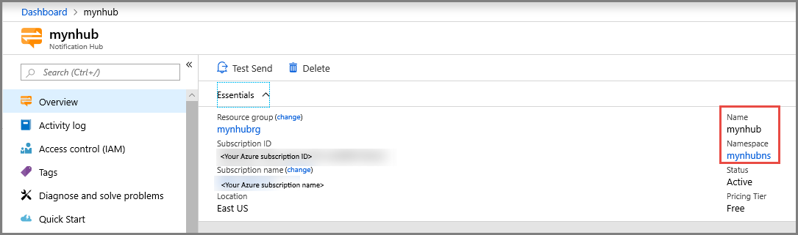
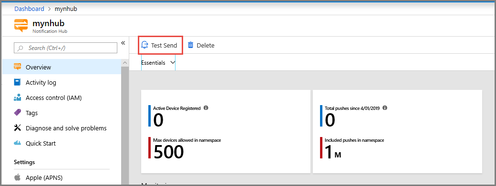
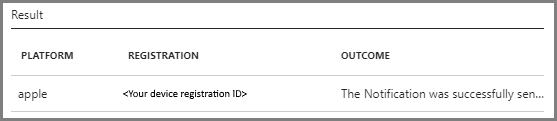
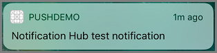

# Tutorial: Push notifications to Swift iOS apps using the Notification Hubs REST API
The article provides a high-level overview of the available options for connecting your client app to Notification Hubs. Then, it shows you how to connect a Swift-based iOS app to a notification hub from the client using the [REST API](/rest/api/notificationhubs/).  

## Overview 
Push notifications enable backend services to push information to mobile devices even when the app on the device isn't active. They can aid in keeping users engaged, app content up-to-date, and supporting other asynchronous workflows. While the infrastructure required for push notifications is fairly complex, [Azure Notification Hub](notification-hubs-push-notification-overview.md) abstracts the details of the underlying **PNS (Platform Notification Service)** enabling you to send mobile push notifications to any mobile platform with a single API call. For a detailed overview of Azure Notification Hubs, see [Introduction to Azure Notification Hubs](notification-hubs-push-notification-overview.md). 

### Connect to Notification Hubs
There are a couple of key decisions to consider up-front when working with Notification Hubs:  

- Whether to handle registration directly via the client
- Deciding which **Device Registration** option to use

### Handle registrations (client vs service)
The two main patterns for registering devices with Notification Hubs are to handle it directly from the device or indirectly through an application backend service. 

Regardless of the chosen approach, you must supply a PNS handle for each device and channel. It's acquired within the client app itself. On iOS, it's provided within the *didRegisterForRemoteNotificationsWithDeviceToken* method in AppDelegate. In Android, it's provided by the Firebase identity service.  

Once you have a valid PNS handle, the device registration can be either handled by the client app directly or through a backend service.

When handled by the client directly, the backend is responsible only for sending notifications. The client assumes the responsibilities for keeping the PNS handle up-to-date on the Notification Hubs and must manage things like tags itself.

When you use a service to handle the registration, the client app must still provide an updated PNS handle each time it's launched but the service takes care of everything else.

The backend service approach is the preferred option in most cases for the following reasons:

- Ability to handle changes outside of app releases
- Enables scaling beyond a single hub
- Logic is encapsulated in a single place

While the service-based approach is advantageous in many cases, the direct approach might be considered an easier on-ramp and is perfectly sufficient for many scenarios.  

For more information about registrations, see [Registration Management](notification-hubs-push-notification-registration-management.md).

### Device registration options

Whether you choose to handle the registration directly or indirectly ([client vs service](#handle-registrations-client-vs-service)), there are currently two available options for registering a device with Notification Hubs:

#### Registration  
The original approach to connecting devices to Notification Hubs. It associates the PNS handle for a given device with tags and optionally a template. The REST APIs are XML based and not as easy to work with as with the installation APIs. However, they can be used via both [client and server SDKs](https://www.nuget.org/packages/Microsoft.Azure.NotificationHubs/).  

#### Installation  
This approach is the latest and the best approach to connecting devices to Notification Hub. It's described as an enhanced registration and has the following advantages over the original registration approach:

- Fully idempotent so you can retry it without risking duplicate registrations
- Easier to do individual pushes targeting specific devices
- Ability to update the registration without having to delete and resend in its entirety
- Nicer JSON-based API that is easier to work with overall

### Summary
Handing registration via an intermediary **service** using the installation approach is the preferred option for most. In this case, you can use either the [Notification Hubs SDK](https://www.nuget.org/packages/Microsoft.Azure.NotificationHubs/) or the  [Notification Hubs REST API](/rest/api/notificationhubs/).

When handling registration directly via the **client** is preferred, it's a choice between using the [Notification Hubs SDK](https://www.nuget.org/packages/Microsoft.Azure.NotificationHubs/) with the original registration approach or using the [Notification Hubs REST API](/rest/api/notificationhubs/) to use the newer (and best) installation approach.  When handling the registration from the client itself, the client SDK does not yet support the preferred [installation approach](notification-hubs-push-notification-registration-management.md#installations), so you must use the [REST API](/rest/api/notificationhubs/).

## Walkthrough
This walkthrough provides step-by-step instructions for connecting a Swift-based iOS app to a notification hub from the client using the [REST API](/rest/api/notificationhubs/).  

## Prerequisites
To follow along, you need:

- An active [Apple Developer Account](https://developer.apple.com) 
- A Mac with Xcode along with a valid developer certificate installed into your Keychain
- A physical iPhone device you can run and debug with (it is not possible to test push notifications with the simulator)
- Your physical iPhone device registered in the [Apple Portal](https://developer.apple.com) and associated with your certificate
- An [Azure Subscription](https://portal.azure.com) where you can create and manage resources

It should be possible to follow along to create this first-principles example without prior experience. However, familiarity with the following concepts will be beneficial:

- Building iOS apps with Xcode and Swift
- Configuring an [Azure Notification Hub](notification-hubs-ios-apple-push-notification-apns-get-started.md) for iOS
- Familiarity with the [Apple Developer Portal](https://developer.apple.com) and the [Azure portal](https://portal.azure.com)

> [!NOTE]
> The notification hub will be configured to use the *Sandbox* authentication mode only. You should not use this authentication mode for production workloads.

## Use Apple developer portal
First, configure the requisite certificate for the **Notification Hub**, and a specific **App ID** and **Provisioning Profile** for the client app. The high-level steps are:  

- Generate the **CSR** (Certificate Signing Request)
- Register the app (**App ID**) for push notifications
- Create a **Provisioning Profile** for the app 

[!INCLUDE [Notification Hubs Enable Apple Push Notifications](../../includes/notification-hubs-enable-apple-push-notifications.md)]

## Use Xcode
In this section, you'll build the iOS app that will connect to the notification hub.  

### Create an iOS project
1. In **Xcode**, create a new iOS project and select the **Single View Application** template.
2. When setting the options for the new project, follow these steps:
    1. Use the same **Product Name** (that is, **PushDemo**) and **Organization Identifier** (that is, `com.<organization>`) that you used when the **Bundle Identifier** was set in the **Apple Developer Portal**. 
    2. Choose the **Team** that the **App ID** was set up for.
    3. Set the **language** to **Swift**.
    4. Click **Next**
3. Create a new folder called **SupportingFiles**.
4. Create a new **plist** file called **devsettings.plist** under the **SupportingFiles** folder. Be sure to add this folder to your **gitignore** file so it isn't committed when working with a **git repo**. In a production app, you would likely be conditionally setting these secrets as part of an automated build process however it's not covered as part of this walkthrough.
5. Update **devsettings.plist** to include the following configuration entries (using your own values from the **Notification Hub** you provisioned):

   | Key                            | Type                     | Value                     |               
   |--------------------------------| -------------------------| --------------------------|
   | notificationHubKey             | String                   | \<hubKey\>                |
   | notificationHubKeyName         | String                   | \<hubKeyName\>            |
   | notificationHubName            | String                   | \<hubName\>               |
   | notificationHubNamespace       | String                   | \<hubNamespace\>          |
    
   You can find the requisite values by navigating to the **Notification Hub** resource in the **Azure portal**. You can find the **notificationHubName** and the **notificationHubNamespace** values in the top-right corner of the **Essentials** summary within the **Overview** page.

   

   You can find the **notificationHubKeyName** and **notificationHubKey** values by navigating to **Access Policies**, clicking on the respective **Access Policy**. For example, `DefaultFullSharedAccessSignature`. Then copy from the **Primary Connection String** the value prefixed with `SharedAccessKeyName=` for `notificationHubKeyName` and the value prefixed with `SharedAccessKey=` for the `notificationHubKey`. The connection string should be in the following format:
    
   ```xml
   Endpoint=sb://<namespace>.servicebus.windows.net/;SharedAccessKeyName=<notificationHubKeyName>;SharedAccessKey=<notificationHubKey>
   ```

   To keep it simple, you'll use *DefaultFullSharedAccessSignature* so you can use the token to send notifications as well. However, in practice the `DefaultListenSharedAccessSignature` would be a better choice for situations where you only want to receive notifications.       
6. Under **Project Navigator**, click the **Project Name**, then click the **General** tab
7. Find **Identity**, then set the **Bundle Identifier** value so it matches the one used for the **App ID** (from the earlier step) that is, `'com.<organization>.PushDemo'`
8. Find **Signing**, then make sure you select the appropriate **Team** for your **Apple Developer Account** (the one under which you had created your certificates and profiles earlier).  **Xcode** should automatically pull down the appropriate **Provisioning Profile** based on the **Bundle Identifier**. If you don't see the new **Provisioning Profile**, try refreshing the profiles for the **Signing Identity** (*Xcode > Preferences > Account > View Details*). Clicking on the **Signing Identity**, then clicking the **Refresh** button in the bottom-right should download the profiles.
9. Select the **Capabilities** tab and ensure that **push notifications** are enabled.
10. Open your **AppDelegate.swift** file to implement the *UNUserNotificationCenterDelegate* protocol and add the following code to the top of the class:
    
    ```swift
    @UIApplicationMain
    class AppDelegate: UIResponder, UIApplicationDelegate, UNUserNotificationCenterDelegate {
        
        ...

        var configValues: NSDictionary?
        var notificationHubNamespace : String?
        var notificationHubName : String?
        var notificationHubKeyName : String?
        var notificationHubKey : String?
        let tags = ["12345"]
        let genericTemplate = PushTemplate(withBody: "{\"aps\":{\"alert\":\"$(message)\"}}")
        
        ...
    }
    ```

    You'll use these members later. The *tags* and *genericTemplate* will be used as part of the registration. For more information on tags, see [Tags for registrations](notification-hubs-tags-segment-push-message.md) and [Template registrations](notification-hubs-templates-cross-platform-push-messages.md).
 
11. In the same file, add the following code in the *didFinishLaunchingWithOptions* function:

    ```swift
    if let path = Bundle.main.path(forResource: "devsettings", ofType: "plist") {
        if let configValues = NSDictionary(contentsOfFile: path) {
            self.notificationHubNamespace = configValues["notificationHubNamespace"] as? String
            self.notificationHubName = configValues["notificationHubName"] as? String
            self.notificationHubKeyName = configValues["notificationHubKeyName"] as? String
            self.notificationHubKey = configValues["notificationHubKey"] as? String
        }
    }
        
    if #available(iOS 10.0, *){
        UNUserNotificationCenter.current().delegate = self
        UNUserNotificationCenter.current().requestAuthorization(options: [.alert, .sound, .badge]) {
            (granted, error) in
                
            if (granted)
            {
                DispatchQueue.main.async {
                    application.registerForRemoteNotifications()
                }
            }
        }
    }

    return true
    ```

    This code retrieves the setting values from **devsettings.plist**, sets the **AppDelegate** class as the *UNUserNotificationCenter* delegate, requests authorization for push notifications, and then calls *registerForRemoteNotifications*.
	
	To keep it simple, the code supports **iOS 10 and above only**. You can add the support for older OS versions by conditionally using the respective APIs and approaches as you would normally do.

12. In the same file, add the following functions:

    ```swift
    func application(_ application: UIApplication, didRegisterForRemoteNotificationsWithDeviceToken deviceToken: Data) {
        let installationId = (UIDevice.current.identifierForVendor?.description)!
        let pushChannel = deviceToken.reduce("", {$0 + String(format: "%02X", $1)})
    }

    func showAlert(withText text : String) {
        let alertController = UIAlertController(title: "PushDemo", message: text, preferredStyle: UIAlertControllerStyle.alert)
        alertController.addAction(UIAlertAction(title: "OK", style: UIAlertActionStyle.default,handler: nil))
        self.window?.rootViewController?.present(alertController, animated: true, completion: nil)
    }
    ```

    The code uses the *installationId* and *pushChannel* values to register with the **Notification Hub**. In this case, you're using *UIDevice.current.identifierForVendor* to provide us with a unique value to identify the device and then perform some formatting on the *deviceToken* to provide us with the desired *pushChannel* value. The *showAlert* function is simply to facilitate the display of some message text for demonstration purposes.

13. Still in **AppDelegate.swift**, add the *willPresent* and *didReceive* **UNUserNotificationCenterDelegate** functions to display an alert when the notification arrived when the app is running in the foreground and background respectively
    
    ```swift
    @available(iOS 10.0, *)
    func userNotificationCenter(_ center: UNUserNotificationCenter, 
        willPresent notification: UNNotification, 
        withCompletionHandler completionHandler: @escaping (UNNotificationPresentationOptions) -> Void) {
        showAlert(withText: notification.request.content.body)
    }
    
    @available(iOS 10.0, *)
    func userNotificationCenter(_ center: UNUserNotificationCenter, 
        didReceive response: UNNotificationResponse, 
        withCompletionHandler completionHandler: @escaping () -> Void) {
        showAlert(withText: response.notification.request.content.body)
    }
    ```    

14. Add print statements to the bottom of the *didRegisterForRemoteNotificationsWithDeviceToken* function to verify that *installationId* and *pushChannel* are being assigned values
15. Create folders (**Models**, **Services**, and **Utilities**) for the foundational components you'll be adding to the project later
16. Check that the project builds and runs on a physical device (push notifications cannot be tested using the simulator)

### Create models
In this step, you will create a set of models to represent the [Notification Hubs REST API](/rest/api/notificationhubs/) payloads and to store the required **SAS token** data.


1.  Add a new swift file to the **Models** called **PushTemplate.swift**. This model provides a struct representing the **BODY** of an individual template as part of the **DeviceInstallation** payload:
    
    ```swift
    import Foundation

    struct PushTemplate : Codable {
        let body : String
    
        init(withBody body : String) {
            self.body = body
        }
    }
    ```

2. Add a new swift file to the **Models** folder named **DeviceInstallation.swift**. This file defines a struct representing the payload for creating or updating a **Device Installation**. Add the following code to the file:
    
    ```swift
    import Foundation

    struct DeviceInstallation : Codable {
        let installationId : String
        let pushChannel : String
        let platform : String = "apns"
        var tags : [String]
        var templates : Dictionary<String, PushTemplate>
    
        init(withInstallationId installationId : String, andPushChannel pushChannel : String) {
            self.installationId = installationId
            self.pushChannel = pushChannel
            self.tags = [String]()
            self.templates = Dictionary<String, PushTemplate>()
        }
    }
    ```

3.  Add a new swift file under **Models** called **TokenData.swift**. This model will be used to store a **SAS token** along with its expiration

    ```swift
    import Foundation

    struct TokenData {
    
        let token : String
        let expiration : Int

        init(withToken token : String, andTokenExpiration expiration : Int) {
            self.token = token
            self.expiration = expiration
        }
    }
    ```

### Generate a SAS token
**Notification Hubs** use the same security infrastructure as **Azure Service Bus**. To call the REST API, you'll need to [programmatically generate a SAS token](/rest/api/eventhub/generate-sas-token) that can be used in the **Authorization** header of the request.  

The resulting token will be in the following format: 

```xml
SharedAccessSignature sig=<UrlEncodedSignature>&se=<ExpiryEpoch>&skn=<KeyName>&sr=<UrlEncodedResourceUri>
```

The process itself involves the same six key steps:  

1. 	Computing the expiry in [UNIX Epoch time](https://en.wikipedia.org/wiki/Unix_time) format (seconds elapsed since 00:00:00 UTC 1 January 1970)
2.  Formatting the **ResourceUrl** (representing the resource you are trying to access, that is, `'https://\<namespace\>.servicebus.windows.net/\<hubName\>'`) so it is percent-encoded and lowercase
3.  Preparing the **StringToSign**, which is composed of `'\<**UrlEncodedResourceUrl**\>\n\<**ExpiryEpoch**\>'`
4.  Computing (and base 64 encoding) the **Signature** using the **HMAC-SHA256** of the **StringToSign** value with the **Key** part of the **Connection String** (for the respective **Authorization Rule**)
5.  Formatting the base 64 encoded **Signature** so it is percent encoded
6.  Constructing the **token** in the expect format using the aforementioned **UrlEncodedSignature**, **ExpiryEpoch**, **KeyName**, and **UrlEncodedResourceUrl** values

See the [Azure Service Bus documentation](../service-bus-messaging/service-bus-sas.md) for a more thorough overview of **Shared Access Signature** and how it is used by **Azure Service Bus** and **Notification Hubs**.

For the purposes of this Swift example, you're going to use Apple's open-source **CommonCrypto** library to facilitate the hashing of the signature. As it's a C library, it is not accessible in Swift out-of-the-box. However, you can make this available using a bridging header. To add and configure the bridging header:

1. In **Xcode**, go to **File**, then **New**, then **File** and Select **Header File** naming it *'BridgingHeader.h'*
2. Edit the file to import **CommonHMAC**

    ```swift
    #import <CommonCrypto/CommonHMAC.h>

    #ifndef BridgingHeader_h
    #define BridgingHeader_h


    #endif /* BridgingHeader_h */
    ```

3. Update the Target’s **Build Settings** to reference the bridging header. Open the **Building Settings** tab and scroll down to the **Swift Compiler** section. Ensure that the **Install Objective-C Compatibility Header** option set to **Yes** and enter the filepath to our bridging header into the **Objective-C bridging Header** option that is `'\<ProjectName\>/BridgingHeader.h'`. If you can't find these options, ensure you have the **All** view selected (rather than **Basic** or **Customized**).
    
   There are many third-party open-source wrapper libraries available, which might make using **CommonCrypto** a bit easier. It's beyond the scope of this article.

4. Add a new Swift file under the **Utilities** folder called **TokenUtility.swift** and add the following code:

   ```swift
   import Foundation

   struct TokenUtility {    
        typealias Context = UnsafeMutablePointer<CCHmacContext>
    
        static func getSasToken(forResourceUrl resourceUrl : String, withKeyName keyName : String, andKey key : String, andExpiryInSeconds expiryInSeconds : Int = 3600) -> TokenData {
            let expiry = (Int(NSDate().timeIntervalSince1970) + expiryInSeconds).description
            let encodedUrl = urlEncodedString(withString: resourceUrl)
            let stringToSign = "\(encodedUrl)\n\(expiry)"
            let hashValue = sha256HMac(withData: stringToSign.data(using: .utf8)!, andKey: key.data(using: .utf8)!)
            let signature = hashValue.base64EncodedString(options: .init(rawValue: 0))
            let encodedSignature = urlEncodedString(withString: signature)
            let sasToken = "SharedAccessSignature sr=\(encodedUrl)&sig=\(encodedSignature)&se=\(expiry)&skn=\(keyName)"
            let tokenData = TokenData(withToken: sasToken, andTokenExpiration: expiryInSeconds)
        
            return tokenData
        }
    
        private static func sha256HMac(withData data : Data, andKey key : Data) -> Data {
            let context = Context.allocate(capacity: 1)
            CCHmacInit(context, CCHmacAlgorithm(kCCHmacAlgSHA256), (key as NSData).bytes, size_t((key as NSData).length))
            CCHmacUpdate(context, (data as NSData).bytes, (data as NSData).length)
            var hmac = Array<UInt8>(repeating: 0, count: Int(CC_SHA256_DIGEST_LENGTH))
            CCHmacFinal(context, &hmac)
        
            let result = NSData(bytes: hmac, length: hmac.count)
            context.deallocate()
        
            return result as Data
        }
    
        private static func urlEncodedString(withString stringToConvert : String) -> String {
            var encodedString = ""
            let sourceUtf8 = (stringToConvert as NSString).utf8String
            let length = strlen(sourceUtf8)
        
            let charArray: [Character] = [ ".", "-", "_", "~", "a", "z", "A", "Z", "0", "9"]
            let asUInt8Array = String(charArray).utf8.map{ Int8($0) }
        
            for i in 0..<length {
                let currentChar = sourceUtf8![i]
            
                if (currentChar == asUInt8Array[0] || currentChar == asUInt8Array[1] || currentChar == asUInt8Array[2] || currentChar == asUInt8Array[3] ||
                    (currentChar >= asUInt8Array[4] && currentChar <= asUInt8Array[5]) ||
                    (currentChar >= asUInt8Array[6] && currentChar <= asUInt8Array[7]) ||
                    (currentChar >= asUInt8Array[8] && currentChar <= asUInt8Array[9])) {
                    encodedString += String(format:"%c", currentChar)
                }
                else {
                    encodedString += String(format:"%%%02x", currentChar)
                }
            }
        
            return encodedString
        }
    }
   ```
    
    This utility encapsulates the logic responsible for generating the **SAS token**. The *getSasToken* function orchestrates the high-level steps required to prepare the token, as outlined previously, and will be called by the installation service in the steps later in this tutorial. The other two functions are called by the *getSasToken function*; *sha256HMac* for computing the signature and *urlEncodedString* for encoding the respective Url string. The *urlEncodedString* function was required as it was not possible to achieve the required output using the built-in *addingPercentEncoding* function. The [Azure Storage iOS SDK](https://github.com/Azure/azure-storage-ios/blob/master/Lib/Azure%20Storage%20Client%20Library/Azure%20Storage%20Client%20Library/AZSUtil.m) served as an excellent example of how to approach these operations albeit in Objective-C. Further information on **Azure Service Bus SAS tokens** can be found in the [Azure Service Bus documentation](../service-bus-messaging/service-bus-sas.md). 

### Verify the SAS token
Before you implement the installation service in the client, you can check that our app is correctly generating the **SAS token** using your http utility of choice. For the purposes of this post, our tool of choice will be **Postman**.

Take a note of the *installationId* and the *token* values being generated by the app using an appropriately placed print statement or breakpoint. 

Follow these steps to call the *installations* API:

1. In **Postman**, open a new tab
2. Set the request to **GET** and the following address:

    ```xml
    https://<namespace>.servicebus.windows.net/<hubName>/installations/<installationId>?api-version=2015-01
    ```

3. Configure the request headers as follows:
    
   | Key           | Value            |
   | ------------- | ---------------- |
   | Content-Type  | application/json |
   | Authorization | \<sasToken\>     |
   | x-ms-version  | 2015-01          |

4. Click on the **Code** button (top-right under the **Save** button). The request should look similar to the example below:

    ```html
    GET /<hubName>/installations/<installationId>?api-version=2015-01 HTTP/1.1
    Host: <namespace>.servicebus.windows.net
    Content-Type: application/json
    Authorization: <sasToken>
    x-ms-version: 2015-01
    Cache-Control: no-cache
    Postman-Token: <postmanToken>
    ```

5. Click the **Send** button

No registration exists for the specified *installationId* at this point, however it should result in a **404 Not Found** response rather than **401 Unauthorized**. This result should confirm that the **SAS token** has been accepted.

### Implement the installation service class
Next you'll implement our basic wrapper around the [Installations REST API](/rest/api/notificationhubs/create-overwrite-installation).  

Add a new Swift file under the **Services** folder called **NotificationRegistrationService.swift**, then add the following code to this file:

```swift
import Foundation

class NotificationRegistrationService {
    private let tokenizedBaseAddress: String = "https://%@.servicebus.windows.net/%@"
    private let tokenizedCreateOrUpdateInstallationRequest = "/installations/%@?api-version=%@"
    private let session = URLSession(configuration: URLSessionConfiguration.default)
    private let apiVersion = "2015-01"
    private let jsonEncoder = JSONEncoder()
    private let defaultHeaders: [String : String]
    private let installationId : String
    private let pushChannel : String
    private let hubNamespace : String
    private let hubName : String
    private let keyName : String
    private let key : String
    private var tokenData : TokenData? = nil
    
    init(withInstallationId installationId : String,
            andPushChannel pushChannel : String,
            andHubNamespace hubNamespace : String,
            andHubName hubName : String,
            andKeyName keyName : String,
            andKey key: String) {
        self.installationId = installationId
        self.pushChannel = pushChannel
        self.hubNamespace = hubNamespace
        self.hubName = hubName
        self.keyName = keyName
        self.key = key
        self.defaultHeaders = ["Content-Type": "application/json", "x-ms-version": apiVersion]
    }
    
    func register(
        withTags tags : [String]? = nil,
        andTemplates templates : Dictionary<String, PushTemplate>? = nil,
        completeWith completion: ((_ result: Bool) -> ())? = nil) {
        
        var deviceInstallation = DeviceInstallation(withInstallationId: installationId, andPushChannel: pushChannel)
        
        if let tags = tags {
            deviceInstallation.tags = tags
        }
        
        if let templates = templates {
            deviceInstallation.templates = templates
        }
        
        if let deviceInstallationJson = encodeToJson(deviceInstallation) {
            let sasToken = getSasToken()
            let requestUrl = String.init(format: tokenizedCreateOrUpdateInstallationRequest, installationId, apiVersion)
            let apiEndpoint = "\(getBaseAddress())\(requestUrl)"
            
            var request = URLRequest(url: URL(string: apiEndpoint)!)
            request.httpMethod = "PUT"
            
            for (key,value) in self.defaultHeaders {
                request.addValue(value, forHTTPHeaderField: key)
            }
            
            request.addValue(sasToken, forHTTPHeaderField: "Authorization")
            request.httpBody = Data(deviceInstallationJson.utf8)
            
            (self.session.dataTask(with: request) { dat, res, err in
                if let completion = completion {
                        completion(err == nil && (res as! HTTPURLResponse).statusCode == 200)
                }
            }).resume()
        }
    }
    
    private func getBaseAddress() -> String {
        return String.init(format: tokenizedBaseAddress, hubNamespace, hubName)
    }
    
    private func getSasToken() -> String {
        if (tokenData == nil ||
            Date(timeIntervalSince1970: Double((tokenData?.expiration)!)) < Date(timeIntervalSinceNow: -(5 * 60))) {
            self.tokenData = TokenUtility.getSasToken(forResourceUrl: getBaseAddress(), withKeyName: self.keyName, andKey: self.key)
        }

        return (tokenData?.token)!
    }
    
    private func encodeToJson<T : Encodable>(_ object: T) -> String? {
        do {
            let jsonData = try jsonEncoder.encode(object)
            if let jsonString = String(data: jsonData, encoding: .utf8) {
                return jsonString
            } else {
                return nil
            }
        }
        catch {
            return nil
        }
    }
}
```
 
The requisite details are provided as part of initialization. Tags and templates are optionally passed into the *register* function to form part of the **Device Installation** JSON payload.  

The *register* function calls out to the other private functions to prepare the request. Once a response is received, the completion is called indicating whether the registration was successful or not.  

The request endpoint is constructed by the *getBaseAddress* function using the **Notification Hub** parameters **namespace** and **name** provided during initialization.  

The *getSasToken* function will check whether the currently stored token is valid, otherwise it will call out to the **TokenUtility** to generate a new one and store it before returning a value. 

Finally the *encodeToJson* will convert the respective model objects into JSON for use as part of the request body.

### Invoke the Notification Hubs REST API
The last step is to update **AppDelegate** to use the **NotifiationRegistrationService** to register with our **NotificationHub**. 

1. Open **AppDelegate.swift** and add a class-level variable to store a reference to the **NoficiationRegistrationService**:

    ```swift
    var registrationService : NotificationRegistrationService?
    ```

2. In the same file, update the *didRegisterForRemoteNotificationsWithDeviceToken* function to initialize the **NotificationRegistrationService** with the requisite parameters, then call the *register* function.

    ```swift
    func application(_ application: UIApplication, didRegisterForRemoteNotificationsWithDeviceToken deviceToken: Data) {
        let installationId = (UIDevice.current.identifierForVendor?.description)!
        let pushChannel = deviceToken.reduce("", {$0 + String(format: "%02X", $1)})

        // Initialize the Notification Registration Service
        self.registrationService = NotificationRegistrationService(
            withInstallationId: installationId,
            andPushChannel: pushChannel,
            andHubNamespace: notificationHubNamespace!,
            andHubName: notificationHubName!,
            andKeyName: notificationHubKeyName!,
            andKey: notificationHubKey!)
    
        // Call register passing in the tags and template parameters
        self.registrationService!.register(withTags: tags, andTemplates: ["genericTemplate" : self.genericTemplate]) { (result) in
            if !result {
                print("Registration issue")
            } else {
                print("Registered")
            }
        }
    }
    ```

    To keep it simple, you're going to use a couple of print statements to update the output window with the result of the *register* operation. 

3. Now build and run the app (on a physical device). You should see **"Registered"** in the output window.

## Test the solution
At this stage, our app should have registered with **NotificationHub** and should be able to receive push notifications. In **Xcode**, stop the debugger and close the app (if it is currently running). Next, you'll check that the **Device Installation** details are as expected and that our app can now indeed receive push notifications.  

### Verify the device installation
You can now make the same request as you did earlier using **Postman** for [verifying the SAS token](#verify-the-sas-token). Assuming that the **SAS token** has not expired, the response should now include the installation details you provided such as the templates and tags.  

```json
{
    "installationId": "<installationId>",
    "pushChannel": "<pushChannel>",
    "pushChannelExpired": false,
    "platform": "apns",
    "expirationTime": "9999-12-31T23:59:59.9999999Z",
    "tags": [
        "12345"
    ],
    "templates": {
        "genericTemplate": {
            "body": "{\"aps\":{\"alert\":\"$(message)\"}}",
            "tags": [
                "genericTemplate"
            ]
        }
    }
}
```

### Send a test notification (Azure portal)
The quickest way to test that you can now receive notifications is to navigate to the **Notification Hub** in the **Azure portal**.

1. In the **Azure portal**, navigate to the **Overview** tab on your **Notification Hub**
2. Click **Test Send** (top-left) above the **Essentials** summary

    
3. Choose **Custom Template** from the list of **Platforms**
4. Enter **12345** for the **Send to Tag Expression** (you had specified this tag in our installation)
5. Optionally, edit the **message** in the JSON payload
    
    
6. Click **Send** and the portal should indicate whether the notification was sent to the device successfully

    

You should also get a notification appear in **Notification Center** on our device (assuming the app is not running in the foreground). Tapping on the notification should open the app and show the alert containing our message.  



### Send a test notification (Postman)
You can send notifications via the respective [REST API](/rest/api/notificationhubs/) via **Postman** as well and it may be a more convenient way to test. 

1. In **Postman**, open a new tab
2. Set the request to **POST** and enter the following address:

    ```xml
    https://<namespace>.servicebus.windows.net/<hubName>/messages/?api-version=2015-01
    ```

3. Configure the request headers as follows:
    
   | Key                            | Value                          |
   | ------------------------------ | ------------------------------ |
   | Content-Type                   | application/json;charset=utf-8 |
   | Authorization                  | \<sasToken\>                   |
   | ServiceBusNotification-Format  | template                       |
   | Tags                           | "12345"                        |

4. Configure the request **BODY** to use **RAW - JSON (application.json)** with the following JSON payload:

    ```json
    {
       "message" : "Hello from Postman!"
    }
    ```

5. Click on the **Code** button (top-right under the **Save** button). The request should look similar to the example below:

    ```html
    POST /<hubName>/messages/?api-version=2015-01 HTTP/1.1
    Host: <namespace>.servicebus.windows.net
    Content-Type: application/json;charset=utf-8.
    ServiceBusNotification-Format: template
    Tags: "12345"
    Authorization: <sasToken>
    Cache-Control: no-cache
    Postman-Token: <postmanToken>

    {
        "message" : "Hello from Postman!"
    }
    ```

5. Click the **Send** button

You should get a success status code and receive the notification on the client device.

## Next steps
You now have a basic iOS Swift app connected to a **Notification Hub** via the [REST API](/rest/api/notificationhubs/) and should be able to send and receive notifications. For more information, see the following articles: 

- [Azure Notification Hubs overview](notification-hubs-push-notification-overview.md)
- [Notification Hubs REST APIs](/rest/api/notificationhubs/)
- [Notification Hubs SDK for backend operations](https://www.nuget.org/packages/Microsoft.Azure.NotificationHubs/)
- [Notification Hubs SDK on GitHub](https://github.com/Azure/azure-notificationhubs)
- [Register with application backend](notification-hubs-ios-aspnet-register-user-from-backend-to-push-notification.md)
- [Registration management](notification-hubs-push-notification-registration-management.md)
- [Working with tags](notification-hubs-tags-segment-push-message.md) 
- [Working with custom templates](notification-hubs-templates-cross-platform-push-messages.md)
- [Service Bus access control with Shared Access Signatures](../service-bus-messaging/service-bus-sas.md)
- [Programmatically generate SAS tokens](/rest/api/eventhub/generate-sas-token)
- [Apple security: common crypto](https://developer.apple.com/security/)
- [UNIX Epoch time](https://en.wikipedia.org/wiki/Unix_time)
- [HMAC](https://en.wikipedia.org/wiki/HMAC)
