# Get started with Notification Hubs for Kindle apps

[!INCLUDE [notification-hubs-selector-get-started](../../includes/notification-hubs-selector-get-started.md)]

This tutorial shows you how to use Azure Notification Hubs to send push notifications to a Kindle application. You create a blank Kindle app that receives push notifications by using Amazon Device Messaging (ADM).

In this tutorial, you create/update code to do the following tasks:

> [!div class="checklist"]
> * Add a new app to the developer portal
> * Create an API key
> * Create and configure a notification hub
> * Set up your application
> * Create your ADM message handler
> * Add your API key to your app
> * Run the app
> * Send a test notification

## Prerequisites

- [Android Studio](https://developer.android.com/studio/?gclid=CjwKCAjwwZrmBRA7EiwA4iMzBPZ9YYmR0pbb5LtjnWhWCxe8PWrmjmeaR6ad5ksCr_j2mmkVj_-o6hoCAqwQAvD_BwE).
- Follow the steps in [Setting Up Your Development Environment](https://developer.amazon.com/docs/fire-tablets/ft-set-up-your-development-environment.html) to set up your development environment for Kindle.

## Add a new app to the developer portal

1. Sign into the [Amazon Developer Portal](https://developer.amazon.com/apps-and-games/console/apps/list.html).
2. Select **Add New App**, and then select **Android**.  

    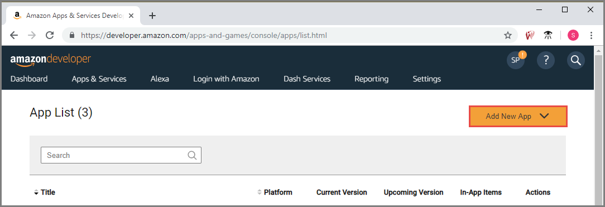
1. On the **New App Submission** page, follow these steps to get the **application key**:
    1. Enter a name for the **App title**.
    2. Select any **category** (for example: education)
    4. Enter an email address for the **Customer support email address** field. 
    5. Select **Save**.

        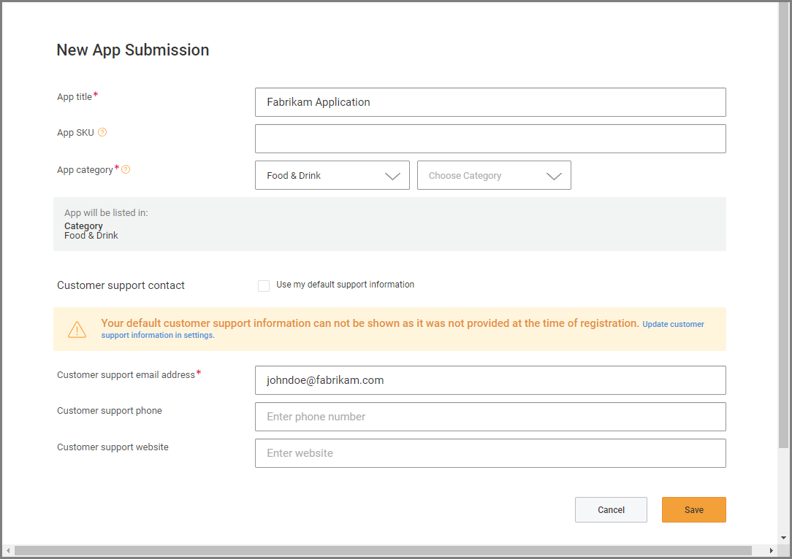 
2.  At the top, switch to the **App Services** tab.

    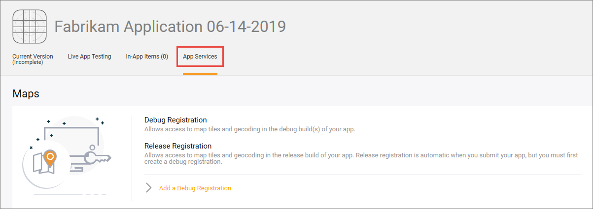
1. On the **App Services** tab, scroll down, and select **View Mobile Ads** in the **Mobile Ads** section. You see the **Mobile Ads** page in a new tab in the web browser. 

    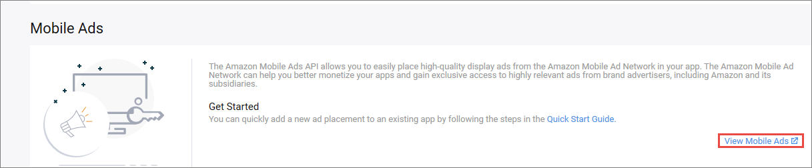
1. On the **Mobile Ads** page, do the following steps: 
    1. Specify whether your app is directed primarily at kids under 13. For this tutorial, select **No**.
    1. Select **Submit**. 

        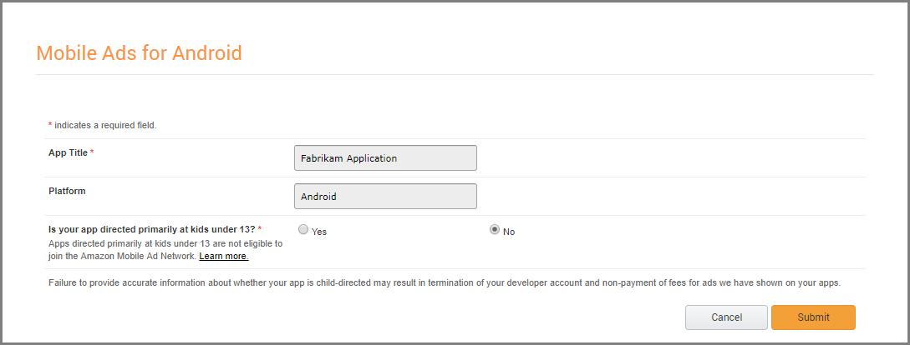
    3. Copy the **application key** from the **Mobile Ads** page. 

        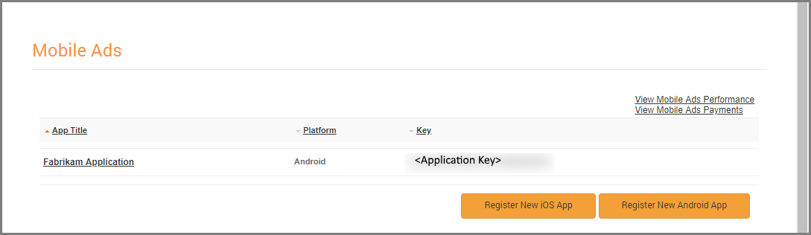
3.  Now, switch to the web browser's tab that has the **App Services** tab open, and do the following steps:
    1. Scroll to the **Device Messaging** section.     
    1. Expand **Select existing security profile or create new**, and then select **Create Security Profile**. 

        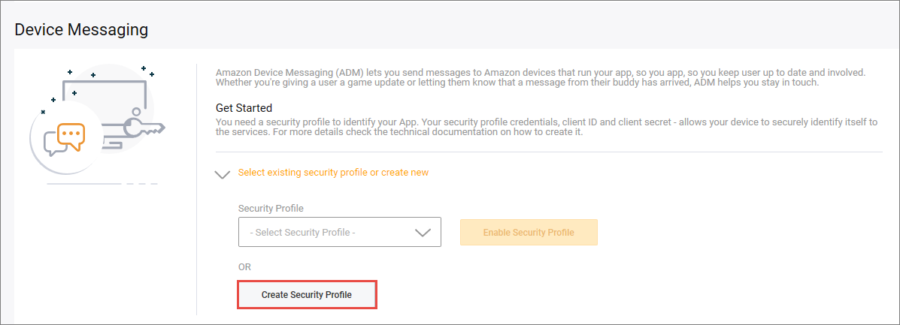
    1. Enter a **name** for your security profile. 
    2. Enter **description** for your security profile. 
    3. Select **Save**. 

        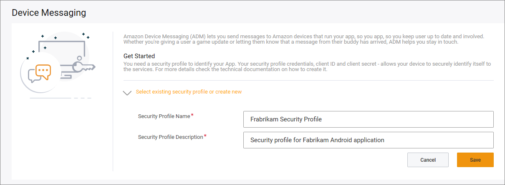
    1. Select **Enable Device Messaging** to enable device messaging on this security profile. 

        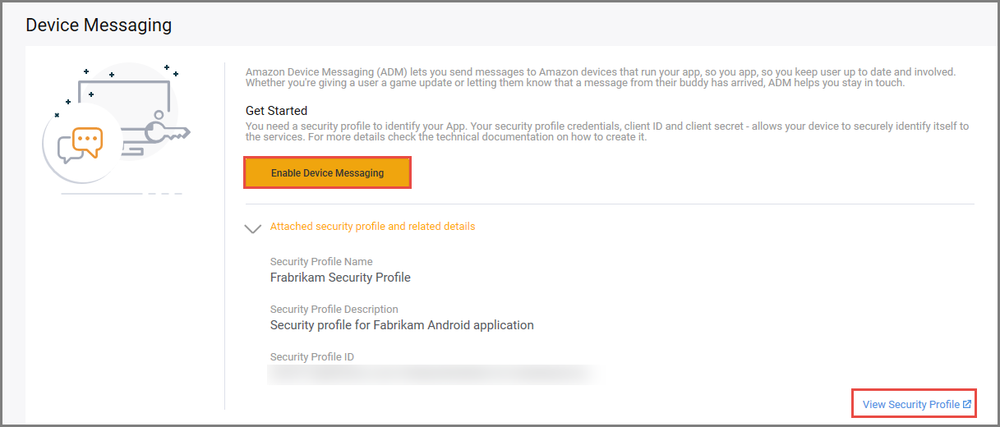
    1. Then, select **View Security Profile** on the result page. 
1. Now, on the **Security Profile** page, do the following steps: 
    1. Switch to the **Web Settings** tab, and copy the **Client ID** and **Client Secret** value for later use. 

        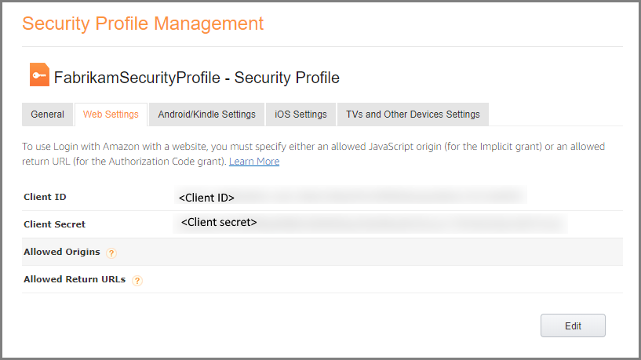 
    2. Switch to the **Android/Kindle Settings** page, and keep the page open. You'll enter these values in the next section. 

## Create an API key
1. Open a command prompt with administrator privileges.
2. Navigate to the Android SDK folder.
3. Enter the following command:

    ```shell
    keytool -list -v -alias androiddebugkey -keystore ./debug.keystore
    ```
4. For the **keystore** password, type **android**.
5. Copy the **MD5** and **SHA256** fingerprints. 
6. Back in the developer portal, on the **Android/Kindle Settings** tab, do the following steps: 
    1. Enter a **name for the API key**. 
    2. enter the **name of the package** for your app (for example, **com.fabrikam.mykindleapp**) and the **MD5** value.
        
        >[!IMPORTANT]
        > When you create an app in Android Studio, use the same package name you specified here. 
    1. Paste the **MD5 signature** you copied earlier. 
    2. Paste the **SHA256 signature** you copied earlier.  
    3. Select **Generate New Key**.

        
    4. Now, select **Show** in the list to see the API key. 

        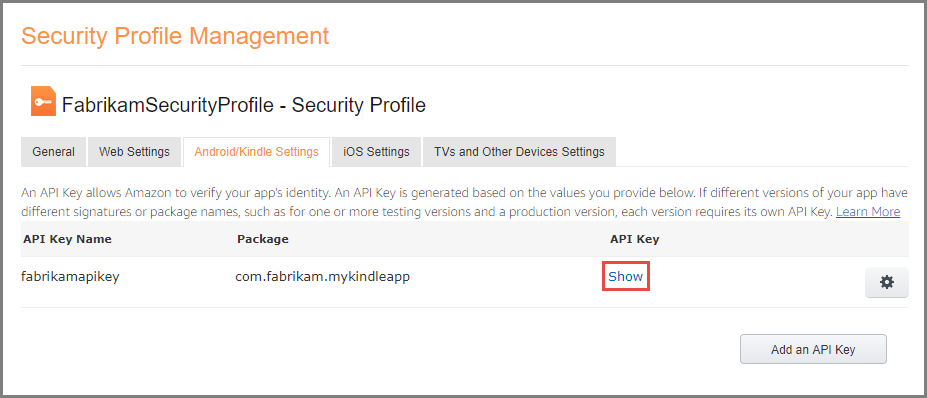 
    5. In the **API Key Details** window, copy the API Key and save it somewhere. Then, select **X** in the upper-right corner to close the window. 


## Create and configure a notification hub

1. Follow steps in the [Create an Azure notification hub in the Azure portal](create-notification-hub-portal.md) article to create a notification hub. 
2. Select **Amazon (ADM)** under **Settings** menu.
3. Paste the **Client ID** and **Client Secret** you saved earlier. 
4. Select **Save** on the toolbar. 

    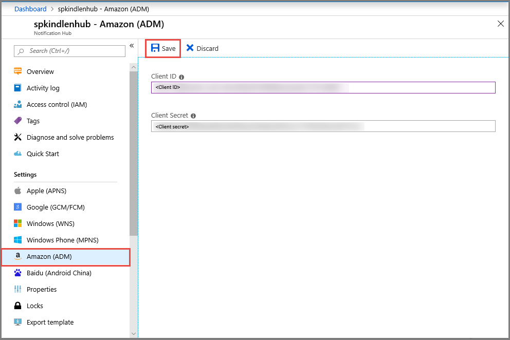
5. Select **Access Policies** on the left menu, and select the **copy** button for the connection string for the **DefaultListenSharedAccessSignature** policy. Save it somewhere. You'll use it later in the source code. 

    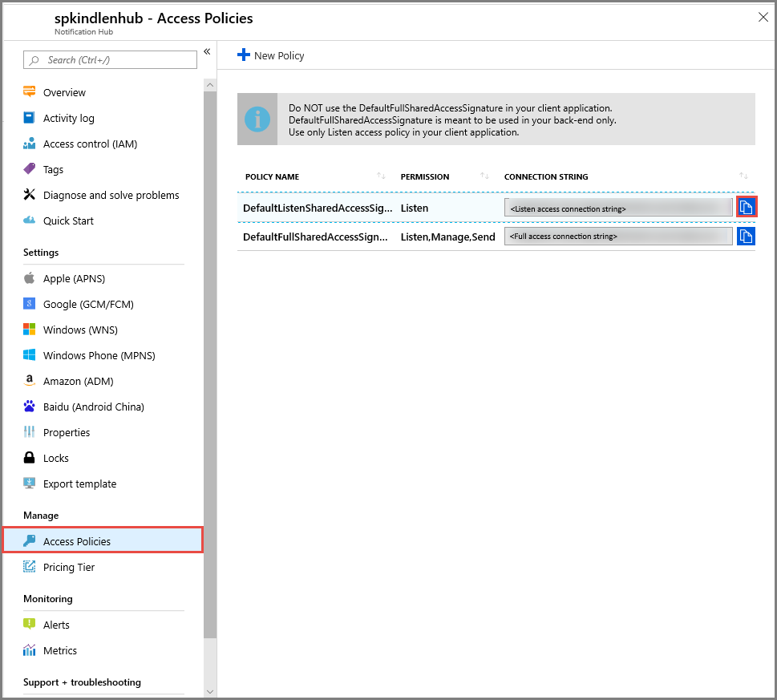    

## Set up your application

1. Launch Android Studio. 
2. Select **File**, point to **New**, and then select **New Project**. 
3. In the **Choose your project** window, on the **Phone and Tablet** tab, select **Empty Activity**, and select **Next**. 
4. In the **Configure your project** window, do the following steps:
    1. Enter a **name for your application**. You may want to match it with the name of the application you created in the Amazon Developer Portal. 
    2. Enter a **name for the package**. 
        
        >[!IMPORTANT]
        >The package name must match the package name you specified in the Amazon Developer Portal.
    3. Review and update the remaining values as appropriate. 
    4. Select **Finish**. 

        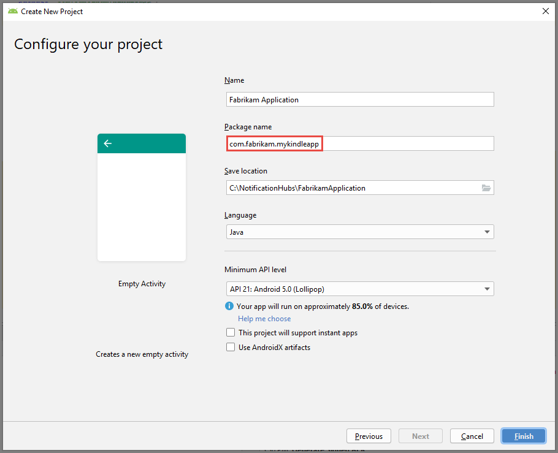
5. Download [Amazon Developer SDK for Android](https://developer.amazon.com/sdk-download) library to your hard disk. Extract the SDK zip file.
6. In Android Studio, change the folder structure from **Android** to **Project** if it isn't already set to **Project**. 

    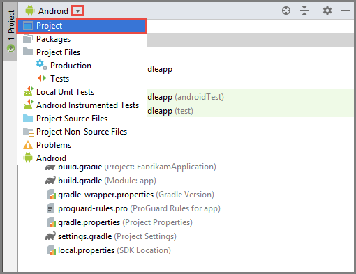
7. Expand **app** to see the **libs** folder in the tree view.     
8. In a File Explorer window, navigate to the folder where you downloaded the Amazon Android SDKs.
9. Press **CTRL** and drag-and-drop the **amazon-device-messaging-1.0.1.jar** file to the **lib** node in the tree view. 

    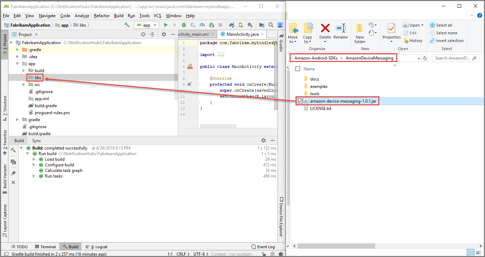
9. In the **Copy** window, select **OK**. If you see the **Move** window instead of **Copy** window, close it, and try drag-drop operation with **CTRL** button pressed. 

    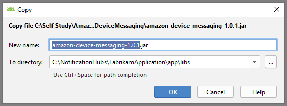
10. Add the following statement to the **app's build.gradle** file in the **dependencies** section: `implementation files('libs/amazon-device-messaging-1.0.1.jar')`. 

    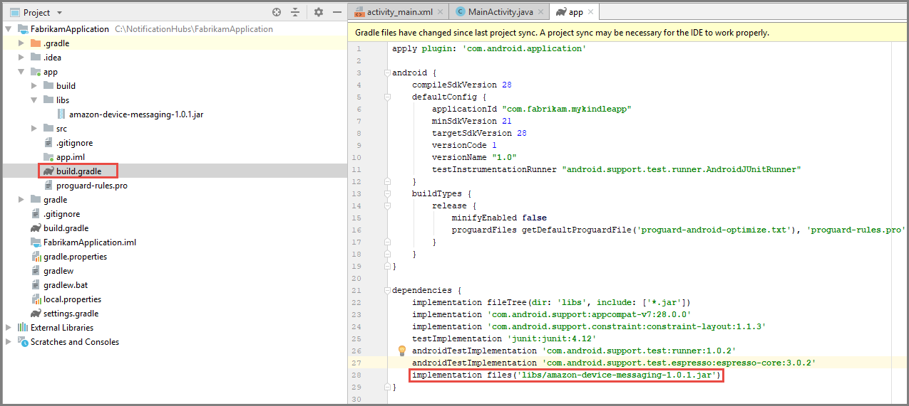
11. In the `Build.Gradle` file for the **app**, add the following lines in the **dependencies** section: 

    ```gradle
    implementation 'com.microsoft.azure:notification-hubs-android-sdk:0.6@aar'
    implementation 'com.microsoft.azure:azure-notifications-handler:1.0.1@aar'
    ```
12. Add the following repository **after** the **dependencies** section:

    ```gradle
    repositories {
        maven {
            url "https://dl.bintray.com/microsoftazuremobile/SDK"
        }
    }
    ```
13. In the editor for the **build.gradle** file for the **app**, select **Sync  now** on the toolbar. 

    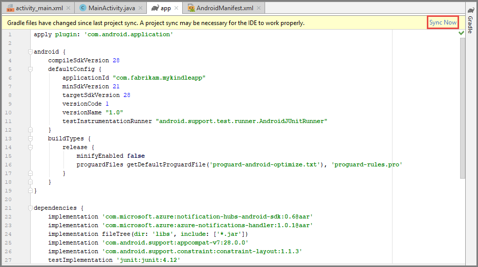
14. Switch back to the Android structure in the tree view.  Add the Amazon namespace in the root manifest element:

    ```xml
    xmlns:amazon="http://schemas.amazon.com/apk/res/android"
    ```
   
    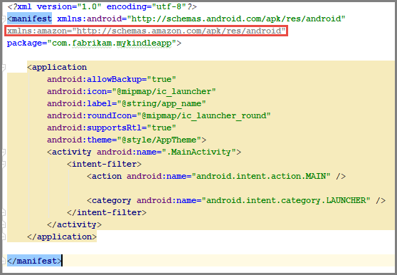
2. Add permissions as the first element under the manifest element. Replace **[YOUR PACKAGE NAME]** with the package that you used to create your app.

    ```xml
    <permission
        android:name="[YOUR PACKAGE NAME].permission.RECEIVE_ADM_MESSAGE"
        android:protectionLevel="signature" />

    <uses-permission android:name="android.permission.INTERNET"/>

    <uses-permission android:name="[YOUR PACKAGE NAME].permission.RECEIVE_ADM_MESSAGE" />

    <!-- This permission allows your app access to receive push notifications
    from ADM. -->
    <uses-permission android:name="com.amazon.device.messaging.permission.RECEIVE" />

    <!-- ADM uses WAKE_LOCK to keep the processor from sleeping when a message is received. -->
    <uses-permission android:name="android.permission.WAKE_LOCK" />
    ```
3. Insert the following element as the first child of the application element. Replace **[YOUR PACKAGE NAME]** with the package name with which you created your app. You'll create the MyADMMessageHandler class in the next step. 

    ```xml
        <amazon:enable-feature
            android:name="com.amazon.device.messaging"
            android:required="true"/>
        <service
            android:name="[YOUR PACKAGE NAME].MyADMMessageHandler"
            android:exported="false" />
        <receiver
            android:name="[YOUR PACKAGE NAME].MyADMMessageHandler$Receiver"
            android:permission="com.amazon.device.messaging.permission.SEND" >

            <!-- To interact with ADM, your app must listen for the following intents. -->
            <intent-filter>
                <action android:name="com.amazon.device.messaging.intent.REGISTRATION" />
                <action android:name="com.amazon.device.messaging.intent.RECEIVE" />
                <!-- Replace the name in the category tag with your app's package name. -->
                <category android:name="[YOUR PACKAGE NAME]" />
            </intent-filter>
        </receiver>
    ```

## Create your ADM message handler

1. Add a new class to the `com.fabrikam.mykindleapp` package in the project that inherits from `com.amazon.device.messaging.ADMMessageHandlerBase` and name it `MyADMMessageHandler`, as shown in the following image:

    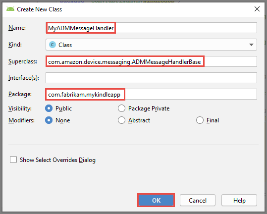

2. Add the following `import` statements to the `MyADMMessageHandler` class:

    ```java
    import android.app.NotificationManager;
    import android.app.PendingIntent;
    import android.content.Context;
    import android.content.Intent;
    import android.support.v4.app.NotificationCompat;
    import android.util.Log;
    import com.amazon.device.messaging.ADMMessageReceiver;
    import com.microsoft.windowsazure.messaging.NotificationHub;
    ```

3. Add the following code in the class that you created. Remember the `[HUB NAME]` and `[LISTEN CONNECTION STRING]` with the name of your notification hub and listen connection string: 

    ```java
    public static final int NOTIFICATION_ID = 1;
    private NotificationManager mNotificationManager;
    NotificationCompat.Builder builder;
    private static NotificationHub hub;

    public static NotificationHub getNotificationHub(Context context) {
        Log.v("com.wa.hellokindlefire", "getNotificationHub");
        if (hub == null) {
            hub = new NotificationHub("[HUB NAME]", "[HUB NAMESPACE CONNECTION STRING]", context);
        }
        return hub;
    }

    public MyADMMessageHandler() {
        super("MyADMMessageHandler");
    }

    @Override
    protected void onMessage(Intent intent) {
        String nhMessage = intent.getExtras().getString("msg");
        sendNotification(nhMessage);
    }

    @Override
    protected void onRegistrationError(String s) {

    }

    @Override
    protected void onRegistered(String s) {
        try {
            getNotificationHub(getApplicationContext()).register(s);
        } catch (Exception e) {
            Log.e("[your package name]", "Fail onRegister: " + e.getMessage(), e);
        }
    }

    @Override
    protected void onUnregistered(String s) {
        try {
            getNotificationHub(getApplicationContext()).unregister();
        } catch (Exception e) {
            Log.e("[your package name]", "Fail onUnregister: " + e.getMessage(), e);
        }
    }

    public static class Receiver extends ADMMessageReceiver
    {
        public Receiver()
        {
            super(MyADMMessageHandler.class);
        }
    }

    private void sendNotification(String msg) {
        Context ctx = getApplicationContext();

        mNotificationManager = (NotificationManager)
                ctx.getSystemService(Context.NOTIFICATION_SERVICE);

        PendingIntent contentIntent = PendingIntent.getActivity(ctx, 0,
                new Intent(ctx, MainActivity.class), 0);


        NotificationCompat.Builder mBuilder =
                new NotificationCompat.Builder(ctx)
                        .setSmallIcon(R.mipmap.ic_launcher)
                        .setContentTitle("Notification Hub Demo")
                        .setStyle(new NotificationCompat.BigTextStyle()
                                .bigText(msg))
                        .setContentText(msg);

        mBuilder.setContentIntent(contentIntent);
        mNotificationManager.notify(NOTIFICATION_ID, mBuilder.build());
    }
    ```
## Create an ADM object
1 In the `MainActivity.java` file, add the following import statements:

    ```java
    import android.os.AsyncTask;
    import android.util.Log;
    import com.amazon.device.messaging.ADM;
    ```
2. Add the following code at the end of the `OnCreate` method:

    ```java
    final ADM adm = new ADM(this);
    if (adm.getRegistrationId() == null)
    {
        adm.startRegister();
    } else {
        new AsyncTask() {
                @Override
                protected Object doInBackground(Object... params) {
                    try {                         MyADMMessageHandler.getNotificationHub(getApplicationContext()).register(adm.getRegistrationId());
                    } catch (Exception e) {
                        Log.e("com.wa.hellokindlefire", "Failed registration with hub", e);
                        return e;
                    }
                    return null;
                }
            }.execute(null, null, null);
    }
    ```


## Add your API key to your app
1. Follow these steps to add an assets folder to the project. 
    1. Switch to the **Project** view. 
    2. Right-click **app**.
    3. Select **New**.
    4. Select **Folder**. 
    5. Then, select **Assets Folder**. 

        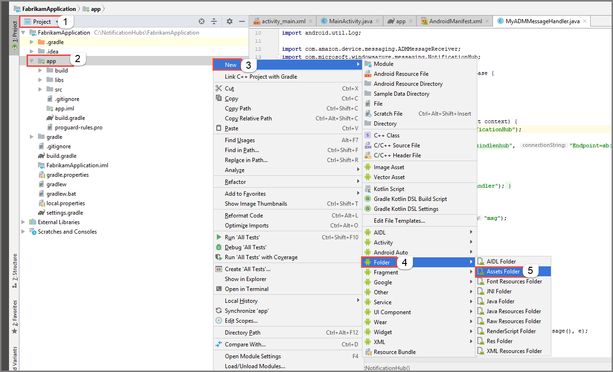    
    6. On the **Configure Component** page, do the following steps:
        1. Select **Change folder location**
        2. Confirm that the folder is set to: `src/main/assets`.
        3. Select **Finish**. 
        
            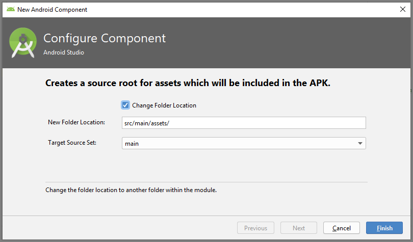
2. Add a file named **api_key.txt** to the **assets** folder. In the tree view, expand **app**, expand **src**, expand **main**, and right-click **assets**, point to **New**, and then select **File**. Enter **api_key.txt** for the file name. 3. 
5. Copy the API key that you generated in the Amazon developer portal to the api_key.txt file. 
6. Build the project. 

## Run the app
1. On the Kindle device, swipe from the top and click **Settings**, and then click **My account** and register with a valid Amazon account.
2. Run the app on a Kindle device from Android Studio. 

> [!NOTE]
> If a problem occurs, check the time of the emulator (or device). The time value must be accurate. To change the time of the Kindle emulator, you can run the following command from your Android SDK platform-tools directory:

```shell
adb shell  date -s "yyyymmdd.hhmmss"
```

## Send a notification message

To send a message by using .NET:

```csharp
static void Main(string[] args)
{
    NotificationHubClient hub = NotificationHubClient.CreateClientFromConnectionString("[conn string]", "[hub name]");

    hub.SendAdmNativeNotificationAsync("{\"data\":{\"msg\" : \"Hello from .NET!\"}}").Wait();
}
```

For sample code, see [this example on GitHub](https://github.com/Azure/azure-notificationhubs-dotnet/blob/master/Samples/SendPushSample/SendPushSample/Program.cs).

![][7]

## Next steps

In this tutorial, you sent broadcast notifications to all your Kindle devices registered with the backend. To learn how to push notifications to specific Kindle devices, advance to the following tutorial:  The following tutorial shows how to push notifications to specific Android devices, but you can use the same logic for pushing notifications to specific Kindle devices.

> [!div class="nextstepaction"]
>[Push notifications to specific devices](notification-hubs-aspnet-backend-android-xplat-segmented-gcm-push-notification.md)

<!-- URLs. -->
[Amazon developer portal]: https://developer.amazon.com/home.html
[download the SDK]: https://developer.amazon.com/public/resources/development-tools/sdk
[0]: ./media/notification-hubs-kindle-get-started/notification-hub-kindle-portal1.png
[1]: ./media/notification-hubs-kindle-get-started/notification-hub-kindle-portal2.png
[2]: ./media/notification-hubs-kindle-get-started/notification-hub-kindle-portal3.png
[3]: ./media/notification-hubs-kindle-get-started/notification-hub-kindle-portal4.png
[4]: ./media/notification-hubs-kindle-get-started/notification-hub-kindle-portal5.png
[5]: ./media/notification-hubs-kindle-get-started/notification-hub-kindle-cmd-window.png
[6]: ./media/notification-hubs-kindle-get-started/notification-hub-kindle-new-java-class.png
[7]: ./media/notification-hubs-kindle-get-started/notification-hub-kindle-notification.png
