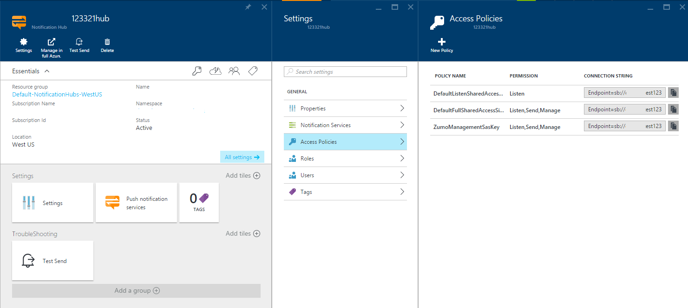

# Sending push notifications with Azure Notification Hubs and Node.js
[!INCLUDE [notification-hubs-backend-how-to-selector](../../includes/notification-hubs-backend-how-to-selector.md)]

## Overview
> [!IMPORTANT]
> To complete this tutorial, you must have an active Azure account. If you don't have an account, you can create a free trial account in just a couple of minutes. For details, see [Azure Free Trial](https://azure.microsoft.com/pricing/free-trial/?WT.mc_id=A643EE910&amp;returnurl=http%3A%2F%2Fazure.microsoft.com%2Fen-us%2Fdocumentation%2Farticles%2Fnotification-hubs-nodejs-how-to-use-notification-hubs).
> 
> 

This guide shows you how to send push notifications with the help of Azure Notification Hubs directly from a Node.js application. 

The scenarios covered include sending push notifications to applications on the following platforms:

* Android
* iOS
* Windows Phone
* Universal Windows Platform 

For more information on notification hubs, see the [Next Steps](#next) section.

## What are Notification Hubs?
Azure Notification Hubs provide an easy-to-use, multi-platform, scalable infrastructure for sending push notifications to mobile devices. For details on the service infrastructure, see the [Azure Notification Hubs](http://msdn.microsoft.com/library/windowsazure/jj927170.aspx) page.

## Create a Node.js Application
The first step in this tutorial is creating a new blank Node.js application. For instructions on creating a Node.js application, see [Create and deploy a Node.js application to Azure Web Site][nodejswebsite], [Node.js Cloud Service][Node.js Cloud Service] using Windows PowerShell, or [Web Site with WebMatrix][webmatrix].

## Configure Your Application to Use Notification Hubs
To use Azure Notification Hubs, you need to download and use the Node.js [azure package](https://www.npmjs.com/package/azure), which includes a built-in set of helper libraries that communicate with the push notification REST services.

### Use Node Package Manager (NPM) to obtain the package
1. Use a command-line interface such as **PowerShell** (Windows), **Terminal** (Mac), or **Bash** (Linux) and navigate to the folder where you created your blank application.
2. Type **npm install azure-sb** in the command window.
3. You can manually run the **ls** or **dir** command to verify that a **node\_modules** folder was created. Inside that folder, find the **azure** package, which contains the libraries you need to access the Notification Hub.

> [!NOTE]
> You can learn more about installing NPM on the official [NPM blog](http://blog.npmjs.org/post/85484771375/how-to-install-npm). 
> 
> 

### Import the module
Using a text editor, add the following to the top of the **server.js** file of the application:

    var azure = require('azure');

### Set up an Azure Notification Hub connection
The **NotificationHubService** object lets you work with notification hubs. The following code creates a **NotificationHubService** object for the notification hub named **hubname**. Add it near the top of the **server.js** file, after the statement to import the azure
module:

    var notificationHubService = azure.createNotificationHubService('hubname','connectionstring');

The connection **connectionstring** value can be obtained from the [Azure portal] by performing the following steps:

1. In the left navigation pane, click **Browse**.
2. Select **Notification Hubs**, and then find the hub you wish to use for the sample. You can refer to the [Windows Store Getting Started tutorial](notification-hubs-windows-store-dotnet-get-started-wns-push-notification.md) if you need help creating a new Notification Hub.
3. Select **Settings**.
4. Click on **Access Policies**. You see both shared and full access connection strings.

> [!NOTE]
> You can also retrieve the connection string using the **Get-AzureSbNamespace** cmdlet provided by [Azure PowerShell](/powershell/azureps-cmdlets-docs) or the **azure sb namespace show** command with the [Azure Command-Line Interface (Azure CLI)](../cli-install-nodejs.md).
> 
> 

## General architecture
The **NotificationHubService** object exposes the following object instances for sending push notifications to specific devices and applications:

* **Android** - use the **GcmService** object, which is available at **notificationHubService.gcm**
* **iOS** - use the **ApnsService** object, which is accessible at **notificationHubService.apns**
* **Windows Phone** - use the **MpnsService** object, which is available at **notificationHubService.mpns**
* **Universal Windows Platform** - use the **WnsService** object, which is available at **notificationHubService.wns**

### How to: Send push notifications to Android applications
The **GcmService** object provides a **send** method that can be used to send push notifications to Android applications. The **send** method accepts the following parameters:

* **Tags** - the tag identifier. If no tag is provided, the notification is sent to all clients.
* **Payload** - the message's JSON or raw string payload.
* **Callback** - the callback function.

For more information on the payload format, see the **Payload** section of the [Implementing GCM Server](http://developer.android.com/google/gcm/server.html#payload) document.

The following code uses the **GcmService** instance exposed by the **NotificationHubService** to send a push notification to all registered clients.

    var payload = {
      data: {
        message: 'Hello!'
      }
    };
    notificationHubService.gcm.send(null, payload, function(error){
      if(!error){
        //notification sent
      }
    });

### How to: Send push notifications to iOS applications
Same as with Android applications described above, the **ApnsService** object provides a **send** method that can be used to send push notifications to iOS applications. The **send** method accepts the following parameters:

* **Tags** - the tag identifier. If no tag is provided, the notification is sent to all clients.
* **Payload** - the message's JSON or string payload.
* **Callback** - the callback function.

For more information the payload format, see The **Notification Payload** section of the [Local and Push Notification Programming Guide](http://developer.apple.com/library/ios/#documentation/NetworkingInternet/Conceptual/RemoteNotificationsPG/ApplePushService/ApplePushService.html) document.

The following code uses the **ApnsService** instance exposed by the **NotificationHubService** to send an alert message to all clients:

    var payload={
        alert: 'Hello!'
      };
    notificationHubService.apns.send(null, payload, function(error){
      if(!error){
         // notification sent
      }
    });

### How to: Send push notifications to Windows Phone applications
The **MpnsService** object provides a **send** method that can be used to send push notifications to Windows Phone applications. The **send** method accepts the following parameters:

* **Tags** - the tag identifier. If no tag is provided, the notification is sent to all clients.
* **Payload** - the message's XML payload.
* **TargetName** - `toast` for toast notifications. `token` for tile notifications.
* **NotificationClass** - The priority of the notification. See the **HTTP Header Elements** section of the [Push notifications from a server](http://msdn.microsoft.com/library/hh221551.aspx) document for valid values.
* **Options** - optional request headers.
* **Callback** - the callback function.

For a list of valid **TargetName**, **NotificationClass** and header options, check out the [Push notifications from a server](http://msdn.microsoft.com/library/hh221551.aspx) page.

The following sample code uses the **MpnsService** instance exposed by the **NotificationHubService** to send a toast push notification:

    var payload = '<?xml version="1.0" encoding="utf-8"?><wp:Notification xmlns:wp="WPNotification"><wp:Toast><wp:Text1>string</wp:Text1><wp:Text2>string</wp:Text2></wp:Toast></wp:Notification>';
    notificationHubService.mpns.send(null, payload, 'toast', 22, function(error){
      if(!error){
        //notification sent
      }
    });

### How to: Send push notifications to Universal Windows Platform (UWP) applications
The **WnsService** object provides a **send** method that can be used to send push notifications to Universal Windows Platform applications.  The **send** method accepts the following parameters:

* **Tags** - the tag identifier. If no tag is provided, the notification is sent to all registered clients.
* **Payload** - the XML message payload.
* **Type** - the notification type.
* **Options** - optional request headers.
* **Callback** - the callback function.

For a list of valid types and request headers, see [Push notification service request and response headers](http://msdn.microsoft.com/library/windows/apps/hh465435.aspx).

The following code uses the **WnsService** instance exposed by the **NotificationHubService** to send a toast push notification to a UWP app:

    var payload = '<toast><visual><binding template="ToastText01"><text id="1">Hello!</text></binding></visual></toast>';
    notificationHubService.wns.send(null, payload , 'wns/toast', function(error){
      if(!error){
         // notification sent
      }
    });

## Next Steps
The sample snippets above allow you to easily build service infrastructure to deliver push notifications to a wide variety of devices. Now that you've learned the basics of using Notification Hubs with node.js, follow these links to learn more about how you can extend these capabilities further.

* See the MSDN Reference for [Azure Notification Hubs](https://msdn.microsoft.com/library/azure/jj927170.aspx).
* Visit the [Azure SDK for Node] repository on GitHub for more samples and implementation details.

[Azure SDK for Node]: https://github.com/WindowsAzure/azure-sdk-for-node
[Next Steps]: #nextsteps
[What are Service Bus Topics and Subscriptions?]: #what-are-service-bus-topics
[Create a Service Namespace]: #create-a-service-namespace
[Obtain the Default Management Credentials for the Namespace]: #obtain-default-credentials
[Create a Node.js Application]: #Create_a_Nodejs_Application
[Configure Your Application to Use Service Bus]: #Configure_Your_Application_to_Use_Service_Bus
[How to: Create a Topic]: #How_to_Create_a_Topic
[How to: Create Subscriptions]: #How_to_Create_Subscriptions
[How to: Send Messages to a Topic]: #How_to_Send_Messages_to_a_Topic
[How to: Receive Messages from a Subscription]: #How_to_Receive_Messages_from_a_Subscription
[How to: Handle Application Crashes and Unreadable Messages]: #How_to_Handle_Application_Crashes_and_Unreadable_Messages
[How to: Delete Topics and Subscriptions]: #How_to_Delete_Topics_and_Subscriptions
[1]: #Next_Steps
[Topic Concepts]: .media/notification-hubs-nodejs-how-to-use-notification-hubs/sb-topics-01.png
[image]: .media/notification-hubs-nodejs-how-to-use-notification-hubs/sb-queues-03.png
[2]: .media/notification-hubs-nodejs-how-to-use-notification-hubs/sb-queues-04.png
[3]: .media/notification-hubs-nodejs-how-to-use-notification-hubs/sb-queues-05.png
[4]: .media/notification-hubs-nodejs-how-to-use-notification-hubs/sb-queues-06.png
[5]: .media/notification-hubs-nodejs-how-to-use-notification-hubs/sb-queues-07.png
[SqlFilter.SqlExpression]: http://msdn.microsoft.com/library/windowsazure/microsoft.servicebus.messaging.sqlfilter.sqlexpression.aspx
[Azure Service Bus Notification Hubs]: http://msdn.microsoft.com/library/windowsazure/jj927170.aspx
[SqlFilter]: http://msdn.microsoft.com/library/windowsazure/microsoft.servicebus.messaging.sqlfilter.aspx
[Web Site with WebMatrix]: /develop/nodejs/tutorials/web-site-with-webmatrix/
[Node.js Cloud Service]: ../cloud-services/cloud-services-nodejs-develop-deploy-app.md
[Previous Management Portal]: .media/notification-hubs-nodejs-how-to-use-notification-hubs/previous-portal.png
[nodejswebsite]: https://docs.microsoft.com/azure/app-service/app-service-web-get-started-nodejs
[webmatrix]: https://docs.microsoft.com/aspnet/web-pages/videos/introduction/create-a-website-using-webmatrix
[Node.js Cloud Service with Storage]: /develop/nodejs/tutorials/web-app-with-storage/
[Node.js Web Application with Storage]: /develop/nodejs/tutorials/web-site-with-storage/
[Azure Portal]: https://portal.azure.com
