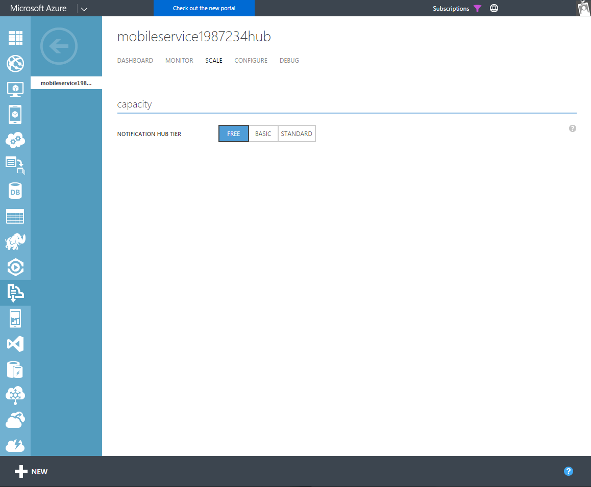

<properties
	pageTitle="Azure Notification Hubs - Frequently Asked Questions (FAQs)"
	description="FAQs on designing/implementing solutions on Notification Hubs"
	services="notification-hubs"
	documentationCenter="mobile"
	authors="wesmc7777"
	manager="erikre"
    keywords="push notification, push notifications, iOS push notifications, android push notifications, ios push, android push"
	editor="" />

<tags
	ms.service="notification-hubs"
	ms.workload="mobile"
	ms.tgt_pltfrm="mobile-multiple"
	ms.devlang="multiple"
	ms.topic="article"
	ms.date="06/29/2016"
	ms.author="wesmc" />

#Push Notifications with Azure Notification Hubs - Frequently Asked Questions

##General
###1.	What is the price model for Notification Hubs?
Notification Hubs is offered in three tiers:

* **Free** - get up to 1 million pushes per subscription a month.
* **Basic** - get 10 million pushes per subscription a month as a baseline, with quota growth options.
* **Standard** - get 10 million pushes per subscription a month as a baseline, with quota increase options, plus rich telemetry capabilties.

The latest details can be found on the [Notification Hubs Pricing] page. The pricing is established at the subscription level and is based on the number of push notification initiations so it doesn't matter how many namespaces or notification hubs you have created in your Azure subscription.

**Free** tier is offered for development purpose with no SLA guarantee. While this tier might be a good starting point for those that want to explore the capabilities of push notifications through Azure Notification Hubs, it might not be the best choice for medium to large scale applications.

**Basic** & **Standard** tiers are offered for production usage with the following key features enabled *only for the Standard tier*:

- *Rich telemetry* - Notification Hubs offer a number of capabilities to export your telemetry data as well as push notification registration information for offline viewing and analysis.
- *Multi-tenancy* - Ideal if you are creating a mobile app using Notification Hubs to support multiple tenants. This allows you to set Push Notification Services (PNS) credentials at the Notification Hub namespace level for the app and then you can segregate the tenants providing them individual hubs under this common namespace. This enables ease of maintenance while keeping the SAS keys to send & receive push notifications from the notification hubs segregated for each tenant ensuring non cross-tenant overlap.
- *Scheduled Push* - Allows you to schedule push notifications, that will be subsequently queued up and sent out.
- *Bulk import* - Allows you to import registrations in bulk.

###2.	What is the Notification Hubs SLA?
For **Basic** and **Standard** Notification Hubs tiers, we guarantee that at least 99.9% of the time, properly configured applications will be able to send push notifications or perform registration management operations with respect to a Notification Hub deployed within a supported tier. To learn more about our SLA, please visit the [Notification Hubs SLA] page.

> [AZURE.NOTE] There are no SLA guarantees for the leg between the Platform Notification Service and the device since Notification Hubs depend on external platform providers to deliver the push notification to the device.

###3.	Which customers are using Notification Hubs?
We have a large number of customers using Notification Hubs with a few notable ones below:

* Sochi 2014 – 100s of interest groups, 3+ million devices, 150+ million notification dispatched in 2 weeks. [CaseStudy - Sochi]
* Skanska - [CaseStudy - Skanska]
* Seattle Times - [CaseStudy - Seattle Times]
* Mural.ly - [CaseStudy - Mural.ly]
* 7Digital - [CaseStudy - 7Digital]
* Bing Apps – 10s of millions of devices, sending 3 million notifications/day.

###4. How do I upgrade or downgrade my Notification Hubs to change my service tier?
Go to the [Azure Classic Portal], click Service Bus, and click on your namespace then your notification hub. Under the Scale tab, you will be able to change your Notification Hubs service tier.

##Design & Development
###1.	Which server-side platforms do you support?
We provide SDKs and [complete samples] for .NET, Java, PHP, Python, Node.js so that an app backend can be setup to communicate to Notification Hubs using any of these platforms. Notification Hubs APIs are based on REST interfaces so you can choose to directly talk to those instead if you don't want to add an extra dependency. More details can be found on the [NH - REST APIs] page.

###2.	Which client platforms do you support?
We support sending push notifications to [Apple iOS](notification-hubs-ios-apple-push-notification-apns-get-started.md), [Android](notification-hubs-android-push-notification-google-gcm-get-started.md), [Windows Universal](notification-hubs-windows-store-dotnet-get-started-wns-push-notification.md), [Windows Phone](notification-hubs-windows-mobile-push-notifications-mpns.md), [Kindle](notification-hubs-kindle-amazon-adm-push-notification.md), [Android China (via Baidu)](notification-hubs-baidu-china-android-notifications-get-started.md), Xamarin ([iOS](xamarin-notification-hubs-ios-push notification-apns-get-started.md) & [Android](xamarin-notification-hubs-push-notifications-android-gcm.md)), [Chrome Apps](notification-hubs-chrome-push-notifications-get-started.md) and [Safari](https://github.com/Azure/azure-notificationhubs-samples/tree/master/PushToSafari) platforms. For a complete list of getting started tutorials tackling sending push notifications on these platforms, visit our [NH - Getting Started Tutorials] page.

###3.	Do you support SMS/Email/web notifications?
Notification Hubs is primarily designed to send notifications to mobile apps using the platforms listed above. We do not yet provide the capability to send email or SMS alerts; however third party platforms which provide these capabilities can be integrated along with Notification Hubs to send native push notifications by using [Azure Mobile Apps].

Notification Hubs also do not provide an in-browser push notification delivery service out-of-the-box. Customers may choose to implement this using SignalR on top of the supported server-side platforms. If you are looking to send notifications to browser apps in the Chrome sandbox, check out the [Chrome Apps tutorial].

###4.	What is the relation between Azure Mobile Apps and Azure Notification Hubs and when do I use what?
If you have an existing mobile app backend and you only want to add the capability to send push notifications then you can use Azure Notification Hubs. If you want to setup your mobile app backend from scratch then you should consider using Azure Mobile Apps. An Azure Mobile App automatically provisions a Notification Hub for you to be able to send push notifications easily from the mobile app backend. Pricing for Azure Mobile Apps includes the base charges for a Notification Hub and you only pay when you go beyond the included pushes. More details on the costs are available on the [App Service Pricing] page.

###5.	How many devices can I support if I send push notifications via Notification Hubs?
Please refer to the [Notification Hubs Pricing] page for details on the number of supported devices.

For certain scenarios, if you need support for more than 10,000,000 registered devices, please [contact us](https://azure.microsoft.com/overview/contact-us/) directly and we will help you scale your solution.

###6.	How many push notifications can I send out?
Depending on the selected tier, Azure will automatically scale up based on the number of notifications flowing through the system.

>[AZURE.NOTE] The overall usage cost can go up based on the number of push notifications being served. Make sure that you are aware of existing tier limits outlined on the [Notification Hubs Pricing] page.

Our existing customers are using Notification Hubs to send millions of push notifications daily. You do not have to do anything special to scale your push notifications reach as long as you are using Azure Notification Hubs.

###7.	How long does it take for sent push notifications to reach my device?
Azure Notification Hubs is able to process at least **1 million push notification sends a minute** in a normal use scenario where the incoming load is pretty consistent and isn't spikey in nature. This rate may vary depending on the number of tags, nature of incoming sends and other external factors.

During the estimated delivery time, the service is able calculate the targets per platform and route messages to the respective push notification delivery services based on the registered tags/tag expressions. From here on, it is the responsibility of the Push Notifications services (PNS) to send the notification to the device.

A PNS does not guarantee any SLA for delivering notifications; however, typically a vast majority of push notifications are delivered to target devices within a few minutes (usually within the limits of 10 minutes) from the time they are sent to our platform. There may be a few outliers which may take more time.

>[AZURE.NOTE] Azure Notification Hubs has a policy in place to drop any push notifications which aren't able to be delivered to the PNS in 30 minutes. This delay can happen for a number of reasons, most commonly because the PNS is throttling your application.

###8.	Is there any latency guarantee?
Because of the nature of push notifications (they are delivered by an external, platform-specific Push Notification Service), there is no latency guarantee. Typically, the majority of push notifications get delivered within a couple of minutes.

###9.	What are the considerations I need to take into account when designing a solution with namespaces and Notification Hubs?

####Mobile App/Environment

* There should be one Notification Hub per mobile app, per environment.
* In a multi-tenant scenario, each tenant should have a separate hub.
* You must never share the same Notification Hub between test and production environments as this may cause problems down the line while sending notifications. e.g. Apple offers Sandbox and Production Push endpoints with each having separate credentials.
* By default, you can send test notifications to your registered devices through the Azure Portal or the Azure integrated component in Visual Studio. The threshold is set to 10 devices that are selected at random from the registration pool.

>[AZURE.NOTE] If the hub was configured originally with an Apple sandbox certificate and then reconfigured to use an Apple production certificate, the old device tokens would become invalid with the new certificate and cause pushes to fail. It is best to separate your production and test environments and use different hubs for different environments.

####PNS credentials

When a mobile app is registered with a platform's developer portal (e.g. Apple or Google etc) then you get an app identifier and security tokens which an app backend needs to provide to the Platform's Push Notification services to be able to send push notifications to the devices. These security tokens which can be in the form of certificates (e.g. for Apple iOS or Windows Phone) or security keys (Google Android, Windows etc) need to be configured in Notification Hubs. This is done typically at the notification hub level but can also be done at the namespace level in a multi-tenant scenario.

####Namespaces

Namespaces can be used for deployment grouping.  It can also be used to represent all Notification Hubs for all tenants of the same app in the multi-tenant scenario.

####Geo-distribution

Geo-distribution is not always critical in push notification scenarios. It is to be noted that various Push Notification Services (e.g. APNS, GCM etc), which ultimately deliver the push notifications to the devices, aren't evenly distributed either.

If you have an application which is used across the world, you can create several hubs in different namespaces taking advantage of the availability of Notification Hubs service in different Azure regions around the globe.

>[AZURE.NOTE] This will increase the management cost - particularly around registrations, so this isn't really recommended and must only be done if there is an explicit need.

###10.	Should I do registrations from the app backend or directly through client devices?
Registrations from the app backend are useful when you have to do client authentication before creating the registration or when you have tags which must be created or modified by the app backend based on some app logic. For details, you can read more in the [Backend Registration guidance] and [Backend Registration guidance - 2] pages.

###11.	What is the push notification delivery security model?
Azure Notification Hubs use a [Shared Access Signature (SAS)](../storage/storage-dotnet-shared-access-signature-part-1.md)-based security model. You can use the SAS tokens at the root namespace level or at the granular Notification Hubs level. These SAS tokens can be set with different authorization rules e.g. send message permissions, listen notification permissions etc. More details are available in the [NH Security model] document.

###12.	How should I handle sensitive payload in the push notifications?
All notifications are delivered to target devices by the platform's Push Notification Services (PNS). When a sender sends a notification to Azure Notification Hubs then we process and pass the notification to the respective PNS.

All connections from the sender to the Azure Notifications Hubs and then to the PNS use HTTPS.

>[AZURE.NOTE] Azure Notifications Hubs does not log the payload of the message in any way.

For sending sensitive payloads however we recommend a Secure Push pattern where the sender delivers a 'ping' notification with a message identifier to the device without the sensitive payload and when the app on the device receives this payload, it is able to call a secure API directly to fetch the message details. A guide on how to implement the pattern described above is available on the [NH - Secure Push tutorial] page.

##Operations
###1.	What is the Disaster Recovery (DR) story?
We provide metadata Disaster Recovery coverage on our end (Notification Hub name, connection string and other critical information). When a DR scenario is triggered, the registrations data is the **only segment** of the Notification Hubs infrastructure which will be lost. You will need to implement a solution to re-populate this data into your new hub post-recovery.

- *Step1* - Create a secondary Notification Hub in a different datacenter. You can create this on the fly at the time of the DR event or you can create one from the get go. It doesn't make much of a difference which option you choose because Notification Hub provisioning is a relatively fast process in the order of a few seconds. Having one from the beginning will shield you from the DR event impacting your management capabilities, so it is the highly-recommended option.

- *Step2* - Hydrate the secondary Notification Hub with the registrations from the primary Notification Hub. It is not recommended to try to maintain registrations on both hubs and try to keep them in sync on the fly as registrations are coming in - typically that hasn’t worked well because of inherent tendency of registrations to expire on the PNS side. Notification Hubs clean them up as we receive PNS feedback about expired or invalid registrations.  

Recommendation is to use an app backend which either:

- Maintains a given set of registrations at its end so that it can do a bulk insert into the secondary notification hub in case of DR

**OR**

- Gets a regular dump of registrations from the primary hub as a backup and then does a bulk insert into the secondary NH.

>[AZURE.NOTE] Registrations Export/Import functionality available in Standard Tier is described in the [Registrations Export/Import] document.

If you don’t have a backend, then when the app starts up on any of the target devices, they will perform a new registration in the secondary Notification Hub, and eventually the secondary Notification Hub will have all the active devices registered.

The downside is that there will be a time period when devices where apps haven't opened up will not receive notifications.

###2.	Is there any audit log capability?
All Notification Hubs Management operations go to Operation Logs which are exposed in the [Azure Classic Portal].

##Monitoring & Troubleshooting
###1.	What troubleshooting capabilities are available?
Azure Notification Hubs provide several features to do common troubleshooting, particularly in the most common scenario around dropped notifications. See details in our [NH - troubleshooting] whitepaper.

###2.	What telemetry features are available?
Azure Notification Hubs enables viewing telemetry data in the [Azure Classic Portal]. Details of the available metrics are available on the [NH - Metrics] page.

>[AZURE.NOTE] Successful notifications only mean that the push notifications have been delivered to the external Push Notification Service (e.g. APNS for Apple, GCM for Google etc). It is up to the PNS to deliver the notification to target devices. Typically, the PNS does not expose delivery metrics to third-parties.  

We also provide the capability to export the telemetry data programmatically (in **Standard** tier). See the [NH - Metrics sample] for details.

[Azure Classic Portal]: https://manage.windowsazure.com
[Notification Hubs Pricing]: http://azure.microsoft.com/pricing/details/notification-hubs/
[Notification Hubs SLA]: http://azure.microsoft.com/support/legal/sla/
[CaseStudy - Sochi]: https://customers.microsoft.com/Pages/CustomerStory.aspx?recid=7942
[CaseStudy - Skanska]: https://customers.microsoft.com/Pages/CustomerStory.aspx?recid=5847
[CaseStudy - Seattle Times]: https://customers.microsoft.com/Pages/CustomerStory.aspx?recid=8354
[CaseStudy - Mural.ly]: https://customers.microsoft.com/Pages/CustomerStory.aspx?recid=11592
[CaseStudy - 7Digital]: https://customers.microsoft.com/Pages/CustomerStory.aspx?recid=3684
[NH - REST APIs]: https://msdn.microsoft.com/library/azure/dn530746.aspx
[NH - Getting Started Tutorials]: http://azure.microsoft.com/documentation/articles/notification-hubs-ios-get-started/
[Chrome Apps tutorial]: http://azure.microsoft.com/documentation/articles/notification-hubs-chrome-get-started/
[Mobile Services Pricing]: http://azure.microsoft.com/pricing/details/mobile-services/
[Backend Registration guidance]: https://msdn.microsoft.com/library/azure/dn743807.aspx
[Backend Registration guidance - 2]: https://msdn.microsoft.com/library/azure/dn530747.aspx
[NH Security model]: https://msdn.microsoft.com/library/azure/dn495373.aspx
[NH - Secure Push tutorial]: http://azure.microsoft.com/documentation/articles/notification-hubs-aspnet-backend-ios-secure-push/
[NH - troubleshooting]: http://azure.microsoft.com/documentation/articles/notification-hubs-diagnosing/
[NH - Metrics]: https://msdn.microsoft.com/library/dn458822.aspx
[NH - Metrics sample]: https://github.com/Azure/azure-notificationhubs-samples/tree/master/FetchNHTelemetryInExcel
[Registrations Export/Import]: https://msdn.microsoft.com/library/dn790624.aspx
[Azure Portal]: https://portal.azure.com
[complete samples]: https://github.com/Azure/azure-notificationhubs-samples
[Azure Mobile Apps]: https://azure.microsoft.com/en-us/services/app-service/mobile/
[App Service Pricing]: https://azure.microsoft.com/en-us/pricing/details/app-service/
