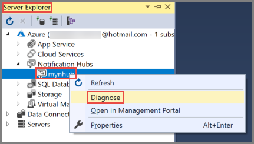

# Diagnose dropped notifications in Azure Notification Hubs

A common question about Azure Notification Hubs is how to troubleshoot when notifications from an application don't appear on client devices. Customers want to know where and why notifications were dropped, and how to fix the issue. This article identifies why notifications might get dropped or not be received by devices. It also explains how to determine the root cause.

It's critical to first understand how Notification Hubs pushes notifications to a device.

![Notification Hubs architecture][0]

In a typical send notification flow, the message is sent from the *application back end* to Notification Hubs. Notification Hubs processes all the registrations. It takes into account the configured tags and tag expressions to determine targets. Targets are the registrations that need to receive the push notification. These registrations can span any of our supported platforms: Android, Baidu (Android devices in China), Fire OS (Amazon) iOS, Windows, and Windows Phone.

With the targets established, Notification Hubs pushes notifications to the *push notification service* for the device platform. Examples include the Apple Push Notification service (APNs) for Apple and Firebase Cloud Messaging (FCM) for Google. Notification Hubs pushes notifications split across multiple batches of registrations. It authenticates with the respective push notification service, based on the credentials you set in the Azure portal, under **Configure Notification Hub**. The push notification service then forwards the notifications to the respective *client devices*.

The final leg of notification delivery is between the platform's push notification service and the device. Notification delivery can fail at any of the four stages in the push notification process (client, application back end, Notification Hubs, and the platform's push notification service). For more information about the Notification Hubs architecture, see [Notification Hubs overview].

A failure to deliver notifications might occur during the initial test/staging phase. Dropped notifications at this stage might indicate a configuration issue. If a failure to deliver notifications occurs in production, some or all of the notifications might be dropped. A deeper application or messaging pattern issue is indicated in this case.

The next section looks at scenarios in which notifications might be dropped, ranging from common to rare.

## Notification Hubs misconfiguration ##

To send notifications to the respective push notification service, Notification Hubs must authenticate itself in the context of your application. You must create a developer account with the target platform's notification service (Microsoft, Apple, Google, etc.). Then, you must register your application with the OS where you get a token or key that you use to work with the target PNS.

You must add platform credentials to the Azure portal. If no notifications are reaching the device, the first step is to ensure the correct credentials are configured in Notification Hubs. The credentials must match the application that's created under a platform-specific developer account.

For step-by-step instructions to complete this process, see [Get started with Azure Notification Hubs].

Here are some common misconfigurations to check for:

### Notification hub name location

Ensure that your notification hub name (without typos) is the same in each of these locations:
   * Where you register from the client
   * Where you send notifications from the back end
   * Where you configured the push notification service credentials

Ensure you use the correct shared access signature configuration strings on the client and the application back end. Generally, you must use **DefaultListenSharedAccessSignature** on the client and **DefaultFullSharedAccessSignature** on the application back end. This grants permissions to send notifications to Notification Hubs.

### APN configuration ###

You must maintain two different hubs: one for production and another for testing. You must upload the certificate you use in a sandbox environment to a separate hub than the certificate/hub you'll use in production. Don't try to upload different types of certificates to the same hub. It will cause notification failures.

If you inadvertently upload different types of certificates to the same hub, you should delete the hub and start fresh with a new hub. If for some reason you can't delete the hub, you must at least delete all the existing registrations from the hub.

### FCM configuration ###

1. Ensure that the *server key* you obtained from Firebase matches the server key you registered in the Azure portal.

   ![Firebase server key][3]

2. Ensure that you have configured **Project ID** on the client. You can obtain the value for **Project ID** from the Firebase dashboard.

   ![Firebase Project ID][1]

## Application issues ##

### Tags and tag expressions ###

If you use tags or tag expressions to segment your audience, it's possible that when you send the notification, no target is found. This error is based on the specified tags or tag expressions in your send call.

Review your registrations to ensure the tags match when you send a notification. Then, verify the notification receipt from only the clients that have those registrations.

For example, suppose all your registrations with Notification Hubs use the tag "Politics." If you then send a notification with the tag "Sports," the notification won't be sent to any device. A complex case might involve tag expressions where you registered by using "Tag A" *or* "Tag B," but you targeted "Tag A && Tag B." The self-diagnosis tips section later in the article shows you how to review your registrations and their tags.

### Template issues ###

If you use templates, ensure that you follow the guidelines described in [Templates].

### Invalid registrations ###

If the notification hub was configured correctly and tags or tag expressions were used correctly, valid targets are found. Notifications should be sent to these targets. Notification Hubs then fires off several processing batches in parallel. Each batch sends messages to a set of registrations.

> [!NOTE]
> Because Notification Hubs processes batches in parallel, the order in which the notifications are delivered is not guaranteed.

Notification Hubs is optimized for an "at-most-once" message delivery model. We attempt deduplication, so that no notifications are delivered more than once to a device. Registrations are checked to ensure that only one message is sent per device identifier before it's sent to the push notification service.

Each batch is sent to the push notification service, which in turn accepts and validates the registrations. During this process, it's possible that the push notification service will detect an error with one or more registrations in a batch. The push notification service then returns an error to Notification Hubs, and the process stops. The push notification service drops that batch completely. This is especially true with APNs, which uses a TCP stream protocol.

In this case, the faulting registration is removed from the database. Then, we retry notification delivery for the rest of the devices in that batch.

To get more error information about the failed delivery attempt against a registration, you can use the Notification Hubs REST APIs [Per Message Telemetry: Get Notification message telemetry](https://msdn.microsoft.com/library/azure/mt608135.aspx) and [PNS feedback](https://msdn.microsoft.com/library/azure/mt705560.aspx). For sample code, see the [Send REST example](https://github.com/Azure/azure-notificationhubs-dotnet/tree/master/Samples/SendRestExample/).

## Push notification service issues

After the push notification service receives the notification, it delivers the notification to the device. At this point, Notification Hubs has no control over the delivery of the notification to the device.

Because platform notification services are robust, notifications tend to reach devices in a few seconds. If the push notification service is throttling, Notification Hubs applies an exponential back-off strategy. If the push notification service remains unreachable for 30 minutes, there's a policy in place to expire and drop the messages permanently.

If a push notification service attempts to deliver a notification but the device is offline, the notification is stored by the push notification service. It's stored for only a limited period of time. The notification is delivered to the device when the device becomes available.

Each app stores only one recent notification. If multiple notifications are sent while a device is offline, each new notification causes the last one to be discarded. Keeping only the newest notification is called *coalescing* in APNs and *collapsing* in FCM. (FCM uses a collapsing key.) When the device remains offline for a long time, notifications that were stored for the device are discarded. For more information, see [APNs Overview] and [About FCM messages].

With Notification Hubs, you can pass a coalescing key via an HTTP header by using the generic SendNotification API. For example, for the .NET SDK, you'd use `SendNotificationAsync`. The SendNotification API also takes HTTP headers that are passed as is to the respective push notification service.

## Self-diagnosis tips

Here are paths to diagnose the root cause of dropped notifications in Notification Hubs.

### Verify credentials ###

#### Push notification service developer portal ####

Verify credentials in the respective push notification service developer portal (APNs, FCM, Windows Notification Service, and so on). For more information, see [Tutorial: Send notifications to Universal Windows Platform apps by using Azure Notification Hubs](https://docs.microsoft.com/azure/notification-hubs/notification-hubs-windows-store-dotnet-get-started-wns-push-notification).

#### Azure portal ####

To review and match the credentials with those you obtained from the push notification service developer portal, go to the **Access Policies** tab in the Azure portal.

![Azure portal Access Policies][4]

### Verify registrations

#### Visual Studio ####

In Visual Studio, you can connect to Azure through Server Explorer to view and manage multiple Azure services, including Notification Hubs. This shortcut is primarily useful for your development/test environment.

![Visual Studio Server Explorer][9]

You can view and manage all the registrations in your hub. The registrations can be categorized by platform, native or template registration, tag, push notification service identifier, registration ID, and expiration date. You can also edit a registration on this page. It's especially useful for editing tags.

Right-click your notification hub in **Server Explorer**, and select **Diagnose**. 



You see the following page:


Switch to the **Device Registrations** page:


You can use **Test Send** page to send a test notification message:


> [!NOTE]
> Use Visual Studio to edit registrations only during development/test, and with a limited number of registrations. If you need to edit your registrations in bulk, consider using the export and import registration functionality described in [How To: Export and Modify Registrations in Bulk](https://msdn.microsoft.com/library/dn790624.aspx).

#### Service Bus Explorer ####

Many customers use [Service Bus Explorer](https://github.com/paolosalvatori/ServiceBusExplorer) to view and manage their notification hubs. Service Bus Explorer is an open-source project. 

### Verify message notifications

#### Azure portal ####

To send a test notification to your clients without having a service back end up and running, under **SUPPORT + TROUBLESHOOTING**, select **Test Send**.

![Test Send functionality in Azure][7]

#### Visual Studio ####

You can also send test notifications from Visual Studio.

![Test Send functionality in Visual Studio][10]

For more information about using Notification Hubs with Visual Studio Server Explorer, see these articles:

* [How to view device registrations for notification hubs](https://docs.microsoft.com/previous-versions/windows/apps/dn792122(v=win.10))
* [Deep dive: Visual Studio 2013 Update 2 RC and Azure SDK 2.3]
* [Announcing release of Visual Studio 2013 Update 3 and Azure SDK 2.4]

### Debug failed notifications and review notification outcome

#### EnableTestSend property ####

When you send a notification via Notification Hubs, the notification is initially queued. Notification Hubs determines the correct targets, and then sends the notification to the push notification service. If you're using the REST API or any of the client SDKs, the return of your send call means only that the message is queued with Notification Hubs. It doesn't provide insight into what happened when Notification Hubs eventually sent the notification to the push notification service.

If your notification doesn't arrive at the client device, an error might have occurred when Notification Hubs tried to deliver it to the push notification service. For example, the payload size might exceed the maximum allowed by the push notification service, or the credentials configured in Notification Hubs might be invalid.

To get insight into push notification service errors, you can use the [EnableTestSend] property. This property is automatically enabled when you send test messages from the portal or Visual Studio client. You can use this property to see detailed debugging information and also via APIs. Currently, you can use it in the .NET SDK. It will be added to all client SDKs eventually.

To use the `EnableTestSend` property with the REST call, append a query string parameter called *test* to the end of your send call. For example:

```text
https://mynamespace.servicebus.windows.net/mynotificationhub/messages?api-version=2013-10&test
```

#### .NET SDK example ####

Here's an example of using the .NET SDK to send a native pop-up (toast) notification:

```csharp
NotificationHubClient hub = NotificationHubClient.CreateClientFromConnectionString(connString, hubName);
var result = await hub.SendWindowsNativeNotificationAsync(toast);
Console.WriteLine(result.State);
```

At the end of the execution, `result.State` simply states `Enqueued`. The results don't provide any insight into what happened to your push notification.

Next, you can use the `EnableTestSend` Boolean property. Use the `EnableTestSend` property while you initialize `NotificationHubClient` to get a detailed status about push notification service errors that occur when the notification is sent. The send call takes additional time to return because it first needs Notification Hubs to deliver the notification to the push notification service.

```csharp
    bool enableTestSend = true;
    NotificationHubClient hub = NotificationHubClient.CreateClientFromConnectionString(connString, hubName, enableTestSend);

    var outcome = await hub.SendWindowsNativeNotificationAsync(toast);
    Console.WriteLine(outcome.State);

    foreach (RegistrationResult result in outcome.Results)
    {
        Console.WriteLine(result.ApplicationPlatform + "\n" + result.RegistrationId + "\n" + result.Outcome);
    }
```

#### Sample output ####

```text
DetailedStateAvailable
windows
7619785862101227384-7840974832647865618-3
The Token obtained from the Token Provider is wrong
```

This message indicates either that the credentials configured in Notification Hubs are invalid or that there's an issue with the registrations in the hub. Delete this registration and let the client re-create the registration before sending the message.

> [!NOTE]
> Use of the `EnableTestSend` property is heavily throttled. Use this option only in a development/test environment and with a limited set of registrations. Debug notifications are sent to only 10 devices. There's also a limit on processing debug sends, at 10 per minute.

### Review telemetry ###

#### Azure portal ####

In the portal, you can get a quick overview of all the activity in your notification hub.

1. On the **Overview** tab, you can see an aggregated view of registrations, notifications, and errors by platform.

   ![Notification Hubs overview dashboard][5]

2. On the **Monitor** tab, you can add many other platform-specific metrics for a deeper look. You can look specifically at errors that are returned when Notification Hubs tries to send the notification to the push notification service.

   ![Azure portal activity log][6]

3. Begin by reviewing **Incoming Messages**, **Registration Operations**, and **Successful Notifications**. Then, go to the per-platform tab to review errors that are specific to the push notification service.

4. If the authentication settings for your notification hub are incorrect, the message **PNS Authentication Error** appears. It's a good indication to check the push notification service credentials.

#### Programmatic access ####

For more information about programmatic access, see [Programmatic access](https://docs.microsoft.com/previous-versions/azure/azure-services/dn458823(v=azure.100)).

> [!NOTE]
> Several telemetry-related features, like exporting and importing registrations and telemetry access via APIs, are available only on the Standard service tier. If you attempt to use these features from the Free or Basic service tier, you'll get an exception message if you use the SDK. You'll get an HTTP 403 (Forbidden) error if you use the features directly from the REST APIs.
>
> To use telemetry-related features, first ensure in the Azure portal that you're using the Standard service tier.  

<!-- IMAGES -->
[0]: ./media/notification-hubs-diagnosing/Architecture.png
[1]: ./media/notification-hubs-diagnosing/FCMConfigure.png
[3]: ./media/notification-hubs-diagnosing/FCMServerKey.png
[4]: ../../includes/media/notification-hubs-portal-create-new-hub/notification-hubs-connection-strings-portal.png
[5]: ./media/notification-hubs-diagnosing/PortalDashboard.png
[6]: ./media/notification-hubs-diagnosing/PortalAnalytics.png
[7]: ./media/notification-hubs-ios-get-started/notification-hubs-test-send.png
[8]: ./media/notification-hubs-diagnosing/VSRegistrations.png
[9]: ./media/notification-hubs-diagnosing/VSServerExplorer.png
[10]: ./media/notification-hubs-diagnosing/VSTestNotification.png

<!-- LINKS -->
[Notification Hubs overview]: notification-hubs-push-notification-overview.md
[Get started with Azure Notification Hubs]: notification-hubs-windows-store-dotnet-get-started-wns-push-notification.md
[Templates]: https://msdn.microsoft.com/library/dn530748.aspx
[APNs overview]: https://developer.apple.com/library/content/documentation/NetworkingInternet/Conceptual/RemoteNotificationsPG/APNSOverview.html
[About FCM messages]: https://firebase.google.com/docs/cloud-messaging/concept-options
[Export and modify registrations in bulk]: https://msdn.microsoft.com/library/dn790624.aspx
[Service Bus Explorer code]: https://code.msdn.microsoft.com/windowsazure/Service-Bus-Explorer-f2abca5a
[View device registrations for notification hubs]: https://msdn.microsoft.com/library/windows/apps/xaml/dn792122.aspx
[Deep dive: Visual Studio 2013 Update 2 RC and Azure SDK 2.3]: https://azure.microsoft.com/blog/2014/04/09/deep-dive-visual-studio-2013-update-2-rc-and-azure-sdk-2-3/#NotificationHubs
[Announcing release of Visual Studio 2013 Update 3 and Azure SDK 2.4]: https://azure.microsoft.com/blog/2014/08/04/announcing-release-of-visual-studio-2013-update-3-and-azure-sdk-2-4/
[EnableTestSend]: https://docs.microsoft.com/dotnet/api/microsoft.azure.notificationhubs.notificationhubclient.enabletestsend?view=azure-dotnet
[Programmatic telemetry access]: https://msdn.microsoft.com/library/azure/dn458823.aspx
