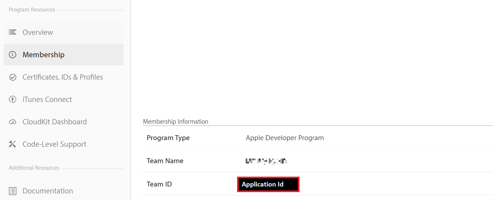

# Token-based (HTTP/2) Authentication for APNS

## Overview

This article details how to use the new APNS HTTP/2 protocol with token based authentication.

The key benefits of using the new protocol include:

* Token generation is relatively hassle free (compared to certificates)
* No more expiry dates – you are in control of your authentication tokens and their revocation
* Payloads can now be up to 4 KB
* Synchronous feedback
* You’re on Apple’s latest protocol – certificates still use the binary protocol, which is marked for deprecation

Using this new mechanism can be done in two steps in a few minutes:

1. Obtain the necessary information from the Apple Developer Account portal
2. Configure your notification hub with the new information

Notification Hubs is now all set to use the new authentication system with APNS.

Note that if you migrated from using certificate credentials for APNS:

* the token properties overwrite your certificate in our system,
* but your application continues to receive notifications seamlessly.

## Obtaining authentication information from Apple

To enable token-based authentication, you need the following properties from your Apple Developer Account:

### Key Identifier

The key identifier can be obtained from the "Keys" page in your Apple Developer Account


### Application Identifier & Application Name

The application name is available via the App IDs page in the Developer Account.


The application identifier is available via the membership details page in the Developer Account.



### Authentication token

The authentication token can be downloaded after you generate a token for your application. For details on how to generate this token, refer to [Apple’s Developer documentation](https://help.apple.com/xcode/mac/current/#/devdfd3d04a1).

## Configuring your notification hub to use token-based authentication

### Configure via the Azure portal

To enable token based authentication in the portal, log in to the Azure portal and go to your Notification Hub > Notification Services > APNS panel.

There is a new property – *Authentication Mode*. Selecting Token allows you to update your hub with all the relevant token properties.


* Enter the properties you retrieved from your Apple developer account
* Choose your application mode (Production or Sandbox)
* Click the **Save** button to update your APNS credentials

### Configure via Management API (REST)

You can use our [management APIs](https://msdn.microsoft.com/library/azure/dn495827.aspx) to update your notification hub to use token-based authentication.
Depending on whether the application you’re configuring is a Sandbox or Production app (specified in your Apple Developer Account), use one of the corresponding endpoints:

* Sandbox Endpoint: [https://api.development.push.apple.com:443/3/device](https://api.development.push.apple.com:443/3/device)
* Production Endpoint: [https://api.push.apple.com:443/3/device](https://api.push.apple.com:443/3/device)

> [!IMPORTANT]
> Token-based authentication requires an API version of: **2017-04 or later**.

Here’s an example of a PUT request to update a hub with token-based authentication:

    ```text
    PUT https://{namespace}.servicebus.windows.net/{Notification Hub}?api-version=2017-04
      "Properties": {
        "ApnsCredential": {
          "Properties": {
            "KeyId": "<Your Key Id>",
            "Token": "<Your Authentication Token>",
            "AppName": "<Your Application Name>",
            "AppId": "<Your Application Id>",
            "Endpoint":"<Sandbox/Production Endpoint>"
          }
        }
      }
    ```

### Configure via the .NET SDK

You can configure your hub to use token based authentication using our [latest client SDK](https://www.nuget.org/packages/Microsoft.Azure.NotificationHubs/1.0.8).

Here’s a code sample illustrating the correct usage:

```csharp
NamespaceManager nm = NamespaceManager.CreateFromConnectionString(_endpoint);
string token = "YOUR TOKEN HERE";
string keyId = "YOUR KEY ID HERE";
string appName = "YOUR APP NAME HERE";
string appId = "YOUR APP ID HERE";
NotificationHubDescription desc = new NotificationHubDescription("PATH TO YOUR HUB");
desc.ApnsCredential = new ApnsCredential(token, keyId, appId, appName);
desc.ApnsCredential.Endpoint = @"https://api.development.push.apple.com:443/3/device";
nm.UpdateNotificationHubAsync(desc);
```

## Reverting to using certificate-based authentication

You can revert at any time to using certificate-based authentication by using any preceding method and passing the certificate instead of the token properties. That action overwrites the previously stored credentials.
