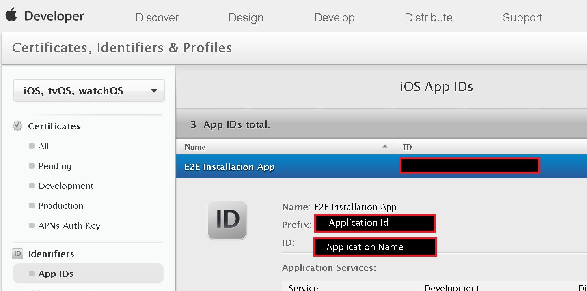

# HTTP/2 and Token Based Authentication for APNS
## Overview
This article details how to leverage the new APNS HTTP/2 protocol with token based authentication.

The key benefits of using the new protocol include:
-	Token generation is relatively hassle free (compared to certificates)
-	No more expiry dates – you are in control of your authentication tokens and their revocation
-	Payloads can now be up to 4KB in size
-	You’re on Apple’s latest protocol – certificates still use the binary protocol which is marked for deprecation

Using this new mechanism can be done in 2 steps in a few minutes:
1.	Obtain the necessary information from the Apple Developer Account portal
2.	Configure your notification hub with the new information

Notification Hubs will then be all set to leverage the new authentication system with APNS. If your hub used certificate credentials for APNS prior to this, the token properties will overwrite your certificate in our system, but your application will continue to receive notifications seamlessly.

## Obtaining Auth information from Apple
To enable token based authentication, you need the following properties from your Apple Developer Account:
### Key Identifier
This can be obtained from the APNs Auth Key page in your Apple Developer Account

### Application Identifier & Application Name
These are available via the App IDs page in the Developer Account. 

### Authentication token
This can be downloaded after you generate a token for your application. For details on how to generate this token, please refer to [Apple’s Developer documentation](http://help.apple.com/xcode/mac/current/#/dev11b059073?sub=dev1eb5dfe65).

## Configuring your notification hub to use token-based authentication
### Configure via the Azure Management Portal
To enable token based authentication in the portal, log in to the Azure Management Portal and go to your Notification Hub > Notification Services > APNS panel. 

You’ll see a new property – *Authentication Mode*. Selecting Token will allow you to update your hub with all the relevant token properties.

Simply enter the properties you retrieved from your Apple developer account, choose your application mode (Production or Sandbox) and click Save to update your APNS credentials. 

### Configure via Management API (REST)

You can use our [management APIs](https://msdn.microsoft.com/en-us/library/azure/dn495827.aspx) to update your notification hub to use token based authentication.
Depending on whether the application you’re configuring is a Sandbox or Production app (this is specified in your Apple Developer Account), please use the corresponding endpoint:

- Sandbox Endpoint: [https://api.development.push.apple.com:443/3/device](https://api.development.push.apple.com:443/3/device)
- Production Endpoint: [https://api.push.apple.com:443/3/device](https://api.push.apple.com:443/3/device)

Important note: Token based authentication requires an API version of: 2017-04 or later
> [!IMPORTANT]
> Token based authentication requires an API version of: **2017-04 or later**.
> 
> 

Here’s an example of a PUT request to update a hub with token-based authentication:

        PUT https://{namespace}.servicebus.windows.net/{Notification Hub}?api-version=2017-04
          "Properties": {
            "ApnsCredential": {
              "Properties": {
                "KeyId": "<Your Key Id>",
                "Token": "<Your Authentication Token>",
                "AppName": "<Your Application Name>",
                "AppId": "<Your Application Id>",
                "Endpoint":"<Sandbox/Production Endpoint>"
              }
            }
          }
        

### Configure via the .NET SDK
You can configure your hub to use token based authentication using our [latest client SDK](https://www.nuget.org/packages/Microsoft.Azure.NotificationHubs/1.0.8). 

Here’s a code sample illustrating the correct usage:

        NamespaceManager nm = NamespaceManager.CreateFromConnectionString(_endpoint);
        string token = "YOUR TOKEN HERE";
        string keyId = "YOUR KEY ID HERE";
        string appName = "YOUR APP NAME HERE";
        string appId = "YOUR APP ID HERE";
        NotificationHubDescription desc = new NotificationHubDescription("PATH TO YOUR HUB");
        desc.ApnsCredential = new ApnsCredential(token, keyId, appId, appName);
        desc.ApnsCredential.Endpoint = @"https://api.development.push.apple.com:443/3/device";
        nm.UpdateNotificationHubAsync(desc);

## Reverting to using certificate based authentication
You can revert at any time to using certificate based authentication using any method shown above by passing the certificate instead of the token properties. This will overwrite the previously stored credentials.
