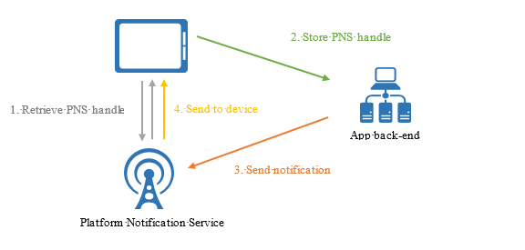
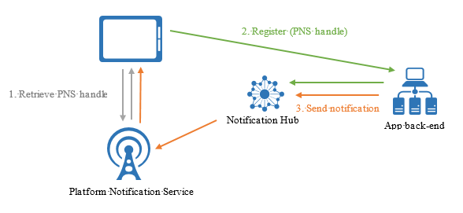

# What is Azure Notification Hubs?

Azure Notification Hubs provide an easy-to-use and scaled-out push engine that enables you to send notifications to any platform (iOS, Android, Windows, etc.) from any back-end (cloud or on-premises). Notification Hubs works great for both enterprise and consumer scenarios. Here are a few example scenarios:

- Send breaking news notifications to millions with low latency.
- Send location-based coupons to interested user segments.
- Send event-related notifications to users or groups for media/sports/finance/gaming applications.
- Push promotional contents to applications to engage and market to customers.
- Notify users of enterprise events such as new messages and work items.
- Send codes for multi-factor authentication.

## What are push notifications?

Push notifications are a form of app-to-user communication where users of mobile apps are notified of certain desired information, usually in a pop-up or dialog box on a mobile device. Users generally choose to view or dismiss the message; choosing the former opens the mobile application that communicated the notification. Some notifications are silent - delivered behind the scenes for the app to process and decide what to do.

Push notifications are vital for consumer apps in increasing app engagement and usage, and for enterprise apps in communicating up-to-date business information. It's the best app-to-user communication because it is energy-efficient for mobile devices, flexible for the notifications senders, and available when corresponding applications are not active.

> [!NOTE]
> Azure Notification Hubs does not officially support Voice Over Internet Protocol (VOIP) push notifications; however, [this article describes how you can use APNS VOIP notifications](voip-apns.md) through Azure Notification Hubs.

For more information on push notifications for a few popular platforms, see the following topics:

- [Android](https://developer.android.com/guide/topics/ui/notifiers/notifications.html)
- [iOS](https://developer.apple.com/notifications/)
- [Windows](https://msdn.microsoft.com/library/windows/apps/hh779725.aspx)

## How do push notifications work?

Push notifications are delivered through platform-specific infrastructures called *Platform Notification Systems* (PNSes). They offer basic push functionalities to deliver a message to a device with a provided handle, and have no common interface. To send a notification to all customers across the Android, iOS, and Windows versions of an app, the developer must work separately with Apple Push Notification Service (APNS), Firebase Cloud Messaging (FCM), and Windows Notification Service (WNS).

At a high level, here is how push works:

1. An application wants to receive a notification, so it contacts the PNS for the target platform on which the app is running and requests a unique and temporary push handle. The handle type depends on the system (for example, WNS uses URIs while APNS uses tokens).
2. The client app stores this handle in the app backend or provider.
3. To send a push notification, the app backend contacts the PNS using the handle to target a specific client app.
4. The PNS forwards the notification to the device specified by the handle.

## The challenges of push notifications

PNSes are powerful. However, they leave much work to the app developer to implement even common push notification scenarios, such as broadcasting push notifications to segmented users.

Sending push notifications requires complex infrastructure that is unrelated to the application's main business logic. Some of the infrastructure challenges are:

- **Platform dependency**
  - The backend requires complex and hard-to-maintain platform-dependent logic to send notifications to devices on various platforms, as PNSes are not unified.
- **Scale**
  - Per PNS guidelines, device tokens must be refreshed on every app launch. The backend deals with a large amount of traffic and database access just to keep the tokens up-to-date. When the number of devices grows to hundreds, thousands, or millions, the cost of creating and maintaining this infrastructure is massive.
  - Most PNSes do not support broadcast to multiple devices. A simple broadcast to a million devices results in a million calls to the PNSes. Scaling this amount of traffic with minimal latency is nontrivial.
- **Routing**
  - Though PNSes provide a way to send messages to devices, most app notifications are targeted at users or interest groups. The backend must maintain a registry to associate devices with interest groups, users, properties, etc. This overhead adds to the time to market and maintenance costs of an app.

## Why use Azure Notification Hubs?

Notification Hubs eliminates all complexities associated with sending push notifications on your own from your app backend. Its multi-platform, scaled-out push notification infrastructure reduces push-related coding and simplifies your backend. With Notification Hubs, devices are merely responsible for registering their PNS handles with a hub, while the backend sends messages to users or interest groups, as shown in the following figure:

Notification Hubs is your ready-to-use push engine with the following advantages:

- **Cross platforms**
  - Support for all major push platforms.
  - A common interface to push to all platforms in platform-specific or platform-independent formats with no platform-specific work.
  - Device handle management in one place.
- **Cross backends**
  - Cloud or on-premises.
  - .NET, Node.js, Java, Python, etc.
- **Rich set of delivery patterns**
  - Broadcast to one or more platforms: You can instantly broadcast to millions of devices across platforms with a single API call.
  - Push to device: You can target notifications to individual devices.
  - Push to user: Tags and templates help you reach all cross-platform devices for a user.
  - Push to segment with dynamic tags: The tags feature helps you segment devices and push to them according to your needs, whether you are sending to one segment or an expression of segments (For example, active AND lives in Seattle NOT new user). Instead of being restricted to publish-subscribe, you can update device tags anywhere and anytime.
  - Localized push: The templates feature helps achieve localization without affecting backend code.
  - Silent push: You can enable the push-to-pull pattern by sending silent notifications to devices and triggering them to complete certain pulls or actions.
  - Scheduled push: You can schedule notifications to be sent anytime.
  - Direct push: You can skip registering devices with the Notification Hubs service and directly batch push to a list of device handles.
  - Personalized push: Device push variables help you send device-specific personalized push notifications with customized key-value pairs.
- **Rich telemetry**
  - General push, device, error, and operation telemetry are available both in the Azure portal and programmatically.
  - Per-message telemetry tracks each push from your initial request call to the Notification Hubs service successfully sending the pushes.
  - Platform Notification System feedback communicates all feedback from PNSes to assist in debugging.
- **Scalability**
  - Send fast messages to millions of devices without re-architecting or device sharding.
- **Security**
  - Shared Access Secret (SAS) or federated authentication.

## Next steps

Get started with creating and using a notification hub by following the [Tutorial: Push notifications to mobile applications](notification-hubs-android-push-notification-google-fcm-get-started.md).

[0]: ./media/notification-hubs-overview/registration-diagram.png
[1]: ./media/notification-hubs-overview/notification-hub-diagram.png

[How customers are using Notification Hubs]: https://azure.microsoft.com/services/notification-hubs
[Notification Hubs tutorials and guides]: https://azure.microsoft.com/documentation/services/notification-hubs
[iOS]: https://azure.microsoft.com/documentation/articles/notification-hubs-ios-get-started
[Android]: https://azure.microsoft.com/documentation/articles/notification-hubs-android-get-started
[Windows Universal]: https://azure.microsoft.com/documentation/articles/notification-hubs-windows-store-dotnet-get-started
[Windows Phone]: https://azure.microsoft.com/documentation/articles/notification-hubs-windows-phone-get-started
[Kindle]: https://azure.microsoft.com/documentation/articles/notification-hubs-kindle-get-started
[Xamarin.iOS]: https://azure.microsoft.com/documentation/articles/partner-xamarin-notification-hubs-ios-get-started
[Xamarin.Android]: https://azure.microsoft.com/documentation/articles/partner-xamarin-notification-hubs-android-get-started
[Microsoft.WindowsAzure.Messaging.NotificationHub]: https://msdn.microsoft.com/library/microsoft.windowsazure.messaging.notificationhub.aspx
[Microsoft.ServiceBus.Notifications]: https://msdn.microsoft.com/library/microsoft.servicebus.notifications.aspx
[App Service Mobile Apps]: https://azure.microsoft.com/documentation/articles/app-service-mobile-value-prop/
[templates]: notification-hubs-templates-cross-platform-push-messages.md
[Azure portal]: https://portal.azure.com
[tags]: (https://msdn.microsoft.com/library/azure/dn530749.aspx)
