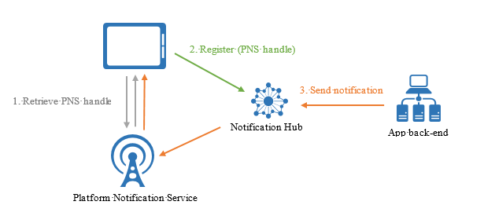
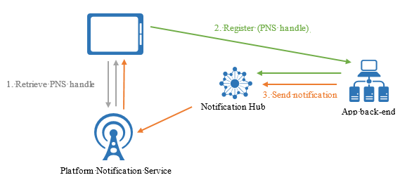

<properties
	pageTitle="Registration Management"
	description="This topic explains how to register devices with notification hubs in order to receive push notifications."
	services="notification-hubs"
	documentationCenter=".net"
	authors="wesmc7777"
	manager="erikre"
	editor=""/>

<tags
	ms.service="notification-hubs"
	ms.workload="mobile"
	ms.tgt_pltfrm="mobile-multiple"
	ms.devlang="dotnet"
	ms.topic="article"
	ms.date="06/29/2016"
	ms.author="wesmc"/>

# Registration management

##Overview

This topic explains how to register devices with notification hubs in order to receive push notifications. The topic describes registrations at a high level, then introduces the two main patterns for registering devices: registering from the device directly to the notification hub, and registering through an application backend. 

##What is device registration

Device registration with a Notification Hub is accomplished using a **Registration** or **Installation**.

#### Registrations
A registration associates the Platform Notification Service (PNS) handle for a device with tags and possibly a template. The PNS handle could be a ChannelURI, device token, or GCM registration id. Tags are used to route notifications to the correct set of device handles. For more information, see [Routing and Tag Expressions](notification-hubs-tags-segment-push-message.md). Templates are used to implement per-registration transformation. For more information, see [Templates](notification-hubs-templates-cross-platform-push-messages.md).

#### Installations
An Installation is an enhanced registration that includes a bag of push related properties. It is the latest and best approach to registering your devices. However, it is not supported by client side .NET SDK ([Notification Hub SDK for backend operations](https://www.nuget.org/packages/Microsoft.Azure.NotificationHubs/)) as of yet.  This means if you are registering from the client device itself, you would have to use the [Notification Hubs REST API](https://msdn.microsoft.com/library/mt621153.aspx) approach to support installations. If you are using a backend service, you should be able to use [Notification Hub SDK for backend operations](https://www.nuget.org/packages/Microsoft.Azure.NotificationHubs/).

The following are some key advantages to using installations:

* Creating or updating an installation is fully idempotent. So you can retry it without any concerns about duplicate registrations.
* The installation model makes it easy to do individual pushes - targeting specific device. A system tag **"$InstallationId:[installationId]"** is automatically added with each installation based registration. So you can call a send to this tag to target a specific device without having to do any additional coding.
* Using installations also enables you to do partial registration updates. The partial update of an installation is requested with a PATCH method using the [JSON-Patch standard](https://tools.ietf.org/html/rfc6902). This is particularly useful when you want to update tags on the registration. You don't have to pull down the entire registration and then resend all the previous tags again.

An installation can contain the the following properties. For a complete listing of the installation properties see, [Create or Overwrite an Installation with REST API](https://msdn.microsoft.com/library/azure/mt621153.aspx) or [Installation Properties](https://msdn.microsoft.com/library/azure/microsoft.azure.notificationhubs.installation_properties.aspx) for the .

	// Example installation format to show some supported properties
	{
	    installationId: "",
	    expirationTime: "",
	    tags: [],
	    platform: "",
	    pushChannel: "",
	    ………
	    templates: {
	        "templateName1" : {
				body: "",
				tags: [] },
			"templateName2" : {
				body: "",
				// Headers are for Windows Store only
				headers: {
					"X-WNS-Type": "wns/tile" }
				tags: [] }
	    },
	    secondaryTiles: {
	        "tileId1": {
	            pushChannel: "",
	            tags: [],
	            templates: {
	                "otherTemplate": {
	                    bodyTemplate: "",
	                    headers: {
	                        ... }
	                    tags: [] }
	            }
	        }
	    }
	}

 

It is important to note that registrations and installations by default no longer expire.

Registrations and installations must contain a valid PNS handle for each device/channel. Because PNS handles can only be obtained in a client app on the device, one pattern is to register directly on that device with the client app. On the other hand, security considerations and business logic related to tags might require you to manage device registration in the app back-end. 

#### Templates

If you want to use [Templates](notification-hubs-templates-cross-platform-push-messages.md), the device installation also hold all templates associated with that device in a JSON format (see sample above). The template names help target different templates for the same device.

Note that each template name maps to a template body and an optional set of tags. Moreover, each platform can have additional template properties. For Windows Store (using WNS) and Windows Phone 8 (using MPNS), an additional set of headers can be part of the template. In the case of APNs, you can set an expiry property to either a constant or to a template expression. For a complete listing of the installation properties see, [Create or Overwrite an Installation with REST](https://msdn.microsoft.com/library/azure/mt621153.aspx) topic.

#### Secondary Tiles for Windows Store Apps

For Windows Store client applications, sending notifications to secondary tiles is the same as sending them to the primary one. This is also supported in installations. Note that secondary tiles have a different ChannelUri, which the SDK on your client app handles transparently.

The SecondaryTiles dictionary uses the same TileId that is used to create the SecondaryTiles object in your Windows Store app.
As with the primary ChannelUri, ChannelUris of secondary tiles can change at any moment. In order to keep the installations in the notification hub updated, the device must refresh them with the current ChannelUris of the secondary tiles.

##Registration management from the device

When managing device registration from client apps, the backend is only responsible for sending notifications. Client apps keep PNS handles up to date, and register tags. The following picture illustrates this pattern.

The device first retrieves the PNS handle from the PNS, then registers with the notification hub directly. After the registration is successful, the app backend can send a notification targeting that registration. For more information about how to send notifications, see [Routing and Tag Expressions](notification-hubs-tags-segment-push-message.md).
Note that in this case, you will use only Listen rights to access your notification hubs from the device. For more information, see [Security](notification-hubs-push-notification-security.md).

Registering from the device is the simplest method, but it has some drawbacks.
The first drawback is that a client app can only update its tags when the app is active. For example, if a user has two devices that register tags related to sport teams, when the first device registers for an additional tag (for example, Seahawks), the second device will not receive the notifications about the Seahawks until the app on the second device is executed a second time. More generally, when tags are affected by multiple devices, managing tags from the backend is a desirable option.
The second drawback of registration management from the client app is that, since apps can be hacked, securing the registration to specific tags requires extra care, as explained in the section “Tag-level security.”

#### Example code to register with a notification hub from a device using an installation 

At this time, this is only supported using the [Notification Hubs REST API](https://msdn.microsoft.com/library/mt621153.aspx).

You can also use the PATCH method using the [JSON-Patch standard](https://tools.ietf.org/html/rfc6902) for updating the installation.

	class DeviceInstallation
	{
	    public string installationId { get; set; }
	    public string platform { get; set; }
	    public string pushChannel { get; set; }
	    public string[] tags { get; set; }
	}

    private async Task<HttpStatusCode> CreateOrUpdateInstallationAsync(DeviceInstallation deviceInstallation,
		 string hubName, string listenConnectionString)
    {
        if (deviceInstallation.installationId == null)
            return HttpStatusCode.BadRequest;

        // Parse connection string (https://msdn.microsoft.com/library/azure/dn495627.aspx)
        ConnectionStringUtility connectionSaSUtil = new ConnectionStringUtility(listenConnectionString);
        string hubResource = "installations/" + deviceInstallation.installationId + "?";
        string apiVersion = "api-version=2015-04";

        // Determine the targetUri that we will sign
        string uri = connectionSaSUtil.Endpoint + hubName + "/" + hubResource + apiVersion;

        //=== Generate SaS Security Token for Authorization header ===
		// See, https://msdn.microsoft.com/library/azure/dn495627.aspx
        string SasToken = connectionSaSUtil.getSaSToken(uri, 60);

        using (var httpClient = new HttpClient())
        {
            string json = JsonConvert.SerializeObject(deviceInstallation);

            httpClient.DefaultRequestHeaders.Add("Authorization", SasToken);

            var response = await httpClient.PutAsync(uri, new StringContent(json, System.Text.Encoding.UTF8, "application/json"));
            return response.StatusCode;
        }
    }

    var channel = await PushNotificationChannelManager.CreatePushNotificationChannelForApplicationAsync();

    string installationId = null;
    var settings = ApplicationData.Current.LocalSettings.Values;

    // If we have not stored a installation id in application data, create and store as application data.
    if (!settings.ContainsKey("__NHInstallationId"))
    {
        installationId = Guid.NewGuid().ToString();
        settings.Add("__NHInstallationId", installationId);
    }

    installationId = (string)settings["__NHInstallationId"];

    var deviceInstallation = new DeviceInstallation
    {
        installationId = installationId,
        platform = "wns",
        pushChannel = channel.Uri,
        //tags = tags.ToArray<string>()
    };

    var statusCode = await CreateOrUpdateInstallationAsync(deviceInstallation, 
						"<HUBNAME>", "<SHARED LISTEN CONNECTION STRING>");

    if (statusCode != HttpStatusCode.Accepted)
    {
        var dialog = new MessageDialog(statusCode.ToString(), "Registration failed. Installation Id : " + installationId);
        dialog.Commands.Add(new UICommand("OK"));
        await dialog.ShowAsync();
    }
    else
    {
        var dialog = new MessageDialog("Registration successful using installation Id : " + installationId);
        dialog.Commands.Add(new UICommand("OK"));
        await dialog.ShowAsync();
    }

   

#### Example code to register with a notification hub from a device using a registration

These methods create or update a registration for the device on which they are called. This means that in order to update the handle or the tags, you must overwrite the entire registration. Remember that registrations are transient, so you should always have a reliable store with the current tags that a specific device needs.

	// Initialize the Notification Hub
	NotificationHubClient hub = NotificationHubClient.CreateClientFromConnectionString(listenConnString, hubName);

	// The Device id from the PNS
    var pushChannel = await PushNotificationChannelManager.CreatePushNotificationChannelForApplicationAsync();

    // If you are registering from the client itself, then store this registration id in device
	// storage. Then when the app starts, you can check if a registration id already exists or not before
	// creating.
	var settings = ApplicationData.Current.LocalSettings.Values;

	// If we have not stored a registration id in application data, store in application data.
	if (!settings.ContainsKey("__NHRegistrationId"))
	{
		// make sure there are no existing registrations for this push handle (used for iOS and Android)	
		string newRegistrationId = null;
		var registrations = await hub.GetRegistrationsByChannelAsync(pushChannel.Uri, 100);
		foreach (RegistrationDescription registration in registrations)
		{
			if (newRegistrationId == null)
			{
				newRegistrationId = registration.RegistrationId;
			}
			else
			{
				await hub.DeleteRegistrationAsync(registration);
			}
		}

		newRegistrationId = await hub.CreateRegistrationIdAsync();

        settings.Add("__NHRegistrationId", newRegistrationId);
	}
     
    string regId = (string)settings["__NHRegistrationId"];

    RegistrationDescription registration = new WindowsRegistrationDescription(pushChannel.Uri);
    registration.RegistrationId = regId;
    registration.Tags = new HashSet<string>(YourTags);

	try
	{
		await hub.CreateOrUpdateRegistrationAsync(registration);
	}
	catch (Microsoft.WindowsAzure.Messaging.RegistrationGoneException e)
	{
		settings.Remove("__NHRegistrationId");
	}

## Registration management from a backend

Managing registrations from the backend requires writing additional code. The app from the device must provide the updated PNS handle to the backend every time the app starts (along with tags and templates), and the backend must update this handle on the notification hub. The following picture illustrates this design.

The advantages of managing registrations from the backend include the ability to modify tags to registrations even when the corresponding app on the device is inactive, and to authenticate the client app before adding a tag to its registration.

#### Example code to register with a notification hub from a backend using an installation

The client device still gets its PNS handle and relevant installation properties as before and calls a custom API on the backend that can perform the registration and authorize tags etc. The backend can leverage the [Notification Hub SDK for backend operations](https://www.nuget.org/packages/Microsoft.Azure.NotificationHubs/).

You can also use the PATCH method using the [JSON-Patch standard](https://tools.ietf.org/html/rfc6902) for updating the installation.
 

	// Initialize the Notification Hub
	NotificationHubClient hub = NotificationHubClient.CreateClientFromConnectionString(listenConnString, hubName);

    // Custom API on the backend
    public async Task<HttpResponseMessage> Put(DeviceInstallation deviceUpdate)
    {

        Installation installation = new Installation();
        installation.InstallationId = deviceUpdate.InstallationId;
        installation.PushChannel = deviceUpdate.Handle;
        installation.Tags = deviceUpdate.Tags;

        switch (deviceUpdate.Platform)
        {
            case "mpns":
                installation.Platform = NotificationPlatform.Mpns;
                break;
            case "wns":
                installation.Platform = NotificationPlatform.Wns;
                break;
            case "apns":
                installation.Platform = NotificationPlatform.Apns;
                break;
            case "gcm":
                installation.Platform = NotificationPlatform.Gcm;
                break;
            default:
                throw new HttpResponseException(HttpStatusCode.BadRequest);
        }

        // In the backend we can control if a user is allowed to add tags
        //installation.Tags = new List<string>(deviceUpdate.Tags);
        //installation.Tags.Add("username:" + username);

        await hub.CreateOrUpdateInstallationAsync(installation);

        return Request.CreateResponse(HttpStatusCode.OK);
    }

#### Example code to register with a notification hub from a device using a registration id

From your app backend, you can perform basic CRUDS operations on registrations. For example:

	var hub = NotificationHubClient.CreateClientFromConnectionString("{connectionString}", "hubName");
            
	// create a registration description object of the correct type, e.g.
	var reg = new WindowsRegistrationDescription(channelUri, tags);

	// Create
	await hub.CreateRegistrationAsync(reg);

	// Get by id
	var r = await hub.GetRegistrationAsync<RegistrationDescription>("id");

	// update
	r.Tags.Add("myTag");

	// update on hub
	await hub.UpdateRegistrationAsync(r);

	// delete
	await hub.DeleteRegistrationAsync(r);

The backend must handle concurrency between registration updates. Service Bus offers optimistic concurrency control for registration management. At the HTTP level, this is implemented with the use of ETag on registration management operations. This feature is transparently used by Microsoft SDKs, which throw an exception if an update is rejected for concurrency reasons. The app backend is responsible for handling these exceptions and retrying the update if required.