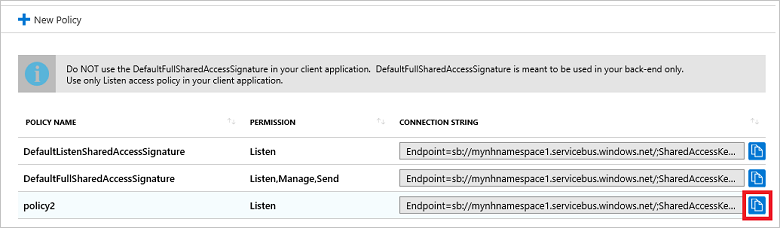

# Notification Hubs security

## Overview

This topic describes the security model of Azure Notification Hubs.

## Shared Access Signature security

Notification Hubs implements an entity-level security scheme called a *Shared Access Signature* (SAS). Each rule contains a name, a key value (shared secret), and a set of rights, as explained later in [Security claims](#security-claims). 

When creating a hub, two rules are automatically created: one with **Listen** rights (that the client app uses) and one with **all** rights (that the app backend uses):

- **DefaultListenSharedAccessSignature**: grants **Listen** permission only.
- **DefaultFullSharedAccessSignature**: grants **Listen**, **Manage**, and **Send** permissions. This policy is to be used only in your app backend. Do not use it in client applications; use a policy with only **Listen** access. To create a new custom access policy with a new SAS token, see [SAS tokens for access policies](#sas-tokens-for-access-policies) later in this article.

When performing registration management from client apps, if the information sent via notifications is not sensitive (for example, weather updates), a common way to access a Notification Hub is to give the key value of the rule Listen-only access to the client app, and to give the key value of the rule full access to the app backend.

Apps should not embed the key value in Windows Store client apps; instead, have the client app retrieve it from the app backend at startup.

The key with **Listen** access allows a client app to register for any tag. If your app must restrict registrations to specific tags to specific clients (for example, when tags represent user IDs), your app backend must perform the registrations. For more information, see [Registration management](notification-hubs-push-notification-registration-management.md). Note that in this way, the client app will not have direct access to Notification Hubs.

## Security claims

Similar to other entities, Notification Hub operations are allowed for three security claims: **Listen**, **Send**, and **Manage**.

| Claim   | Description                                          | Operations allowed |
| ------- | ---------------------------------------------------- | ------------------ |
| Listen  | Create/Update, Read, and Delete single registrations | Create/Update registration<br><br>Read registration<br><br>Read all registrations for a handle<br><br>Delete registration |
| Send    | Send messages to the Notification Hub                | Send message |
| Manage  | CRUDs on Notification Hubs (including updating PNS credentials, and security keys), and read registrations based on tags |Create/Update/Read/Delete hubs<br><br>Read registrations by tag |

Notification Hubs accepts SAS tokens generated with shared keys configured directly on the hub.

It is not possible to send a notification to more than one namespace. Namespaces are logical containers for Notification Hubs and are not involved in sending notifications.

Use the namespace-level access policies (credentials) for namespace-level operations; for example: listing hubs, creating or deleting hubs, etc. Only the hub-level access policies let you send notifications.

### SAS tokens for access policies

To create a new security claim or to view existing SAS keys, do the following:

1. Sign in to the Azure portal.
2. Select **All resources**.
3. Select the name of the Notification Hub for which you want to create the claim or view the SAS key.
4. In the left-hand menu, select **Access Policies**.
5. Select **New Policy** to create a new security claim. Give the policy a name, and select the permissions you want to grant. Then select **OK**.
6. The full connection string (including the new SAS key) is displayed in the Access Policies window. You can copy this string to the clipboard for later use.

To extract the SAS key from a specific policy, select the **Copy** button next to the policy containing the SAS key you want. Paste this value into a temporary location, then copy the SAS key portion of the connection string. This example uses a Notification Hubs namespace called **mytestnamespace1**, and a policy named **policy2**. The SAS key is the value near the end of the string, specified by **SharedAccessKey**:

```shell
Endpoint=sb://mytestnamespace1.servicebus.windows.net/;SharedAccessKeyName=policy2;SharedAccessKey=<SAS key value here>
```



## Next steps

- [Notification Hubs overview](notification-hubs-push-notification-overview.md)
